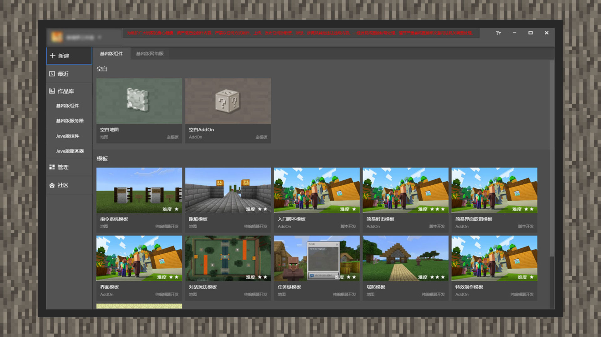

# 认识主界面

#### 作者：境界

预期目标：熟悉MCSTUDIO的部分界面，以及开发一个自定义配方

在开发者官网：[https://mc.163.com/dev/index.html](https://mc.163.com/dev/index.html)，下载MCSTUDIO应用程序进行安装，然后双击MCSTUDIO图标，在登陆界面中输入开发者账号密码进行登录，开发者就可以看到MCSTUDIO的主界面了。

MCSTUDIO主界面分为上方的信息区域，侧边的导航区域，以及中间的内容区域。你可以在导航区域选择你需要跳转到其他功能页面的按钮。

作为新手开发者，本章节将引导你如何使用MCSTUDIO制作第一个玩法。