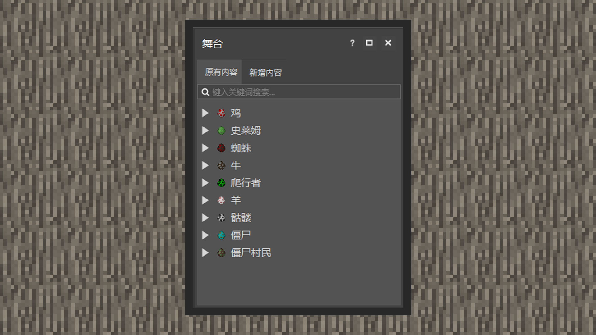

# 探索关卡编辑器

#### 作者：境界

#### 什么是舞台？

舞台是访问当前正出现在地图中的原有内容和新增内容的入口。当玩家出生在出生点附近时，世界会根据群系在玩家周围自然生成新的生物和方块。开发者可以通过舞台看到当前存在的生物种类，点击生物种类的折叠选项，还可以精确选择到某一个生物上，视角摄像机会自动定位到所选中的生物身上。

原有内容是地图中，由游戏世界自然生成的生物。新增内容则是开发者进入编辑器后，用编辑器工具放置的生物。
在编辑器的中央，是一套内嵌在MCSTUDIO窗口上的游戏界面。开发者可以轻按鼠标左键选择在视角范围内的生物，这与在右侧区域里选择单一生物是同样的效果。因此，游戏世界本身也是舞台。

#### 移动与转移视角

在MCSTUDIO控制游戏界面内人物的移动方式和在游戏客户端上的方法大致相同。开发者在键盘上按WASD的行走按键控制人物的前后左右移动。

鼠标左键可以选择生物，鼠标右键可以旋转视角，鼠标中键滑轮可以拉伸视距。

如果双击空格，视角则会像创造模式下的玩家一样上升，按住shift键则会下降。

如果视角未移动，请将光标移向游戏界面区域即可。

#### 调试、保存与备份 

当游戏界面处于编辑模式时，开发者是无法作为一个玩家与世界产生互动的。

这时候若想调试，就需要点击运行按钮。它会带领你进入游戏模式，及时获得玩法的测试反馈。

保存按钮提供保存功能，你也可以同时按住CRTL+S进行快捷的进度保存。

备份按钮提供克隆功能，它会将正在制作的内容再克隆一份。开发者可以稍后在主页面的基岩版组件中找到。