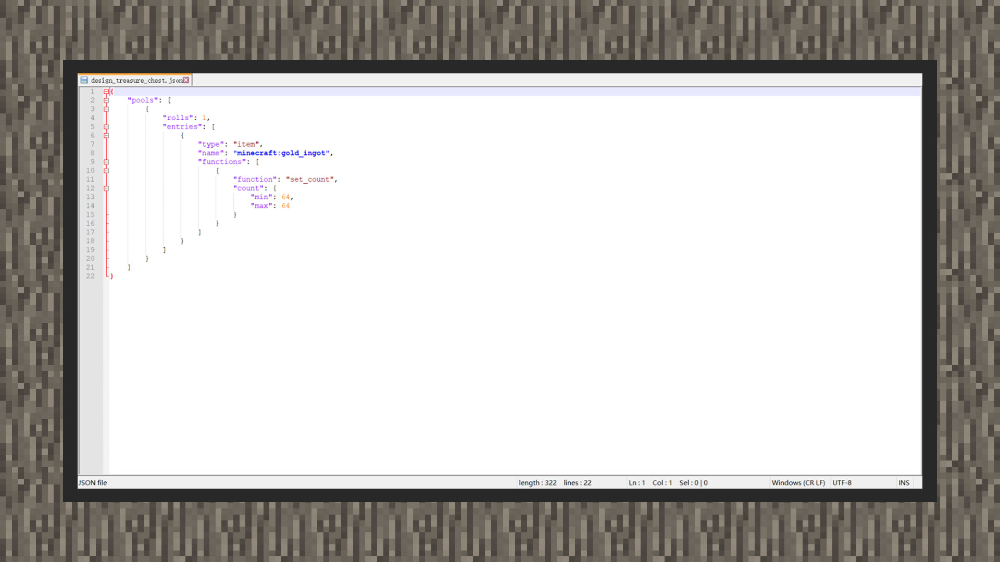
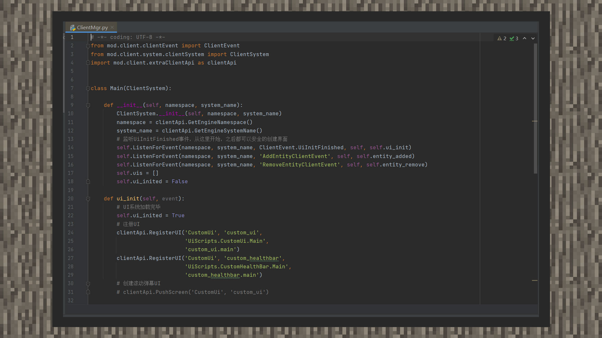
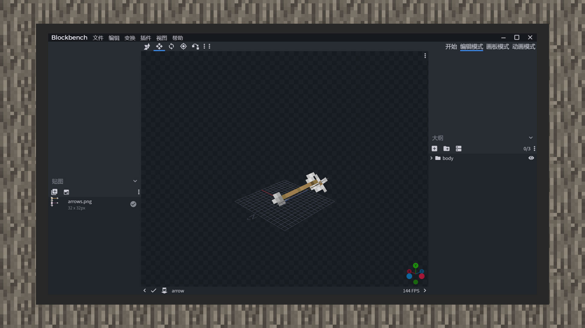

# 基本开发工具介绍

#### 作者：境界

#### 开发工具

开发者在对玩法进行开发设计时，可能会脱离MCSTUDIO来编写更复杂的代码。趁手的工具可以让开发效率变得更高，这里给开发者提供了两种方向的选择： 

使用外部功能较全的文本编辑器。如：Visual Studio Code、NotePad++、手机上的相关软件，可以对基岩版原生的附加包（Add-on）进行编辑。附加包的相关解释可以查看教程《Addon-万象的基石》。

另外，若是想要使用更多接口实现更复杂的模组玩法，则可以选择中国版的MODSDK框架，基于该框架可以使用Python语言进行模组开发。在开发过程中，建议开发者使用标准的IDE(集成开发环境)，如：Pycharm。这样的工具可以帮助开发者在使用Python语言开发时提高效率。更多MODSDK框架的介绍，可以查看教程《初见MOD》。

#### 美术工具

我的世界中，生物的模型、动画、贴图，以及物品、方块贴图等，这些都算在美术资源的范畴。

开发者在开发玩法功能时，需要各种美术资源。绘制简单的方块、物品贴图时，开发者可以选择自己常用的绘图软件。而制作像生物模型、方块模型这样的资源，则需要用到BlockBench。它是由国外个人开发者Jennis开发维护的一款针对我的世界美术制作的软件。

它可以满足我的世界基岩版的生物模型、方块模型、皮肤等资源的制作和绘制。同时可将制作好的生物模型在同一个软件里进行动画制作、粒子预览、音效演示等。

下载本地版:[https://blockbench.net/downloads/](https://blockbench.net/downloads/)

WEB版入口:[https://web.blockbench.net/](https://web.blockbench.net/)

#### 地图工具

地图包括地形和建筑，开发者可以自行选择制作工具、资源中心的建筑辅助组件、或是使用MCSTUDIO的地图编辑器功能。

这里主要补充一种途径，方便开发者将JAVA版与基岩版地图格式互相转换的方法。MCCTOOLCHESTPE是由cynodontA开发维护的一款免费闭源的MC世界存档转化软件，支持Java版地图转基岩版、基岩版地图转Java。

下载入口:[http://mcctoolchest.com/download](http://mcctoolchest.com/download)

