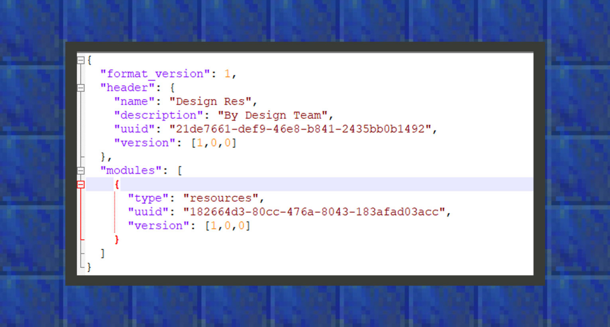

# 你的第一个Add-on

#### 作者：境界


附加包（Add-on）由Resource Pack(以下称为资源包)和Behavior Pack(以下称之为行为包)组成，资源包加载在客户端中，里面涵盖的资源包括生物模型、动画、粒子、方块贴图、生物贴图、物品贴图、方块模型、音效等。而行为包更多处理服务端的任务，如生物的行为、物品的功能、战利品的配置、生物在世界中的生成规则、群系维度的配置等。

在做一个附加包时，开发者应当十分注重工程内每个文件夹的命名，因为它需要根据指定的文件夹引入相应的配置文件，同时在资源包和行为包中都需要在根目录下有一个入口文件，其格式为json，来告诉游戏是哪个附加包，在这里我们通常会命名它为manifest.json。只要在工程内的资源包和行为包创建了这样的文件，即使没有自定义的游戏内容，它也是一个附加包了。


#### 入口文件manifest.json

如果使用国际版Add-on附加包模板的开发者，需要注意一下微软将manifest内的format_version参数提升为2了，而在中国版1.16.10里，还可以继续使用兼容性format_version：1的参数，Name通常指代附加包的名字，亦或是作品名称，description意为简介描述，在这里开发者可以简单地写上团队名称等内容。

UUID 是指Universally Unique Identifier，翻译为中文是通用唯一识别码，UUID 的目的是让每个附加包内的所有元素都能有唯一的识别信息。如此一来，每个人都可以创建与其它人不冲突的 UUID，且不需考虑附加包创建时的冲突问题。开发者可以通过网上自由分享的uuid生成器页面进行UUID的生成，资源包和行为包一共至少需要四个UUID，所以通常情况下要一次性生成四个UUID。




```json
{

 "format_version": 1,

 "header": {

  "name": "Design Res",

  "description": "By Design Team",

  "uuid": "21de7661-def9-46e8-b841-2435bb0b1492",

  "version": [

   0,

	 0,

	 0

  ]

 },

 "modules": [

  {

   "type": "resources",//type改为data时，则变为行为包的manifest

   "uuid": "182664d3-80cc-476a-8043-183afad03acc",

   "version": [

	  0,

	  0,

	  0

	 ]

  }

 ]

}
```

上图是一个简单的资源包manifest的书写格式，与资源包不同的是，行为包的manifest文件里，type内的resourece字段需要改成data字段即可。

