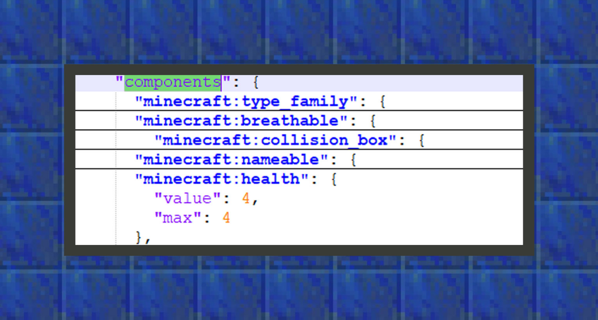
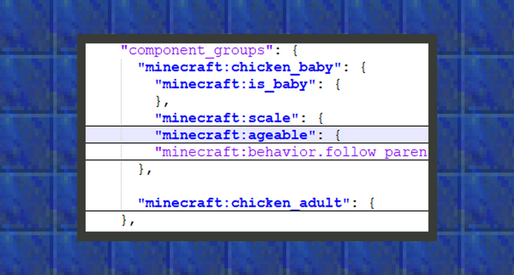
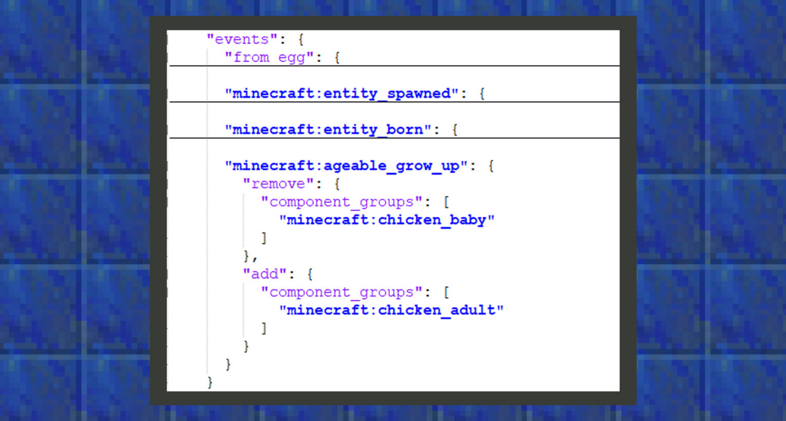

# 定义生物行为的三种结构

#### 作者：境界


开发者第一次点开生物行为文件时，常常会对component_groups、components、events三种结构感到困惑。这三种结构是组成行为包里生物行为的基础结构。本章将会带领开发者逐一梳理这几种结构的不同作用。


#### components【组件行为】

组件是构建我的世界基岩版实体的属性集合。

它是由Mojang和微软提供给开发者使用的，并且不允许开发者自创新的组件，当开发者想要给实体添加行为时，可以通过添加组件到组件行为对象中来让实体行为表现得更加复杂多样。

例如，当我们希望某种生物会爬行，我们可以通过添加"minecraft:can_climb": {}来实现。所有的组件格式都以"minecraft:<组件名称>": {<组件设定>}为基准，不同的组件带有不同的设定。



```
{
    "format_version":"1.16.0",
    "minecraft:entity":{
        "description":{
        },
        "component_groups":{
        },
        "components":{
            "minecraft:health":{
                "value":4,
                "max":4
            }
        },
        "events":{
        }
    }
}
```

上图是原版鸡生物的部分行为组成，其中minecraft:health组件会影响实体的血量，在图片中，鸡的生命值和最大生命值被设置为4点，即两颗心。

 

#### component_groups【组件组】

组件组将多个组件分组在一起，就像一个文件夹一样，因此多个组件组内可以包含多个组件，并且可以在events事件内添加和删除它们，以创建自定义生物行为的组合。

在组件组内放入的组件不会自动添加到生物实体上，在事件未被添加进生物行为前，它们不会做任何事。只有当事件被触发后，对应的事件将组件会变为工作状态，它才会开始影响生物的行为。



```
{
    "format_version":"1.16.0",
    "minecraft:entity":{
        "description":{},
        "component_groups":{
            "minecraft:chicken_baby":{
                "minecraft:is_baby":{},
                "minecraft:scale":{
                    "value":0.5
                },
                "minecraft:ageable":{
                    "duration":1200,
                    "feed_items":[
                        "wheat_seeds",
                        "beetroot_seeds",
                        "melon_seeds",
                        "pumpkin_seeds"
                    ],
                    "grow_up":{
                        "event":"minecraft:ageable_grow_up",
                        "target":"self"
                    }
                },
                "minecraft:behavior.follow_parent":{
                    "priority":5,
                    "speed_multiplier":1.1
                }
            }
        },
        "components":{},
        "events":{}
    }
}
```

上图是原版鸡的部分组件组，其中官方对组件组的命名格式为"minecraft：<命名空间>:chicken_baby<名称>"，开发者可以自由定义命名空间和名称，如"design:custom_abc"。在chicken_baby中，微软将minecraft:is_baby组件放在这里，通过事件来宣告某只鸡是否为幼年鸡。


#### events【事件】

事件是用于添加或删除组件组的特殊语法，通过这些改变，我们可以为实体创建动态行为。



在上图中，原版鸡使用minecraft:ageable_grow_up事件来删除chicken_baby组，添加新的chicken_adult组，来将一只幼年鸡变为成年鸡。

```
{
    "format_version":"1.16.0",
    "minecraft:entity":{
        "description":{

        },
        "component_groups":{

        },
        "components":{

        },
        "events":{
            "from_egg":{
                "add":{
                    "component_groups":[
                        "minecraft:chicken_baby"
                    ]
                }
            },
            "minecraft:entity_spawned":{
                "randomize":[
                    {
                        "weight":95,
                        "remove":{

                        },
                        "add":{
                            "component_groups":[
                                "minecraft:chicken_adult"
                            ]
                        }
                    },
                    {
                        "weight":5,
                        "remove":{

                        },
                        "add":{
                            "component_groups":[
                                "minecraft:chicken_baby"
                            ]
                        }
                    }
                ]
            },
            "minecraft:entity_born":{
                "remove":{

                },
                "add":{
                    "component_groups":[
                        "minecraft:chicken_baby"
                    ]
                }
            },
            "minecraft:ageable_grow_up":{
                "remove":{
                    "component_groups":[
                        "minecraft:chicken_baby"
                    ]
                },
                "add":{
                    "component_groups":[
                        "minecraft:chicken_adult"
                    ]
                }
            }
        }
    }
}
```


#### 如何触发事件

原版中有许多组件会触发事件，这些组件可能在一开始就被添加进了组件行为，然后在不同的条件下触发事件，来实现复杂多样的生物行为。并且所有实体会有一些共同事件，这些事件是由游戏引擎控制触发的，如minecraft:entity_spawned，它会在生物第一次生成时触发。当然，在之后开发者学会MODSDK后，也可以通过生物事件接口来触发生物的事件。