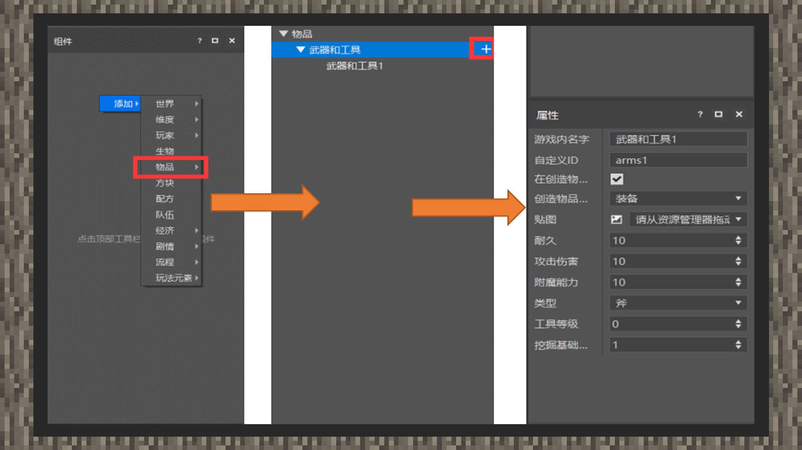

# 基础武器工具

#### 作者：境界

在当前的中国版版本下，剑、镐、锄、斧、铲包含在自定义物品内容范围里。因此它们除了支持自定义物品的所有特性之外，还具有工具的相关功能，属于特殊的自定义物品。本章将会教给开发者如何使用MCSTUDIO自定义武器和工具道具。

1）进入逻辑编辑器，右键左侧“组件”面板，依次选择添加、物品、武器和工具。

2）点击面板下的“+”可以增加多个装备。

3）点击武器和工具下的子项，界面右下角的属性面板会出现自定义工具的内容选项。

4）游戏内名字输入口提供显示武器工具名称的功能。

自定义ID是物品的唯一性名称，必须为英文，在游戏中使用give、replaceitem等指令时会用到；

在创造物品栏显示：默认打勾，一般情况下都使用默认选项，会将物品注册到创造背包内，若取消则不显示在创造背包中；

贴图：将贴图通过拖曳的方式导入资源管理器中的textures/items文件夹内，再导入至提示入口即可；

耐久：即物品工具使用的耐久；

攻击伤害：给予装备攻击伤害值，必须填入整数；

附魔能力：是为盔甲、工具、武器以及书添加一个或多个魔咒的游戏机制，这些魔咒可以添加或增强物品的特殊能力和效果。

类型：支持剑、镐、锄、斧、铲，类型会决定物品可以附魔的种类。

工具等级：对于镐，对应挖掘等级，即当使用镐挖掘某些方块时，镐子的挖掘等级大于等于方块的挖掘等级，才会产生掉落物。并且该值与铁砧的修复材料有关。当等级为0时，速度为2对应木板,否则对应金锭；当等级为1时，对应石头；当等级为2时，对应铁锭；当等级为3时，对应钻石；当等级大于3时，无法用铁砧修复。

对于原版镐子，木镐与金镐是0，石镐是1，铁镐是2，钻石镐是3；

挖掘工具基础速度：对采集工具生效，表示挖掘方块时的基础速度；