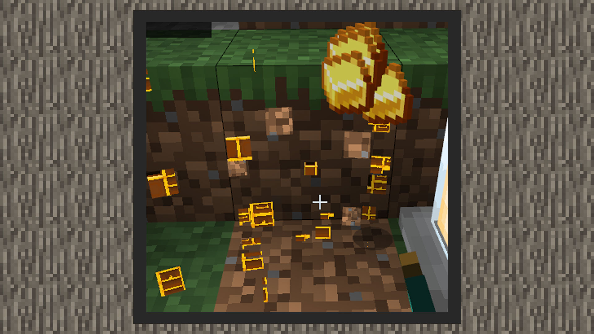

# 简易教学②：制作一个百宝箱


#### 作者：境界


百宝箱示例包下载：下载[示例包](https://g79.gdl.netease.com/guidedemo-case9.zip)。

#### 自定义方块行为包

```
{
    "format_version": "1.16.0",
    "minecraft:block": {
        "description": {
            "identifier": "design:treasure_chest",
            "register_to_creative_menu": true
        },
        "components": {
            "minecraft:block_light_absorption": 0,
            "netease:tier": {
                "digger": "pickaxe",
				"level": 0
            },
			"netease:face_directional": {
				"type": "direction"
			},
            "minecraft:block_light_emission": 0.0,
            "minecraft:destroy_time": 2.0,
            "minecraft:loot": "loot_tables/design_treasure_chest.json",
            "minecraft:map_color": "#ffffff"
        }
    }
}
```


1）1.16.0是当前下界更新的自定义方块内容格式，所以我们在format_version里填1.16.0

2）identifier是自定义方块的名称域，这里可以由开发者自己定义。register_to_creative_menu是管理方块是否注册到创造背包里。

3）components下的参数会储存方块的各项功能。

-将透光度调为0，减少环境光的影响。

-将该方块设置为被木镐以上等级的镐子挖掘有速度加成。

-将该方块设置为四面向方块，因为我们希望玩家放置时，正面始终朝向玩家。

-将发光度设置为0，即不发光，该组件也可以省略。

-将方块破摔时间设置为2.0

-自定义一个战利品表，将路径设置到该战利品表上，战利品表内会放置一种组合，破坏宝箱时会掉落一组金锭。

-自定义方块在地图上显示的颜色，这里可以由开发者自己定义。


#### 自定义方块资源包

1）在resourcepack/blocks.json中，添加该方块的名称域与模型资源名称，名称来自resourcepack/models/netease_block/内的模型文件里的名称域。将走在方块上和破坏方块的音效设置为木头音效。

```
{
  "format_version": [
    1,
    1,
    0
  ],
  "design:treasure_chest": {
    "netease_model": "design:treasure_chest",
	"sound": "wood"
  }
}
{
    "format_version": "1.13.0",
    "netease:block_geometry": {
        "bones": [
            …
        ],
        "description": {
            "identifier": "design:treasure_chest",
            "textures": [
                "design:treasure_chest"
            ],
            "use_ao": false
        }
    }
}
```


#### 实际游戏效果

