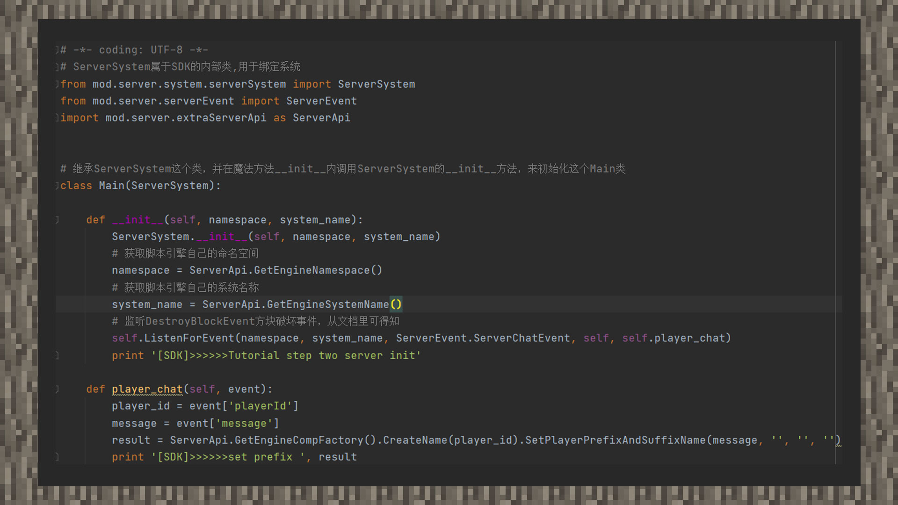

# MOD第二步：创建组件

#### 作者：境界

①创建组件前，先来确认一下要实现的功能。由于我们执行的环境是在玩家聊天时，因此可以假定一个目标，我们希望通过取得玩家聊天输入的信息变成玩家名称的前缀。

②通过获得字典内数据的语法，将玩家ID和聊天内容赋值给两个变量：“player_id”和“message”。其中“player_id”为玩家在世界的唯一ID，也可以理解为是一种身份标识。通常在创建组件的时候，我们要通过MODSDK的接口让某个玩家执行某种操作，就需要在创建组件时传入玩家ID。

③根据存档可知，服务端上有个设置玩家前缀名称和后缀名称的接口。我们通过创建这个接口，根据代码提示需要传入四个参数，即前缀、前缀字颜色、后缀、后缀字颜色。将“message”传入第一个参数位置，其它三个位置留''空字符串”。

④最后，将接口执行后回传的执行结果传给“result”变量，并将结果打印在控制台上，在游戏内看到最终的效果。由于主机玩家不会看到自己的名称，开发者可以通过双开客户端的方式来用房客的视角看噢！