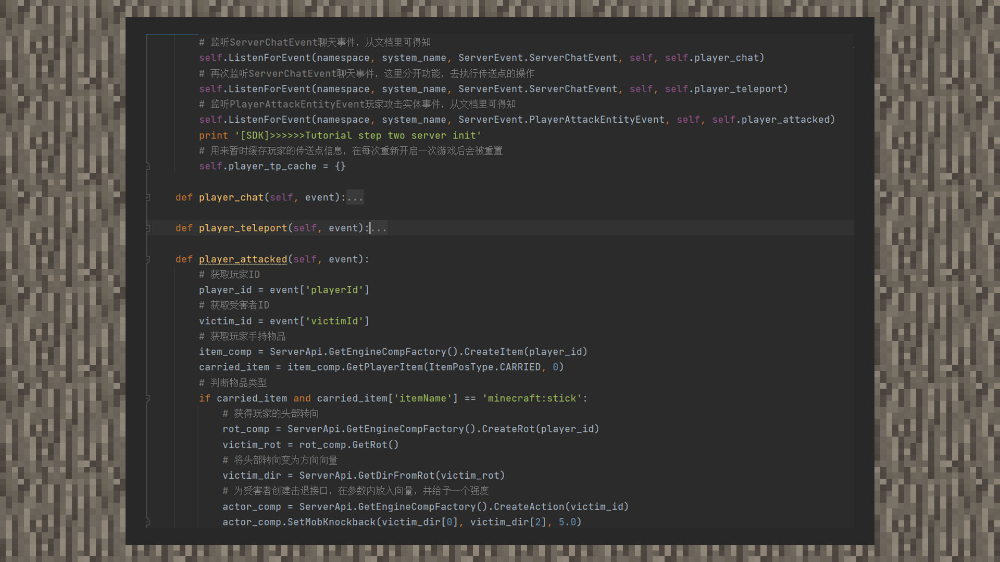

# 简易教程①：击退棒

#### 作者：境界

击退棒示例包下载：[下载示例包](https://g79.gdl.netease.com/guidedemo-case10.zip)。

①在看到一些竞技性的MC小游戏玩法，或者一些整蛊搞笑的模组时，我们常常能看到一种赋予了木棒超高击退效果的玩法。我们现在就来复刻一下吧！

②根据文档可知，脚本引擎存在一个玩家攻击实体事件。首先我们监听一下这个事件，并获取被伤害的实体ID。判断玩家手持物品是否是木棒，是则执行接下来的逻辑。

③我们获得玩家的头部转向，将头部转向转化成方向向量。最后，创建一个Action组件，给予受害者实体一个瞬时的击退效果。进入游戏并查看效果吧！

