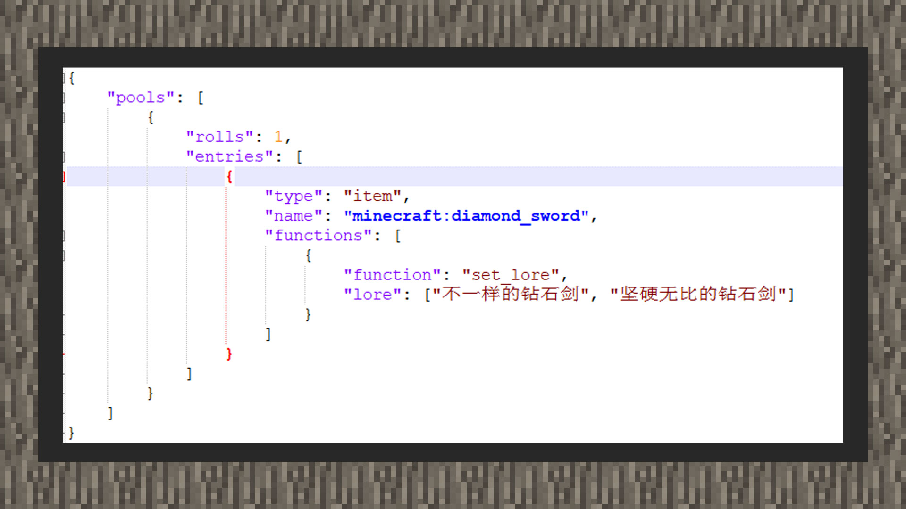
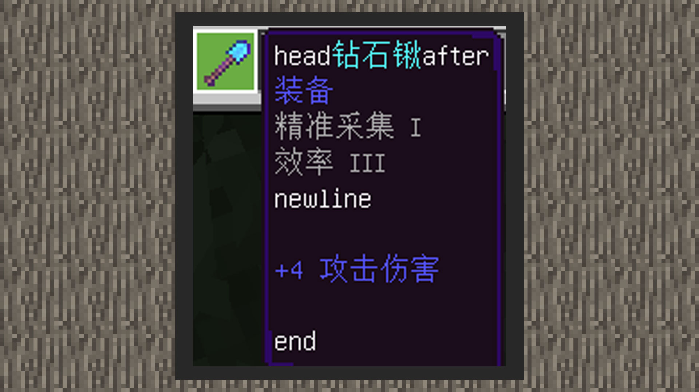

# 自定义武器词条

 

#### 作者：境界

 

物品包含词缀，当玩家点选物品时，词缀会包含物品的一些信息，如武器的附魔、伤害等。由于当前接口限制，无论是附加包自带的接口还是中国版MODSDK自带的接口，都无法一开始就自定义词缀注册在道具上，如从创造背包选取下来的道具等。以下优先教给大家如何自定义武器词缀。

 

#### 利用战利品功能添加词缀




使用战利品表的set_lore功能，可以将词缀写入武器道具内。但是新增的词缀不会覆盖原来的词缀。

战利品表可以随组件行为、村民交易等地方一起使用。

#### 效果图：


#### 使用MODSDK添加词缀

物品信息字典带有一对customTips的数据，里面会包含着使用接口所改变的物品词缀信息。

使用生成物品或者是ChangePlayerItemTipsAndExtraId接口可以改变物品词缀信息。其中词缀改变时，是直接覆盖掉原来的词缀。这一点与战利品表的词缀添加功能有着明显不同。

同时，customTips支持自定义格式，包含四种自带格式：

【%name%：物品名】

【%category%：物品类型】

【%enchanting%：附魔属性】

【%attack_damage%：攻击伤害】

自带格式可以与自定义文本自由组合，顺序可以打乱，物品的自定义格式的文本不存在时不予显示。

自带格式的字符串采用原版的显示格式，物品名前面不带换行符，物品类型、附魔属性前面自带一个换行符，攻击伤害前面自带两个换行符。

举个例子：

```
head%name%after%category%%enchanting%/nnewline%attack_damage%/n/nend
```

 

#### 效果如下：

