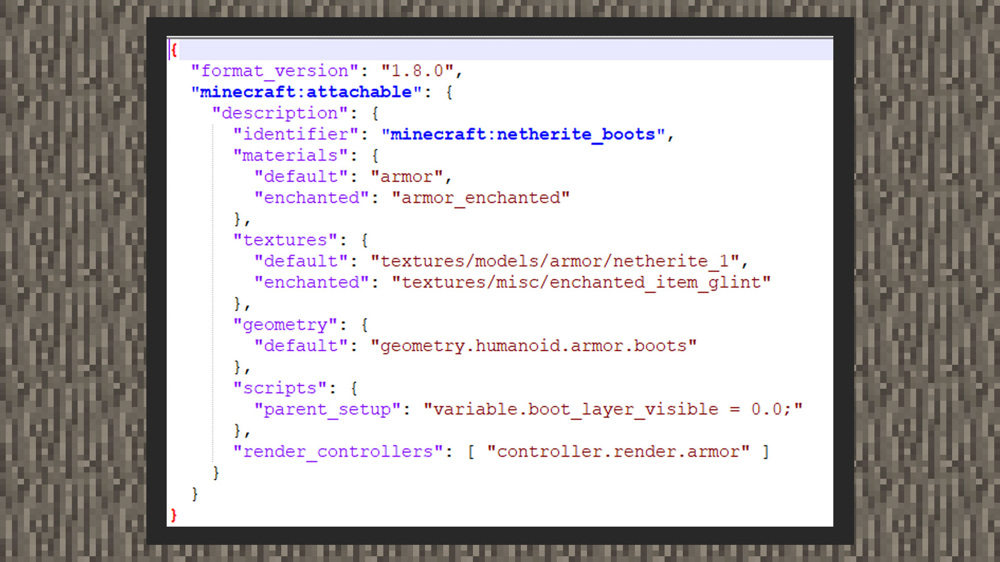

# 自定义3D防具模型

 

#### 作者：境界

  

目前中国版与国际版一样，支持自定义防具模型。同时防具在被附魔后，模型也会呈现附魔的流光效果。这里会教大家解读防具资源包内容的数据格式，在本大章的最后会提供一个防具模型给开发者，尝试自己导入进去。

 

#### 数据格式解析

①自定义防具定义文件，需要放在资源包下的attachables文件夹内。

②format_version有1.8.0和1.10.0两种格式，理论上支持粒子和动画。但由于硬编码缘故，无法对模型进行绑定定位器，且防具模型只支持方块自旋转，不支持骨骼旋转，所以若使用粒子和动画在防具资源上可能会得出错误的效果。

③identifier即相对应的物品ID，使用自定义防具时，需要将identifier和对应的物品设置为同一个ID。

③scripts中的parent_setup，是用于配合官方商店中，由官方推出的3D皮肤包的显示与隐藏。若玩家装备了3D头饰皮肤，则定义了parent_setup的头部防具将不予以显示。

④其他四项里，除了geometry、textures的default键指向自定义的防具贴图和模型资源以外，其他可以保持不做更改。