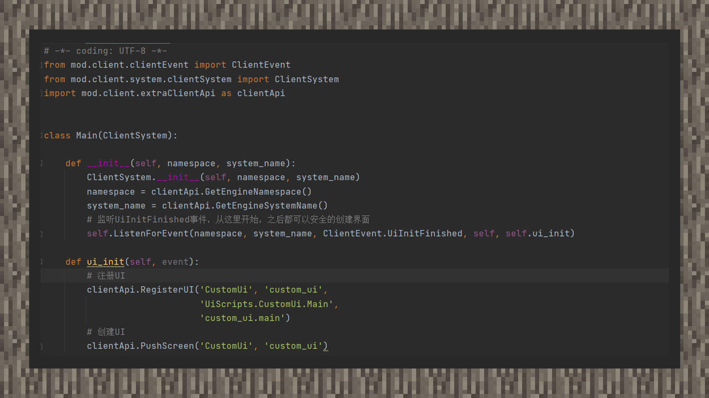

# 在游戏内弹出界面

 

#### 作者：境界

 

①切换回关卡编辑器，在资源管理器面板下，选择行为包，右键打开行为包所在的文件夹。在文件夹内新建一个脚本文件夹工程。　 

②由于UI界面运行在客户端，并且界面功能仅需调用客户端接口，因此我们只注册一个客户端系统。

③新建一个CustomUi.py文件，导入ScreenNode类。新增一个Main类，并继承ScreenNode。

④监听UiInitFinished事件，在回调函数内使用注册UI接口，UI必须注册才能创建。其中第一个参数是命名空间，第二个参数是UI名称，第三个参数是ui节点路径。ui节点路径的格式与注册系统类似，即"脚本文件夹.CustomUi.Main"。第四个是ui json文件入口，即"custom_ui.main"。

⑤使用客户端的PushScreen接口，第一个参数即UI的命名空间，第二个参数即UI名称，分别对应注册UI的前两个参数。进入游戏后，查看效果。