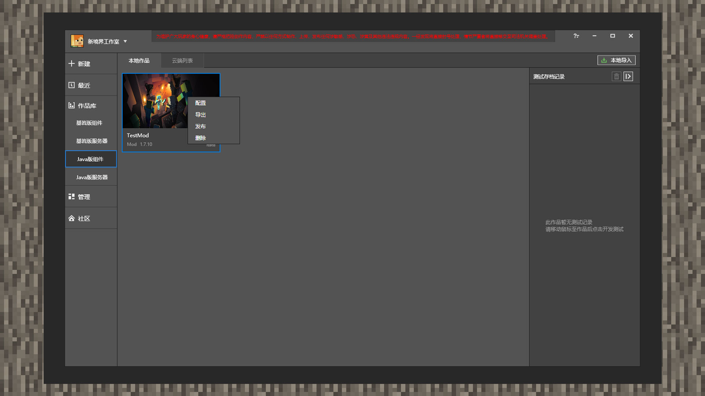
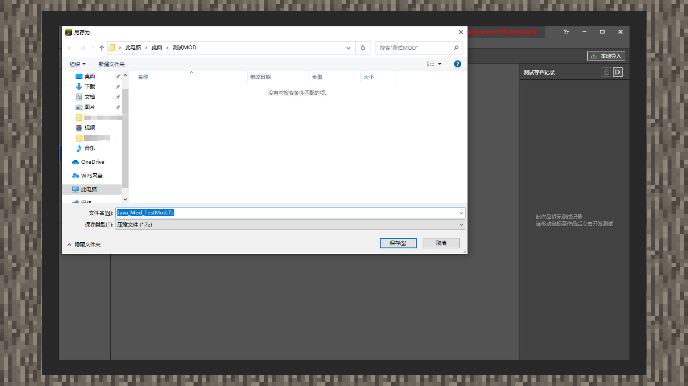
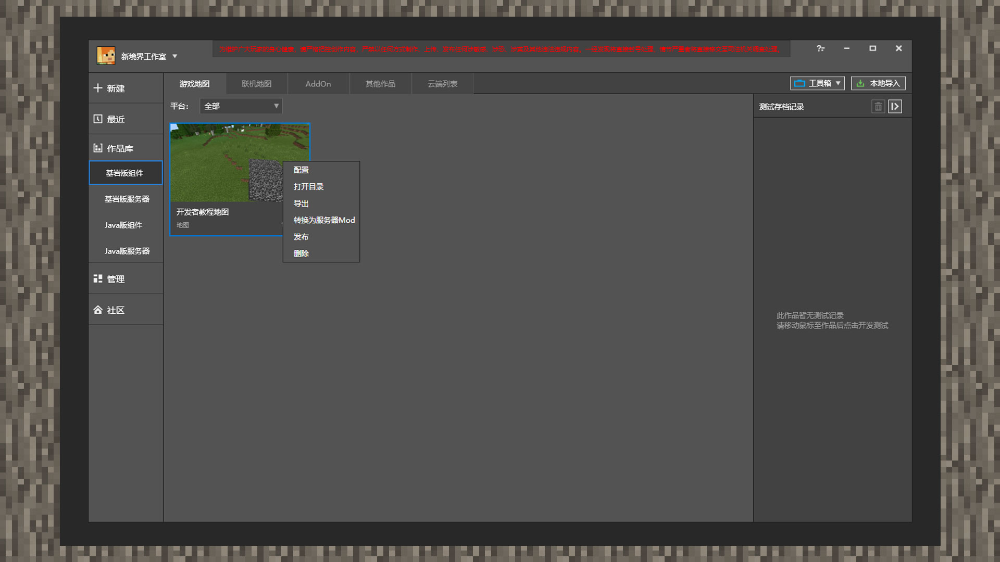
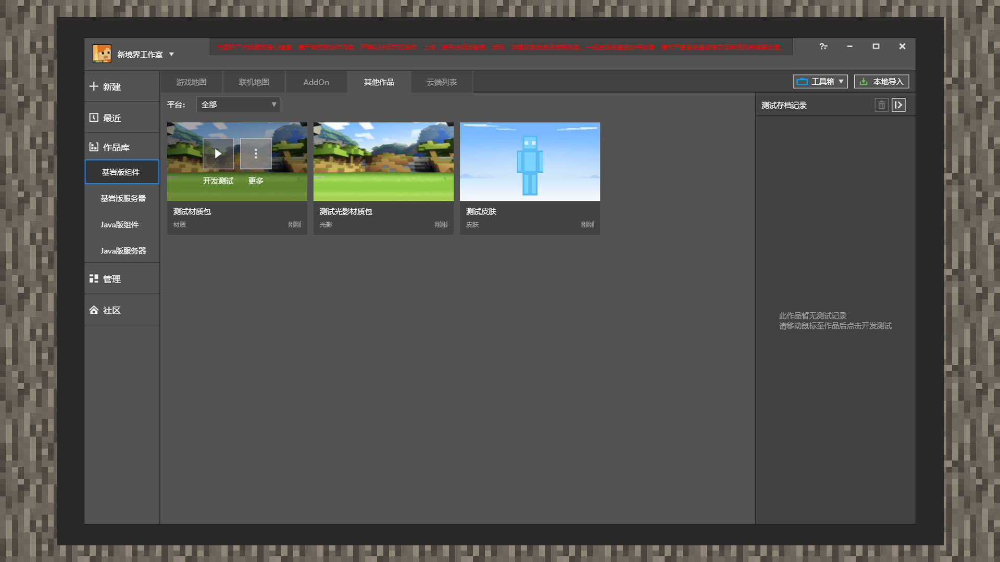

# 包体的导出

 

#### 作者：境界

 

在进行作品编辑、测试、上架等操作时，开发者可能需要将包体进行备份等操作。现在使用MCSTUDIO平台将包体导入后，可以导出包体到本地电脑上的任何一个地方。

 

### JAVA包体的导出

1) 打开MCSTUDIO，点击作品库后再点击Java版组件。鼠标放在单个组件窗体上后直到出现【更多】按钮。接着点击【更多】，再点击【导出】。

2) 进入【文件另存为】界面，选择想要的路径导出即可。

 

### 基岩版包体的导出

#### 地图资源

1) 打开MCSTUDIO，点击作品库后再点击基岩版版组件，组件标签分类选择【游戏地图】。鼠标放在单个组件窗体上后直到出现【更多】按钮。接着点击【更多】，再点击【导出】。

2) 进入【文件另存为】界面，选择想要的路径导出即可。

 

#### Addon资源

1) 打开MCSTUDIO，点击作品库后再点击基岩版版组件，组件标签分类选择【AddOn】。鼠标放在单个组件窗体上后直到出现【更多】按钮。接着点击【更多】，再点击【导出】。

2) 进入【文件另存为】界面，选择想要的路径导出即可。

 

#### PE 光影/材质/皮肤

1) 打开MCSTUDIO，点击作品库后再点击基岩版版组件，组件标签分类选择【其他作品】。鼠标放在单个组件窗体上后直到出现【更多】按钮。接着点击【更多】，再点击【导出】。

2) 进入【文件另存为】界面，选择想要的路径导出即可。