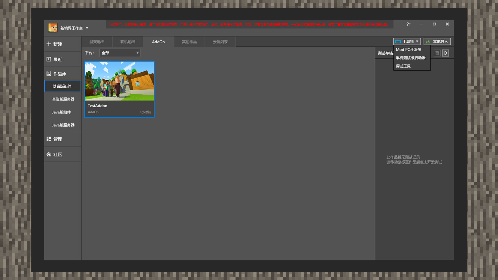
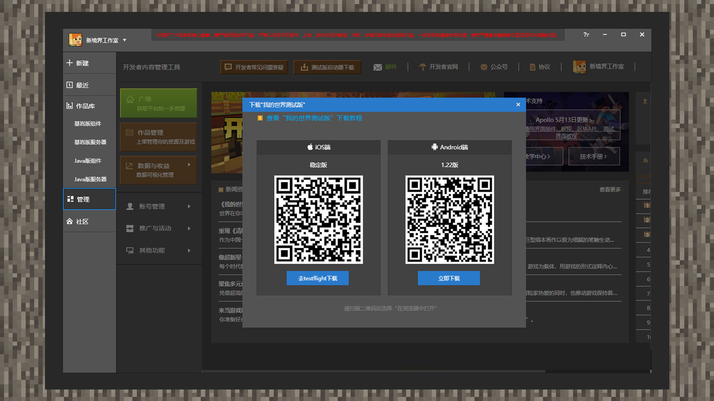
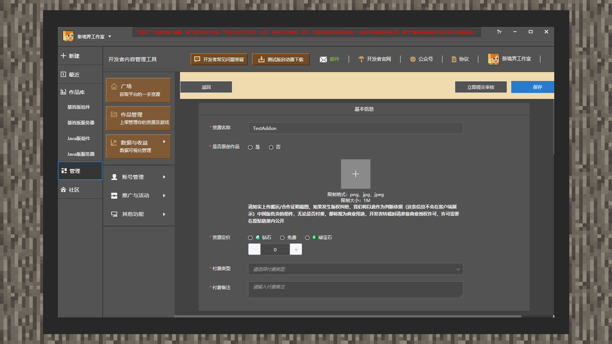
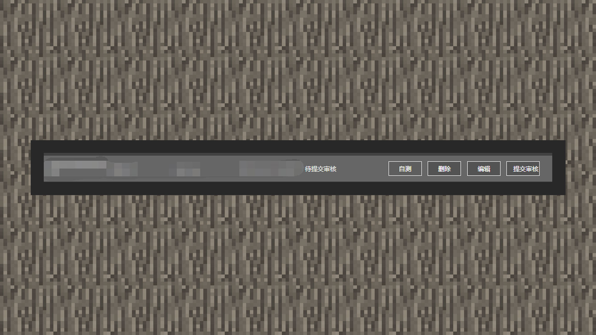
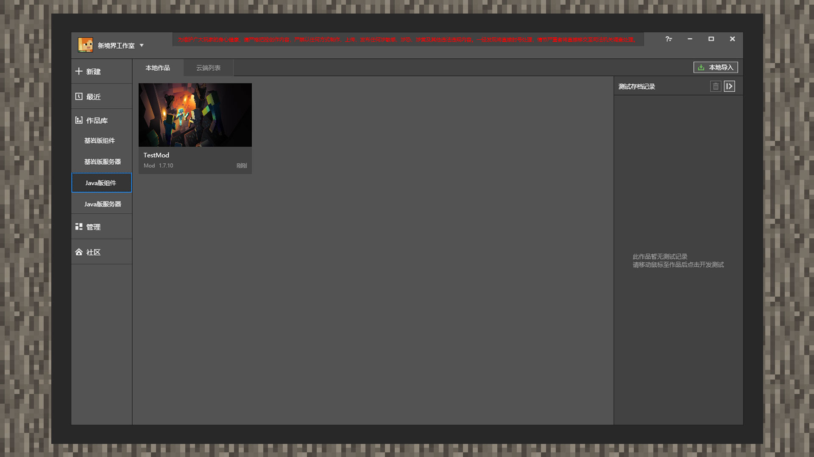
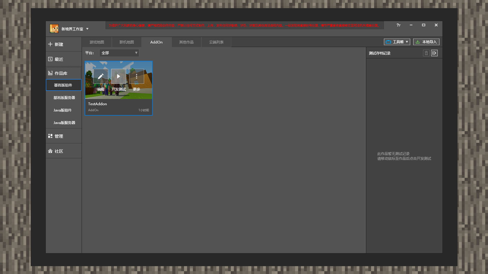
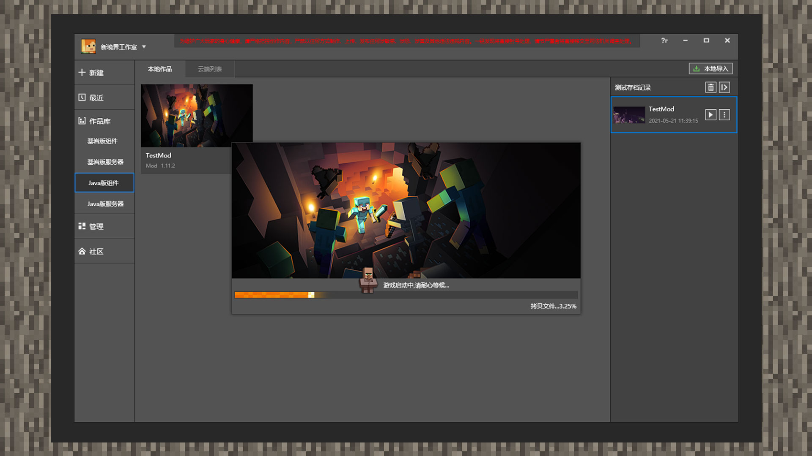
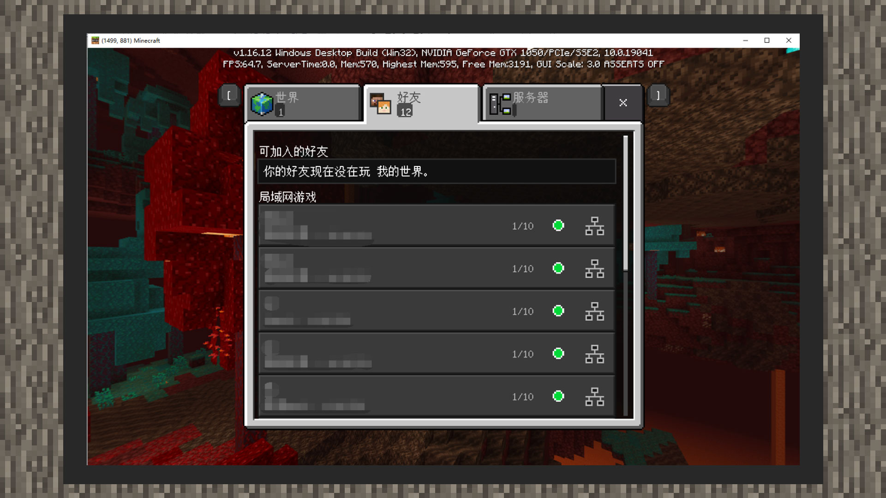
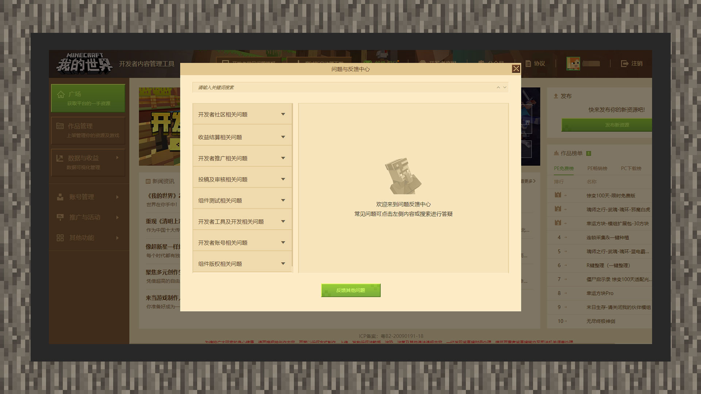

# 在手机和电脑上测试你的作品

 

#### 作者：境界

 

在进行作品测试操作时，开发者可能需要使用手机环境对作品进行测试。现在使用MCSTUDIO一键发布资源并将资源上传到自测平台后，就可以使用自测手机开发客户端进行测试。

 

## MCSTUDIO下载我的世界测试版

1. 打开MCSTUDIO，点击右上角的【工具箱。选择第二个选项【手机测试器】。

   

2. MCSTUDIO会将当前页面自动跳转到【开发者平台内嵌页】的二维码链接上。开发者通过手机扫描二维码的功能就能下载到手机测试客户端。

   

 

## 使用MCSTUDIO和手机设备进行作品测试

通过本大章的第一节【包体的结构与导入】教程，开发者对于MCSTUDIO的作品导入功能应该具有初步的掌握。不仅如此，开发者还可以通过MCSTUDIO进行测试组件，上传组件资源至开发者平台进行审核上架。基岩版组件还支持自测功能，自测组件不需要经过人工审核，只需组件通过机器审核的打包流程后，开发者可以通过手机测试客户端进行下载测试资源。我们来看看该如何达到这些想要的目的。

 

 

1. 打开MCSTUDIO，点击【作品库】，再点击【基岩版组件】。将鼠标悬浮在资源窗体上直至【更多】按钮出现，点击【更多】按钮。再次点击【发布】按钮。

   

2. MCSTUDIO会将页面跳转至【开发者平台内嵌页】的【发布资源】窗口，并自动预备上传好资源，开发者只需填写基本信息、收费模式、宣传素材等即可。最后记得点击【保存】按钮。

   

3.  建立好的基岩版资源处于【待提交审核】状态。在这个状态下，开发者可以选择自测。自测的组件最后会上架至开发者自测手机客户端。**请注意：若开发者设置了付费价格，可以先将需要自测的组件收费改成免费形式，自测结束后统一等到送审前再更改回原来的价格。**

   

4. 自测手机客户端登陆时需要创建一个新的账号，并且您只能在资源中心看到自己的提交自助测试的组件。

 

## 单人测试环境

 

 

1. JAVA版资源只能使用PC进行测试。在MCSTUDIO主界面上点击【作品库】，再点击【本地作品】分类。鼠标悬浮在资源窗体上方直至显示出【测试】按钮后，点击【测试】按钮即可。

   

   

2. 基岩版资源可以使用手机自测客户端或MODPC客户端进行测试。在MCSTUDIO主界面上点击【作品库】，再点击资源所在的标签分类。鼠标悬浮在资源窗体上方直至显示出【开发测试】按钮后，点击【开发测试】按钮即可。

   

3. 电脑启动资源前，系统可能需要下载资源所依赖的JAVA版客户端或基岩版MODPC客户端，请耐心等待。

 

## 多人联机测试方案

目前MCSTUDIO支持**本地ModPC局域网联机**和**使用开发者子母账号在手机测试端联机**。

### 本地ModPC局域网联机

 

1. 启动MODPC客户端或点击相应的资源进行【开发测试】。

   

2. 可以在局域网游戏内看到其他人创建的存档房间。点击进入即可联机测试组件。

### 使用开发者子母账号在手机测试端上联机

1. 在使用手机测试端与其他成员测试玩法前，需要您先将成员设置为开发者子账号。有关添加开发者子账号的相关信息，<a href="../../../mcguide/32-开发者账号与团队/课程15-使用成员管理模块实现多账号协作.html">请单击本链接查询</a>。
2. 再确认加入成员子账号后，请您进入手机测试端。在主页下进入 **【联机大厅】** ，选择 **【本地联机】** ，再次选择 **【自定义联机】** 。待您创建完房间后，其他成员即可在 **【自定义联机】** 区域找到您的房间。

## 查找你的问题

模组玩法开发上遇到Bug可在开发者官网查询相关问题的解决方法，<a href="../../../mcguide/20-玩法开发/13-模组SDK编程/9-Mod开发BUG解决方案.html">请单击本链接查询</a>。

## 开发者常见问题答疑

 

在上传组件或是结算收益时，遇到一些比较常见的问题，可以在《我的世界》开发者平台-【开发者常见问题答疑】中找到对应方法。若是无法找到相关问题的解决办法，可以打开[【开发者常见问题答疑】-【反馈其他问题】表单](https://mcdev.webapp.163.com/#/feedbackModal?target=browser)，提交对应问题，官方将通过站内邮件与短信告知处理进度或结果。

  