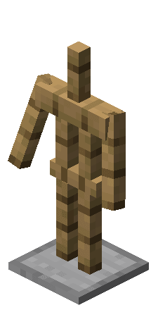
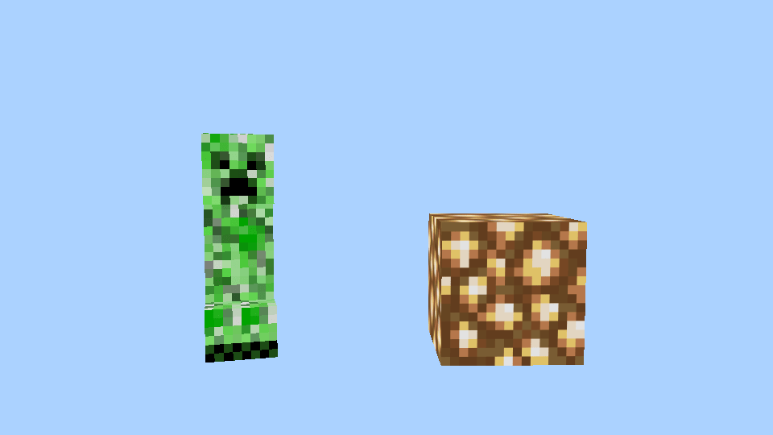
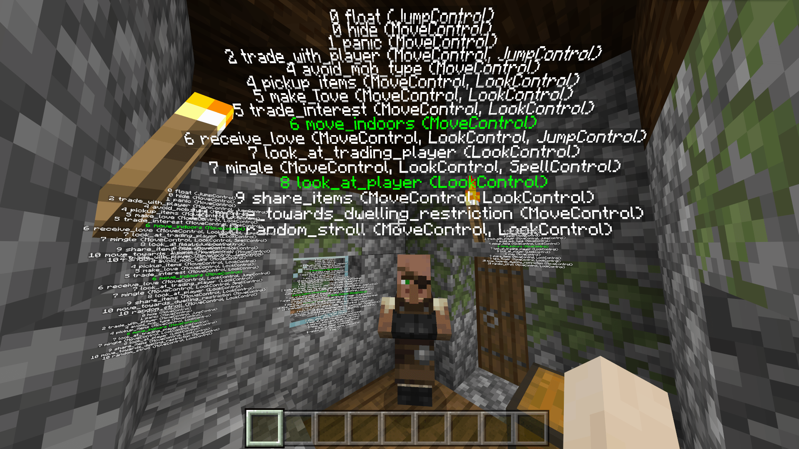

# 实体、生物和弹射物

本节中，我们将一起学习实体，了解实体的组成和分类，为以后自定义实体打下概念基础。

## 生物和实体

在一个存档中，除了方块之外，和玩家接触最密切的便是**生物**（**Mob**）了。在世界中，猪、牛、羊等有好生物，僵尸、骷髅、末影人等敌对生物，还有末影龙、凋灵等Boss，都是生物的一员。然而，生物并不是这个世界的非方块造物的全部。比如，我们经常使用盔甲架摆放物品、做出造型，有时还拿它加入红石电路，制作一些高级的机械。而我们刚刚提到的盔甲架，便不是生物。它属于一个更上层的概念，那便是**实体**（**Entity**）。

实体也称为**活动对象**（**Actor**），是一种拥有各种形状、各种行为的可交互的物体。与方块不同，实体拥有生命值，可以遭到攻击。当然，有时候有些实体也可以攻击他人，和玩家一样破坏一些方块。**玩家**（**Player**）本质上也是实体的一种。

一般来说，实体分为生物和**非生物实体**（**Non-mob Entity**），但是这两种实体其实并没有非常严格的界定。一般人们认为，拥有AI的的实体都被称为生物。在我们自定义实体时，我们也可以给予该实体一些**AI意向**（**AI Goal**），使其富有生命活力。

## 弹射物

**弹射物**（**Projectile**）是一种典型的非生物实体，他是一类可以被玩家抛出或发射器发射出去的实体，往往在空中运行一定的轨迹后击中某个方块或实体，然后触发一定的效果。箭、雪球、鸡蛋、末影珍珠、末影之眼等都是弹射物的一种。

弹射物一般拥有和其他实体不同的运动计算方式，而且一般和其对应的物品共享同一个纹理贴图，是一种非常特殊的实体。