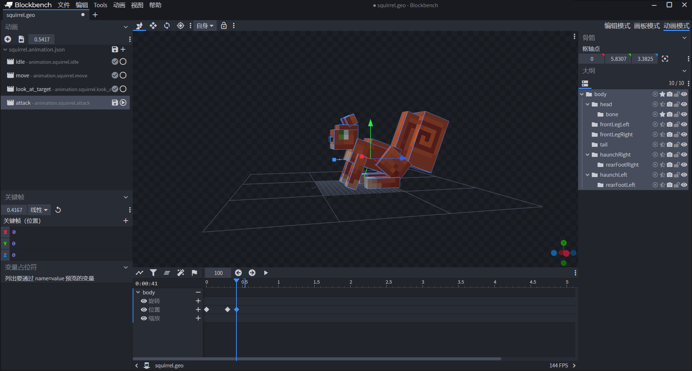
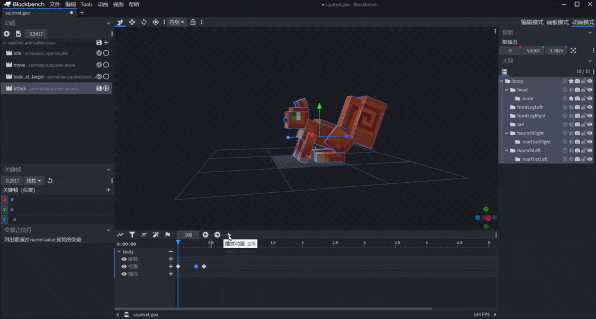
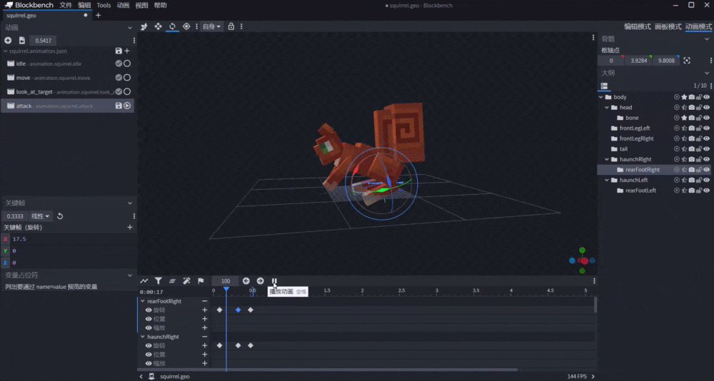

# 将实体动画与行为结合

在实体的行为包组件中，有些组件可以做到和实体的渲染帧相结合。本节我们以实体的攻击组件为例，探索如何将实体动画与行为相结合。

## 利用关键帧动画制作攻击动画

与之前几个动画使用Molang不同，我们现在使用关键帧制作一个攻击动画。我们在Blockbench中切换到动画模式，新添加一个名为`attack`的动画。


我们像之前一样，先为整个body制作一个向前平移的动画，然后再在各个骨骼上制作旋转动画。我们可以使用“+”按钮多添加几个关键帧。


与使用Molang不同，这里我们直接指定该关键帧处的值。我们可以定位到该关键帧后，拉动预览窗中的坐标轴来实时改变某个轴向上的值。在拉动坐标轴的时候，左侧关键帧窗格里的值会随之改变。





最后我们添加一个关键帧用于骨骼的位置归位，这是为了使该攻击和下一次攻击相衔接。接下来我们依照相同的原理制作其他骨骼的旋转。



我们可以看到，经过一段时间的制作，我们的松鼠具备了基本的攻击动画。我们将该动画保存，以备之后制作行为时联动使用。下面是保存之后的动画JSON文件：

```json
{
  "format_version": "1.8.0",
  "animations": {
    "animation.squirrel.idle": {
      // ...
    },
    "animation.squirrel.move": {
      // ...
    },
    "animation.squirrel.look_at_target": {
      // ...
    },
    "animation.squirrel.attack": {
      "animation_length": 0.54167,
      "bones": {
        "body": {
          "position": {
            "0.0": [0, 0, 0],
            "0.2917": [0, 0, -8],
            "0.4167": [0, 0, 0]
          }
        },
        "head": {
          "rotation": {
            "0.0": [0, 0, 0],
            "0.25": [40, 0, 0],
            "0.4167": [0, 0, 0]
          }
        },
        "haunchLeft": {
          "rotation": {
            "0.0": [0, 0, 0],
            "0.25": [20, 0, 0],
            "0.4167": [0, 0, 0]
          }
        },
        "rearFootLeft": {
          "rotation": {
            "0.0": [0, 0, 0],
            "0.25": [17.5, 0, 0],
            "0.4167": [0, 0, 0]
          }
        },
        "frontLegLeft": {
          "rotation": {
            "0.0833": [0, 0, 0],
            "0.3333": [-32.5, 0, 0],
            "0.5417": [0, 0, 0]
          }
        },
        "frontLegRight": {
          "rotation": {
            "0.0": [0, 0, 0],
            "0.25": [-32.5, 0, 0],
            "0.4167": [0, 0, 0]
          }
        },
        "tail": {
          "rotation": {
            "0.0": [0, 0, 0],
            "0.25": [35, 0, 0],
            "0.4167": [0, 0, 0]
          }
        },
        "haunchRight": {
          "rotation": {
            "0.0833": [0, 0, 0],
            "0.3333": [17.5, 0, 0],
            "0.5": [0, 0, 0]
          }
        },
        "rearFootRight": {
          "rotation": {
            "0.0833": [0, 0, 0],
            "0.3333": [17.5, 0, 0],
            "0.5": [0, 0, 0]
          }
        }
      }
    }
  }
}
```

## 结合Molang与行为将攻击动画实装

我们希望松鼠的攻击能够在动画播放到特定的时间时再打出，所以我们需要使用一种“延迟”攻击的组件。事实上，我们确实有这种组件。我们可以在劫掠兽的行为定义中看到一个`minecraft:behavior.delayed_attack`的组件，这个组件便控制着劫掠兽的延迟攻击，使劫掠兽的攻击能够在开始攻击动画一定时间后再打出。原版的劫掠兽延迟攻击组件如下：

```json
"minecraft:behavior.delayed_attack": {
  "priority": 4,
  "reach_multiplier": 1.5,
  "attack_duration": 0.75,
  "hit_delay_pct": 0.5,
  "track_target": true,
  "sound_event": "attack.strong"
}
```

其中`hit_delay_pct`字段便是攻击造成伤害时动画已播放的时间。根据我们刚才制作的动画，我们将其修改为`0.25`，也就是我们的头部动画达到最大旋转角的关键帧所在的时间点。然后，我们将其加入到我们的松鼠行为包定义中。

```json
{
  "format_version": "1.12.0",
  "minecraft:entity": {
    "description": {
      "identifier": "tutorial_demo:squirrel",
      "is_experimental": false,
      "is_spawnable": true,
      "is_summonable": true
    },
    "component_groups": {
      // ...
    },
    "components": {
      // ...
      "minecraft:behavior.float": {
        "priority": 0
      },
      "minecraft:behavior.hurt_by_target": {
        "priority": 1
      },
      "minecraft:behavior.delayed_attack": {
        "priority": 4,
        "reach_multiplier": 1.5,
        "attack_duration": 0.75,
        "hit_delay_pct": 0.25,
        "track_target": true,
        "sound_event": "attack.strong"
      },
      "minecraft:behavior.random_stroll": {
        "priority": 6,
        "speed_multiplier": 0.8,
        "xz_dist": 2,
        "y_dist": 1
      },
      "minecraft:behavior.random_look_around": {
        "priority": 9
      },
      "minecraft:behavior.look_at_player": {
        "priority": 11
      }
      // ...
    },
    "events": {
      // ...
    }
  }
}
```

这个`minecraft:behavior.delayed_attack`AI意向可以使松鼠延迟攻击自己的**目标**（**Target**）。而我们知道，`minecraft:behavior.hurt_by_target`AI意向可以将攻击松鼠的实体设置为松鼠的目标。这样，我们的松鼠便具备了受到攻击后对攻击自己的实体进行延迟攻击的能力。但是，此时我们的松鼠仅仅是“会攻击”了，但还“攻击不动”。这是为什么呢？因为我们还没有为松鼠设定攻击力，所以此时松鼠的攻击就算打出也只能算“攻击了个寂寞”。我们通过查阅文档找到设置攻击力的组件`minecraft:attack`。它是一个特性组件，所以为了方便维护，我们将其加入到特性那部分的组件中。为了方便调试，我们将其设置为1，以免我们两下便被打死，造成测试的不便。

```json
{
  "format_version": "1.12.0",
  "minecraft:entity": {
    "description": {
      "identifier": "tutorial_demo:squirrel",
      "is_experimental": false,
      "is_spawnable": true,
      "is_summonable": true
    },
    "component_groups": {
      // ...
    },
    "components": {
      // ...
      "minecraft:attack": {
        "damage": 1.0
      },
      "minecraft:movement": {
        "value": 0.3
      },
      "minecraft:health": {
        "value": 30,
        "max": 30
      }
    },
    "events": {
      // ...
    }
  }
}
```

现在，我们已经为松鼠设置好了攻击的能力，接下来，只需要将攻击动画正确绑定到实体资源包定义文件中，便可以使松鼠在攻击时正确播放动画了。此时，我们便需要使用Molang查询函数`query.is_delayed_attacking`。该查询函数在`minecraft:behavior.delayed_attack`AI意向处于激活状态时返回1.0，处于未激活状态时返回0.0。因此，我们可以用这个查询函数控制动画的播放。由于我们使用的实体资源定义是旧版的`1.8.0`，所以没有办法直接条件控制动画播放。不过不用担心，我们可以使用一个动画控制器：

```json
{
  "format_version" : "1.10.0",
  "animation_controllers" : {
    "controller.animation.squirrel.general" : {
      // ...
    },
    "controller.animation.squirrel.attack" : {
      "initial_state" : "default",
      "states" : {
        "attacking" : {
          "animations" : [ "attack" ],
          "transitions" : [
            {
              "default" : "query.is_delayed_attacking == 0"
            }
          ]
        },
        "default" : {
          "transitions" : [
            {
              "attacking" : "query.is_delayed_attacking == 1"
            }
          ]
        }
      }
    }
  }
}

```

我们将动画和动画控制器绑定在实体资源包定义上：

```json
{
  "format_version": "1.8.0",
  "minecraft:client_entity": {
    "description": {
      "identifier": "tutorial_demo:squirrel",
      "materials": {
        "default": "rabbit"
      },
      "textures": {
        "red": "textures/entity/squirrel/red",
        "gray": "textures/entity/squirrel/gray"
      },
      "geometry": {
        "default": "geometry.squirrel"
      },
      "animations": {
        "walk": "animation.squirrel.move",
        "general": "animation.squirrel.idle",
        "look_at_target": "animation.squirrel.look_at_target",
        "attack": "animation.squirrel.attack"
      },
      "animation_controllers": [
        { "general": "controller.animation.squirrel.general" },
		{ "attack": "controller.animation.squirrel.attack" }
      ],
      "render_controllers": [
        "controller.render.squirrel"
      ],
      "spawn_egg": {
        "base_color":"#1778D2",
        "overlay_color":"#1778D2"
      },
	  "enable_attachables": true
    }
  }
}
```

这样，我们便可以进入游戏自测查看效果了。我们可以通过`/aigoals`命令打开“AI意向显示”以清晰地查看AI意向的激活情况。


我们可以看到，松鼠的攻击动画正常播放了，而且我们确实是在动画播放接近一半时被攻击掉血。这说明我们的自定义攻击动画和攻击行为成功结合了。
