# 了解和创建JSON UI

在模组制作过程中，我们经常遇到需要为某一个功能绘制UI的需求。了解如何创建和修改UI能够使我们创作出更加精彩的模组。在当前阶段的我的世界中，大部分的UI依旧使用了一种通过JSON文件数据驱动并在源代码中给予相应的绑定和逻辑的UI形式，我们常称之为**JSON UI**。在本节中，我们将一起了解和学习如何创新和编辑JSON UI。

## 界面和屏幕

在了解JSON UI的创建之前，我们需要先了解什么是**界面**（**Interface**）和**屏幕**（**Screen**）。界面又译**接口**，一般指代两个个体之间交互的“临界”或“通道”。比如，我现在有一本书，那么文字便是这本书和我的界面；我在吃一个苹果，那么味蕾便是苹果和我感受甜味的神经的界面；我有一套模组SDK，那么模组API便是游戏引擎和我的模组的代码的接口（界面）。同样的，在电子设备上，设备的实体屏幕往往充当了电子设备与我们的界面，这种界面一般称为**图形用户界面**（**Graphical User Interface**），常简称为**用户界面**（**User Interface**），进而简称为**UI**。

然而，除了设备的实体屏幕，在我的世界中，我们还有一个虚拟的**屏幕**（**Screen**，***画布***）概念。在同一个设备上，界面只有一个，那就是实体屏，而屏幕则有多个。每个屏幕都是一个充斥了整个界面的图像，各个屏幕依次叠加在界面上，从而形成了我们看到的画面。这一点我们可以通过电脑开发版的调试屏幕来辅助理解。

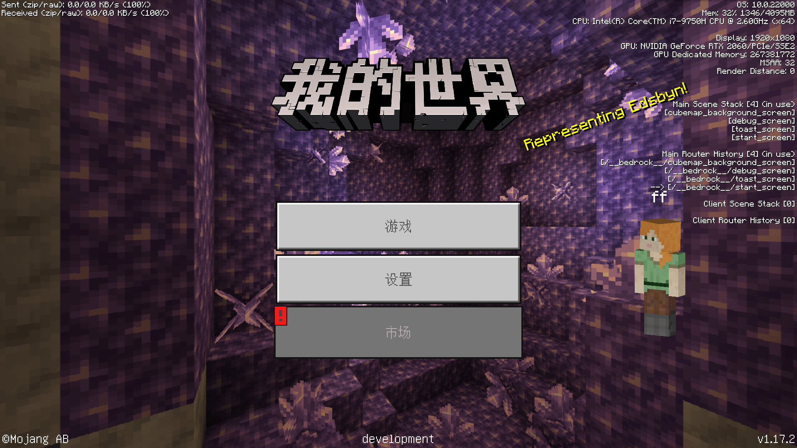

按`F3`打开调试屏幕，我们可以在界面的右侧看到我们当前UI上的屏幕信息。调试屏幕上分别有四种代表UI的信息，分别是**主场景栈**（**Main Scene Stack**）、**主路由器历史**（**Main Router History**）、**客户端场景栈**（**Client Scene Stack**）、**客户端路由器历史**（**Client Router History**）。通过刚才的说明，细心的开发者或许已经发现了，我的世界UI中的屏幕是通过一种**栈**（**Stack**）的模式来控制的。也就是说，各个屏幕垂直叠加在界面上，最上面的屏幕是最后叠上去的，也是当前显示在界面上最上方的。就比如上图中的开始屏幕（`start_screen`）。我们将注意力放在主场景栈上，可以看到，开始屏幕叠在栈的最上方，再往下是`toast_screen`，再向下是我们的调试屏幕（`debug_screen`），最下方是负责充当背景的立方体贴图背景屏幕（`cubemap_backgroud_screen`）。

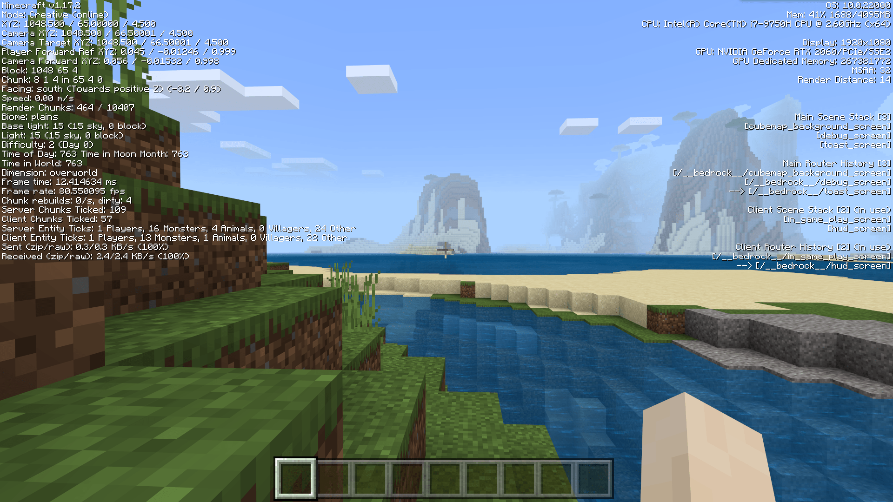

我们再进入一个世界，开始进行游戏，我们再来看右侧的信息。此时，“**（使用中）**”（“**(in use)**”）字样从主场景栈转移到了客户端场景栈。这是因为客户端场景栈主要显示世界中游玩时的屏幕状况，而主场景栈则显示以游戏标题菜单为起点的，即非世界中游玩时的屏幕状况。此时，我们可以看到我们的界面上只有两个屏幕，分别是位于上方的HUD屏幕（`hud_screen`）和位于下方的游戏内游玩屏幕（`in_game_play_screen`）。


当我们打开物品栏后，我们可以看到物品栏屏幕（`inventory_screen`）被**压入**（**Push**）了场景栈，同时我们看到了物品栏屏幕确实叠在了界面的最上方。当我们关闭物品栏时，物品栏屏幕作为栈最上方的的屏幕被**弹出**（**Pop**）场景栈。

同时，与场景栈一同变化的路由器历史信息能够告诉我们当前的屏幕是否是JSON UI定义的屏幕。我的世界UI的各个屏幕的调用路径被称为**路由**（**Route**），比如上图中物品栏屏幕的路由便为`/__bedrock__/inventory_screen`。所有由基岩引擎定义和控制的屏幕，即JSON UI的屏幕的路由都位于`/__bedrock__`下。我们可以通过这一点确定我们的屏幕来自于JSON UI。之后，我们将通过JSON UI创建自己的屏幕，这些屏幕的栈信息也可以通过调试屏幕的右方信息来进行调试。

## 通过界面编辑器创建界面


我的世界开发工作台的编辑器中内置了一套可以方便开发者快速可视化地创建和编辑界面的工具，这边是我们的**界面编辑器**。我们可以在屏幕顶部的切换页签中选择“界面编辑器”来切换到该编辑器。界面编辑器的结构的也非常简单，除了中央预览窗之外，仅有四个功能窗格。

- **界面文件列表**：默认位于左下角，是当前该附加包内所有的界面工程文件的列表。开发者通过编辑器创建界面时，编辑器会自动在行为包的`ui`文件夹内生成一个`.mcgui`格式的界面工程文件，同时生成一个最终会被应用到游戏中的`.json`格式的数据文件。这里便是显示`ui`文件夹内所有的界面工程文件。
- **控件结构**：默认位于左上角，显示当前“界面文件列表”中选中的界面的控件的树状结构，玩家可以通过点击或拖动来调整界面的结构。
- **资源管理**：默认位于右上角，是当前所有导入到编辑器中的UI纹理贴图资源列表。支持通过拖动的方式应用到对应UI控件上。
- **属性**：当前选中的控件的属性。

要想创建一个新的界面，我们只需要在“界面文件列表”中点击“**+**”按钮。

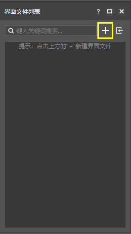


之后我们输入我们想创建的UI的名字，比如这里我们起名为`ui_demo_screen`。注意，这里的UI名比如使用字母、数字和下划线组合的形式。其他形式的名称将可能造成读取错误，请勿使用。

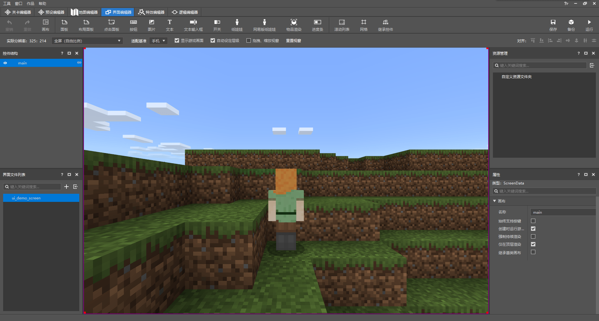

此时，我们便看到我们的JSON UI文件已被创建，该文件中自动为我们创建一个屏幕（*画布*）控件`main`。接下来，我们可以在这个`main`屏幕上添加其他的控件，制作我们想要的功能。当我们需要在游戏内显示该屏幕时，我们便可以通过模组SDK将`main`压入我们的屏幕场景栈。这样我们的自定义屏幕便可以出现在游戏中了。

值得注意的是，我们可以在调试屏幕中看到，场景栈中或者路由器中的屏幕都是直接使用了该屏幕的名称，而不会出现文件名或其他标识符（比如我们之前创建的UI名`ui_demo_screen`），所以我们此处的屏幕名`main`将可能与其他人的屏幕发生冲突，也不利于我们识别和调试。

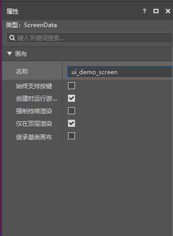

我们在右下角的属性窗格中将屏幕名也改成`ui_demo_screen`。这样，我们的屏幕在压入场景栈后将以`ui_demo_screen`的名称显示。

现在，我们来查看具体的JSON UI文件内容，以了解我们的UI文件结构。

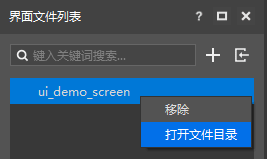

在“界面文件列表”窗格中右键我们的UI，点击“**打开文件目录**”。

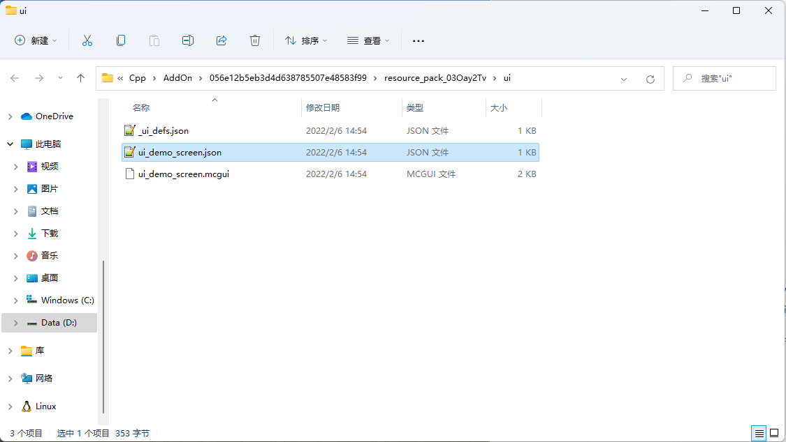

我们可以看到，弹出了一个打开了我们附加包中资源包的`ui`文件夹的资源管理器窗口。窗口中便可以看到我们`ui_demo_screen`UI的工程文件`ui_demo_screen.mcgui`和最终将在游戏内起作用的JSON UI数据驱动文件`ui_demo_screen.json`，以及定义了包括`ui_demo_screen.json`的所有的JSON UI的UI定义文件`_ui_defs.json`。事实上，我们在编辑器中编辑时UI，直接发生改动的便是我们的工程文件`ui_demo_screen.mcgui`，随之，`ui_demo_screen.json`将根据工程文件自动生成。因此，在我们还需要在编辑器中编辑之前，我们并不推荐直接修改`.json`文件。虽然编辑器可以在检测到`.json`文件发生变动后将变动重新应用到`.mcgui`文件中并重新生成`.json`文件，但是由于目前我们的界面编辑器尚未支持全部的JSON UI内容，所以在这一修改过程中，我们的`.json`文件最终的显示结果可能会发生我们不希望产生的变化。我们推荐开发者优先使用界面编辑器绘制全部所需的界面元素，然后再集中地二次手动修改`.json`文件，删除不必要的冗余部分，并添加我们希望额外添加的内容。在最终的手动修改UI步骤之后，将`.mcgui`文件备份后删除，以免编辑器重载该文件后造成`.json`文件紊乱。

现在，我们打开`ui_demo_screen.json`文件来学习JSON UI文件结构：

```json
{
  "namespace" : "ui_demo_screen",
  "ui_demo_screen" : {
    "type" : "screen",
    "absorbs_input" : true,
    "always_accepts_input" : false,
    "force_render_below" : false,
    "is_showing_menu" : true,
    "render_game_behind" : true,
    "render_only_when_topmost" : true,
    "should_steal_mouse" : false
  }
}
```

这是目前我们的`ui_demo_screen.json`文件全部的内容，可以看到，最开头我们有一个`namespace`字段，这是我们该文件所存储的所有控件的**命名空间**（**Namespace**）。由编辑器生成的JSON UI将产生相同的文件名和命名空间，事实上，文件名和命名空间可以不同，比如，原版的`hud_screen.json`的命名空间便是`hud`。但是，我们依旧推荐使命名空间和文件名相一致，这有利于我们识别JSON UI文件和增强兼容性。

接下来，便是我们该文件中存储的所有的**控件**（**Control**）。每个JSON UI文件中都存储着一系列各种各样的控件，比如我们刚刚添加并改名过的屏幕控件`ui_demo_screen`。每个控件在JSON中的结构都是一个对象，对象的键名是该控件的名称，对象的值是一个对象，对象中指定了该控件的一系列**属性**（**Property**）。

`type`属性代表一个控件的类型。控件分别有以下类型：**按钮**（`button`）、**自定义**（`custom`）、**下拉菜单**（`dropdown`）、**编辑框**（`edit_box`，*文本输入框*）、**工厂**（`factory`）、**网格**（`grid`）、**图像**（`image`，*图片*）、**输入面板**（`input_panel`，*点击面板*）、**标签**（`label`，*文本*）、**面板**（`panel`）、**屏幕**（`screen`，*画布*）、**滚动条框**（`scrollbar_box`）、**滚动跟踪**（`scroll_track`）、**滚动视图**（`scroll_view`，*滚动列表*）、**选轮**（`selection_wheel`）、**滑块**（`slider`）、**滑块框**（`slider_box`）、**栈面板**（`stack_panel`，*布局面板*）、**开关**（`toggle`）。其中，上述斜体字是界面编辑器中显示的该控件类型的易记名称，而我们的`ui_demo_screen`屏幕便是使用了`screen`类型的控件。所有的屏幕都是`screen`类型的。事实上，一个JSON UI文件中并不一定只定义一个屏幕控件，但是我们可以希望有一个用于展示在画面上的主屏幕，比如此处`ui_demo_screen`便是我们希望展示的屏幕。

在中国版中，我们还可以额外定义以下这些类型的控件：**组合框**（`combox`，*下拉框*）、**布局**（`layout`）、**摇杆**（`joystick`）、**栈网格**（`stack_grid`）、**富文本**（`rich_text`）、**多行**（`mul_lines`）、**16-9布局**（`sixteen_nine_layout`）、**动画进度条**（`anim_porecess_bar`）。

在JSON UI文件中，每个控件的完整名称都由命名空间与控件名中间加点（`.`）组合而成的，`ui_demo_screen`的完整引用名称为`ui_demo_screen.ui_demo_screen`。如果别处想引用该控件的名称，就需要提供这种完整名称的引用。

## 在界面编辑器中添加更多控件

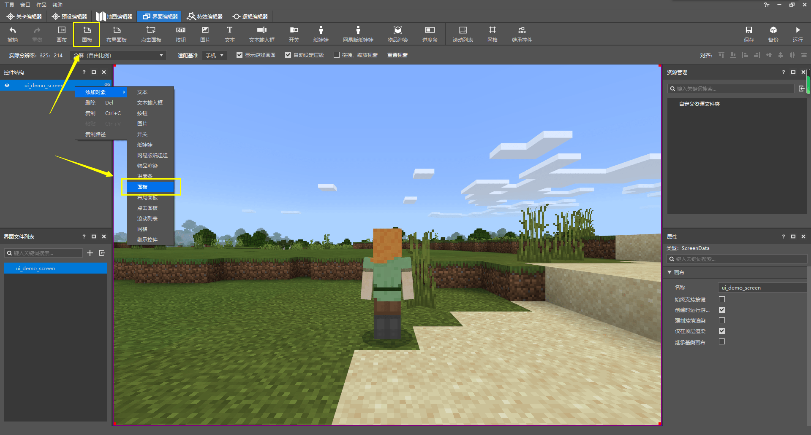

接下来，我们在编辑器中再为我们的UI添加控件，以添加一个面板为例。很多种控件下都可以挂接其他的控件作为子控件，屏幕控件便是如此。我们想要向我们的`ui_demo_screen`下添加一个面板控件，我们有两种添加控件的方式。我们可以右击该屏幕控件，然后选择“**添加对象**->**面板**”，也可以选中我们的屏幕控件，然后点击上方功能区的“**面板**”按钮。两种方式都可以成功为我们的`ui_demo_screen`控件添加一个面板子控件，我们将该面板控件命名为`ui_demo_panel`。

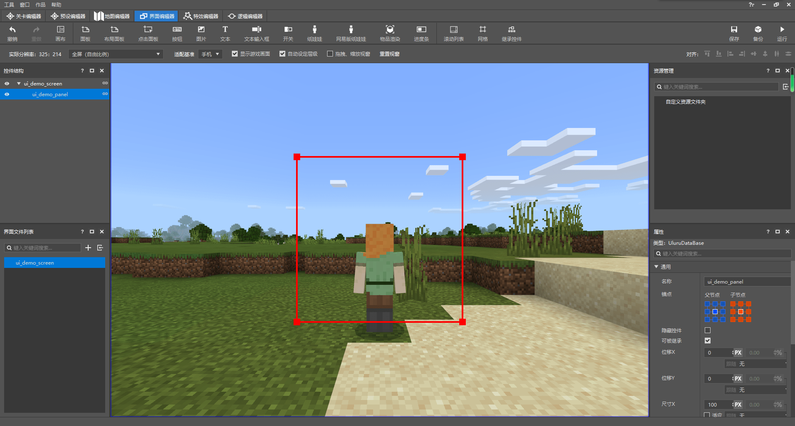

可以看到，当我们在左侧“控件结构”窗格中选中该面板后，图中出现了一个红色方框，同时预览窗的边缘出现了一个蓝色方框。红色框便代表当前选中的控件，即我们此处的面板控件，而蓝色框代表我们当前选中控件的父控件，即理应充斥整个界面屏幕控件。屏幕控件的尺寸是无法修改的，不过面板的尺寸可以修改。所以我们通常推荐开发者在屏幕中先添加一个面板，然后再在面板上进行编辑。这有助于我们控制屏幕上元素的位置和尺寸。

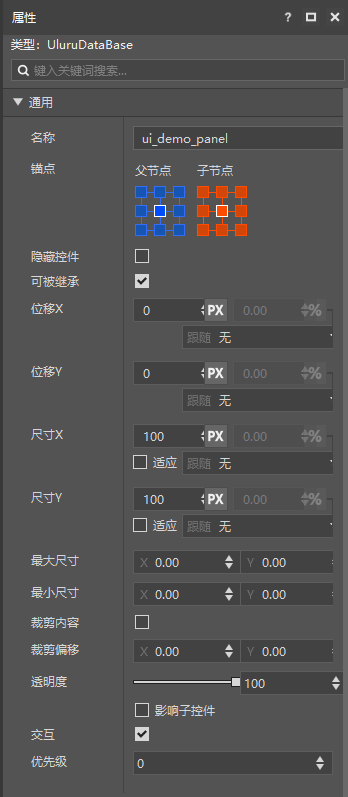

在右侧的属性窗格中，我们可以看到显示了一个“**通用**”属性菜单。这里是所有控件都具备的通用属性。我们可以在此修改该控件的**锚点**（**Anchor**）、**偏移**（**Offset**）、**尺寸**（**Size**）、**裁剪**（**Clip**）、**透明度**（**Alpha**）等属性。这些修改也都将同步到JSON文件中。

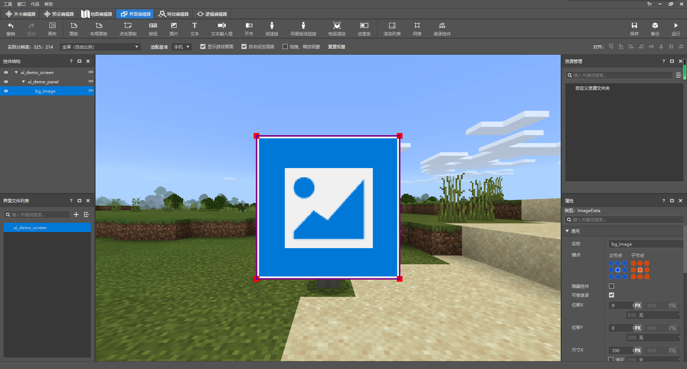

我们可以看到，面板其实就是一种玩家不可见的透明板。比着葫芦画瓢，我们为这个面板再添加一个图像子控件，命名为`bg_image`，用于充当该面板的背景。

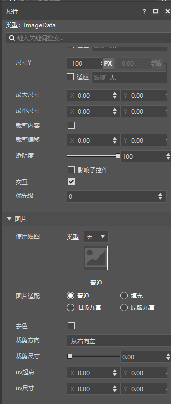

我们可以看到，图像控件相对于面板控件多出了一个“图片”属性菜单，我们可以在这里修改图像控件所显示的图像，比如，我们可以将图像修改成原生面板背景图像。


我们此时再看该UI的JSON文件：

```json
{
  "namespace" : "ui_demo_screen",
  "ui_demo_screen" : {
    "type" : "screen",
    "absorbs_input" : true,
    "always_accepts_input" : false,
    "force_render_below" : false,
    "is_showing_menu" : true,
    "render_game_behind" : true,
    "render_only_when_topmost" : true,
    "should_steal_mouse" : false,
    "controls" : [
      {
        "ui_demo_panel@ui_demo_screen.ui_demo_panel" : {}
      }
    ]
  },
  "ui_demo_panel" : {
    "type" : "panel",
    "alpha" : 1.0,
    "anchor_from" : "center",
    "anchor_to" : "center",
    "clip_offset" : [ 0, 0 ],
    "clips_children" : false,
    "enabled" : true,
    "layer" : 1,
    "max_size" : [ 0, 0 ],
    "min_size" : [ 0, 0 ],
    "offset" : [ 0, 0 ],
    "priority" : 0,
    "propagate_alpha" : false,
    "size" : [ 100, 100 ],
    "visible" : true,
    "controls" : [
      {
        "bg_image@ui_demo_screen.bg_image" : {}
      }
    ]
  },
  "bg_image" : {
    "type" : "image",
    "alpha" : 1.0,
    "anchor_from" : "center",
    "anchor_to" : "center",
    "clip_direction" : "left",
    "clip_offset" : [ 0, 0 ],
    "clip_ratio" : 0.0,
    "clips_children" : false,
    "enabled" : true,
    "fill" : false,
    "grayscale" : false,
    "is_new_nine_slice" : false,
    "keep_ratio" : true,
    "layer" : 1,
    "max_size" : [ 0, 0 ],
    "min_size" : [ 0, 0 ],
    "nine_slice_buttom" : 0,
    "nine_slice_left" : 0,
    "nine_slice_right" : 0,
    "nine_slice_top" : 0,
    "nineslice_size" : [ 0, 0, 0, 0 ],
    "offset" : [ 0, 0 ],
    "priority" : 0,
    "propagate_alpha" : false,
    "size" : [ 100, 100 ],
    "texture" : "textures/ui/dialog_background_opaque",
    "uv" : [ 0, 0 ],
    "uv_size" : [ 0, 0 ],
    "visible" : true
  }
}
```

我们可以明显看到，我们的JSON文件中多出了两个控件的定义，这便分别是我们的`ui_demo_panel`和`bg_image`，他们带有命名空间的完整名称分别为`ui_demo_screen.ui_demo_panel`和`ui_demo_screen.bg_image`，类型也分别由各自的`type`属性决定，分别是代表面板的`panel`和图像的`image`。


另一个显眼的部分便是我们的屏幕`ui_demo_screen`中多出了一个`controls`属性，而且里面好似引用了我们的`ui_demo_panel`面板。事实上，这确实是代表着在我们的屏幕的节点上挂接了一个面板，不过，需要注意的是，这里的写法被称为**继承**（**Inherit**）。继承得到的控件是一个和源控件各种属性都相同的新控件，在继承之后我们也可以重写部分属性，以覆盖原先控件的属性。这相当于在原先控件的基础上再进行修改。不过，重写继承得到的控件的属性并不会影响源控件，所以这非常有助于我们快速创建多个相似的控件。继承的常规写法是`control_name@source_control_name`。`source_control_name`是要继承自的源控件，而`control_name`是通过继承产生的新控件的名称。虽然`control_name`从语法上将可以省略不写，但是我们并不推荐这样做，因为这样会使我们之后在模组SDK中编写逻辑时无法操作。

这里，我们在屏幕`ui_demo_screen`下挂接一个继承自`ui_demo_screen.ui_demo_panel`的新控件，并将命名为和原先的控件名一样的`ui_demo_panel`。所以，我们在这里写作了`ui_demo_panel@ui_demo_screen.ui_demo_panel`。同时，也正因如此，我们可以注意得到这个面板并不是我们在JSON文件的根节点上定义的`ui_demo_panel`面板，而是将`ui_demo_panel`原封不动复制了一份之后再重新命名的新面板。不过，我们的新面板并没有修改源控件的什么属性，所以我们将其后面的对象留空，写作`"ui_demo_panel@ui_demo_screen.ui_demo_panel" : {}`。

同理，面板`ui_demo_panel`控件下也挂接了一个继承自`ui_demo_screen.bg_image`且命名为同名的`bg_image`的图像控件。

继承之后的得到的新控件虽然命名和源控件相同，但是其不再是直接属于`ui_demo_screen`命名空间的根节点，所以我们可以用另一种表示方法：控件的**路径**（**Path**）来表示这种挂接在一个控件下的控件。比如，`ui_demo_screen`下挂接的`ui_demo_panel`控件，我们可以使用`ui_demo_screen/ui_demo_panel`来表示，而我们知道。`ui_demo_panel`控件本身自己还会挂接一个`bg_image`控件，该控件在`ui_demo_panel`控件被继承的时候也会同样被继承。所以，`ui_demo_screen`下挂接的`ui_demo_panel`控件下挂接的`bg_image`控件的路径便是`ui_demo_screen/ui_demo_panel/bg_image`。有时，我们希望路径是相对于一个屏幕书写的，此时，我们便不再将屏幕本身写入路径，对于上述示例，我们写作`/ui_demo_panel/bg_image`。

重新回到继承，事实上，我们并不一定非得使用继承的方法来书写控件的挂接关系。我们可以直接将控件本身书写在一个控件的子控件的位置上，比如下方的修改示例：

```json
{
  "namespace" : "ui_demo_screen",
  "ui_demo_screen" : {
    "type" : "screen",
    "absorbs_input" : true,
    "always_accepts_input" : false,
    "force_render_below" : false,
    "is_showing_menu" : true,
    "render_game_behind" : true,
    "render_only_when_topmost" : true,
    "should_steal_mouse" : false,
    "controls" : [
      {
        "ui_demo_panel" : {
          "type" : "panel",
          "alpha" : 1.0,
          "anchor_from" : "center",
          "anchor_to" : "center",
          "clip_offset" : [ 0, 0 ],
          "clips_children" : false,
          "enabled" : true,
          "layer" : 1,
          "max_size" : [ 0, 0 ],
          "min_size" : [ 0, 0 ],
          "offset" : [ 0, 0 ],
          "priority" : 0,
          "propagate_alpha" : false,
          "size" : [ 100, 100 ],
          "visible" : true,
          "controls" : [
            {
              "bg_image" : {
                "type" : "image",
                "alpha" : 1.0,
                "anchor_from" : "center",
                "anchor_to" : "center",
                "clip_direction" : "left",
                "clip_offset" : [ 0, 0 ],
                "clip_ratio" : 0.0,
                "clips_children" : false,
                "enabled" : true,
                "fill" : false,
                "grayscale" : false,
                "is_new_nine_slice" : false,
                "keep_ratio" : true,
                "layer" : 1,
                "max_size" : [ 0, 0 ],
                "min_size" : [ 0, 0 ],
                "nine_slice_buttom" : 0,
                "nine_slice_left" : 0,
                "nine_slice_right" : 0,
                "nine_slice_top" : 0,
                "nineslice_size" : [ 0, 0, 0, 0 ],
                "offset" : [ 0, 0 ],
                "priority" : 0,
                "propagate_alpha" : false,
                "size" : [ 100, 100 ],
                "texture" : "textures/ui/dialog_background_opaque",
                "uv" : [ 0, 0 ],
                "uv_size" : [ 0, 0 ],
                "visible" : true
              }
            }
          ]
        }
      }
    ]
  }
}
```

此时，我们便不再需要继承。不过，这也有两个缺点，其一便是当一个控件被多次使用时，我们无法做到通过简便的修改来实现多处更改， 更没有办法使用我们后续会讲到的变量功能控制不同位置的控件的不同表现。其二是当控件数目非常多时，整个JSON UI文件将变得冗长与复杂，极大降低了可读性。因此，我们的编辑器也默认使用了继承的方式来制作UI文件。

## 变量、绑定与按钮映射


在编辑器中，我们可以非常简单地通过“**按钮**”按钮在我们的面板上再添加一个按钮，并重命名为`demo_button`。我们此时来查看添加了该按钮的JSON代码：

```json
{
  "namespace" : "ui_demo_screen",
  "ui_demo_screen" : {
    "type" : "screen",
    "absorbs_input" : true,
    "always_accepts_input" : false,
    "force_render_below" : false,
    "is_showing_menu" : true,
    "render_game_behind" : true,
    "render_only_when_topmost" : true,
    "should_steal_mouse" : false,
    "controls" : [
      {
        "ui_demo_panel@ui_demo_screen.ui_demo_panel" : {}
      }
    ]
  },
  "ui_demo_panel" : {
    "type" : "panel",
    "alpha" : 1.0,
    "anchor_from" : "center",
    "anchor_to" : "center",
    "clip_offset" : [ 0, 0 ],
    "clips_children" : false,
    "enabled" : true,
    "layer" : 1,
    "max_size" : [ 0, 0 ],
    "min_size" : [ 0, 0 ],
    "offset" : [ 0, 0 ],
    "priority" : 0,
    "propagate_alpha" : false,
    "size" : [ 100, 100 ],
    "visible" : true,
    "controls" : [
      {
        "bg_image@ui_demo_screen.bg_image" : {}
      },
      {
        "demo_button@ui_demo_screen.demo_button" : {}
      }
    ]
  },
  "bg_image" : {
    "type" : "image",
    "alpha" : 1.0,
    "anchor_from" : "center",
    "anchor_to" : "center",
    "clip_direction" : "left",
    "clip_offset" : [ 0, 0 ],
    "clip_ratio" : 0.0,
    "clips_children" : false,
    "enabled" : true,
    "fill" : false,
    "grayscale" : false,
    "is_new_nine_slice" : false,
    "keep_ratio" : true,
    "layer" : 1,
    "max_size" : [ 0, 0 ],
    "min_size" : [ 0, 0 ],
    "nine_slice_buttom" : 0,
    "nine_slice_left" : 0,
    "nine_slice_right" : 0,
    "nine_slice_top" : 0,
    "nineslice_size" : [ 0, 0, 0, 0 ],
    "offset" : [ 0, 0 ],
    "priority" : 0,
    "propagate_alpha" : false,
    "size" : [ 100, 100 ],
    "texture" : "textures/ui/dialog_background_opaque",
    "uv" : [ 0, 0 ],
    "uv_size" : [ 0, 0 ],
    "visible" : true
  },
  "default" : {
    "type" : "image",
    "alpha" : "$control_alpha",
    "is_new_nine_slice" : "$is_new_nine_slice",
    "layer" : "$texture_layer",
    "nine_slice_buttom" : "$nine_slice_buttom",
    "nine_slice_left" : "$nine_slice_left",
    "nine_slice_right" : "$nine_slice_right",
    "nine_slice_top" : "$nine_slice_top",
    "nineslice_size" : "$nineslice_size",
    "texture" : "$default_texture"
  },
  "hover" : {
    "type" : "image",
    "alpha" : "$control_alpha",
    "is_new_nine_slice" : "$is_new_nine_slice",
    "layer" : "$texture_layer",
    "nine_slice_buttom" : "$nine_slice_buttom",
    "nine_slice_left" : "$nine_slice_left",
    "nine_slice_right" : "$nine_slice_right",
    "nine_slice_top" : "$nine_slice_top",
    "nineslice_size" : "$nineslice_size",
    "texture" : "$hover_texture"
  },
  "pressed" : {
    "type" : "image",
    "alpha" : "$control_alpha",
    "is_new_nine_slice" : "$is_new_nine_slice",
    "layer" : "$texture_layer",
    "nine_slice_buttom" : "$nine_slice_buttom",
    "nine_slice_left" : "$nine_slice_left",
    "nine_slice_right" : "$nine_slice_right",
    "nine_slice_top" : "$nine_slice_top",
    "nineslice_size" : "$nineslice_size",
    "texture" : "$pressed_texture"
  },
  "button_label" : {
    "type" : "label",
    "alpha" : "$control_alpha",
    "color" : "$label_color",
    "font_scale_factor" : "$label_font_scale_factor",
    "font_size" : "$label_font_size",
    "font_type" : "smooth",
    "layer" : "$label_layer",
    "max_size" : [ "100%", "100%" ],
    "offset" : "$label_offset",
    "shadow" : false,
    "text" : "$label_text",
    "text_alignment" : "center"
  },
  "demo_button@common.button" : {
    "$control_alpha" : 1.0,
    "$default_texture" : "textures/netease/common/button/default",
    "$hover_texture" : "textures/netease/common/button/hover",
    "$is_new_nine_slice" : false,
    "$label_color" : [ 1, 1, 1 ],
    "$label_font_scale_factor" : 1.0,
    "$label_font_size" : "large",
    "$label_layer" : 3,
    "$label_offset" : [ 0, 0 ],
    "$label_text" : "Button",
    "$nine_slice_buttom" : 0,
    "$nine_slice_left" : 0,
    "$nine_slice_right" : 0,
    "$nine_slice_top" : 0,
    "$nineslice_size" : [ 0, 0, 0, 0 ],
    "$pressed_button_name" : "%ui_demo_screen.click",
    "$pressed_texture" : "textures/netease/common/button/pressed",
    "$texture_layer" : 2,
    "alpha" : 1.0,
    "anchor_from" : "center",
    "anchor_to" : "center",
    "button_mappings" : [],
    "clip_offset" : [ 0, 0 ],
    "clips_children" : false,
    "draggable" : "not_draggable",
    "enabled" : true,
    "is_handle_button_move_event" : true,
    "layer" : 2,
    "max_size" : [ 0, 0 ],
    "min_size" : [ 0, 0 ],
    "offset" : [ 0, 0 ],
    "priority" : 0,
    "propagate_alpha" : false,
    "size" : [ 100, 50 ],
    "visible" : true,
    "bindings" : [
      {
        "binding_collection_name" : "",
        "binding_condition" : "always_when_visible",
        "binding_type" : "collection_details"
      }
    ],
    "controls" : [
      {
        "default@ui_demo_screen.default" : {}
      },
      {
        "hover@ui_demo_screen.hover" : {}
      },
      {
        "pressed@ui_demo_screen.pressed" : {}
      },
      {
        "button_label@ui_demo_screen.button_label" : {}
      }
    ]
  }
}
```

我们可以看到，在JSON UI文件的根节点上出现了五个新控件，分别是`default`、`hover`、`pressed`、`button_label`和`demo_button`，如果带着命名空间来称呼，就是`ui_demo_screen.default`、`ui_demo_screen.hover`、`ui_demo_screen.pressed`、`ui_demo_screen.button_label`和`ui_demo_screen.demo_button`。其中，这里列出的前四个控件又分别在最后一个`demo_button`按钮下被该按钮的四个子控件继承。

前四个控件地类型我们可以看得非常明晰，分别是三个`image`类型和一个`label`类型，但是最后一个`demo_button`控件虽然从名称来看是按钮，但是我们却找不到他的`type`属性，这是为什么呢？其实，我们可以发现，`demo_button`控件继承了名为`common.button`的控件。`common`是原版JSON UI文件`ui_common.json`所使用的命名空间，我们可以打开`ui_common.json`文件来查看原版的按钮控件的定义：

```json
{
  "namespace": "common",

  //---------------------------------------------------------------------------
  // Common controls
  //---------------------------------------------------------------------------

  "button": {
    "type": "button",

    "$focus_id|default": "",
    "$focus_override_down|default": "",
    "$focus_override_up|default": "",
    "$focus_override_left|default": "",
    "$focus_override_right|default": "",
    "focus_identifier": "$focus_id",
    "focus_change_down": "$focus_override_down",
    "focus_change_up": "$focus_override_up",
    "focus_change_left": "$focus_override_left",
    "focus_change_right": "$focus_override_right",
    "focus_enabled": true,
    "focus_magnet_enabled": true,

    "$button_focus_precedence|default": 0,
    "default_focus_precedence": "$button_focus_precedence",

    "$button_tts_name|default": "accessibility.button.tts.title",
    "$button_tts_header|default": "",
    "$tts_section_header|default": "",
    "$button_tts_control_type_order_priority|default": 100,
    "$button_tts_index_priority|default": 150,

    "tts_name": "$button_tts_name",
    "tts_control_header": "$button_tts_header",
    "tts_section_header": "$tts_section_header",
    "tts_control_type_order_priority": "$button_tts_control_type_order_priority",
    "tts_index_priority": "$button_tts_index_priority",

    "layer": 1,
    "sound_name": "random.click",
    "sound_volume": 1.0,
    "sound_pitch": 1.0,
    "locked_control": "",
    "default_control": "default",
    "hover_control": "hover",
    "pressed_control": "pressed",
    "button_mappings": [
      {
        "from_button_id": "button.menu_select",
        "to_button_id": "$pressed_button_name",
        "mapping_type": "pressed"
      },
      {
        "from_button_id": "button.menu_ok",
        "to_button_id": "$pressed_button_name",
        "mapping_type": "focused"
      }
    ],

    "$button_bindings|default": [],
    "bindings": "$button_bindings"
  },

  // ...
}
```

可以看到，`common.button`控件里其实已经定义了`"type": "button"`属性。我们之前说过，继承得到的新控件会默认拥有源控件的所有属性，虽然也可以覆写一些属性为新的值（比如我们可以看到`ui_demo_screen.demo_button`和`common.button`中都有`layer`属性，这边是`ui_demo_screen.demo_button`的`"layer" : 2`属性覆写了之前`common.button`中定义的`"layer": 1`属性），但是没有覆写的值自然是和源控件相同。所以说，我们的`ui_demo_screen.demo_button`通过继承得到了`common.button`中定义的`"type": "button"`属性，自然成为了一个按钮控件。

### 变量

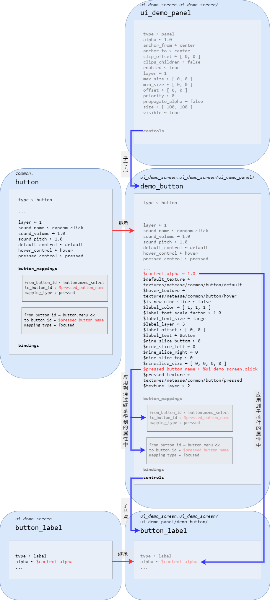

现在，我们将目光转向所有**以`$`开头**的字符串上，这种字符串被称为**变量**（**Variable**）。比如`ui_demo_screen.demo_button`下的`$control_alpha`、`$default_texture`、`$hover_texture`等等，便都是变量。变量的用途十分广泛，比如，开发者可以在继承的得到的控件中覆写继承的源控件中的变量，实现对源控件功能的自定义改变。在`ui_demo_screen.demo_button`控件中，我们为`$pressed_button_name`变量赋了值`%ui_demo_screen.click`，而该控件从源控件`common.button`处继承到了一个`button_mappings`属性，`button_mappings`属性内便会读取`$pressed_button_name`的值，此时它便读取到了`%ui_demo_screen.click`。而如果有另一个控件也继承了`common.button`，那么它也可以为`$pressed_button_name`赋上不同的值，那么它的`button_mappings`也会读取到不同于`ui_demo_screen.demo_button`的值，以此实现和`ui_demo_screen.demo_button`不同的效果。

变量还可以用于在父控件中定义并在子控件中使用，这多用于子控件中要多次使用同一个值的情况，这样可以做到在父控件中一键修改所有子控件中的某些同种属性。比如上述示例中，`ui_demo_screen.demo_button`的`$control_alpha`变量便指定了一个透明度的值，而它的子控件`default`、`hover`、`pressed`和`button_label`中便都通过`"alpha" : "$control_alpha"`读取了`$control_alpha`的值作为自己透明度`alpha`属性的值。

值得注意的是，这些变量的生存周期是在整个节点链上而非继承链上的。换言之，`ui_demo_screen.demo_button`虽然是继承自`common.button`，但是`ui_demo_screen.demo_button`中的`$pressed_button_name`和`common.button`中的`$pressed_button_name`并不是同一个变量。前者仅仅是在继承时从后者拷贝过来的同名变量。修改`ui_demo_screen.demo_button`中变量的值只会影响`ui_demo_screen.demo_button`中的效果，而不会影响`common.button`中的效果。同理，`ui_demo_screen.demo_button/default`中的`$control_alpha`和`ui_demo_screen.default`中的`$control_alpha`本质上也不是同一个变量，不会相互影响。不过，`ui_demo_screen.demo_button`和`ui_demo_screen.demo_button/default`中的`$control_alpha`确实同一个变量，即父节点和子节点中的同名变量本质上是同一个变量，这也是为什么在`ui_demo_screen.demo_button`中为`$control_alpha`赋的值可以在`ui_demo_screen.demo_button/default`中读取的原因。

变量不仅能直接被读取，也可以参与运算后再读取。比如，`$some_var`的值目前是`some_value`，那么`"some_property": "($some_var - '_value')"`的意思就是将`some_value`的末尾去掉`_value`之后的`some`提供给属性`some_property`。字符串运算时需要将表达式加上圆括号，圆括号内的“字符串”两侧需要用单直引号来表示。同理，`+`也可以做到在变量末尾新追加字符串。

此外，变量不仅可以作为属性的值来传递，还可以作为控件名或者继承的控件名来写在控件的键名里。为了方便说明这一点，我们将我们的`ui_demo_screen.ui_demo_screen`屏幕稍加改造：

```json
{
   "namespace" : "ui_demo_screen",
   "ui_demo_screen@common.base_screen" : {
      "$screen_content": "ui_demo_screen.ui_demo_panel"
   },
   // ... 后面的内容不进行改变
}
```

然后我们来查看原版`ui_common.json`文件中的`common.base_screen`控件及其子控件的定义，为了便于观察，我们删去了一些不必要的部分：

```json
{
  "namespace": "common",

  // ...
  
  //---------------------------------------------------------------------------
  // Screens, survival inventory and crafting
  //---------------------------------------------------------------------------

  "base_screen": {
    "type": "screen",
    "vr_mode": "$is_holographic",
    "$screen_content|default": "common.base_screen_empty_panel",
    "$screen_bg_content|default": "common.base_screen_empty_panel",
    "$screen_animations|default": [
      "@common.screen_exit_animation_push_offset",
      "@common.screen_exit_animation_pop_offset",
      "@common.screen_entrance_animation_push_offset",
      "@common.screen_entrance_animation_pop_offset",
      "@common.screen_exit_animation_push_fade",
      "@common.screen_exit_animation_pop_fade",
      "@common.screen_entrance_animation_push_fade",
      "@common.screen_entrance_animation_pop_fade"
    ],
    "$background_animations|default": [
      "@common.screen_exit_animation_push_alpha",
      "@common.screen_exit_animation_pop_alpha",
      "@common.screen_entrance_animation_push_alpha",
      "@common.screen_entrance_animation_pop_alpha"
    ],
    "$use_loading_bars|default": true,
    "$is_full_screen_layout|default": false,
    "$safezone_screen_matrix_layer|default": 2,
    "controls": [
      {
        "variables_button_mappings_and_controls": {
          "type": "input_panel",
          // ...
          "variables": [
            // ...
            }
          ],
          "button_mappings": [
            // ...
          ],
          "controls": [
            {
              "bg_no_safezone_screen_panel@$screen_bg_content": {
                // ...
              }
            },
            {
              "safezone_screen_matrix@common.safezone_outer_matrix": {
                "anims": "$screen_animations",
                "animation_reset_name": "screen_animation_reset",
                "propagate_alpha": true,
                "disable_anim_fast_forward": true,
                "layer": "$safezone_screen_matrix_layer"
              }
            },
            {
              "screen_background@common_dialogs.full_screen_background": {
                // ...
              }
            }
          ]
        }
      },
      {
        "loading_bars_background": {
          "type": "image",
		  // ...

          "controls": [
            {
              "loading_bars@common_store.progress_loading_bars": {
                // ...
              }
            }
          ],

          "anims": [
            "@common.loading_bar_init_animation_push",
            "@common.loading_bar_init_animation_pop"
          ]
        }
      }
    ]
  },

  // ...
  
  "safezone_inner_matrix": {
    "type": "stack_panel",
    "size": [ "fill", "100%" ],
    "orientation": "vertical",
    "$header_safezone_control|default": "common.empty_panel",
    "controls": [
      {
        "outer_top@common.top_safezone_vertical_buffer": {
          // ...
          "controls": [
            {
              "top_side_control@$header_safezone_control": {
                // ...
              }
            }
          ]
        }
      },
      {
        "inner_top@common.top_safezone_vertical_buffer": {
          // ...
          "controls": [
            {
              "top_side_control@$header_safezone_control": {
                // ...
              }
            }
          ]
        }
      },
      { "safezone_screen_panel@common.screen_panel": {} },
      {
        "inner_bottom@common.bottom_safezone_vertical_buffer": {
          // ...
        }
      },
      {
        "outer_bottom@common.bottom_safezone_vertical_buffer": {
          // ...
        }
      }
    ]
  },

  "safezone_outer_matrix": {
    "type": "stack_panel",
    "orientation": "horizontal",
    "size": [ "100%", "100%" ],
    "controls": [
      {
        "outer_left@common.left_safezone_horizontal_buffer": {
          // ...
          "controls": [
            {
              "outer_left_safe_zone_stack@common.safe_zone_stack": {}
            }
          ]
        }
      },
      {
        "inner_left@common.left_safezone_horizontal_buffer": {
          // ...
          "controls": [
            {
              "inner_left_safe_zone_stack@common.safe_zone_stack": {}
            }
          ]
        }
      },
      { "inner_matrix@common.safezone_inner_matrix": {} },
      {
        "inner_right@common.right_safezone_horizontal_buffer": {
          // ...
          "controls": [
            {
              "inner_right_safe_zone_stack@common.safe_zone_stack": {}
            }
          ]
        }
      },
      {
        "outer_right@common.right_safezone_horizontal_buffer": {
          // ...
          "controls": [
            {
              "outer_right_safe_zone_stack@common.safe_zone_stack": {}
            }
          ]
        }
      }
    ]
  },

  "screen_panel": {
    "type": "panel",
    "size": [ "100%", "fill" ],
    "controls": [
      { "root_screen_panel@$screen_content": {} },
      {
        "popup_dialog_factory": {
          "type": "factory",
          "control_ids": {
            // ...
          }
        }
      }
    ]
  },

  // ...
}
```

在`base_screen`的一开始，我们便可以看到有一句定义`"$screen_content|default": "common.base_screen_empty_panel"`。这里便是定义了`$screen_content`的默认值。`|default`的意思便是定义**默认值**（**Default Value**）。每个节点链中每个变量只能有一处为默认值，其余的位置皆可以认为是在重写这个默认值为别的值。

这个`base_screen`控件和它继承的子控件都比较复杂，我们可以用一个节点树状图来表示这些控件在JSON UI文件中的结构：

```shell
ui_common.json|common
├─button
│  └─ # 其他子控件
├─base_screen
│  ├─variables_button_mappings_and_controls
│  │  ├─bg_no_safezone_screen_panel
│  │  ├─safezone_screen_matrix # @common.safezone_outer_matrix
│  │  └─screen_background
│  └─loading_bars_background
│     └─loading_bars
├─safezone_inner_matrix
│  ├─outer_top
│  │  └─top_side_control
│  ├─inner_top
│  │  └─top_side_control
│  ├─safezone_screen_panel # @common.screen_panel
│  ├─inner_bottom
│  └─outer_bottom
├─safezone_outer_matrix
│  ├─outer_left
│  │  └─outer_left_safe_zone_stack
│  ├─inner_left
│  │  └─inner_left_safe_zone_stack
│  ├─inner_matrix # @common.safezone_inner_matrix
│  ├─inner_right
│  │  └─inner_right_safe_zone_stack
│  └─outer_right
│     └─outer_right_safe_zone_stack
├─screen_panel
│  ├─root_screen_panel # @$screen_content
│  └─popup_dialog_factory
└─ #其他控件
```

我们依照上图中的注释便可以找到`$screen_content`最终应用的位置，即我们重点关注`base_screen/variables_button_mappings_and_controls/safezone_screen_matrix`控件，它继承自`common.safezone_outer_matrix`。然后我们找到`safezone_outer_matrix`控件，找到其下的`safezone_outer_matrix/inner_matrix`控件，它继承自`common.safezone_inner_matrix`。于是我们再找到`safezone_inner_matrix`下的`safezone_inner_matrix/safezone_screen_panel`，它继承自`common.screen_panel`。最后，我们找到`screen_panel`。可以看到，它使用了一个`"root_screen_panel@$screen_content": {}`的写法。这样，当我们为`$screen_content`变量赋予新值的时候，我们需要使用控件名为其赋值，同时，该变量最终便会应用到`screen_panel/root_screen_panel`控件的继承位置上。比如在我们上述对`ui_demo_screen.ui_demo_screen`屏幕的修改示例中，在最外面，由于`ui_demo_screen@common.base_screen`即我们的`ui_demo_screen`继承了`common.base_screen`，所以意味着我们的`ui_demo_screen`拥有了和`common.base_screen`一样的结构。`$screen_content`变量通过层层向下级传递，最终在`ui_demo_screen/variables_button_mappings_and_controls/safezone_screen_matrix/inner_matrix/safezone_screen_panel/root_screen_panel`处通过`root_screen_panel@$screen_content`应用为`root_screen_panel@ui_demo_screen.ui_demo_panel`。

同理，变量不仅可以在用于继承时语法的`@`之后，也可以用于`@`之前。在此便不再赘述。

在这一段落的最后，我们介绍另一种定义变量的方法：条件定义。顾名思义，我们可以在满足某些条件时定义一个或一些变量。事实上，我们刚才看过的`common.base_screen`中便存在这种定义形式，我们重新将其节选出来并观察它的用法，我们依旧将不必要的部分删去，仅观察变量的定义：

```json
"base_screen": {
  "type": "screen",
  // ...
  "controls": [
    {
      "variables_button_mappings_and_controls": {
        "type": "input_panel",
        // ...
        "variables": [
          // Screen sizes - you should be using one of these unless explicitly told otherwise - in which case that size should be added as a variable here
          // Win10
          {
            //Desktop Texel Size: [376, 250]
            "requires": "$desktop_screen",
            "$narrow_screen_size": [ 280, "100% - 10px" ], // Realms Pending Invitations, Add Players
            "$play_screen_size": [ 282, "100% - 50px" ], // Play Screen
            "$tabbed_upsell_screen_size": [ 310, 173 ], // Trial Tabbed Upsell Screen
            "$realms_create_screen_size": [ 267, 240 ], // Realms Create
            "$large_screen_size": [ 317, "100% - 10px" ], // Multiplayer Invitations
            "$store_screen_size": [ "100% - 4px", "100% - 4px" ], // Store Home
            "$skin_pack_screen_size": [ "100% - 4px", "100% - 50px" ], // Skin Pack
            "$resource_pack_screen_size": [ "100% - 50px", "45%x + 65px" ], // Texture Pack
            "$upsell_screen_size": [ "177%y - 208.5px", "100% - 4px" ], // Skin Pack Upsell
            "$create_world_upsell_screen_size": [ 360, 183 ],
            "$create_realm_upsell_screen_size": [ 360, 183 ],
            "$create_realm_upsell_play_screen_size": [ 360, 213 ],
            "$max_create_world_upsell_screen_size": [ 360, "100% - 4px" ],
            "$min_resource_pack_screen_size": [ 372, 232.4 ],
            "$max_resource_pack_screen_size": [ 400, 246 ],
            "$max_upsell_screen_size": [ 250, 259.125 ],
            "$rating_prompt_screen_size": [ 250, 87 ],
            "$max_skin_pack_screen_size": [ 310, "56.25%x - 65.25px + 118.5px" ],
            "$extra_large_screen_size": [ "100% - 4px", "100% - 4px" ], // Skin Picker, Command Block screen
            "$extra_large_max_screen_size": [ 370, "100% - 50px" ],
            "$xbl_optional_signin_screen_size": [ 317, 158 ], // XBL Optional Signin Popup
            "$xbl_console_signin_screen_size": [ 316, 161 ], // XBL Console Signin Popup
            "$xbl_console_signin_succeeded_screen_size": [ 230, "100% - 50px" ], // XBL Console Signin Succeeded Popup
            "$xbl_first_launch_screen_size": [ 317, 146 ], // XBL First Launch Popup, Trial Upsell
            "$xbl_gamer_profile_screen_size": [ 260, "100% - 50px" ], // XBL Console Signin Succeeded Popup
            "$modal_screen_size": [ 204, 140 ], // Pop-up dialogue boxes and modal progress screens
            "$tall_modal_screen_size": [ 204, 172 ],
            "$patch_notes_screen_size": [ 300, "100% - 4px" ], // Patch Notes Screen
            "$sign_screen_size": [ 185, 90 ], // Sign Screen
            "$mob_effect_screen_size": [ "90%", "90%" ], // Mob Effect Screen
            "$purchase_coin_screen_size": [ "90%", "17%x + 82px" ], //Coin Purchase Screen
            "$purchase_coin_screen_size_extended": [ "90%", "17%x + 117px" ], //Coin Purchase Screen, with FAQ
            "$purchase_coin_screen_size_not_enough": [ "90%", "17%x + 97px" ], //Coin Purchase Screen, when not enough coins for current purchase
            "$purchase_coin_screen_size_extended_not_enough": [ "90%", "17%x + 132px" ], //Coin Purchase Screen, when not enough coins for current purchase, with FAQ
            "$choose_realm_screen_size": [ "70%", "85%" ], //Choose Realm Screen
            "$custom_templates_screen_size": [ "70%", "85%" ], //Custom Templates Screen
            "$world_modal_screen_size": [ 290, 100 ], // world convert and world loading modal progress screens
            "$day_one_experience_intro_screen_size": [ "60%", "85%" ], // Day One Experience intro popup
            "$day_one_experience_import_progress_screen_size": [ "80%", "90%" ], // Day One Experience import progress modal screen
            "$world_conversion_complete_screen_size": [ 290, 160 ], // World Conversion complete modal screen
            "$gamepad_disconnect_screen_size": [ 300, 100 ] //custom gamepad disconnected modal size, to contain all languages in title
          },
          // PE edition and VR
          {
            //Pocket Texel Size:  [320, 210]
            "requires": "($pocket_screen or $is_holographic)",
            "$narrow_screen_size": [ "90.3225%", "100% - 4px" ], // Realms Pending Invitations, Add Players
            "$play_screen_size": [ "83.4375%", "100% - 4px" ], // Play Screen
            "$tabbed_upsell_screen_size": [ 310, 173 ], // Trial Tabbed Upsell Screen
            "$realms_create_screen_size": [ "71.2766%", "100% - 4px" ], // Realms Create
            "$large_screen_size": [ "70.3215%", "100% - 4px" ], // Multiplayer Invitations
            "$store_screen_size": [ "100% - 4px", "100% - 4px" ], // Store Home, purchase Skin Pack
            "$skin_pack_screen_size": [ "100% - 4px", "100% - 4px" ], // Skin Pack
            "$resource_pack_screen_size": [ "100% - 50px", "45%x + 65px" ], // Texture Pack
            "$upsell_screen_size": [ "100% - 76px", "100% - 4px" ], // Skin Pack Upsell
            "$create_world_upsell_screen_size": [ "100% - 4px", 223 ],
            "$create_realm_upsell_screen_size": [ "100% - 4px", 223 ],
            "$create_realm_upsell_play_screen_size": [ "100% - 4px", 219 ],
            "$max_create_world_upsell_screen_size": [ "100% - 4px", "100% - 4px" ],
            "$min_resource_pack_screen_size": [ 306, 202.7 ],
            "$max_resource_pack_screen_size": [ 313.3, 206 ],
            "$max_upsell_screen_size": [ "100% - 76px", "56.25%x + 118.5px" ],
            "$max_skin_pack_screen_size": [ "100% - 4px", "56.25%x - 65.25px + 118.5px" ],
            "$extra_large_screen_size": [ "100% - 4px", "100% - 4px" ], // Skin Picker, Command Block screen
            "$extra_large_max_screen_size": [ 370, "100% - 50px" ],
            "$xbl_optional_signin_screen_size": [ 316, 153 ], // XBL Optional Signin Popup
            "$xbl_console_signin_screen_size": [ 316, 161 ], // XBL Console Signin Popup
            "$xbl_console_signin_succeeded_screen_size": [ 230, "100% - 4px" ], // XBL Console Signin Succeeded Popup
            "$xbl_first_launch_screen_size": [ 316, 146 ], // XBL First Launch Popup, Trial Upsell
            "$xbl_gamer_profile_screen_size": [ 316, "100% - 4px" ], // XBL Console Signin Succeeded Popup
            "$modal_screen_size": [ 204, 140 ], // Pop-up dialogue boxes and modal progress screens
            "$rating_prompt_screen_size": [ 250, 87 ],
            "$tall_modal_screen_size": [ 204, 172 ],
            "$patch_notes_screen_size": [ 300, "100% - 4px" ], // Patch Notes Screen
            "$sign_screen_size": [ 185, 90 ], // Sign Screen
            "$mob_effect_screen_size": [ "90%", "90%" ], // Mob Effect Screen
            "$purchase_coin_screen_size": [ "90%", "17%x + 82px" ], //Coin Purchase Screen
            "$purchase_coin_screen_size_extended": [ "90%", "17%x + 117px" ], //Coin Purchase Screen, with FAQ
            "$purchase_coin_screen_size_not_enough": [ "90%", "17%x + 97px" ], //Coin Purchase Screen, when not enough coins for current purchase
            "$purchase_coin_screen_size_extended_not_enough": [ "90%", "17%x + 132px" ], //Coin Purchase Screen, when not enough coins for current purchase, with FAQ
            "$choose_realm_screen_size": [ "70%", "85%" ], //Choose Realm Screen
            "$custom_templates_screen_size": [ "70%", "85%" ], //Custom Templates Screen
            "$world_modal_screen_size": [ 290, 100 ], // world convert and world loading modal progress screens
            "$day_one_experience_intro_screen_size": [ "60%", "85%" ], // Day One Experience intro popup
            "$day_one_experience_import_progress_screen_size": [ "80%", "90%" ], // Day One Experience import progress modal screen
            "$world_conversion_complete_screen_size": [ 290, 160 ], // World Conversion complete modal screen
            "$gamepad_disconnect_screen_size": [ 300, 100 ] //custom gamepad disconnected modal size, to contain all languages in title
          }
        ],
        "button_mappings": [
          // ...
        ],
        "controls": [
          // ...
        ]
      }
    },
    // ...
  ]
}
```

我们可以观察`base_screen/variables_button_mappings_and_controls`控件的`variables`属性，这里通过条件定义了一系列变量。事实上，这些变量定义了原版的各种不同屏幕的尺寸。我们将其抽象为如下结构：

```json
"variables": [
  {
    "requires": "$some_condition",
    "$var1": [ 280, "100% - 10px" ],
    "$var2": [ 280, "100% - 50px" ]
  },
  {
    "requires": "/* logic expression */",
    "$var3": [ "90.3225%", "100% - 4px" ]
  }
]
```

`variables`是一个数组，数组中是一个个的对象，每一个对象都有一个`requires`字段，“requires”直译为“需要”，即代表对象中定义的变量需要满足的条件。当`requires`后面的值为`true`时，其后面所跟的变量才会被定义或赋值。上面的抽象结构中，当`$some_condition`变量为`true`时，`$var1`和`$var2`就会被定义。`requires`字段的值也可以是一个逻辑表达式。与字符串变量、数字变量可以使用`+`、`-`运算出一个字符串或数字类似，布尔值变量可以使用逻辑运算符`and`、`or`和`not`运算出一个新的布尔值，比如`"requires": "($condition1 and $condition2)"`表示`$condition1`和`$condition2`皆为`true`时执行该对象中的变量定义，放在上面的示例中就是执行`$var3`的定义。事实上，字符串和数字变量之间也可以使用`=`运算符做不等关系比较，得出一个布尔值；数字变量还可以使用`>`和`<`来做序关系比较，同样可以得到一个布尔值。

在上面`base_screen/variables_button_mappings_and_controls`控件的`variables`属性中，我们可以看到，当`$desktop_screen`变量为`true`时，将定义一系列桌面屏幕尺寸变量；当`($pocket_screen or $is_holographic)`为`true`，即要么是携带屏幕要么是VR屏幕时，将定义一系列携带屏幕尺寸变量。`$desktop_screen`、`$pocket_screen`与`$is_holographic`与普通的变量不同，他们都是游戏引擎硬编码定义的变量，所以他们可以在整个JSON UI中的任意位置直接调用，换言之，他们的生存周期是全局的。

当然，除了游戏引擎，我们自己也可以定义一系列生存周期为全局的变量，我们称之为**全局变量**（**Global Variable**）。与定义了该附加包中所有的JSON UI文件的`_ui_defs.json`文件一样，我们有另一种技术性UI文件，命名为`_global_variables.json`。它和`_ui_defs.json`一样都位于资源包的`ui`文件夹下，不过该文件中定义的是全部开发者自定义的全局变量，格式也非常简单，如下所示：

```json
{
  "$global_var1": "some_value",
  "$global_var2": "some_value",
  // ...
}
```

之后，`$global_var1`、`$global_var2`等变量便可以在UI的任何位置直接使用。

### 绑定

我们回到我们用界面编辑器制作的`ui_demo_screen`上，我们将其格式稍微手动整理后再将其代码复制到这里，以便我们后面继续讲解。由于一些属性具有默认值，而我们又没有修改这些值，所以我们将不影响的属性先行删除，缩短文件长度：

```json
{
  "namespace" : "ui_demo_screen",
   "ui_demo_screen@common.base_screen" : {
      "$screen_content": "ui_demo_screen.ui_demo_panel"
   },
  "ui_demo_panel" : {
    "type" : "panel",
    "size" : [ 100, 100 ],
    "controls" : [
      {
        "bg_image" : {
          "type" : "image",
          "size" : [ "100%", "100%" ],
          "texture" : "textures/ui/dialog_background_opaque"
        }
      },
      {
        "demo_button@ui_demo_screen.demo_button" : {}
      }
    ]
  },
  "demo_button@common.button" : {
    "$control_alpha" : 1.0,
    "$default_texture" : "textures/netease/common/button/default",
    "$hover_texture" : "textures/netease/common/button/hover",
    "$is_new_nine_slice" : false,
    "$label_color" : [ 1, 1, 1 ],
    "$label_font_scale_factor" : 1.0,
    "$label_font_size" : "large",
    "$label_layer" : 3,
    "$label_offset" : [ 0, 0 ],
    "$label_text" : "Button",
    "$nine_slice_buttom" : 0,
    "$nine_slice_left" : 0,
    "$nine_slice_right" : 0,
    "$nine_slice_top" : 0,
    "$nineslice_size" : [ 0, 0, 0, 0 ],
    "$pressed_button_name" : "%ui_demo_screen.click",
    "$pressed_texture" : "textures/netease/common/button/pressed",
    "$texture_layer" : 2,
    "bindings" : [
      {
        "binding_collection_name" : "",
        "binding_condition" : "always_when_visible",
        "binding_type" : "collection_details"
      }
    ],
    "controls" : [
      {
        "default" : {
          "type" : "image",
          "alpha" : "$control_alpha",
          "is_new_nine_slice" : "$is_new_nine_slice",
          "layer" : "$texture_layer",
          "nine_slice_buttom" : "$nine_slice_buttom",
          "nine_slice_left" : "$nine_slice_left",
          "nine_slice_right" : "$nine_slice_right",
          "nine_slice_top" : "$nine_slice_top",
          "nineslice_size" : "$nineslice_size",
          "texture" : "$default_texture"
        }
      },
      {
        "hover" : {
          "type" : "image",
          "alpha" : "$control_alpha",
          "is_new_nine_slice" : "$is_new_nine_slice",
          "layer" : "$texture_layer",
          "nine_slice_buttom" : "$nine_slice_buttom",
          "nine_slice_left" : "$nine_slice_left",
          "nine_slice_right" : "$nine_slice_right",
          "nine_slice_top" : "$nine_slice_top",
          "nineslice_size" : "$nineslice_size",
          "texture" : "$hover_texture"
        },
      },
      {
        "pressed" : {
          "type" : "image",
          "alpha" : "$control_alpha",
          "is_new_nine_slice" : "$is_new_nine_slice",
          "layer" : "$texture_layer",
          "nine_slice_buttom" : "$nine_slice_buttom",
          "nine_slice_left" : "$nine_slice_left",
          "nine_slice_right" : "$nine_slice_right",
          "nine_slice_top" : "$nine_slice_top",
          "nineslice_size" : "$nineslice_size",
          "texture" : "$pressed_texture"
        }
      },
      {
        "button_label" : {
          "type" : "label",
          "alpha" : "$control_alpha",
          "color" : "$label_color",
          "font_scale_factor" : "$label_font_scale_factor",
          "font_size" : "$label_font_size",
          "font_type" : "smooth",
          "layer" : "$label_layer",
          "max_size" : [ "100%", "100%" ],
          "offset" : "$label_offset",
          "shadow" : false,
          "text" : "$label_text",
          "text_alignment" : "center"
        }
      }
    ]
  }
}
```

现在，我们继续关注`demo_button`控件。我们可以看到，该控件下有一个`bindings`属性，这里便是用于定义该控件的**绑定**（**Binding**）的地方。绑定其实指的是一个控件与控制该控件逻辑的代码的绑定，这里的代码可以是一个回调函数，比如，我们可以在我们的Python脚本中注册一个回调函数，当绑定生效时，便执行该回调的内容，修改该控件的逻辑。回调函数有时也会返回一些值，这些值也会被传回JSON UI中作为绑定的“值”使用。游戏引擎也自带一系列硬编码的绑定。绑定的名称简称**绑定名**（**Binding Name**），一般**以`#`开头**。

编辑器自动生成的按钮的`bindings`属性并不完整，因为绑定一般都需要我们自己来填写。我们先以原版的绑定为示例学习。我们先来查看原版的旧版成就屏幕UI文件`achievement_screen.json`中的`achievement.gamer_score_value_label`控件：

```json
{
  "namespace": "achievement",

  // ...

  "gamer_score_value_label": {
    "type": "label",
    "size": [ "default", 10 ],
    "text": "#gamerscore_value",
    "color": "$achievement_text_color",
    "shadow": false,
    "bindings": [
      {
        "binding_name": "#gamerscore_value"
      }
    ]
  },

  // ...
}
```

这是一个标签控件，即一个用于显示一段文本的控件。`bindings`里只有一个绑定对象，而这个绑定中又只有一个字段`binding_name`，它的值便是一个绑定。这个绑定的名称为`#gamerscore_value`，那么源代码中便存在一个**绑定器**（**Binder**）用于执行该绑定名的回调函数，以执行其中的逻辑并得到一个返回值。这里便是得到了`#gamerscore_value`的值。然后，我们可以看到该控件的`text`属性使用了这个值。最终的效果便是，该控件上显示出了玩家的游戏分数。

当然，`binding_name`后面并不一定必须只能是单独的一个绑定名，还可以是一个包含一个或多个绑定名的表达式。当其是表达式时，效果便是计算整个表达式的值。这种时候，往往需要另一个字段`binding_name_override`配合使用。我们来看下面的示例，依旧是成就屏幕：

```json
{
  "namespace": "achievement",


  // -----------------------------------------------
  //
  //    Screen Window and Border
  //
  // -----------------------------------------------

  "main_content_panel": {
    "type": "panel",
    "size": [ "100%", "100%" ],
    "anchor_to": "top_left",
    "anchor_from": "top_left",
    "controls": [
      // ...
      {
        "scrolling_panel@common.scrolling_panel": {
          "anchor_to": "top_left",
          "anchor_from": "top_left",
          "$show_background": false,
          "size": [ "100%", "100%" ],
          "$scrolling_content": "achievement.inside_header_panel",
          "$scroll_size": [ 5, "100% - 4px" ],
          "$scrolling_pane_size": [ "100% - 4px", "100%" ],
          "$scrolling_pane_offset": [ 2, 0 ],
          "$scroll_bar_right_padding_size": [ 0, 0 ],
          "bindings": [
            {
              "binding_name": "(not #loading_achievement_panel_visible)",
              "binding_name_override": "#visible"
            }
          ]
        }
      }
    ]
  },

  // ...
}
```

`main_content_panel`是该文件中第一个定义的控件，我们关注它的子控件`scrolling_panel`。这里定义了一个绑定，它的作用是计算`(not #loading_achievement_panel_visible)`的值，然后将值赋给另一个绑定名`#visible`。有些人可能会问，为什么绑定名还可以被“赋予”值？事实上，一些绑定名被称作**属性绑定名**（**Property Binding Name**），他们可以用来“存值”，然后像普通的属性一样发挥作用，改变控件的外观或逻辑，同时因为其本身是绑定，所以可以像变量一样参与表达式的计算。这里的`#visible`便是一个属性绑定名，可以用于控制该控件是否隐藏而不可见。这里的含义便是，如果通过计算`#loading_achievement_panel_visible`得到其值为`false`，便将`(not false)`即`true`赋值给`#visible`，使控件可见；反之，使控件隐藏。`binding_name_override`的意义便是将其后面的绑定名的值覆盖为前面`binding_name`计算得到的值。同时，一些开发者可能在查找JSON UI文件时会看到有一些控件会使用一个属性叫做`property_bag`。`property_bag`叫做**属性袋**（**Property Bag**），属性袋便是一个可以直接给一个或一些属性绑定名像变量一样直接赋值的地方，一般是用于赋该控件中属性绑定名的初值。

再次回到我们用界面编辑器自动生成的按钮的绑定上。我们将这一部分节选出来：

```json
"bindings" : [
  {
    "binding_collection_name" : "",
    "binding_condition" : "always_when_visible",
    "binding_type" : "collection_details"
  }
]
```

我们之前之所以说它不完整，是因为这个绑定中需要我们手动指定一个`binding_collection_name`才能运作，不过在此之前，我们先看另外两条我们之前没见过的属性：`binding_type`和`binding_condition`。`binding_condition`是该绑定启用的条件和时机，分别支持**无**（`none`）、**单次**（`once`）、**始终**（`always`）、**当可见时始终**（`always_when_visible`）、**可见**（`visible`）、**可见性变更**（`visibility_changed`）六种。`binding_type`为绑定的类型，支持**无**（`none`）、**全局**（`global`）、**合集**（`collection`，*集合*）、**合集详情**（`collection_details`）、**查看**（`view`）五种类型，当该字段不存在，即不指定类型时，默认为合集类型。在不同的类型下绑定的作用域可能有所不同，一般来说，一个绑定都是为本控件计算值或本控件赋值，但是全局绑定下，计算的值可以应用到全局。在不同的类型下绑定中的字段也稍微有所区别，比如，在合集和合集详情类型下，一般我们都需要指定`binding_collection_name`，用于定义绑定的**合集名**（**Collection Name**）。合集一般都用于一个网格控件控制其下的模板控件，在原版中多见于开发、滑块和编辑框。当然，这并不意味着合集只能用于这些控件，当我们的按钮称为一个网格的模板控件时，我们的按钮也可以被合集控制。我们来看一个原版的合集绑定示例，依旧是成就屏幕：

```json
{
  "namespace": "achievement",

  // ...

  "achievement_locked_title": {
    "type": "panel",
    "visible": "#is_locked",
    "bindings": [
      {
        "binding_name": "#is_locked",
        "binding_name_override": "#visible",
        "binding_type": "collection",
        "binding_collection_name": "achievement_list"
      }
    ],
    "controls": [
      // ...
    ]
  },

  // ...

  "achievement_list_grid": {
    "type": "grid",
    "grid_item_template": "achievement.achievement_grid_item",
    "grid_dimension_binding": "#achievement_grid_dimension",
    "collection_name": "achievement_list",
    "anchor_to": "top_left",
    "anchor_from": "top_left",
    "size": [ "100%", "default" ],
    "$grid_size|default": [ "100%", 54 ],
    "bindings": [
      {
        "binding_name": "#achievement_grid_dimension",
        "binding_type": "global"
      }
    ]
  },

  // ...
}
```

`achievement_locked_title`控件便是一个典型的合集绑定，执行`#is_locked`的计算，此时由于是一个合集绑定，该绑定名的绑定器执行回调函数时会向函数内传入合集名为`achievement_list`的合集的一些数据，配合这些数据，成功计算出对应成就的`#is_locked`值，将其赋值给`#visible`属性绑定名。而后面的`achievement_list_grid`网格控件，其实就是控制该合集名数据的网格控件。在这个示例中，该网格控件用于存储一系列成就，每个成就都是一些相同定义的控件（即该网格的模板`achievement.achievement_grid_item`及其子控件），他们全部通过合集绑定来区分彼此的文本、图像和逻辑。

查看（`view`）类型的绑定，顾名思义，是查看一个控件的一个属性，然后将其赋值给自己的一个属性。这里查看和赋值的属性都是属性绑定名。我们来看设置屏幕里的控制段落的JSON UI文件`controls_section.json`下的一个控件：

```json
{
  "namespace": "controls_section",

  // ...

  "keyboard_and_mouse_section": {
    "type": "stack_panel",
    "size": [ "100%", "100%c" ],
    "$keymapping_grid_dimension": "#keyboard_standard_grid_dimension",
    "$keymapping_collection": "keyboard_standard_collection",
    "anchor_from": "top_left",
    "anchor_to": "top_left",
    "bindings": [
      {
        "binding_type": "view",
        "source_control_name": "keyboard_and_mouse_button_toggle",
        "source_property_name": "#toggle_state",
        "target_property_name": "#visible"
      }
    ],
    "controls": [
      // ...
    ]
  },

    // ...
}
```

这里便使用了查看绑定。查看绑定没有`binding_name`字段，然而，其拥有`source_control_name`和`source_property_name`字段，这两个字段配合使用，可以用来查看（计算）另外一个控件的一个绑定名，然后将其值赋给本控件的`target_property_name`后面指定的绑定名上。这里便是将`controls_section.keyboard_and_mouse_button_toggle`的一个属性绑定名`#toggle_state`的值赋到自己的属性绑定名`#visible`上，以控制自己（这里是键鼠控制段落）的可见性。当然，和`binding_name`一样，`source_property_name`虽说是写的是一个属性名，但是依旧可以写一个包含绑定名的表达式，用于进行稍微复杂的计算。

最后，我们介绍一种可以直接用于控制的绑定，即不需要绑定名的绑定。这一种绑定在我们编辑器自动生成的按钮里就能找到。我们关注这一行：

```json
"demo_button@common.button" : {
  // ...
  "$pressed_button_name" : "%ui_demo_screen.click",
  // ...
  "bindings" : [
    // ...
  ],
  "controls" : [
    // ...
  ]
}
```

此处的`%ui_demo_screen.click`便是这种绑定。这种绑定**以`%`开头**，其格式为`%python_module_file_name.method_name`。`python_module_file_name`指我们在模组API中该JSON UI的**代理**（**Proxy**）模块，即控制该JSON UI逻辑的`ScreenNode`类所在的模块位于的Python文件的文件名，而`method_name`则是该`ScreenNode`类中写入的绑定器的回调函数方法的方法名。这相当于我们绕过绑定名直接指定一个绑定对应的回调函数。这种方式指定绑定在模组API中也非常好用与实用。关于这一内容，我们将在第三节的挑战中详细介绍与应用。

### 按钮映射

在基岩版的前身携带版制作之初，游戏只支持移动设备的游玩。所以，为了使玩家能够进行控制，所有的控制都是通过屏幕上的按钮来进行的。所以游戏为此硬编码了一系列被称为**按钮ID**（**Button ID**）的硬编码绑定名，用于对应不同功能的按钮，他们大部分都是以`button.`为前缀的。后来，游戏为多种平台进行了适配，控制器的操纵方式也多种多样。不同的按钮ID就硬编码地绑定到了不同的控制器的实体键位或按钮上。比如，`button.menu_cancel`就会在玩家在键盘上按下`Esc`键或手柄上按下`B`键时触发。然而，一般而言，不管是按钮，还是滑块、开关、输入面板等控件，一个功能一般而言就只对应一个绑定。那么，为了使多种输入方式皆执行一种功能，我们就需要将多种输入方式映射到同一个担任主要逻辑任务的绑定上。一般而言，这个担任主要逻辑任务的绑定还可以是一个按钮ID，但是也可以是我们自定义的一个`#`开头或者`%`开头的绑定名。

我们以原版文件`account_banned_screen.json`中的`account_banned_screen`屏幕控件为例：

```json
{
  "namespace": "account_banned",

  // ...

  // -----------------------------------------------
  //
  //    screen
  //
  // -----------------------------------------------
  "account_banned_screen@common.base_screen": {
    // When the player hits Esc or exit button (menu_cancel button), they can exit the screen
    "button_mappings": [
      {
        "from_button_id": "button.menu_cancel",
        "to_button_id": "button.menu_exit",
        "mapping_type": "global"
      }
    ],
    "$screen_content": "account_banned.screen_dialog"
  },

  // ...
}
```

可以看到，这里我们将`button.menu_cancel`映射到了`button.menu_exit`，映射类型是`global`，代表着全局映射，即该屏幕控件下所有的地方都存在这种映射。那么我们在键盘上按`Esc`键时，这个屏幕就会关闭。映射类型`mapping_type`可以接受**全局**（`global`）、**双按**（`double_pressed`）、**按下**（`pressed`）、**获得焦点**（`focused`）四种，分别代表何时或何种情况下发生映射，当没有指定该字段时默认是按下。

其实，我们之前提到`common.button`和变量时，便已经涉及到了按钮映射。我们的`%ui_demo_screen.click`绑定随着`$pressed_button_name`变量被传入了按钮映射，`button.menu_select`在按下时被映射到该绑定上，`button.menu_ok`在获得焦点时被映射到该绑定上。

## 动画

细心的开发者可能在之前我们第一次展示`common.base_screen`控件的节选的时候便发现了，`base_screen/loading_bars_background`控件下我们特地留了一个`anims`属性没有删除。那么，`anims`属性里面引用的都是什么东西呢？事实上，在JSON UI文件中，除了代表界面元素的控件之外，我们还可以定义另一种对象，那便是**动画**（**Animation**）。与控件中`type`代表其类型不同，动画中使用`anim_type`代表其类型，可以有**透明度**（`alpha`）、**裁剪**（`clip`）、**颜色**（`color`）、**翻书动画**（`flip_book`）、**Aseprite翻书动画**（`aseprite_flip_book`）、**偏移**（`offset`）、**等待**（`wait`）、**UV**（`uv`）和**尺寸**（`size`）九种类型。我们可以看一些原版的`ui_common.json`文件中定义的动画：

```json
{
  //...
  
  "loading_bar_init_animation_push": {
    "anim_type": "alpha",
    "easing": "out_cubic",
    "duration": 0.0,
    "from": 0.0,
    "to": 0.0,
    "play_event": "screen.exit_push",
    "next": "@common.loading_bar_wait_animation"
  },
  "loading_bar_init_animation_pop@common.loading_bar_init_animation_push": {
    "play_event": "screen.exit_pop"
  },

  "loading_bar_wait_animation": {
    "anim_type": "wait",
    "duration": "$loading_bar_transition",
    "next": "@common.loading_bar_fade_animation"
  },

  "loading_bar_fade_animation": {
    "anim_type": "alpha",
    "easing": "out_cubic",
    "duration": 1.0,
    "from": 0.0,
    "to": 1.0
  },

  "bar_animation": {
    "anim_type": "flip_book",
    "initial_uv": [ 0, 0 ],
    "frame_count": 10,
    "frame_step": 64,
    "fps": 10,
    "reversible": true,
    "easing": "linear"
  },
  
  //...
}
```

我们可以看到，动画不仅可以使用`next`属性指定该动画之后的下一个动画，还可以向控件一样通过继承来产生新的动画。动画可以指定在对应类型的控件属性中（比如上述`loading_bar_init_animation_push`动画是`alpha`类型，那么某个控件便可以使用`"alpha": "@common.loading_bar_init_animation_push"`来使自己的透明度由该动画操纵），也可以像我们一开始说的一样，放在`anims`属性中。`anims`属性中可以防止任意类型的动画，用于操纵该控件的各种属性的变化。

值得注意的是，`wait`类型的动画可以使动画等待一段时间再继续。善用这种类型的动画可以使控件的变化更加丰富。

## 对既有JSON UI进行二次修改

有时候，我们不仅想要创建一个新的UI，也想对已有的UI进行二次修改，比如，我们希望修改原版的某些屏幕上的控件，那么这个时候，我们便需要知道如何妥善地二次修改JSON UI文件。事实上，二次修改JSON UI文件并不需要把原版的UI代码全部复制过来，然后再进行修改。我们只需要声明对应的控件，然后修改对应的属性即可。无需修改的部分可以全部跳过不写。

我们不妨假设我们本节中一直作为示例的，也就是我们本节中一起使用编辑器制作的JSON UI为一个原版JSON UI文件，然后我们尝试在我们的包中二次修改这个文件。为了方便讲解，我们再次将文件简化后将代码复制到此处：

```json
{
  "namespace" : "ui_demo_screen",
   "ui_demo_screen@common.base_screen" : {
      "$screen_content": "ui_demo_screen.ui_demo_panel"
   },
  "ui_demo_panel" : {
    "type" : "panel",
    "size" : [ 100, 100 ],
    "controls" : [
      {
        "bg_image" : {
          "type" : "image",
          "size" : [ "100%", "100%" ],
          "texture" : "textures/ui/dialog_background_opaque"
        }
      },
      {
        "demo_button@ui_demo_screen.demo_button" : {}
      }
    ]
  },
  "demo_button@common.button" : {
    "$default_texture" : "textures/netease/common/button/default",
    "$hover_texture" : "textures/netease/common/button/hover",
    "$pressed_texture" : "textures/netease/common/button/pressed",
    "$label_color" : [ 1, 1, 1 ],
    "$label_font_scale_factor" : 1.0,
    "$label_font_size" : "large",
    "$label_layer" : 3,
    "$label_offset" : [ 0, 0 ],
    "$label_text" : "Button",
    "$pressed_button_name" : "%ui_demo_screen.click",
    "$texture_layer" : 2,
    "bindings" : [
      {
        "binding_collection_name" : "",
        "binding_condition" : "always_when_visible",
        "binding_type" : "collection_details"
      }
    ],
    "controls" : [
      {
        "default" : {
          "type" : "image",
          "layer" : "$texture_layer",
          "texture" : "$default_texture"
        }
      },
      {
        "hover" : {
          "type" : "image",
          "layer" : "$texture_layer",
          "texture" : "$hover_texture"
        },
      },
      {
        "pressed" : {
          "type" : "image",
          "layer" : "$texture_layer",
          "texture" : "$pressed_texture"
        }
      },
      {
        "button_label" : {
          "type" : "label",
          "color" : "$label_color",
          "font_scale_factor" : "$label_font_scale_factor",
          "font_size" : "$label_font_size",
          "font_type" : "smooth",
          "layer" : "$label_layer",
          "max_size" : [ "100%", "100%" ],
          "offset" : "$label_offset",
          "shadow" : false,
          "text" : "$label_text",
          "text_alignment" : "center"
        }
      }
    ]
  }
}
```

现在我们已经假设上述代码是原版的UI代码，我们想对这个原版的`ui_demo_screen.json`文件进行二次修改。我们在我们资源包的`ui`文件夹中手动创建一个同名的`ui_demo_screen.json`文件，然后我们先将命名空间写入该文件：

```json
{
  "namespace" : "ui_demo_screen"
}
```

现在我们依次实现各种修改功能。首先，我们想修改`ui_demo_panel`控件的尺寸。之前的尺寸是X、Y轴向上皆为100px，我们想在想修改成皆为200。我们无需将整个`ui_demo_panel`控件都复制过来，我们只需要这么做：

```json
{
  "namespace" : "ui_demo_screen",
  "ui_demo_panel" : {
    "size" : [ 200, 200 ]
  }
}
```

这样，就相当于我们修改了`ui_demo_panel`的尺寸为200px。

现在，我们又想将我们的按钮上的文字字号由`large`修改为`noraml`。那么我们只需这么做：

```json
{
  "namespace" : "ui_demo_screen",
  "ui_demo_panel" : {
    "size" : [ 200, 200 ]
  },
  "demo_button" : {
    "$label_font_size" : "normal"
  }
}
```

我们注意到，虽然我们原始文件中的`demo_button`继承了`common.button`，但是我们的二次修改文件中无需再将这一点用`@`点名。我们只需要单纯写`demo_button`，游戏引擎便可以知道我们修改的是哪个控件。

现在我们想修改`demo_button`的子控件`button_label`的字体，由`smooth`修改为`MinecraftTen`。我们只需要这么做：

```json
{
  "namespace" : "ui_demo_screen",
  "ui_demo_panel" : {
    "size" : [ 200, 200 ]
  },
  "demo_button" : {
    "$label_font_size" : "normal"
  },
  "demo_button/button_label" : {
    "font_type" : "MinecraftTen"
  },
}
```

可以看到，对于子控件的修改，我们也只需要将其路径给出，然后修改对应的属性即可。

最后，我们想在按钮的绑定中新增一个绑定。我们知道，如果我们直接覆写`bindings`属性，那么之前的绑定必须也重新写一遍。当绑定特别多时，这并不利于我们简明扼要地进行二次修改，而且将面临着损失兼容性的风险。事实上，对于所有的数组类型的数组，我们都可以使用一个叫做`modifications`的属性来做到动态增删。比如，我们想在`demo_button`的`bindings`的末尾新增一个绑定，我们可以这么做：

```json
{
  "namespace" : "ui_demo_screen",
  "ui_demo_panel" : {
    "size" : [ 200, 200 ]
  },
  "demo_button" : {
    "$label_font_size" : "normal",
    "modifications" : [
      {
        "array_name": "bindings",
        "operation": "insert_back",
        "value": [
          {
            "binding_name": "#my_binding",
            "binding_type": "global"
          }
        ]
      }
    ]
  },
  "demo_button/button_label" : {
    "font_type" : "MinecraftTen"
  },
}
```

同理，我们可以使用这种方法增删一个控件的子控件。

至此，我们已经学习了创建和修改UI的基本方法。在下一节中，我们将一起使用编辑器为我们之前制作的箱子制作一个UI，并使用脚本SDK实现特定时刻（比如打开箱子时）将该UI压入UI的场景栈，以实现将自定义UI显示在世界中的功能。介于篇幅问题，在下一节中我们并不会给新UI添加绑定和赋予逻辑。我们将在第三节的挑战中来实现通过绑定为UI添加逻辑的功能。
