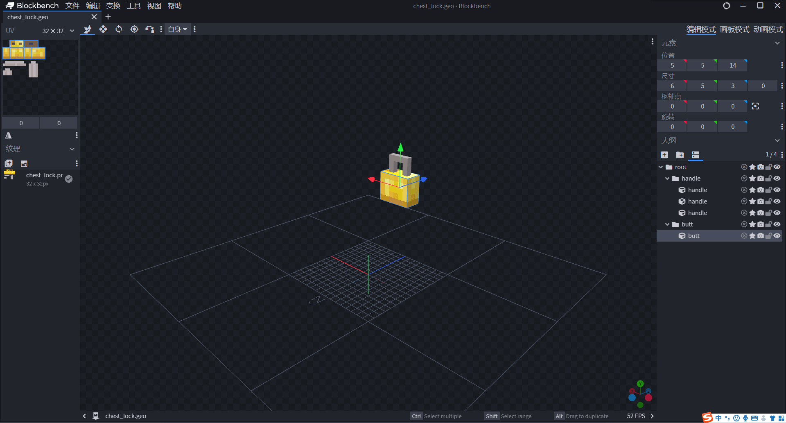
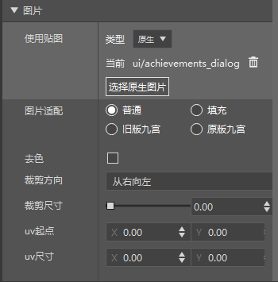
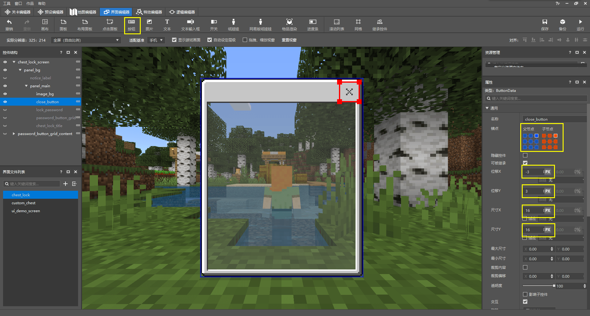
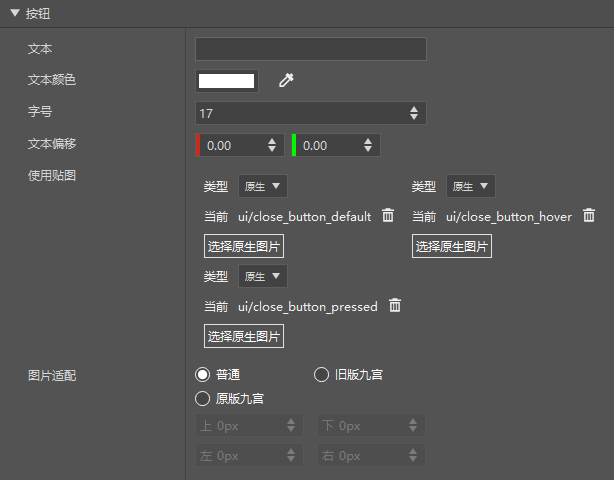
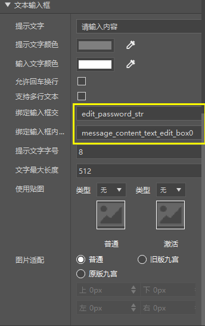
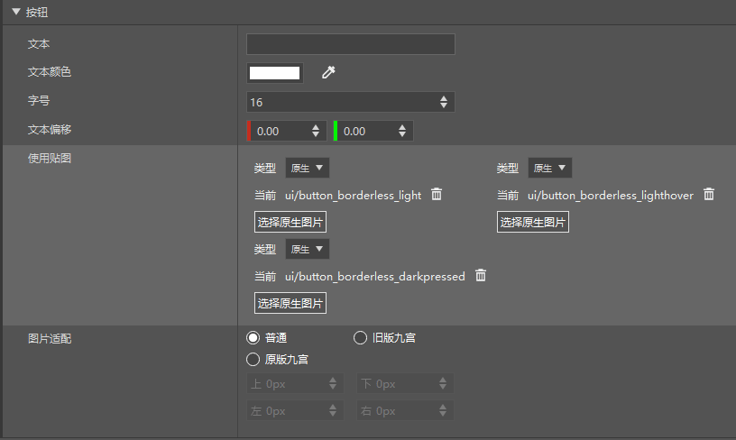
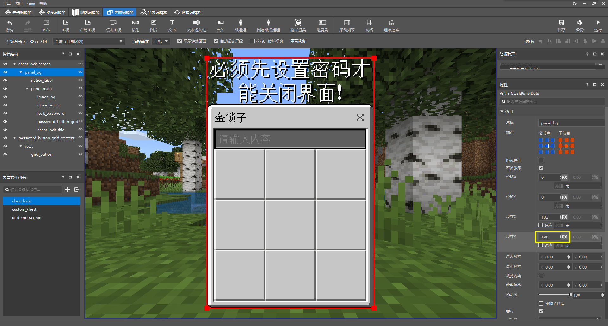
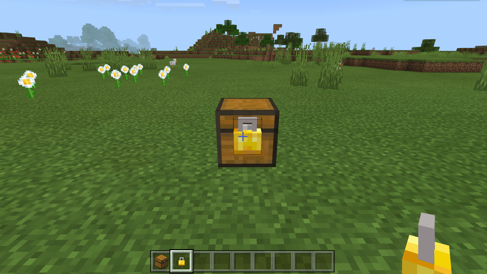
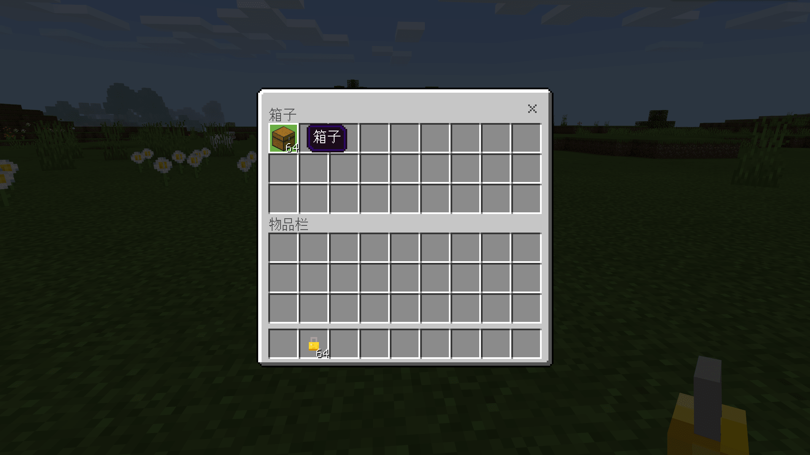
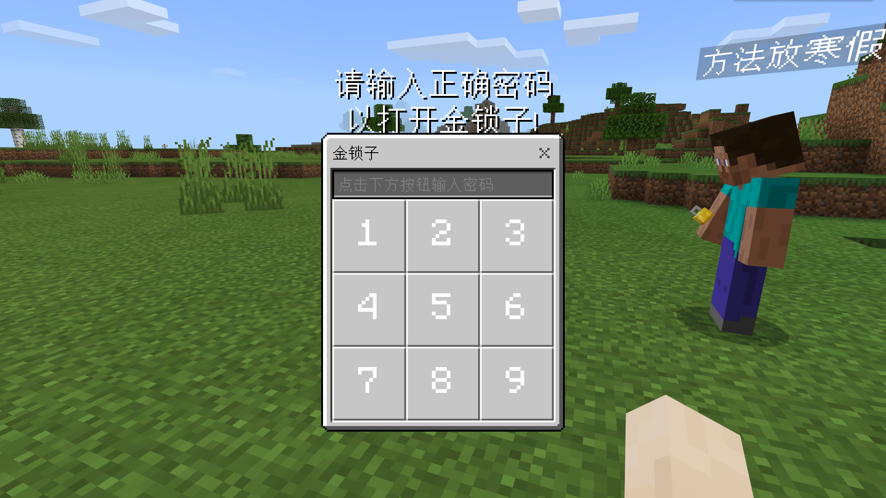

# 挑战：设计箱子锁

在这一节中，我们一起设计一个箱子锁。由于我们的自定义箱子还不完善，我们暂时使用原版箱子作为示例。它们在本质原理上是一样的。现在，我们开始我们的挑战。可以点击链接：[箱子锁Demo](https://g79.gdl.netease.com/addonguide-14.zip)下载到完整包体。

## 准备资源



我们使用自定义方块中的自定义方块实体来完成箱子锁外观的设计。我们通过Blockbench设计好我们的箱子锁模型，并将其导出为JSON文件：

```json
{
	"format_version": "1.12.0",
	"minecraft:geometry": [
		{
			"description": {
				"identifier": "geometry.chest_lock",
				"texture_width": 32,
				"texture_height": 32,
				"visible_bounds_width": 4,
				"visible_bounds_height": 2.5,
				"visible_bounds_offset": [0, 0.75, 0]
			},
			"bones": [
				{
					"name": "root",
					"pivot": [-9, 5, 15]
				},
				{
					"name": "handle",
					"parent": "root",
					"pivot": [-9, 5, 15],
					"cubes": [
						{"origin": [-10, 12, 15], "size": [4, 1, 1], "uv": [0, 9]},
						{"origin": [-7, 6, 15], "size": [1, 6, 1], "uv": [11, 9]},
						{"origin": [-10, 10, 15], "size": [1, 2, 1], "uv": [0, 12]}
					]
				},
				{
					"name": "butt",
					"parent": "root",
					"pivot": [-9, 5, 15],
					"cubes": [
						{"origin": [-11, 5, 14], "size": [6, 5, 3], "uv": [0, 0]}
					]
				}
			]
		}
	]
}
```

同时，我们为其制作好客户端实体定义文件：

```json
{
    "format_version":"1.10.0",
    "minecraft:client_entity":{
        "description":{
            "identifier":"design:chest_lock",
            "materials":{
                "default":"entity_alphatest"
            },
            "textures":{
                "default":"textures/entity/chest_lock"
            },
            "geometry":{
                "default":"geometry.chest_lock"
            },
            "render_controllers":[
                "controller.render.default"
            ]
        }
    }
}
```

下面，我们制作自定义方块。我们先创建服务端方块定义：

```json
{
    "format_version": "1.16",
    "minecraft:block": {
        "description": {
            "identifier": "design:chest_lock",
            "register_to_creative_menu": true,
            "category": "items"
        },
        "components": {
            "minecraft:destroy_time": 2,
            "minecraft:explosion_resistance": 1000,
            "minecraft:block_light_absorption": 0,
            "netease:tier": {
                "digger": "pickaxe",
                "destroy_special": true,
                "level": 1
            },
            "netease:aabb": {
                "collision": {
                    "min": [0.3125, 0.3125, 0.875],
                    "max": [0.6875, 0.8125, 1.0]
                },
                "clip": {
                    "min": [0.3125, 0.3125, 0.875],
                    "max": [0.6875, 0.8125, 1.0]
                }
            },
            "netease:render_layer": {
                "value": "alpha"
            },
            "netease:solid": {
                "value": false
            },
            "netease:face_directional": {
                "type": "direction"
            },
            "netease:block_entity": {
                "tick": false
            },
            "netease:listen_block_remove": {
                "value": true
            }
        }
    }
}
```

我们使用了`netease:block_entity`设置了方块实体，同时使用了`netease:listen_block_remove`使它的移除事件能够被模组SDK监听。之后，我们再写入客户端方块定义，挂接我们的客户端实体：

```json
{
    "format_version": [
        1,
        1,
        0
    ],
    "design:chest_lock": {
        "sound": "metal",
        "client_entity": {
            "identifier": "design:chest_lock",
            "block_icon": "design:chest_lock",
            "hand_model_use_client_entity": true
        }
    }
}
```

然后我们定义我们的地形图集文件：

```json
{
    "resource_pack_name": "vanilla",
    "texture_name": "atlas.terrain",
    "texture_data": {
        "design:chest_lock": {
            "textures": "textures/blocks/chest_lock"
        }
    }
}
```

至此，我们不带有UI和逻辑的箱子锁已经制作完成了。现在，我们为其添加UI。

## 制作UI

通过前两节的学习，我们已经熟练掌握了使用编辑器制作JSON UI。现在，我们一起来简短地浏览一下如何为箱子锁制作一个UI。


首先我们在屏幕下创建一个栈面板。由于我们希望我们最终的UI是上方一行提示语，下方一个锁面板，所以我们可以使用栈面板将其排列。我们希望锁面板中的按键是9×9的网格，而一个按钮占地40×40像素。我们希望使用`textures/ui/achievements_dialog.png`来作为背景图片，根据其对应的九切片JSON文件的描述，我们的面板侧边距为6个像素。因此我们计算出面板的宽度。同理，我们再根据设想计算出面板的高度。


我们建立锁的主面板，宽度为“适应”。高度我们这里可以设置为最大子控件尺寸，即`100%cm`。这样，我们可以使其高度保持为我们背景图像控件所设置的高度。




我们为主面板添加背景，宽度为“适应”，高度为我们计算出的高度。





我们为面板添加关闭按钮。由于我们想实现一种功能——比如要在屏幕中将密码输入完成才可以关闭屏幕，所以我们此处的关闭按钮通过自定义实现，而不继承原版的按钮。我们使用原版的三张关闭按钮纹理，以实现和原版的关闭按钮相一致。




我们加入一个编辑框控件，用于在我们输入密码时显示密码。我们将“文本输入框”部分中两个绑定按照我们的意愿进行输入。之后，我们将通过脚本SDK对此进行修改。这两个绑定分别需要绑定当编辑框检测到有输入时需要执行的回调和编辑框显示文本的部分需要显示的内容的计算回调。




我们制作密码按键按钮，将其宽度和高度设置为我们预期的40像素。


我们将按键按钮作为模板应用到网格控件中，设置为3×3。同时，我们将合集名`password_grid`设置到网格中。该网格的模板控件将使用该合集名进行绑定。在此处，我们将通过合集绑定显示按钮上的文本（1、2、3、……、9）。


在主面板的最后，我们为其添加一个标题。


然后，我们的主面板就制作完成了。我们在主面板的上方加入一个提示语标签控件。



然后我们再返回来修改栈面板的高度，使整个面板再次回到居中状态。这样，我们的界面便初步绘制完成了。接下来，我们需要将该JSON UI的文件二次手动修改为符合之后我们利用模组API制作逻辑的样子。这也是我们本节中着重讲解的部分之一。我们先来观察我们刚通过编辑器制作完成的JSON UI：

```json
{
   "button_label" : {
      "alpha" : "$control_alpha",
      "color" : "$label_color",
      "font_scale_factor" : "$label_font_scale_factor",
      "font_size" : "$label_font_size",
      "font_type" : "smooth",
      "layer" : "$label_layer",
      "max_size" : [ "100%", "100%" ],
      "offset" : "$label_offset",
      "shadow" : false,
      "text" : "$label_text",
      "text_alignment" : "center",
      "type" : "label"
   },
   "chest_lock_screen" : {
      "absorbs_input" : true,
      "always_accepts_input" : false,
      "controls" : [
         {
            "panel_bg@chest_lock.panel_bg" : {}
         }
      ],
      "force_render_below" : false,
      "is_showing_menu" : true,
      "render_game_behind" : true,
      "render_only_when_topmost" : true,
      "should_steal_mouse" : false,
      "type" : "screen"
   },
   "chest_lock_title" : {
      "alpha" : 1.0,
      "anchor_from" : "top_left",
      "anchor_to" : "top_left",
      "clip_offset" : [ 0, 0 ],
      "clips_children" : false,
      "color" : [ 0.0, 0.0, 0.0 ],
      "enabled" : true,
      "font_scale_factor" : 1.0,
      "font_size" : "normal",
      "font_type" : "smooth",
      "layer" : 14,
      "line_padding" : 0.0,
      "max_size" : [ 0, 0 ],
      "min_size" : [ 0, 0 ],
      "offset" : [ 6, 6 ],
      "priority" : 0,
      "propagate_alpha" : false,
      "shadow" : false,
      "size" : [ "default", "default" ],
      "text" : "金锁子",
      "text_alignment" : "center",
      "type" : "label",
      "visible" : true
   },
   "close_button@common.button" : {
      "$control_alpha" : 1.0,
      "$default_texture" : "textures/ui/close_button_default",
      "$hover_texture" : "textures/ui/close_button_pressed",
      "$is_new_nine_slice" : false,
      "$label_color" : [ 1, 1, 1 ],
      "$label_font_scale_factor" : 1.0,
      "$label_font_size" : "large",
      "$label_layer" : 3,
      "$label_offset" : [ 0, 0 ],
      "$label_text" : "",
      "$nine_slice_buttom" : 0,
      "$nine_slice_left" : 0,
      "$nine_slice_right" : 0,
      "$nine_slice_top" : 0,
      "$nineslice_size" : [ 0, 0, 0, 0 ],
      "$pressed_button_name" : "%chest_lock.click",
      "$pressed_texture" : "textures/ui/close_button_hover",
      "$texture_layer" : 2,
      "alpha" : 1.0,
      "anchor_from" : "top_right",
      "anchor_to" : "top_right",
      "bindings" : [
         {
            "binding_collection_name" : "",
            "binding_condition" : "always_when_visible",
            "binding_type" : "collection_details"
         }
      ],
      "button_mappings" : [],
      "clip_offset" : [ 0, 0 ],
      "clips_children" : false,
      "controls" : [
         {
            "default@chest_lock.default" : {}
         },
         {
            "hover@chest_lock.hover" : {}
         },
         {
            "pressed@chest_lock.pressed" : {}
         },
         {
            "button_label@chest_lock.button_label" : {}
         }
      ],
      "draggable" : "not_draggable",
      "enabled" : true,
      "is_handle_button_move_event" : true,
      "layer" : 4,
      "max_size" : [ 0, 0 ],
      "min_size" : [ 0, 0 ],
      "offset" : [ -3, 3 ],
      "priority" : 0,
      "propagate_alpha" : false,
      "size" : [ 16, 16 ],
      "visible" : true
   },
   "default" : {
      "alpha" : "$control_alpha",
      "is_new_nine_slice" : "$is_new_nine_slice",
      "layer" : "$texture_layer",
      "nine_slice_buttom" : "$nine_slice_buttom",
      "nine_slice_left" : "$nine_slice_left",
      "nine_slice_right" : "$nine_slice_right",
      "nine_slice_top" : "$nine_slice_top",
      "nineslice_size" : "$nineslice_size",
      "texture" : "$default_texture",
      "type" : "image"
   },
   "edit_box_background_default" : {
      "is_new_nine_slice" : "$is_new_nine_slice",
      "nine_slice_buttom" : "$nine_slice_buttom",
      "nine_slice_left" : "$nine_slice_left",
      "nine_slice_right" : "$nine_slice_right",
      "nine_slice_top" : "$nine_slice_top",
      "nineslice_size" : "$nineslice_size",
      "texture" : "$edit_box_default_texture",
      "type" : "image"
   },
   "edit_box_background_hover" : {
      "is_new_nine_slice" : "$is_new_nine_slice",
      "nine_slice_buttom" : "$nine_slice_buttom",
      "nine_slice_left" : "$nine_slice_left",
      "nine_slice_right" : "$nine_slice_right",
      "nine_slice_top" : "$nine_slice_top",
      "nineslice_size" : "$nineslice_size",
      "texture" : "$edit_box_hover_texture",
      "type" : "image"
   },
   "grid_button@common.button" : {
      "$control_alpha" : 1.0,
      "$default_texture" : "textures/ui/button_borderless_light",
      "$hover_texture" : "textures/ui/button_borderless_darkpressed",
      "$is_new_nine_slice" : false,
      "$label_color" : [ 1, 1, 1 ],
      "$label_font_scale_factor" : 0.9399999976158142,
      "$label_font_size" : "large",
      "$label_layer" : 3,
      "$label_offset" : [ 0, 0 ],
      "$label_text" : "",
      "$nine_slice_buttom" : 0,
      "$nine_slice_left" : 0,
      "$nine_slice_right" : 0,
      "$nine_slice_top" : 0,
      "$nineslice_size" : [ 0, 0, 0, 0 ],
      "$pressed_button_name" : "%chest_lock.click",
      "$pressed_texture" : "textures/ui/button_borderless_lighthover",
      "$texture_layer" : 2,
      "alpha" : 1.0,
      "anchor_from" : "center",
      "anchor_to" : "center",
      "bindings" : [
         {
            "binding_collection_name" : "",
            "binding_condition" : "always_when_visible",
            "binding_type" : "collection_details"
         }
      ],
      "button_mappings" : [],
      "clip_offset" : [ 0, 0 ],
      "clips_children" : false,
      "controls" : [
         {
            "default@chest_lock.default" : {}
         },
         {
            "hover@chest_lock.hover" : {}
         },
         {
            "pressed@chest_lock.pressed" : {}
         },
         {
            "button_label@chest_lock.button_label" : {}
         }
      ],
      "draggable" : "not_draggable",
      "enabled" : true,
      "is_handle_button_move_event" : true,
      "max_size" : [ 0, 0 ],
      "min_size" : [ 0, 0 ],
      "offset" : [ 0, 0 ],
      "priority" : 0,
      "propagate_alpha" : false,
      "size" : [ 40, 40 ],
      "visible" : true
   },
   "hover" : {
      "alpha" : "$control_alpha",
      "is_new_nine_slice" : "$is_new_nine_slice",
      "layer" : "$texture_layer",
      "nine_slice_buttom" : "$nine_slice_buttom",
      "nine_slice_left" : "$nine_slice_left",
      "nine_slice_right" : "$nine_slice_right",
      "nine_slice_top" : "$nine_slice_top",
      "nineslice_size" : "$nineslice_size",
      "texture" : "$hover_texture",
      "type" : "image"
   },
   "image_bg" : {
      "alpha" : 1.0,
      "anchor_from" : "center",
      "anchor_to" : "center",
      "clip_direction" : "left",
      "clip_offset" : [ 0, 0 ],
      "clip_ratio" : 0.0,
      "clips_children" : false,
      "enabled" : true,
      "fill" : false,
      "grayscale" : false,
      "is_new_nine_slice" : false,
      "keep_ratio" : true,
      "layer" : 3,
      "max_size" : [ 0, 0 ],
      "min_size" : [ 0, 0 ],
      "nine_slice_buttom" : 0,
      "nine_slice_left" : 0,
      "nine_slice_right" : 0,
      "nine_slice_top" : 0,
      "nineslice_size" : [ 0, 0, 0, 0 ],
      "offset" : [ 0, 0 ],
      "priority" : 0,
      "propagate_alpha" : false,
      "size" : [ "default", 162 ],
      "texture" : "textures/ui/achievements_dialog",
      "type" : "image",
      "uv" : [ 0, 0 ],
      "uv_size" : [ 0, 0 ],
      "visible" : true
   },
   "lock_password@common.text_edit_box" : {
      "$edit_box_default_texture" : "textures/ui/edit_box_indent",
      "$edit_box_hover_texture" : "textures/ui/edit_box_indent_hover",
      "$font_scale_factor" : 1.0,
      "$is_new_nine_slice" : false,
      "$nine_slice_buttom" : 0,
      "$nine_slice_left" : 0,
      "$nine_slice_right" : 0,
      "$nine_slice_top" : 0,
      "$nineslice_size" : [ 0, 0, 0, 0 ],
      "$place_holder_text" : "请输入内容",
      "$place_holder_text_color" : [ 0.50, 0.50, 0.50 ],
      "$text_background_default" : "chest_lock.edit_box_background_default",
      "$text_background_hover" : "chest_lock.edit_box_background_hover",
      "$text_box_name" : "%chest_lock.edit_password_str",
      "$text_box_text_color" : [ 1, 1, 1 ],
      "$text_edit_box_content_binding_name" : "#chest_lock.message_content_text_edit_box0",
      "alpha" : 1.0,
      "anchor_from" : "top_middle",
      "anchor_to" : "top_middle",
      "clip_offset" : [ 0, 0 ],
      "clips_children" : false,
      "draggable" : "not_draggable",
      "enabled" : false,
      "enabled_newline" : false,
      "layer" : 8,
      "max_length" : 512,
      "max_size" : [ 0, 0 ],
      "min_size" : [ 0, 0 ],
      "offset" : [ 0, 20 ],
      "priority" : 0,
      "propagate_alpha" : true,
      "size" : [ "100.0%+-12.0px", 16 ],
      "visible" : true
   },
   "namespace" : "chest_lock",
   "notice_label" : {
      "alpha" : 1.0,
      "anchor_from" : "center",
      "anchor_to" : "center",
      "clip_offset" : [ 0, 0 ],
      "clips_children" : false,
      "color" : [ 1, 1, 1 ],
      "enabled" : true,
      "font_scale_factor" : 0.9399999976158142,
      "font_size" : "large",
      "font_type" : "smooth",
      "layer" : 1,
      "line_padding" : 0.0,
      "max_size" : [ 0, 0 ],
      "min_size" : [ 0, 0 ],
      "offset" : [ 0, 0 ],
      "priority" : 0,
      "propagate_alpha" : false,
      "shadow" : true,
      "size" : [ "100.0%+0.0px", 36 ],
      "text" : "必须先设置密码才能关闭界面！",
      "text_alignment" : "center",
      "type" : "label",
      "visible" : true
   },
   "panel_bg" : {
      "alpha" : 1.0,
      "anchor_from" : "center",
      "anchor_to" : "center",
      "clip_offset" : [ 0, 0 ],
      "clips_children" : false,
      "controls" : [
         {
            "notice_label@chest_lock.notice_label" : {}
         },
         {
            "panel_main@chest_lock.panel_main" : {}
         }
      ],
      "enabled" : true,
      "layer" : 0,
      "max_size" : [ 0, 0 ],
      "min_size" : [ 0, 0 ],
      "offset" : [ 0, 0 ],
      "orientation" : "vertical",
      "priority" : 0,
      "propagate_alpha" : false,
      "size" : [ 132, 198 ],
      "type" : "stack_panel",
      "use_priority" : false,
      "visible" : true
   },
   "panel_main" : {
      "alpha" : 1.0,
      "anchor_from" : "center",
      "anchor_to" : "center",
      "clip_offset" : [ 0, 0 ],
      "clips_children" : false,
      "controls" : [
         {
            "image_bg@chest_lock.image_bg" : {}
         },
         {
            "close_button@chest_lock.close_button" : {}
         },
         {
            "lock_password@chest_lock.lock_password" : {}
         },
         {
            "password_button_grid@chest_lock.password_button_grid" : {}
         },
         {
            "chest_lock_title@chest_lock.chest_lock_title" : {}
         }
      ],
      "enabled" : true,
      "layer" : 2,
      "max_size" : [ 0, 0 ],
      "min_size" : [ 0, 0 ],
      "offset" : [ 0, 0 ],
      "priority" : 0,
      "propagate_alpha" : false,
      "size" : [ "default", "100.0%cm+0.0px" ],
      "type" : "panel",
      "visible" : true
   },
   "password_button_grid" : {
      "alpha" : 1.0,
      "anchor_from" : "top_middle",
      "anchor_to" : "top_middle",
      "clip_offset" : [ 0, 0 ],
      "clips_children" : false,
      "collection_name" : "test_grid",
      "enabled" : true,
      "grid_dimensions" : [ 3.0, 3.0 ],
      "grid_item_template" : "chest_lock.grid_button",
      "grid_rescaling_type" : "none",
      "layer" : 10,
      "max_size" : [ 0, 0 ],
      "maximum_grid_items" : 0,
      "min_size" : [ 0, 0 ],
      "offset" : [ 0, 36 ],
      "priority" : 0,
      "propagate_alpha" : true,
      "size" : [ "100.0%+-12.0px", 120 ],
      "type" : "grid",
      "visible" : true
   },
   "password_button_grid_content" : {
      "absorbs_input" : true,
      "always_accepts_input" : false,
      "controls" : [
         {
            "root@chest_lock.root" : {}
         }
      ],
      "force_render_below" : false,
      "is_showing_menu" : true,
      "render_game_behind" : true,
      "render_only_when_topmost" : true,
      "should_steal_mouse" : false,
      "type" : "screen"
   },
   "pressed" : {
      "alpha" : "$control_alpha",
      "is_new_nine_slice" : "$is_new_nine_slice",
      "layer" : "$texture_layer",
      "nine_slice_buttom" : "$nine_slice_buttom",
      "nine_slice_left" : "$nine_slice_left",
      "nine_slice_right" : "$nine_slice_right",
      "nine_slice_top" : "$nine_slice_top",
      "nineslice_size" : "$nineslice_size",
      "texture" : "$pressed_texture",
      "type" : "image"
   },
   "root" : {
      "alpha" : 1.0,
      "anchor_from" : "center",
      "anchor_to" : "center",
      "clip_offset" : [ 0, 0 ],
      "clips_children" : false,
      "controls" : [
         {
            "grid_button@chest_lock.grid_button" : {}
         }
      ],
      "enabled" : true,
      "layer" : 0,
      "max_size" : [ 0, 0 ],
      "min_size" : [ 0, 0 ],
      "offset" : [ 0, 0 ],
      "priority" : 0,
      "propagate_alpha" : false,
      "size" : [ "100.0%cm+100.0px", "100.0%cm+100.0px" ],
      "type" : "panel",
      "visible" : true
   }
}
```

目前的控件是使用了字母序排序。我们先将其排列为易读的顺序：

```json
{
   "namespace" : "chest_lock",
   "chest_lock_screen" : {
      "absorbs_input" : true,
      "always_accepts_input" : false,
      "controls" : [
         {
            "panel_bg@chest_lock.panel_bg" : {}
         }
      ],
      "force_render_below" : false,
      "is_showing_menu" : true,
      "render_game_behind" : true,
      "render_only_when_topmost" : true,
      "should_steal_mouse" : false,
      "type" : "screen"
   },
   "panel_bg" : {
      "alpha" : 1.0,
      "anchor_from" : "center",
      "anchor_to" : "center",
      "clip_offset" : [ 0, 0 ],
      "clips_children" : false,
      "controls" : [
         {
            "notice_label@chest_lock.notice_label" : {}
         },
         {
            "panel_main@chest_lock.panel_main" : {}
         }
      ],
      "enabled" : true,
      "layer" : 0,
      "max_size" : [ 0, 0 ],
      "min_size" : [ 0, 0 ],
      "offset" : [ 0, 0 ],
      "orientation" : "vertical",
      "priority" : 0,
      "propagate_alpha" : false,
      "size" : [ 132, 198 ],
      "type" : "stack_panel",
      "use_priority" : false,
      "visible" : true
   },
   "notice_label" : {
      "alpha" : 1.0,
      "anchor_from" : "center",
      "anchor_to" : "center",
      "clip_offset" : [ 0, 0 ],
      "clips_children" : false,
      "color" : [ 1, 1, 1 ],
      "enabled" : true,
      "font_scale_factor" : 0.9399999976158142,
      "font_size" : "large",
      "font_type" : "smooth",
      "layer" : 1,
      "line_padding" : 0.0,
      "max_size" : [ 0, 0 ],
      "min_size" : [ 0, 0 ],
      "offset" : [ 0, 0 ],
      "priority" : 0,
      "propagate_alpha" : false,
      "shadow" : true,
      "size" : [ "100.0%+0.0px", 36 ],
      "text" : "必须先设置密码才能关闭界面！",
      "text_alignment" : "center",
      "type" : "label",
      "visible" : true
   },
   "panel_main" : {
      "alpha" : 1.0,
      "anchor_from" : "center",
      "anchor_to" : "center",
      "clip_offset" : [ 0, 0 ],
      "clips_children" : false,
      "controls" : [
         {
            "image_bg@chest_lock.image_bg" : {}
         },
         {
            "close_button@chest_lock.close_button" : {}
         },
         {
            "lock_password@chest_lock.lock_password" : {}
         },
         {
            "password_button_grid@chest_lock.password_button_grid" : {}
         },
         {
            "chest_lock_title@chest_lock.chest_lock_title" : {}
         }
      ],
      "enabled" : true,
      "layer" : 2,
      "max_size" : [ 0, 0 ],
      "min_size" : [ 0, 0 ],
      "offset" : [ 0, 0 ],
      "priority" : 0,
      "propagate_alpha" : false,
      "size" : [ "default", "100.0%cm+0.0px" ],
      "type" : "panel",
      "visible" : true
   },
   "image_bg" : {
      "alpha" : 1.0,
      "anchor_from" : "center",
      "anchor_to" : "center",
      "clip_direction" : "left",
      "clip_offset" : [ 0, 0 ],
      "clip_ratio" : 0.0,
      "clips_children" : false,
      "enabled" : true,
      "fill" : false,
      "grayscale" : false,
      "is_new_nine_slice" : false,
      "keep_ratio" : true,
      "layer" : 3,
      "max_size" : [ 0, 0 ],
      "min_size" : [ 0, 0 ],
      "nine_slice_buttom" : 0,
      "nine_slice_left" : 0,
      "nine_slice_right" : 0,
      "nine_slice_top" : 0,
      "nineslice_size" : [ 0, 0, 0, 0 ],
      "offset" : [ 0, 0 ],
      "priority" : 0,
      "propagate_alpha" : false,
      "size" : [ "default", 162 ],
      "texture" : "textures/ui/achievements_dialog",
      "type" : "image",
      "uv" : [ 0, 0 ],
      "uv_size" : [ 0, 0 ],
      "visible" : true
   },
   "default" : {
      "alpha" : "$control_alpha",
      "is_new_nine_slice" : "$is_new_nine_slice",
      "layer" : "$texture_layer",
      "nine_slice_buttom" : "$nine_slice_buttom",
      "nine_slice_left" : "$nine_slice_left",
      "nine_slice_right" : "$nine_slice_right",
      "nine_slice_top" : "$nine_slice_top",
      "nineslice_size" : "$nineslice_size",
      "texture" : "$default_texture",
      "type" : "image"
   },
   "hover" : {
      "alpha" : "$control_alpha",
      "is_new_nine_slice" : "$is_new_nine_slice",
      "layer" : "$texture_layer",
      "nine_slice_buttom" : "$nine_slice_buttom",
      "nine_slice_left" : "$nine_slice_left",
      "nine_slice_right" : "$nine_slice_right",
      "nine_slice_top" : "$nine_slice_top",
      "nineslice_size" : "$nineslice_size",
      "texture" : "$hover_texture",
      "type" : "image"
   },
   "pressed" : {
      "alpha" : "$control_alpha",
      "is_new_nine_slice" : "$is_new_nine_slice",
      "layer" : "$texture_layer",
      "nine_slice_buttom" : "$nine_slice_buttom",
      "nine_slice_left" : "$nine_slice_left",
      "nine_slice_right" : "$nine_slice_right",
      "nine_slice_top" : "$nine_slice_top",
      "nineslice_size" : "$nineslice_size",
      "texture" : "$pressed_texture",
      "type" : "image"
   },
   "button_label" : {
      "alpha" : "$control_alpha",
      "color" : "$label_color",
      "font_scale_factor" : "$label_font_scale_factor",
      "font_size" : "$label_font_size",
      "font_type" : "smooth",
      "layer" : "$label_layer",
      "max_size" : [ "100%", "100%" ],
      "offset" : "$label_offset",
      "shadow" : false,
      "text" : "$label_text",
      "text_alignment" : "center",
      "type" : "label"
   },
   "close_button@common.button" : {
      "$control_alpha" : 1.0,
      "$default_texture" : "textures/ui/close_button_default",
      "$hover_texture" : "textures/ui/close_button_pressed",
      "$is_new_nine_slice" : false,
      "$label_color" : [ 1, 1, 1 ],
      "$label_font_scale_factor" : 1.0,
      "$label_font_size" : "large",
      "$label_layer" : 3,
      "$label_offset" : [ 0, 0 ],
      "$label_text" : "",
      "$nine_slice_buttom" : 0,
      "$nine_slice_left" : 0,
      "$nine_slice_right" : 0,
      "$nine_slice_top" : 0,
      "$nineslice_size" : [ 0, 0, 0, 0 ],
      "$pressed_button_name" : "%chest_lock.click",
      "$pressed_texture" : "textures/ui/close_button_hover",
      "$texture_layer" : 2,
      "alpha" : 1.0,
      "anchor_from" : "top_right",
      "anchor_to" : "top_right",
      "bindings" : [
         {
            "binding_collection_name" : "",
            "binding_condition" : "always_when_visible",
            "binding_type" : "collection_details"
         }
      ],
      "button_mappings" : [],
      "clip_offset" : [ 0, 0 ],
      "clips_children" : false,
      "controls" : [
         {
            "default@chest_lock.default" : {}
         },
         {
            "hover@chest_lock.hover" : {}
         },
         {
            "pressed@chest_lock.pressed" : {}
         },
         {
            "button_label@chest_lock.button_label" : {}
         }
      ],
      "draggable" : "not_draggable",
      "enabled" : true,
      "is_handle_button_move_event" : true,
      "layer" : 4,
      "max_size" : [ 0, 0 ],
      "min_size" : [ 0, 0 ],
      "offset" : [ -3, 3 ],
      "priority" : 0,
      "propagate_alpha" : false,
      "size" : [ 16, 16 ],
      "visible" : true
   },
   "edit_box_background_default" : {
      "is_new_nine_slice" : "$is_new_nine_slice",
      "nine_slice_buttom" : "$nine_slice_buttom",
      "nine_slice_left" : "$nine_slice_left",
      "nine_slice_right" : "$nine_slice_right",
      "nine_slice_top" : "$nine_slice_top",
      "nineslice_size" : "$nineslice_size",
      "texture" : "$edit_box_default_texture",
      "type" : "image"
   },
   "edit_box_background_hover" : {
      "is_new_nine_slice" : "$is_new_nine_slice",
      "nine_slice_buttom" : "$nine_slice_buttom",
      "nine_slice_left" : "$nine_slice_left",
      "nine_slice_right" : "$nine_slice_right",
      "nine_slice_top" : "$nine_slice_top",
      "nineslice_size" : "$nineslice_size",
      "texture" : "$edit_box_hover_texture",
      "type" : "image"
   },
   "lock_password@common.text_edit_box" : {
      "$edit_box_default_texture" : "textures/ui/edit_box_indent",
      "$edit_box_hover_texture" : "textures/ui/edit_box_indent_hover",
      "$font_scale_factor" : 1.0,
      "$is_new_nine_slice" : false,
      "$nine_slice_buttom" : 0,
      "$nine_slice_left" : 0,
      "$nine_slice_right" : 0,
      "$nine_slice_top" : 0,
      "$nineslice_size" : [ 0, 0, 0, 0 ],
      "$place_holder_text" : "请输入内容",
      "$place_holder_text_color" : [ 0.50, 0.50, 0.50 ],
      "$text_background_default" : "chest_lock.edit_box_background_default",
      "$text_background_hover" : "chest_lock.edit_box_background_hover",
      "$text_box_name" : "%chest_lock.edit_password_str",
      "$text_box_text_color" : [ 1, 1, 1 ],
      "$text_edit_box_content_binding_name" : "#chest_lock.message_content_text_edit_box0",
      "alpha" : 1.0,
      "anchor_from" : "top_middle",
      "anchor_to" : "top_middle",
      "clip_offset" : [ 0, 0 ],
      "clips_children" : false,
      "draggable" : "not_draggable",
      "enabled" : false,
      "enabled_newline" : false,
      "layer" : 8,
      "max_length" : 512,
      "max_size" : [ 0, 0 ],
      "min_size" : [ 0, 0 ],
      "offset" : [ 0, 20 ],
      "priority" : 0,
      "propagate_alpha" : true,
      "size" : [ "100.0%+-12.0px", 16 ],
      "visible" : true
   },
   "password_button_grid" : {
      "alpha" : 1.0,
      "anchor_from" : "top_middle",
      "anchor_to" : "top_middle",
      "clip_offset" : [ 0, 0 ],
      "clips_children" : false,
      "collection_name" : "test_grid",
      "enabled" : true,
      "grid_dimensions" : [ 3.0, 3.0 ],
      "grid_item_template" : "chest_lock.grid_button",
      "grid_rescaling_type" : "none",
      "layer" : 10,
      "max_size" : [ 0, 0 ],
      "maximum_grid_items" : 0,
      "min_size" : [ 0, 0 ],
      "offset" : [ 0, 36 ],
      "priority" : 0,
      "propagate_alpha" : true,
      "size" : [ "100.0%+-12.0px", 120 ],
      "type" : "grid",
      "visible" : true
   },
   "chest_lock_title" : {
      "alpha" : 1.0,
      "anchor_from" : "top_left",
      "anchor_to" : "top_left",
      "clip_offset" : [ 0, 0 ],
      "clips_children" : false,
      "color" : [ 0.0, 0.0, 0.0 ],
      "enabled" : true,
      "font_scale_factor" : 1.0,
      "font_size" : "normal",
      "font_type" : "smooth",
      "layer" : 14,
      "line_padding" : 0.0,
      "max_size" : [ 0, 0 ],
      "min_size" : [ 0, 0 ],
      "offset" : [ 6, 6 ],
      "priority" : 0,
      "propagate_alpha" : false,
      "shadow" : false,
      "size" : [ "default", "default" ],
      "text" : "金锁子",
      "text_alignment" : "center",
      "type" : "label",
      "visible" : true
   },
   
   "password_button_grid_content" : {
      "absorbs_input" : true,
      "always_accepts_input" : false,
      "controls" : [
         {
            "root@chest_lock.root" : {}
         }
      ],
      "force_render_below" : false,
      "is_showing_menu" : true,
      "render_game_behind" : true,
      "render_only_when_topmost" : true,
      "should_steal_mouse" : false,
      "type" : "screen"
   },
   "root" : {
      "alpha" : 1.0,
      "anchor_from" : "center",
      "anchor_to" : "center",
      "clip_offset" : [ 0, 0 ],
      "clips_children" : false,
      "controls" : [
         {
            "grid_button@chest_lock.grid_button" : {}
         }
      ],
      "enabled" : true,
      "layer" : 0,
      "max_size" : [ 0, 0 ],
      "min_size" : [ 0, 0 ],
      "offset" : [ 0, 0 ],
      "priority" : 0,
      "propagate_alpha" : false,
      "size" : [ "100.0%cm+100.0px", "100.0%cm+100.0px" ],
      "type" : "panel",
      "visible" : true
   },
   "grid_button@common.button" : {
      "$control_alpha" : 1.0,
      "$default_texture" : "textures/ui/button_borderless_light",
      "$hover_texture" : "textures/ui/button_borderless_darkpressed",
      "$is_new_nine_slice" : false,
      "$label_color" : [ 1, 1, 1 ],
      "$label_font_scale_factor" : 0.9399999976158142,
      "$label_font_size" : "large",
      "$label_layer" : 3,
      "$label_offset" : [ 0, 0 ],
      "$label_text" : "",
      "$nine_slice_buttom" : 0,
      "$nine_slice_left" : 0,
      "$nine_slice_right" : 0,
      "$nine_slice_top" : 0,
      "$nineslice_size" : [ 0, 0, 0, 0 ],
      "$pressed_button_name" : "%chest_lock.click",
      "$pressed_texture" : "textures/ui/button_borderless_lighthover",
      "$texture_layer" : 2,
      "alpha" : 1.0,
      "anchor_from" : "center",
      "anchor_to" : "center",
      "bindings" : [
         {
            "binding_collection_name" : "",
            "binding_condition" : "always_when_visible",
            "binding_type" : "collection_details"
         }
      ],
      "button_mappings" : [],
      "clip_offset" : [ 0, 0 ],
      "clips_children" : false,
      "controls" : [
         {
            "default@chest_lock.default" : {}
         },
         {
            "hover@chest_lock.hover" : {}
         },
         {
            "pressed@chest_lock.pressed" : {}
         },
         {
            "button_label@chest_lock.button_label" : {}
         }
      ],
      "draggable" : "not_draggable",
      "enabled" : true,
      "is_handle_button_move_event" : true,
      "max_size" : [ 0, 0 ],
      "min_size" : [ 0, 0 ],
      "offset" : [ 0, 0 ],
      "priority" : 0,
      "propagate_alpha" : false,
      "size" : [ 40, 40 ],
      "visible" : true
   }
}
```

我们依次修改我们的控件。

```json
"chest_lock_screen@common.base_screen" : {
   "$screen_content": "chest_lock.panel_bg"
}
```

首先，我们可以将我们的屏幕控件修改为继承自原版的`common.base_screen`。我们在第一节中提到过，这样修改有助于我们的屏幕适配不同类型的异形屏。然后，我们开始为控件添加绑定。

```json
"close_button@common.button" : {
   "$control_alpha" : 1.0,
   "$default_texture" : "textures/ui/close_button_default",
   "$hover_texture" : "textures/ui/close_button_pressed",
   "$is_new_nine_slice" : false,
   "$label_color" : [ 1, 1, 1 ],
   "$label_font_scale_factor" : 1.0,
   "$label_font_size" : "large",
   "$label_layer" : 3,
   "$label_offset" : [ 0, 0 ],
   "$label_text" : "",
   "$nine_slice_buttom" : 0,
   "$nine_slice_left" : 0,
   "$nine_slice_right" : 0,
   "$nine_slice_top" : 0,
   "$nineslice_size" : [ 0, 0, 0, 0 ],
   "$pressed_button_name" : "#on_close", // 为我们的关闭按钮加入一个#on_close绑定。当然，我们也可以使用“%”开头的绑定
   "$pressed_texture" : "textures/ui/close_button_hover",
   "$texture_layer" : 2,
   "alpha" : 1.0,
   "anchor_from" : "top_right",
   "anchor_to" : "top_right",
   // 删除此处用不到的bindings和button_mappings
   "button_mappings" : [],
   "clip_offset" : [ 0, 0 ],
   "clips_children" : false,
   "controls" : [
      {
         "default@chest_lock.default" : {}
      },
      {
         "hover@chest_lock.hover" : {}
      },
      {
         "pressed@chest_lock.pressed" : {}
      },
      {
         "button_label@chest_lock.button_label" : {}
      }
   ],
   "draggable" : "not_draggable",
   "enabled" : true,
   "is_handle_button_move_event" : true,
   "layer" : 4,
   "max_size" : [ 0, 0 ],
   "min_size" : [ 0, 0 ],
   "offset" : [ -3, 3 ],
   "priority" : 0,
   "propagate_alpha" : false,
   "size" : [ 16, 16 ],
   "visible" : true
}
```

我们为关闭按钮加入了绑定，同时，我们希望添加几个按钮映射，不过并不是添加在按钮中。

```json
"chest_lock_screen@common.base_screen" : {
   "$screen_content": "chest_lock.panel_bg",
   "button_mappings": [
      {
         "from_button_id": "button.menu_inventory_cancel",
         "to_button_id": "#on_close",
         "mapping_type": "global"
      },
      {
         "from_button_id": "button.menu_cancel",
         "to_button_id": "#on_close",
         "mapping_type": "global"
      }
   ]
}
```

我们希望通过全局映射的方式将映射放在屏幕控件中。其中这里的写法意味着我们将可以通过Esc等返回按键来退出这个屏幕。

```json
"lock_password@common.text_edit_box" : {
   "$edit_box_default_texture" : "textures/ui/edit_box_indent",
   "$edit_box_hover_texture" : "textures/ui/edit_box_indent_hover",
   "$font_scale_factor" : 1.0,
   "$is_new_nine_slice" : false,
   "$nine_slice_buttom" : 0,
   "$nine_slice_left" : 0,
   "$nine_slice_right" : 0,
   "$nine_slice_top" : 0,
   "$nineslice_size" : [ 0, 0, 0, 0 ],
   "$place_holder_text" : "点击下方按钮输入密码", // 稍微更改一下输入框提示文本
   "$place_holder_text_color" : [ 0.50, 0.50, 0.50 ],
   "$text_background_default" : "chest_lock.edit_box_background_default",
   "$text_background_hover" : "chest_lock.edit_box_background_hover",
   "$text_box_name" : "%ChestLock.edit_password_str", // 指定编辑框中的文本框的绑定名
   "$text_box_text_color" : [ 1, 1, 1 ],
   "$text_edit_box_binding_condition": "always_when_visible", // 指定文本编辑框内容绑定发生的条件，为当可见时便始终进行绑定
   "$text_edit_box_content_binding_name" : "#chest_lock.message_content_text_edit_box0", // 指定文本编辑框内容的绑定名
   "alpha" : 1.0,
   "anchor_from" : "top_middle",
   "anchor_to" : "top_middle",
   "clip_offset" : [ 0, 0 ],
   "clips_children" : false,
   "draggable" : "not_draggable",
   "enabled" : false,
   "enabled_newline" : false,
   "layer" : 8,
   "max_length" : 512,
   "max_size" : [ 0, 0 ],
   "min_size" : [ 0, 0 ],
   "offset" : [ 0, 20 ],
   "priority" : 0,
   "propagate_alpha" : true,
   "size" : [ "100.0%+-12.0px", 16 ],
   "visible" : true
}
```

我们为编辑框添加指定两个绑定名，分别用于执行输入逻辑和显示输入内容。

```json
"password_button_grid" : {
   "alpha" : 1.0,
   "anchor_from" : "top_middle",
   "anchor_to" : "top_middle",
   "clip_offset" : [ 0, 0 ],
   "clips_children" : false,
   "$password_collection": "password_grid", // 将password_grid更改为使用变量存储
   "collection_name" : "$password_collection", // 然后将该变量应用到自身的collection_name上以及所有模板控件的合集绑定中
   "enabled" : true,
   "grid_dimensions" : [ 3.0, 3.0 ],
   "grid_item_template" : "chest_lock.grid_button",
   "grid_rescaling_type" : "none",
   "layer" : 10,
   "max_size" : [ 0, 0 ],
   "maximum_grid_items" : 0,
   "min_size" : [ 0, 0 ],
   "offset" : [ 0, 36 ],
   "priority" : 0,
   "propagate_alpha" : true,
   "size" : [ "100.0%+-12.0px", 120 ],
   "type" : "grid",
   "visible" : true
}
```

我们将输入键盘的网格的合集名属性稍加修改，使其模板控件能够更加方便地进行绑定。

```json
"grid_button@common.button" : {
   "$control_alpha" : 1.0,
   "$default_texture" : "textures/ui/button_borderless_light",
   "$hover_texture" : "textures/ui/button_borderless_darkpressed",
   "$is_new_nine_slice" : false,
   "$label_color" : [ 1, 1, 1 ],
   "$label_font_scale_factor" : 1.0,
   "$label_font_size" : "large",
   "$label_layer" : 3,
   "$label_offset" : [ 0, 0 ],
   "$label_text" : "",
   "$nine_slice_buttom" : 0,
   "$nine_slice_left" : 0,
   "$nine_slice_right" : 0,
   "$nine_slice_top" : 0,
   "$nineslice_size" : [ 0, 0, 0, 0 ],
   "$pressed_button_name" : "#click", // 为我们的关闭按钮加入一个#click绑定。当然，我们也可以使用“%”开头的绑定
   "$pressed_texture" : "textures/ui/button_borderless_lighthover",
   "$texture_layer" : 2,
   "alpha" : 1.0,
   "anchor_from" : "center",
   "anchor_to" : "center",
   "bindings" : [
      {
         "binding_collection_name" : "$password_collection", // 指定合集名所在的变量
         "binding_condition" : "always_when_visible",
         "binding_type" : "collection_details"
      }
   ],
   // 删除此处用不到的button_mappings
   "clip_offset" : [ 0, 0 ],
   "clips_children" : false,
   "controls" : [
      {
         "default@chest_lock.default" : {}
      },
      {
         "hover@chest_lock.hover" : {}
      },
      {
         "pressed@chest_lock.pressed" : {}
      },
      {
         "button_label@chest_lock.button_label" : {
            "text": "#text",
            "bindings": [
               {
                  "binding_condition": "visible",
                  "binding_collection_name": "$password_collection",
                  "binding_type": "collection",
                  "binding_name_override": "#text",
                  "binding_name": "#password_number"
               }
            ] // 此处在继承之后二次修改了button_label控件，加入了一个合集绑定，用于之后为该标签赋予不同的按键文本
         }
      }
   ],
   "draggable" : "not_draggable",
   "enabled" : true,
   "is_handle_button_move_event" : true,
   "max_size" : [ 0, 0 ],
   "min_size" : [ 0, 0 ],
   "offset" : [ 0, 0 ],
   "priority" : 0,
   "propagate_alpha" : false,
   "size" : [ 40, 40 ],
   "visible" : true
}
```

我们为按钮加入了一个可以用来响应按下该按钮的合集绑定，同时为按钮的文本加入了一个合集绑定，用于显示按钮上的文字信息。至此，我们完成了JSON UI文件的二次修改，修改完成的完整JSON文件如下：

```json
{
   "namespace" : "chest_lock",
   "chest_lock_screen@common.base_screen" : {
      "$screen_content": "chest_lock.panel_bg",
      "button_mappings": [
         {
            "from_button_id": "button.menu_inventory_cancel",
            "to_button_id": "#on_close",
            "mapping_type": "global"
         },
         {
            "from_button_id": "button.menu_cancel",
            "to_button_id": "#on_close",
            "mapping_type": "global"
         }
      ]
   },
   "panel_bg" : {
      "alpha" : 1.0,
      "anchor_from" : "center",
      "anchor_to" : "center",
      "clip_offset" : [ 0, 0 ],
      "clips_children" : false,
      "controls" : [
         {
            "notice_label@chest_lock.notice_label" : {}
         },
         {
            "panel_main@chest_lock.panel_main" : {}
         }
      ],
      "enabled" : true,
      "layer" : 0,
      "max_size" : [ 0, 0 ],
      "min_size" : [ 0, 0 ],
      "offset" : [ 0, 0 ],
      "orientation" : "vertical",
      "priority" : 0,
      "propagate_alpha" : false,
      "size" : [ 132, 198 ],
      "type" : "stack_panel",
      "use_priority" : false,
      "visible" : true
   },
   "notice_label" : {
      "alpha" : 1.0,
      "anchor_from" : "center",
      "anchor_to" : "center",
      "clip_offset" : [ 0, 0 ],
      "clips_children" : false,
      "color" : [ 1, 1, 1 ],
      "enabled" : true,
      "font_scale_factor" : 1.0,
      "font_size" : "large",
      "font_type" : "smooth",
      "layer" : 1,
      "line_padding" : 0.0,
      "max_size" : [ 0, 0 ],
      "min_size" : [ 0, 0 ],
      "offset" : [ 0, 0 ],
      "priority" : 0,
      "propagate_alpha" : false,
      "shadow" : true,
      "size" : [ "100.0%+0.0px", 36 ],
      "text" : "必须先设置密码才能关闭界面！",
      "text_alignment" : "center",
      "type" : "label",
      "visible" : true
   },
   "panel_main" : {
      "alpha" : 1.0,
      "anchor_from" : "center",
      "anchor_to" : "center",
      "clip_offset" : [ 0, 0 ],
      "clips_children" : false,
      "controls" : [
         {
            "image_bg@chest_lock.image_bg" : {}
         },
         {
            "close_button@chest_lock.close_button" : {}
         },
         {
            "lock_password@chest_lock.lock_password" : {}
         },
         {
            "password_button_grid@chest_lock.password_button_grid" : {}
         },
         {
            "chest_lock_title@chest_lock.chest_lock_title" : {}
         }
      ],
      "enabled" : true,
      "layer" : 2,
      "max_size" : [ 0, 0 ],
      "min_size" : [ 0, 0 ],
      "offset" : [ 0, 0 ],
      "priority" : 0,
      "propagate_alpha" : false,
      "size" : [ "default", "100.0%cm+0.0px" ],
      "type" : "panel",
      "visible" : true
   },
   "image_bg" : {
      "alpha" : 1.0,
      "anchor_from" : "center",
      "anchor_to" : "center",
      "clip_direction" : "left",
      "clip_offset" : [ 0, 0 ],
      "clip_ratio" : 0.0,
      "clips_children" : false,
      "enabled" : true,
      "fill" : false,
      "grayscale" : false,
      "is_new_nine_slice" : false,
      "keep_ratio" : true,
      "layer" : 3,
      "max_size" : [ 0, 0 ],
      "min_size" : [ 0, 0 ],
      "nine_slice_buttom" : 0,
      "nine_slice_left" : 0,
      "nine_slice_right" : 0,
      "nine_slice_top" : 0,
      "nineslice_size" : [ 0, 0, 0, 0 ],
      "offset" : [ 0, 0 ],
      "priority" : 0,
      "propagate_alpha" : false,
      "size" : [ "default", 162 ],
      "texture" : "textures/ui/achievements_dialog",
      "type" : "image",
      "uv" : [ 0, 0 ],
      "uv_size" : [ 0, 0 ],
      "visible" : true
   },
   "default" : {
      "alpha" : "$control_alpha",
      "is_new_nine_slice" : "$is_new_nine_slice",
      "layer" : "$texture_layer",
      "nine_slice_buttom" : "$nine_slice_buttom",
      "nine_slice_left" : "$nine_slice_left",
      "nine_slice_right" : "$nine_slice_right",
      "nine_slice_top" : "$nine_slice_top",
      "nineslice_size" : "$nineslice_size",
      "texture" : "$default_texture",
      "type" : "image"
   },
   "hover" : {
      "alpha" : "$control_alpha",
      "is_new_nine_slice" : "$is_new_nine_slice",
      "layer" : "$texture_layer",
      "nine_slice_buttom" : "$nine_slice_buttom",
      "nine_slice_left" : "$nine_slice_left",
      "nine_slice_right" : "$nine_slice_right",
      "nine_slice_top" : "$nine_slice_top",
      "nineslice_size" : "$nineslice_size",
      "texture" : "$hover_texture",
      "type" : "image"
   },
   "pressed" : {
      "alpha" : "$control_alpha",
      "is_new_nine_slice" : "$is_new_nine_slice",
      "layer" : "$texture_layer",
      "nine_slice_buttom" : "$nine_slice_buttom",
      "nine_slice_left" : "$nine_slice_left",
      "nine_slice_right" : "$nine_slice_right",
      "nine_slice_top" : "$nine_slice_top",
      "nineslice_size" : "$nineslice_size",
      "texture" : "$pressed_texture",
      "type" : "image"
   },
   "button_label" : {
      "alpha" : "$control_alpha",
      "color" : "$label_color",
      "font_scale_factor" : "$label_font_scale_factor",
      "font_size" : "$label_font_size",
      "font_type" : "smooth",
      "layer" : "$label_layer",
      "max_size" : [ "100%", "100%" ],
      "offset" : "$label_offset",
      "shadow" : false,
      "text" : "$label_text",
      "text_alignment" : "center",
      "type" : "label"
   },
   "close_button@common.button" : {
      "$control_alpha" : 1.0,
      "$default_texture" : "textures/ui/close_button_default",
      "$hover_texture" : "textures/ui/close_button_pressed",
      "$is_new_nine_slice" : false,
      "$label_color" : [ 1, 1, 1 ],
      "$label_font_scale_factor" : 1.0,
      "$label_font_size" : "large",
      "$label_layer" : 3,
      "$label_offset" : [ 0, 0 ],
      "$label_text" : "",
      "$nine_slice_buttom" : 0,
      "$nine_slice_left" : 0,
      "$nine_slice_right" : 0,
      "$nine_slice_top" : 0,
      "$nineslice_size" : [ 0, 0, 0, 0 ],
      "$pressed_button_name" : "#on_close",
      "$pressed_texture" : "textures/ui/close_button_hover",
      "$texture_layer" : 2,
      "alpha" : 1.0,
      "anchor_from" : "top_right",
      "anchor_to" : "top_right",
      "button_mappings" : [],
      "clip_offset" : [ 0, 0 ],
      "clips_children" : false,
      "controls" : [
         {
            "default@chest_lock.default" : {}
         },
         {
            "hover@chest_lock.hover" : {}
         },
         {
            "pressed@chest_lock.pressed" : {}
         },
         {
            "button_label@chest_lock.button_label" : {}
         }
      ],
      "draggable" : "not_draggable",
      "enabled" : true,
      "is_handle_button_move_event" : true,
      "layer" : 4,
      "max_size" : [ 0, 0 ],
      "min_size" : [ 0, 0 ],
      "offset" : [ -3, 3 ],
      "priority" : 0,
      "propagate_alpha" : false,
      "size" : [ 16, 16 ],
      "visible" : true
   },
   "edit_box_background_default" : {
      "is_new_nine_slice" : "$is_new_nine_slice",
      "nine_slice_buttom" : "$nine_slice_buttom",
      "nine_slice_left" : "$nine_slice_left",
      "nine_slice_right" : "$nine_slice_right",
      "nine_slice_top" : "$nine_slice_top",
      "nineslice_size" : "$nineslice_size",
      "texture" : "$edit_box_default_texture",
      "type" : "image"
   },
   "edit_box_background_hover" : {
      "is_new_nine_slice" : "$is_new_nine_slice",
      "nine_slice_buttom" : "$nine_slice_buttom",
      "nine_slice_left" : "$nine_slice_left",
      "nine_slice_right" : "$nine_slice_right",
      "nine_slice_top" : "$nine_slice_top",
      "nineslice_size" : "$nineslice_size",
      "texture" : "$edit_box_hover_texture",
      "type" : "image"
   },
   "lock_password@common.text_edit_box" : {
      "$edit_box_default_texture" : "textures/ui/edit_box_indent",
      "$edit_box_hover_texture" : "textures/ui/edit_box_indent_hover",
      "$font_scale_factor" : 1.0,
      "$is_new_nine_slice" : false,
      "$nine_slice_buttom" : 0,
      "$nine_slice_left" : 0,
      "$nine_slice_right" : 0,
      "$nine_slice_top" : 0,
      "$nineslice_size" : [ 0, 0, 0, 0 ],
      "$place_holder_text" : "点击下方按钮输入密码",
      "$place_holder_text_color" : [ 0.50, 0.50, 0.50 ],
      "$text_background_default" : "chest_lock.edit_box_background_default",
      "$text_background_hover" : "chest_lock.edit_box_background_hover",
      "$text_box_name" : "%ChestLock.edit_password_str",
      "$text_box_text_color" : [ 1, 1, 1 ],
      "$text_edit_box_binding_condition": "always_when_visible",
      "$text_edit_box_content_binding_name" : "#chest_lock.message_content_text_edit_box0",
      "alpha" : 1.0,
      "anchor_from" : "top_middle",
      "anchor_to" : "top_middle",
      "clip_offset" : [ 0, 0 ],
      "clips_children" : false,
      "draggable" : "not_draggable",
      "enabled" : false,
      "enabled_newline" : false,
      "layer" : 8,
      "max_length" : 512,
      "max_size" : [ 0, 0 ],
      "min_size" : [ 0, 0 ],
      "offset" : [ 0, 20 ],
      "priority" : 0,
      "propagate_alpha" : true,
      "size" : [ "100.0%+-12.0px", 16 ],
      "visible" : true
   },
   "password_button_grid" : {
      "alpha" : 1.0,
      "anchor_from" : "top_middle",
      "anchor_to" : "top_middle",
      "clip_offset" : [ 0, 0 ],
      "clips_children" : false,
      "$password_collection": "password_grid",
      "collection_name" : "$password_collection",
      "enabled" : true,
      "grid_dimensions" : [ 3.0, 3.0 ],
      "grid_item_template" : "chest_lock.grid_button",
      "grid_rescaling_type" : "none",
      "layer" : 10,
      "max_size" : [ 0, 0 ],
      "maximum_grid_items" : 0,
      "min_size" : [ 0, 0 ],
      "offset" : [ 0, 36 ],
      "priority" : 0,
      "propagate_alpha" : true,
      "size" : [ "100.0%+-12.0px", 120 ],
      "type" : "grid",
      "visible" : true
   },
   "chest_lock_title" : {
      "alpha" : 1.0,
      "anchor_from" : "top_left",
      "anchor_to" : "top_left",
      "clip_offset" : [ 0, 0 ],
      "clips_children" : false,
      "color" : [ 0.0, 0.0, 0.0 ],
      "enabled" : true,
      "font_scale_factor" : 1.0,
      "font_size" : "normal",
      "font_type" : "smooth",
      "layer" : 14,
      "line_padding" : 0.0,
      "max_size" : [ 0, 0 ],
      "min_size" : [ 0, 0 ],
      "offset" : [ 6, 6 ],
      "priority" : 0,
      "propagate_alpha" : false,
      "shadow" : false,
      "size" : [ "default", "default" ],
      "text" : "金锁子",
      "text_alignment" : "center",
      "type" : "label",
      "visible" : true
   },
   
   "password_button_grid_content" : {
      "absorbs_input" : true,
      "always_accepts_input" : false,
      "controls" : [
         {
            "root@chest_lock.root" : {}
         }
      ],
      "force_render_below" : false,
      "is_showing_menu" : true,
      "render_game_behind" : true,
      "render_only_when_topmost" : true,
      "should_steal_mouse" : false,
      "type" : "screen"
   },
   "root" : {
      "alpha" : 1.0,
      "anchor_from" : "center",
      "anchor_to" : "center",
      "clip_offset" : [ 0, 0 ],
      "clips_children" : false,
      "controls" : [
         {
            "grid_button@chest_lock.grid_button" : {}
         }
      ],
      "enabled" : true,
      "layer" : 0,
      "max_size" : [ 0, 0 ],
      "min_size" : [ 0, 0 ],
      "offset" : [ 0, 0 ],
      "priority" : 0,
      "propagate_alpha" : false,
      "size" : [ "100.0%cm+100.0px", "100.0%cm+100.0px" ],
      "type" : "panel",
      "visible" : true
   },
   "grid_button@common.button" : {
      "$control_alpha" : 1.0,
      "$default_texture" : "textures/ui/button_borderless_light",
      "$hover_texture" : "textures/ui/button_borderless_darkpressed",
      "$is_new_nine_slice" : false,
      "$label_color" : [ 1, 1, 1 ],
      "$label_font_scale_factor" : 1.0,
      "$label_font_size" : "large",
      "$label_layer" : 3,
      "$label_offset" : [ 0, 0 ],
      "$label_text" : "",
      "$nine_slice_buttom" : 0,
      "$nine_slice_left" : 0,
      "$nine_slice_right" : 0,
      "$nine_slice_top" : 0,
      "$nineslice_size" : [ 0, 0, 0, 0 ],
      "$pressed_button_name" : "#click",
      "$pressed_texture" : "textures/ui/button_borderless_lighthover",
      "$texture_layer" : 2,
      "alpha" : 1.0,
      "anchor_from" : "center",
      "anchor_to" : "center",
      "bindings" : [
         {
            "binding_collection_name" : "$password_collection",
            "binding_condition" : "always_when_visible",
            "binding_type" : "collection_details"
         }
      ],
      "clip_offset" : [ 0, 0 ],
      "clips_children" : false,
      "controls" : [
         {
            "default@chest_lock.default" : {}
         },
         {
            "hover@chest_lock.hover" : {}
         },
         {
            "pressed@chest_lock.pressed" : {}
         },
         {
            "button_label@chest_lock.button_label" : {
               "text": "#text",
               "bindings": [
                  {
                     "binding_condition": "visible",
                     "binding_collection_name": "$password_collection",
                     "binding_type": "collection",
                     "binding_name_override": "#text",
                     "binding_name": "#password_number"
                  }
               ]
            }
         }
      ],
      "draggable" : "not_draggable",
      "enabled" : true,
      "is_handle_button_move_event" : true,
      "max_size" : [ 0, 0 ],
      "min_size" : [ 0, 0 ],
      "offset" : [ 0, 0 ],
      "priority" : 0,
      "propagate_alpha" : false,
      "size" : [ 40, 40 ],
      "visible" : true
   }
}
```

## 编写逻辑

接下来，我们使用模组API来编写箱子锁的逻辑。首先，我们这里引入一种分模块的管理方式。我们将脚本的文件夹和文件排布如下：

```shell
ChestLockBeh
├─ChestLockScripts
│  │  __init__.py
│  │  modMain.py
│  │
│  ├─client
│  │  │  __init__.py
│  │  └─ listener.py
│  ├─server
│  │  │  __init__.py
│  │  └─ listener.py
│  ├─common
│  │  │  __init__.py
│  │  └─ ChestLock.py
│  └─config
│     │  __init__.py
│     │  helper.py
│     └─ sys.py
└─ #其他文件夹
```

我们的`modMain.py`写入如下：

```python
# -*- coding: utf-8 -*-
import mod.client.extraClientApi as clientApi
import mod.server.extraServerApi as serverApi
from mod.common.mod import Mod

from ChestLockScripts.config.sys import MOD_NAME, MOD_VERSION, MOD_CLIENT_SYSTEM, MOD_SERVER_SYSTEM


# config的MOD_NAME、MOD_VERSION来自config文件下的sys.py
@Mod.Binding(name=MOD_NAME, version=MOD_VERSION)
class ModMain(object):

    def __init__(self):
        pass

    @Mod.InitServer()
    def init_server(self):
        for data in MOD_SERVER_SYSTEM:
            mod_name = data[0]
            system_name = data[1]
            system_cls_path = data[2]
            serverApi.RegisterSystem(mod_name, system_name, system_cls_path)

    @Mod.DestroyServer()
    def destroy_server(self):
        pass

    @Mod.InitClient()
    def init_client(self):
        for data in MOD_CLIENT_SYSTEM:
            mod_name = data[0]
            system_name = data[1]
            system_cls_path = data[2]
            clientApi.RegisterSystem(mod_name, system_name, system_cls_path)

    @Mod.DestroyClient()
    def destroy_client(self):
        pass

```

其中，我们的各种常量来自于`ChestLockScripts.config.sys`模块。这种通过常量来控制各种常用配置属性的方式也是我们想介绍的另一种比较好的编程方式。养成这种习惯有助于你在编程过程中更加得心应手。

我们可以先在`sys.py`中写入常量：

```python
# -*- coding: utf-8 -*-

"""
使用全局变量的好处是：
① 其他文件只访问变量，而所赋的值集中在一个文件内，便于管理，修其一动全身
"""

# Mod名字
MOD_NAME = "design:chest_lock"
# Mod版本
MOD_VERSION = "1.0.0"

# Ui 键
MOD_UI_NAME = 'ChestLockUi'

# UI Class
MOD_UI_CLS_PATH = 'ChestLockScripts.common.ChestLock.Main'

# 监听器系统-系统名字
MOD_LISTENER_SYSTEM_NAME = 'ListenerSystem'

#
MOD_INIT_LOCK_EVENT = 'ChestLockInitPassword'

# 保存金锁子密码时触发的事件
MOD_PASSWORD_SAVE_EVENT = 'ChestLockSavePassword'

#
MOD_LOCK_CACHE_SAVE_EVENT = 'ClientCacheLockData'

# 校验金锁子密码时触发的事件
MOD_PASSWORD_CHECK_EVENT = 'ChestLockPasswordCheck'

# 客户端自定义系统
MOD_CLIENT_SYSTEM = [
    (MOD_NAME, MOD_LISTENER_SYSTEM_NAME, 'ChestLockScripts.client.listener.ListenerSystem')
]

# 服务端自定义系统
MOD_SERVER_SYSTEM = [
    (MOD_NAME, MOD_LISTENER_SYSTEM_NAME, 'ChestLockScripts.server.listener.ListenerSystem')
]

```

下面，我们来写入`client/listener.py`和`server/listener.py`。首先是客户端：

```python
# -*- coding: utf-8 -*-
import mod.client.extraClientApi as clientApi
import ChestLockScripts.config.helper as helper
import time
from ChestLockScripts.config.sys import MOD_NAME, MOD_UI_NAME, MOD_UI_CLS_PATH, MOD_LISTENER_SYSTEM_NAME, MOD_LOCK_CACHE_SAVE_EVENT, MOD_INIT_LOCK_EVENT

ClientSystem = clientApi.GetClientSystemCls()
comp_factory = clientApi.GetEngineCompFactory()


class ListenerSystem(ClientSystem):

    def __init__(self, namespace, system_name):
        ClientSystem.__init__(self, namespace, system_name)
        self.engine_namespace = clientApi.GetEngineNamespace()
        self.engine_system_name = clientApi.GetEngineSystemName()
        self.ListenForEvent(self.engine_namespace, self.engine_system_name, 'UiInitFinished', self, self.ui_init)
        comp_factory.CreateItem(clientApi.GetLevelId()).GetUserDataInEvent('ClientItemUseOnEvent')
        # “*”代表任意附加值
        comp_factory.CreateBlockUseEventWhiteList(clientApi.GetLevelId()).AddBlockItemListenForUseEvent('minecraft:chest:*')
        self.ListenForEvent(self.engine_namespace, self.engine_system_name, 'ClientItemUseOnEvent', self, self.on_item_use_on)
        self.ListenForEvent(self.engine_namespace, self.engine_system_name, 'PlayerTryDestroyBlockClientEvent', self, self.destroy_block_before)
        self.ListenForEvent(self.engine_namespace, self.engine_system_name, 'ClientBlockUseEvent', self, self.on_interact_block)
        self.ListenForEvent(MOD_NAME, MOD_LISTENER_SYSTEM_NAME, MOD_LOCK_CACHE_SAVE_EVENT, self, self.cache_lock)
        self.ListenForEvent(MOD_NAME, MOD_LISTENER_SYSTEM_NAME, MOD_INIT_LOCK_EVENT, self, self.init_lock)
        self.player_id = clientApi.GetLocalPlayerId()
        self.local_lock_cache = {}

    def ui_init(self, event):
        clientApi.RegisterUI(MOD_NAME, MOD_UI_NAME, MOD_UI_CLS_PATH, 'chest_lock.chest_lock_screen')

    def on_item_use_on(self, event):
        item_dict = event['itemDict']
        block_name = event['blockName']
        face = event['face']
        pos = (event['x'], event['y'], event['z'])
        if item_dict and item_dict['newItemName'] == 'design:chest_lock':
            if block_name != 'minecraft:chest':
                event['ret'] = True
            else:
                block_data = comp_factory.CreateBlockInfo(clientApi.GetLevelId()).GetBlock(pos)
                if block_data[1] != face:
                    event['ret'] = True

    def destroy_block_before(self, event):
        full_name = event['blockName']
        pos = (event['x'], event['y'], event['z'])
        aux_data = event['auxData']
        if full_name == 'minecraft:chest':
            offset_pos = helper.get_real_lock_pos(pos, aux_data)
            block_data = comp_factory.CreateBlockInfo(clientApi.GetLevelId()).GetBlock(offset_pos)
            if block_data and block_data[0] == 'design:chest_lock':
                event['cancel'] = True

    def on_interact_block(self, event):
        player_id = event['playerId']
        block_name = event['blockName']
        pos = (event['x'], event['y'], event['z'])
        if block_name == 'minecraft:chest':
            dimension_id = comp_factory.CreateGame(self.player_id).GetCurrentDimension()
            # 箱子的方块旋转数据取值区间在2~5之间
            for i in xrange(2, 6):
                offset_pos = helper.get_real_lock_pos(pos, i)
                block_data = comp_factory.CreateBlockInfo(clientApi.GetLevelId()).GetBlock(offset_pos)
                if block_data and block_data[0] == 'design:chest_lock':
                    # 当房客玩家第一次进入主机游戏时
                    if pos in self.local_lock_cache:
                        owner = self.local_lock_cache[pos]['owner']
                        if owner != player_id:
                            if dimension_id == self.local_lock_cache[pos]['dimension_id']:
                                guests = self.local_lock_cache[pos]['guests']
                                if player_id not in guests:
                                    event['cancel'] = True
                    else:
                        event['cancel'] = True
                    break

    def cache_lock(self, event):
        owner = event['owner']
        pos = event['pos']
        dimension_id = event['dimensionId']
        guests = event.get('guests', [])
        key = event.get('key', '')
        if tuple(pos) not in self.local_lock_cache:
            self.local_lock_cache[tuple(pos)] = {'owner': owner, 'guests': set(), 'dimension_id': dimension_id}
        self.local_lock_cache[tuple(pos)]['owner'] = owner
        self.local_lock_cache[tuple(pos)]['guests'].update(guests)
        if key:
            screen = clientApi.GetTopScreen()
            if screen and getattr(screen, 'my_ui_name') and screen.my_ui_name == 'chest_lock':
                clientApi.PopScreen()

    def init_lock(self, event):
        dimension_id = event['dimensionId']
        pos = event['pos']
        face = event['face']
        self.create_chest_lock_ui(
            {
                'dimension': dimension_id,
                'pos': pos,
                'client': self,
                'face': face,
                'ui_name': 'chest_lock'
            }
        )

    # 创建自定义箱子密码界面
    def create_chest_lock_ui(self, params):
        clientApi.PushScreen(MOD_NAME, MOD_UI_NAME, params)
        comp_factory.CreateGame(self.player_id).SimulateTouchWithMouse(False)

```

然后是服务端：

```python
# -*- coding: utf-8 -*-
import mod.server.extraServerApi as serverApi
from mod.common.minecraftEnum import ItemPosType
import ChestLockScripts.config.helper as helper
from ChestLockScripts.config.sys import MOD_NAME, MOD_LISTENER_SYSTEM_NAME, MOD_PASSWORD_SAVE_EVENT, MOD_LOCK_CACHE_SAVE_EVENT, MOD_PASSWORD_CHECK_EVENT, MOD_INIT_LOCK_EVENT

ServerSystem = serverApi.GetServerSystemCls()
comp_factory = serverApi.GetEngineCompFactory()


class ListenerSystem(ServerSystem):

    def __init__(self, namespace, system_name):
        ServerSystem.__init__(self, namespace, system_name)
        self.engine_namespace = serverApi.GetEngineNamespace()
        self.engine_system_name = serverApi.GetEngineSystemName()
        self.ListenForEvent(self.engine_namespace, self.engine_system_name, 'CommandEvent', self, self.on_command)
        comp_factory.CreateItem(serverApi.GetLevelId()).GetUserDataInEvent('ServerItemUseOnEvent')
        # 将原版方块放入交互方块事件里
        comp_factory.CreateBlockUseEventWhiteList(serverApi.GetLevelId()).AddBlockItemListenForUseEvent('minecraft:chest:*')
        # 监听放置金锁子的事件
        self.ListenForEvent(self.engine_namespace, self.engine_system_name, 'ServerItemUseOnEvent', self, self.on_item_use_on)
        self.ListenForEvent(self.engine_namespace, self.engine_system_name, 'ServerPlayerTryDestroyBlockEvent', self, self.destroy_block_before)
        # 监听方块交互事件
        self.ListenForEvent(self.engine_namespace, self.engine_system_name, 'ServerBlockUseEvent', self, self.on_interact_block)
        self.ListenForEvent(MOD_NAME, MOD_LISTENER_SYSTEM_NAME, MOD_PASSWORD_SAVE_EVENT, self, self.password_saved)
        self.ListenForEvent(MOD_NAME, MOD_LISTENER_SYSTEM_NAME, MOD_PASSWORD_CHECK_EVENT, self, self.password_checked)
        self.chest_lock_guest_cache = {}

    def on_item_use_on(self, event):
        player_id = event['entityId']
        item_dict = event['itemDict']
        block_name = event['blockName']
        dimension_id = event['dimensionId']
        face = event['face']
        pos = (event['x'], event['y'], event['z'])
        if item_dict and item_dict['newItemName'] == 'design:chest_lock':
            tip_comp = comp_factory.CreateGame(serverApi.GetLevelId())
            if block_name != 'minecraft:chest':
                tip_comp.SetOneTipMessage(player_id, '金锁子必须放在箱子正面!')
                event['ret'] = True
            else:
                # 获取箱子的转向方块数据
                chest_state = comp_factory.CreateBlockState(serverApi.GetLevelId()).GetBlockStates(pos, dimension_id)
                if chest_state['facing_direction'] != face:
                    tip_comp.SetOneTipMessage(player_id, '金锁子只能放在箱子正面!')
                    event['ret'] = True
                else:
                    self.NotifyToClient(player_id, MOD_INIT_LOCK_EVENT, {'face': face, 'pos': pos, 'dimensionId': dimension_id})

    def destroy_block_before(self, event):
        full_name = event['fullName']
        pos = (event['x'], event['y'], event['z'])
        dimension = event['dimensionId']
        player_id = event['playerId']
        if full_name == 'minecraft:chest':
            chest_state = comp_factory.CreateBlockState(serverApi.GetLevelId()).GetBlockStates(pos, dimension)
            offset_pos = helper.get_real_lock_pos(pos, chest_state['facing_direction'])
            block_data = comp_factory.CreateBlockInfo(serverApi.GetLevelId()).GetBlockNew(offset_pos, dimension)
            if block_data and block_data['name'] == 'design:chest_lock':
                event['cancel'] = True
        if full_name == 'design:chest_lock':
            block_entity_data_comp = comp_factory.CreateBlockEntityData(serverApi.GetLevelId())
            block_entity_data = block_entity_data_comp.GetBlockEntityData(dimension, pos)
            if block_entity_data['password'] and block_entity_data['owner']:
                if player_id != block_entity_data['owner']:
                    event['cancel'] = True
                else:
                    connect_pos = block_entity_data['connect_pos']
                    del self.chest_lock_guest_cache[tuple(connect_pos)]

    def on_interact_block(self, event):
        player_id = event['playerId']
        block_name = event['blockName']
        pos = (event['x'], event['y'], event['z'])
        dimension_id = event['dimensionId']
        if block_name == 'minecraft:chest':
            face = comp_factory.CreateBlockState(serverApi.GetLevelId()).GetBlockStates(pos, dimension_id)['facing_direction']
            offset_pos = helper.get_real_lock_pos(pos, face)
            block_dict = comp_factory.CreateBlockInfo(serverApi.GetLevelId()).GetBlockNew(offset_pos, dimension_id)
            if block_dict and block_dict['name'] == 'design:chest_lock':
                # 获取箱子旁的金锁子的方块数据
                block_entity_data = comp_factory.CreateBlockEntityData(serverApi.GetLevelId()).GetBlockEntityData(dimension_id, offset_pos)
                if player_id != block_entity_data['owner']:
                    if pos not in self.chest_lock_guest_cache or player_id not in self.chest_lock_guest_cache[pos]:
                        event['cancel'] = True
                        self.NotifyToClient(player_id, MOD_INIT_LOCK_EVENT,
                                            {'face': -1, 'pos': offset_pos, 'dimensionId': dimension_id})
                else:
                    if pos not in self.chest_lock_guest_cache:
                        self.chest_lock_guest_cache[pos] = []

    def password_saved(self, event):
        player_id = event['playerId']
        dimension_id = event['dimension']
        # 这里的坐标是连接的箱子坐标
        pos = event['pos']
        face = event['face']
        block_entity_data_comp = comp_factory.CreateBlockEntityData(serverApi.GetLevelId())
        block_entity_data = block_entity_data_comp.GetBlockEntityData(dimension_id, helper.get_real_lock_pos(pos, face))
        block_entity_data['password'] = event['password']
        block_entity_data['owner'] = player_id
        block_entity_data['connect_pos'] = pos
        self.BroadcastToAllClient(MOD_LOCK_CACHE_SAVE_EVENT, {'pos': pos, 'owner': player_id, 'dimensionId': dimension_id})

    def password_checked(self, event):
        player_id = event['playerId']
        dimension_id = event['dimension']
        # 这里的坐标是金锁子的坐标
        pos = event['pos']
        password = event['password']
        block_entity_data_comp = comp_factory.CreateBlockEntityData(serverApi.GetLevelId())
        block_entity_data = block_entity_data_comp.GetBlockEntityData(dimension_id, tuple(pos))
        if password == block_entity_data['password']:
            chest_pos = block_entity_data['connect_pos']
            if tuple(chest_pos) not in self.chest_lock_guest_cache:
                self.chest_lock_guest_cache[tuple(chest_pos)] = [player_id]
            else:
                self.chest_lock_guest_cache[tuple(chest_pos)].append(player_id)
            self.BroadcastToAllClient(MOD_LOCK_CACHE_SAVE_EVENT,
                                  {'pos': chest_pos, 'owner': player_id, 'dimensionId': dimension_id, 'guests': self.chest_lock_guest_cache[tuple(chest_pos)],
                                   'key': player_id})

    # 事件绑定：触发以/开头的聊天输入文字
    def on_command(self, event):
        entity_id = event['entityId']
        command = event['command']
        if command.startswith('/lock '):
            command_args = command.split(' ')
            tip_comp = comp_factory.CreateGame(serverApi.GetLevelId())
            if len(command_args) == 2 and command_args[1].isdigit():
                if len(command_args[1]) != 4:
                    tip_comp.SetOneTipMessage(entity_id, '/lock指令执行失败，金锁子密码必须为4个数字!')
                    event['cancel'] = True
                    return
                item_comp = comp_factory.CreateItem(entity_id)
                carried_item = item_comp.GetEntityItem(ItemPosType.CARRIED, 0, True)
                if carried_item and carried_item['newItemName'] == 'design:chest_lock':
                    item_comp.SetCustomName(carried_item, command_args[1])
                    item_comp.SpawnItemToPlayerCarried(carried_item, entity_id)
                    tip_comp.SetOneTipMessage(entity_id, '/lock指令执行成功，已将金锁子钥匙密码改为：{}'.format(command_args[1]))
                else:
                    tip_comp.SetOneTipMessage(entity_id, '/lock指令执行失败，你手上拿的不是金锁子!')
            else:
                tip_comp.SetOneTipMessage(entity_id, '/lock指令执行失败，金锁子密码必须为4个数字。指令示例: /lock 0123')
            event['cancel'] = True

```

在这两个文件中，我们主要想实现箱子锁的三个基本功能，分别是：客户端的`ClientItemUseOnEvent`（`self.on_item_use_on`）和服务端的`ServerItemUseOnEvent`（`self.on_item_use_on`）实现的锁主人通过箱子锁的方块物品在箱子方块上使用时触发的“上锁”逻辑，客户端的`PlayerTryDestroyBlockClientEvent`（`self.destroy_block_before`）和服务端的`ServerPlayerTryDestroyBlockEvent`（`self.destroy_block_before`）实现的破坏锁时释放锁的各种信息的摧毁逻辑，还有客户端的`ClientBlockUseEvent`（`self.on_interact_block`）和服务端的`ServerBlockUseEvent`（`self.on_interact_block`）实现的其他非主人玩家对箱子右键（使用该箱子方块）时触发的必须输对密码才能“开锁”的逻辑。

然后，客户端的`UiInitFinished`（`self.ui_init`）、`MOD_LOCK_CACHE_SAVE_EVENT`即我们自定义的事件名`ChestLockPasswordCheck` （`self.cache_lock`）和`MOD_INIT_LOCK_EVENT`即`ChestLockInitPassword` （`self.init_lock`）用于控制客户端上UI的屏幕的显示以及设置目前能够访问箱子的玩家的缓存。其中设置缓存是为了当玩家对箱子方块进行使用时，我们希望直接在客户端拦截那些”不能使用“的玩家。否则，由于网络传输有一定延迟，客户端中的玩家可能会出现看到箱子被使用随即又被服务端传回的数据包制止该次使用所造成的画面波动。

服务端的`MOD_PASSWORD_SAVE_EVENT`即`ChestLockSavePassword` （`self.password_saved`）和`MOD_PASSWORD_CHECK_EVENT`即`ChestLockPasswordCheck` （`self.password_checked`）用于在服务端保存密码和检测密码是否正确。将密码保存至服务端并在服务端直接检测有助于防止客户端玩家的作弊。

其中我们可以看到客户端和服务端都多次使用了`helper`下的`get_real_lock_pos`。这是一种将常用的函数单独注册到一个文件中的做法，方便在各个其他类中进行导入和使用。`helper.py`：

```python
# -*- coding: utf-8 -*-

def get_real_lock_pos(pos, face):
    """
    通过箱子的坐标和点击箱子放置金锁子的面，获得金锁子的坐标
    :param pos: 箱子坐标
    :param face: 点击箱子的面
    :return: 金锁子坐标Tuple
    """
    face_offset_position = {
        2: [0, 0, -1],  # 箱子面向世界北方
        3: [0, 0, 1],  # 箱子面向世界南方
        4: [-1, 0, 0],  # 箱子面向世界西方
        5: [1, 0, 0]  # 箱子面向世界东方
    }
    offset = face_offset_position[face]
    return pos[0] + offset[0], pos[1], pos[2] + offset[2]
```

我们在本节的关注点在于客户端UI的部分。我们可以在客户端系统的`ui_init`方法中看到我们自定义UI的注册，然后在`init_lock`方法中进行了UI的屏幕在场景栈中的压入，最后在`cache_lock`方法中实现了UI的屏幕在场景栈中的弹出。其中，我们在压入屏幕时可以看到，我们的客户端系统向UI的代理类中发送了很多参数（即第三个参数`params`中的字典中的参数）。我们下面就来看看我们的代理类代理是如何处理这些参数，以及如何进行和JSON UI系统的绑定的。代理类`ChestLock.py`：

```python
# -*- coding: utf-8 -*-
import mod.client.extraClientApi as clientApi
from ChestLockScripts.config.sys import MOD_PASSWORD_SAVE_EVENT, MOD_PASSWORD_CHECK_EVENT

ScreenNode = clientApi.GetScreenNodeCls()
ViewBinder = clientApi.GetViewBinderCls()
ViewRequest = clientApi.GetViewViewRequestCls()

# 所有继承base_screen的自定义界面都携带一串长的路径
ROOT_PANEL = '/variables_button_mappings_and_controls/safezone_screen_matrix/inner_matrix/safezone_screen_panel/root_screen_panel'


class Main(ScreenNode):

    def __init__(self, namespace, name, param):
        ScreenNode.__init__(self, namespace, name, param)
        self.password = []
        self.client_sys = param['client']
        self.dimension = param['dimension']
        self.pos = param['pos']
        self.face = param['face']
        self.my_ui_name = param['ui_name']

    @ViewBinder.binding(ViewBinder.BF_EditChanged | ViewBinder.BF_EditFinished)
    def edit_password_str(self, event):
        text = event['Text']
        password = [int(i) for i in list(text)]
        self.password = password
        return ViewRequest.Refresh

    @ViewBinder.binding(ViewBinder.BF_BindString, '#chest_lock.message_content_text_edit_box0')
    def return_password_str(self):
        return ''.join(self.password)

    @ViewBinder.binding_collection(ViewBinder.BF_BindString, 'password_grid', '#password_number')
    def return_password_number(self, index):
        return '{}'.format(index + 1)

    # 绑定回调函数：点击关闭UI按钮
    @ViewBinder.binding(ViewBinder.BF_ButtonClickUp, '#on_close')
    def close(self, event):
        if len(self.password) == 4:
            # 通过判断点击面是否存在来判断玩家是否第一次放置了金锁子
            if self.face != -1:
                self.client_sys.NotifyToServer(MOD_PASSWORD_SAVE_EVENT, {'pos': list(self.pos), 'dimension': self.dimension,
                                                                         'face': self.face, 'playerId': clientApi.GetLocalPlayerId(),
                                                                         'password': self.password})
                clientApi.PopScreen()
            else:
                self.client_sys.NotifyToServer(MOD_PASSWORD_CHECK_EVENT,
                                               {'pos': list(self.pos), 'dimension': self.dimension,
                                                'playerId': clientApi.GetLocalPlayerId(),
                                                'password': self.password})
        return ViewRequest.Refresh

    # 绑定回调函数：点击9键按钮
    @ViewBinder.binding(ViewBinder.BF_ButtonClickUp,  '#click')
    def click(self, event):
        """
        :param event: dict({'#collection_index': 按在第几个网格按钮下，返回它的所处在的合集位置数字})
        :return:
        """
        # 按下数字按钮时，最多只能保存4个元素在密码列表里
        if len(self.password) < 4:
            self.password.append(str(event['#collection_index'] + 1))
        return ViewRequest.Refresh

    def Create(self):
        if self.face == -1:
            self.GetBaseUIControl(ROOT_PANEL + '/notice_label').asLabel().SetText('请输入正确密码以打开金锁子!')

```

我们可以看到，我们所有的绑定都需要在这里得到实现，之后它们才能具备一定的功能。每个绑定所在的回调函数都必须存在一个绑定器的修饰器函数，即`ViewBinder.binding`或`ViewBinder.binding_collection`。我们首先来看编辑框的两个绑定，由于文本框绑定名是我们直接指定了回调函数`edit_password_str`的，所以这里的修饰器中不需要再提及`#`开头的绑定名。`edit_password_str`在修饰器的第一个参数中指定了**绑定旗标**（**Bind Flag**）`BF_EditChanged`**或**`BF_EditFinished`，这意味着该文本框每次发生输入或者输入完成时都会触发该回调。这里传入了一个事件数据`event`，它是一个字典。其中它有一个`Text`字段，用于存储该输入框截止到目前为止已输入的文本。我们将这个文本存储在代理类的成员中，最后返回一个`ViewRequest.Refresh`用于请求刷新玩家的视图。而`return_password_str`回调函数通过绑定器绑定了`#chest_lock.message_content_text_edit_box0`，并使用了字符串的`BF_BindString`绑定旗标。字符串旗标是一种计算用绑定旗标，只要绑定条件允许，他会无时无刻来计算其中的值。这里就是将我们代理类中存储的密码文本字符串返回，用于显示在UI上。

`return_password_number`回调函数通过合集绑定器绑定了一个`password_grid`合集下的绑定`#password_number`，这正是我们的密码按键的文本标签所使用的的绑定。这里我们可以通过合集绑定给到的事件数据来指定合集中不同的按钮具备不同的文本。事实上，如果仅适用合集绑定而不是用合集详情绑定，那么事件数据本身仅仅只有一个合集中元素的索引序号，也就是说，我们只能在回调函数中得到当前元素在合集中是第几个，不过这就足够了。序号是从0开始的，我们将其加一之后返回。由于我们这里也是使用的字符串绑定旗标，我们可以返回该值作为按钮上的按键文本。

`close`回调函数是我们的关闭按钮绑定的回调函数，这里使用了`BF_ButtonClickUp`旗标，即按钮按下时触发。这里我们广泛用到了客户端唤起UI时传来的参数信息。首先我们通过`face`参数判定了是否是第一次放置箱子锁出现的UI。因为物品使用的事件和方块使用的事件存在一个本质区别，那便是方块使用事件不会返回方块的使用面向。这也是理所当然的，因为方块使用时我们关注的是方块本身，我们不关心方块是从哪个方向被使用的，从哪个方向被使用是该方块与物品的交互所应该关心的事。所以，方块的使用事件的数据中没有方块的面向。我们可以通过这个区别来做到两种情况下分别向服务端通知不同的事件，以使服务端调起不同的回调。这里，我们将客户端传来的参数信息在UI关闭时一并又发送给了服务端，方便服务端存储密码或验证密码的正确性。

`click`回调函数是我们合集中代表每个密码按键的按钮按下时执行的回调。由于我们给按钮写入了一个合集详情的不带绑定名的绑定，我们因此能够使按钮的其他绑定获得到更详细的事件数据，其中便包括属性袋中的`#collection_index`属性绑定名存储的数据。这个数据其实和上面我们的`#password_number`绑定得到的事件数据一样，是该元素的索引序号。我们将该序号加一之后追加到我们的密码文本里，用于实现按按钮输入数字。

最后，我们在`Create`生命周期函数中判断是否为非第一次打开放置箱子锁，非第一次时我们改变`notice_label`控件的文本，以适配不同的场景。我们只需要注意，由于我们使用了`common.base_screen`的继承，如第一节中所述，我们的`notice_label`控件所在的路径便改变了，这里的代码也说明了这一点。还需要注意，这里使用控件对象API获取基UI控件时使用的路径是相对于屏幕的，所以屏幕本身的控件名并没有出现在控件中，毕竟该代理类本身就是该屏幕的代理类，我们无需再传入屏幕的控件名。


我们在游戏中在箱子上放置一个箱子锁，可以看到，我们的箱子锁屏幕成功打开了。


我们为其设置密码，之后，我们便可以使用右上的关闭按钮将其关闭了。



此时，我们知道我们的密码已经被保存进入了服务端。



此时，我们可以打开箱子了，我们不妨向箱子中放置一个物品。接下来，我们测试非箱子的主人的玩家加入后的表现。


我们可以通过在我的世界开发工作台中的“工具箱”中的“ModPC开发包”按钮再手动打开一个电脑开发版的实例。我们切换到“好友”标签页。可以看到局域网内存在一个我们另一个已开启实例的游戏。这样，我们便可以实现“伪”的联机测试。但这样的联机测试和真正的联机测试本质上并没有什么两样。



我们用新的开发包实例进入游戏后尝试打开箱子，可以看到我们被箱子锁屏幕阻拦了，同时上方的文本发生了改变。


我们输入正确的密码，然后箱子如预期般得以打开了！至此，从方块本身到方块实体到UI，我们完成了一个完整的箱子锁的制作。开发者们可以在课后自行尝试和消化，通过多看原版JSON UI代码和UI部分模组API的API文档的方法来学习使用更多的JSON UI强大的功能！
