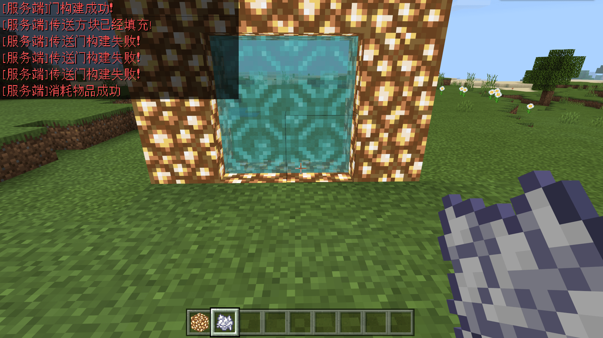
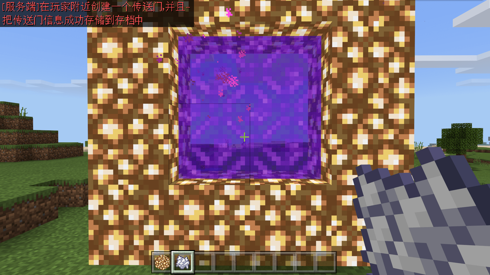

# 设计维度传送门

在本节中，我们为维度设计一个传送门，我们需要使用自定义方块和模组SDK相配合来完成这一逻辑。

## 自定义传送门方块

传送门方块是自定义传送门必须的一个方块。我们可以使用`base_block`为`portal`的自定义方块配合`netease:portal`组件来完成这一配置。我们在编辑器中新建两个方块，分别用于传到我们对应的维度和传回主世界。这两个方块的行为包定义分别设置如下：

```json
{
  "format_version": "1.10",
  "minecraft:block": {
    "description": {
      "identifier": "tutorial_demo:custom_dim_gate",
      "register_to_creative_menu": true,
      "base_block": "portal"
    },
    "components": {
      "minecraft:destroy_time": {
        "value": 9999
      },
      "minecraft:loot": {
        "table": "loot_tables/empty.json"
      },
      "minecraft:block_light_emission": {
        "emission": 1.0
      },
      "netease:portal": {
        "target_dimension": 1688560817,
        "particle_east_west": "minecraft:portal_east_west",
        "particle_north_south": "minecraft:portal_north_south"
      },
      "netease:listen_block_remove": {
        "value": true
      }
    }
  }
}
```

```json
{
  "format_version": "1.10",
  "minecraft:block": {
    "description": {
      "identifier": "tutorial_demo:custom_dim_gate_back",
      "register_to_creative_menu": true,
      "base_block": "portal"
    },
    "components": {
      "minecraft:destroy_time": {
        "value": 9999
      },
      "minecraft:loot": {
        "table": "loot_tables/empty.json"
      },
      "minecraft:block_light_emission": {
        "emission": 1.0
      },
      "netease:portal": {
        "target_dimension": 0,
        "particle_east_west": "minecraft:portal_east_west",
        "particle_north_south": "minecraft:portal_north_south"
      },
      "netease:listen_block_remove": {
        "value": true
      }
    }
  }
}
```

其中`netease:portal`中的`target_dimension`分别设置为我们自定义的维度ID和原版的主世界维度ID（0），`particle_east_west`和`particle_north_south`为东西朝向的传送门方块散发的粒子和南北朝向散发的粒子，我们不妨先设置为国际版原版的传送门方块粒子。为了于模组SDK配合，我们将`netease:listen_block_remove`打开。

## 设计传送门结构

我们这部分代码参考演示示例包portalGateDemo中的代码，并将对应的方块ID和维度ID替换成我们的自己的ID。然后我们一起来分析传送门的代码。事实上，我们如欲设计一个传送门结构，只需要在生成传送门前使用`portal`引擎组件的`DetectStructure`方法来判定是否为我们需要的结构即可。如果是我们的结构，我们就将传送门中的空气替换为我们的传送门方块，如果不是，就什么也不执行。我们这里使用的示例为在荧石框架上使用骨粉来激活传送门，所有的逻辑都在服务端执行。

```python
# -*- coding: utf-8 -*-
import time
import math
import mod.server.extraServerApi as serverApi
from mod_log import engine_logger as logger
ServerSystem = serverApi.GetServerSystemCls()
compFactory = serverApi.GetEngineCompFactory()

# 服务端类
# 处理传送门逻辑
class Main(ServerSystem):
	def __init__(self, namespace, system):
		ServerSystem.__init__(self, namespace, system)
		# 自定义维度1688560817
		self.TARGET_DIMENSION_ID = 1688560817
		# 从主世界去自定义维度自定义方块
		self.telePortBlockName = 'tutorial_demo:custom_dim_gate'
		# 从自定义维度回主世界自定义方块
		self.backPortBlockName = 'tutorial_demo:custom_dim_gate_back'
		# portal forcer功能常量
		self.PORTAL_SEARCH_RADIUS = 128
		self.PORTAL_CREATION_RADIUS = 16
		self.PORTAL_RECORDS_KEY = 'tutorial_demo'
		self.PORTAL_RECORD_DIMID = 'DimId'
		self.PORTAL_RECORD_SPAN = 'Span'
		self.PORTAL_RECORD_TPX = 'TpX'
		self.PORTAL_RECORD_TPY = 'TpY'
		self.PORTAL_RECORD_TPZ = 'TpZ'
		
		# 传送门结构方块的形状
		self.pattern = [
			'####',
			'#**#',
			'#**#',
			'####',
		]
		#传送门形状参数
		self.defines = {
			'#': 'minecraft:glowstone',
			'*': 'minecraft:air'
		}

		# 设置传送门边框可激活的位置
		self.touchPos =[(3,1), (3,2)]

		self.ListenForEvent(serverApi.GetEngineNamespace(), serverApi.GetEngineSystemName(), 'ServerItemUseOnEvent', self, self.OnServerItemUseOnEvent)
		self.ListenForEvent(serverApi.GetEngineNamespace(), serverApi.GetEngineSystemName(), 'DimensionChangeFinishServerEvent', self, self.OnPortalForcerServerEvent)
		self.ListenForEvent(serverApi.GetEngineNamespace(), serverApi.GetEngineSystemName(), 'BlockRemoveServerEvent', self, self.OnBlockRemoveServerEvent)
		self.ShowMsg("Portal Main init!")

	#region 功能函数
	def ShowMsg(self, msg, color='RED', isServer=True):
		customComp = compFactory.CreateGame(serverApi.GetLevelId())
		text = ("[服务端]" if isServer else "[客户端]") +  msg
		customComp.SetNotifyMsg(text, serverApi.GenerateColor(color))

	def SetBlock(self, playerID, blockPos, blockName):
		block = compFactory.CreateBlockInfo(playerID)
		return block.SetBlockNew(blockPos, {'name': blockName, 'aux': 0})

	def AddPostion(self, origin, offset):
		return tuple(map(sum, zip(origin, offset)))

	def MulPostion(self, origin, step):
		return tuple(step * x for x in origin)
	#end region 功能函数

	#region 构建传送门函数

	# 填充传送门 填充 传送门方块
	def FillGateAirBlock(self, playerID, originPos, horizontalDir):
		"""
		param playerID: 玩家Id
		param originPos: 传送门起始位置（左上角/右上角的位置）
		param horizontalDir: 传送门方向，如(-1,0,0)
		"""
		logger.info("FillGameAirBlock pos:({},{},{}) dir:({},{},{})".format(originPos[0], originPos[1], originPos[2], horizontalDir[0], horizontalDir[1], horizontalDir[2]))
		comp = compFactory.CreateDimension(playerID)
		dimensionId = comp.GetEntityDimensionId()
		blockName = self.backPortBlockName if dimensionId == self.TARGET_DIMENSION_ID else self.telePortBlockName
		bottomLeftPos = originPos
		linePos = originPos
		for line in self.pattern:
			for i in range(len(line)):
				name = self.defines.get(line[i], 'minecraft:air')
				pos = self.AddPostion(linePos, self.MulPostion(horizontalDir, i))
				if (pos[0] == bottomLeftPos[0] and pos[1] <= bottomLeftPos[1] and pos[2] <= bottomLeftPos[2]) or \
					pos[2] == bottomLeftPos[2] and pos[1] <= bottomLeftPos[1] and pos[0] <= bottomLeftPos[0]:
						# Y最小同时X最小（或者Z最小）的点
						bottomLeftPos = pos
				logger.info("FillGameAirBlock cur pos:({},{},{})".format(pos[0], pos[1], pos[2]))
				if name == 'minecraft:air':
					self.SetBlock(playerID, pos, blockName)
			linePos = self.AddPostion(linePos, (0, -1, 0))
		# 保存传送门到存档
		self.AddPortalRecord(dimensionId, bottomLeftPos, self.getSpan())

	# 使用骨粉激活传送门
	def OnServerItemUseOnEvent(self, eventData):
		itemName = eventData['itemName']
		auxValue = eventData['auxValue']
		playerID = eventData['entityId']
		if itemName == "minecraft:dye" and auxValue == 15:
			# 骨粉激活传送门
			pos = (eventData['x'], eventData['y'], eventData['z'])
			# 检测自定义门的结构
			portalComp = compFactory.CreatePortal(playerID)
			ret = portalComp.DetectStructure(playerID, self.pattern, self.defines, self.touchPos, pos)
			if ret[0]:
				self.ShowMsg('门构建成功！')
				self.FillGateAirBlock(playerID, ret[1], ret[2])
				self.ShowMsg('传送方块已经填充!')
				#消耗物品"骨粉”
				def consumeDye():
					itemComp = compFactory.CreateItem(playerID)
					item = itemComp.GetPlayerItem(serverApi.GetMinecraftEnum().ItemPosType.CARRIED, 0)
					item["count"] = item["count"] - 1
					newRet = itemComp.SpawnItemToPlayerCarried(item, playerID)
					if newRet:
						self.ShowMsg("消耗物品成功")
					else:
						self.ShowMsg("消耗物品失败")
				comp = compFactory.CreateGame(serverApi.GetLevelId())
				comp.AddTimer(0.1, consumeDye)
			else:
				self.ShowMsg('传送门构建失败！')

	def OnBlockRemoveServerEvent(self, args):
		dimension = args['dimension']
		blockName = args['fullName']
		# 以“底部最左边的点”为key寻找并删除传送门记录
		self.RemovePortalRecord(dimension, args['x'], args['y'], args['z'], blockName)

	# 保存传送门数据到level extraData中
	def AddPortalRecord(self, dimensionId, pos, span):
		logger.info("add portal record dim:{} pos:({},{},{})".format(dimensionId, pos[0], pos[1], pos[2]))
		entitycomp = compFactory.CreateExtraData(serverApi.GetLevelId())
		portalsRecordDict = entitycomp.GetExtraData(self.PORTAL_RECORDS_KEY)
		if not portalsRecordDict:
			portalsRecordDict = {}
		if dimensionId not in portalsRecordDict:
			portalsRecordDict[dimensionId] = []
		# 以‘底部最左边的点’作为key存储该传送门
		record = {
			self.PORTAL_RECORD_DIMID: dimensionId,
			self.PORTAL_RECORD_TPX: pos[0],
			self.PORTAL_RECORD_TPY: pos[1],
			self.PORTAL_RECORD_TPZ: pos[2],
			self.PORTAL_RECORD_SPAN: span,
		}
		portalsRecordDict[dimensionId].append(record)
		entitycomp.SetExtraData(self.PORTAL_RECORDS_KEY, portalsRecordDict)
		return record

	# 以“底部最左边的点”为key删除level extraData保存的数据
	def RemovePortalRecord(self, dimensionId, x, y, z, blockName):
		name = self.backPortBlockName if dimensionId == self.TARGET_DIMENSION_ID else self.telePortBlockName
		defines = {
			'#': 'minecraft:glowstone',
			'*': name
		}
		
		if blockName != name:
			return False
		patternLen = len(self.pattern)
		portalPosArray = []
		for i in xrange(patternLen): # 高度
			line = self.pattern[i]
			for j in range(len(line)): # 宽度
				name = defines.get(line[j], 'minecraft:air')
				if name == blockName:
					bottomLeftMostPos = (x - j, y + i - patternLen + 1, z)
					if self.RemoveAndSavePortalRecordAt(bottomLeftMostPos, dimensionId):
						return True
					bottomLeftMostPos = (x, y + i - patternLen + 1, z - j)
					if self.RemoveAndSavePortalRecordAt(bottomLeftMostPos, dimensionId):
						return True
		return False

	def RemoveAndSavePortalRecordAt(self, pos, dimensionId):
		entitycomp = compFactory.CreateExtraData(serverApi.GetLevelId())
		portalsRecordDict = entitycomp.GetExtraData(self.PORTAL_RECORDS_KEY)
		if not portalsRecordDict or dimensionId not in portalsRecordDict:
			return False
		records = portalsRecordDict[dimensionId]
		for rec in records:
			if rec[self.PORTAL_RECORD_TPX] == pos[0] and \
					rec[self.PORTAL_RECORD_TPY] == pos[1] and \
					rec[self.PORTAL_RECORD_TPZ] == pos[2]:
				records.remove(rec)
				entitycomp.SetExtraData(self.PORTAL_RECORDS_KEY, portalsRecordDict)
				self.ShowMsg("成功删除传送门信息")
				return True
		return False
	#end region 构建传送门函数
```

## 在传送终点生成返回传送门

我们的传送门不能有去无回，所以我们还需要在玩家进入对应维度后在终点处生成一个返回的传送门。关于这一功能我们其实分两种情况考虑，第一种是在目标点周围没有发现之前存在的传送门，那么我们应该在目标点附近找一个空旷点生成一个传送门，然后将玩家移动至该传送门生成的位置。另一种情况是目标点附近存在一个传送门，我们只需要将玩家的位置移动到该传送门处即可。我们查看补充完整的服务端脚本文件。

```python
# -*- coding: utf-8 -*-
import time
import math
import mod.server.extraServerApi as serverApi
from mod_log import engine_logger as logger
ServerSystem = serverApi.GetServerSystemCls()
compFactory = serverApi.GetEngineCompFactory()

# 服务端类
# 处理传送门逻辑
class Main(ServerSystem):
	def __init__(self, namespace, system):
		ServerSystem.__init__(self, namespace, system)
		# 自定义维度23333
		self.TARGET_DIMENSION_ID = 23333
		# 从主世界去自定义维度自定义方块
		self.telePortBlockName = 'portalGateDemo:gateProtal'
		# 从自定义维度回主世界自定义方块
		self.backPortBlockName = 'portalGateDemo:gateProtalBack'
		# portal forcer功能常量
		self.PORTAL_SEARCH_RADIUS = 128
		self.PORTAL_CREATION_RADIUS = 16
		self.PORTAL_RECORDS_KEY = 'ModPortalRecords'
		self.PORTAL_RECORD_DIMID = 'DimId'
		self.PORTAL_RECORD_SPAN = 'Span'
		self.PORTAL_RECORD_TPX = 'TpX'
		self.PORTAL_RECORD_TPY = 'TpY'
		self.PORTAL_RECORD_TPZ = 'TpZ'
		
		# 传送门结构方块的形状
		self.pattern = [
			'####',
			'#**#',
			'#**#',
			'####',
		]
		#传送门形状参数
		self.defines = {
			'#': 'minecraft:glowstone',
			'*': 'minecraft:air'
		}

		# 设置传送门边框可激活的位置
		self.touchPos =[(3,1), (3,2)]

		self.ListenForEvent(serverApi.GetEngineNamespace(), serverApi.GetEngineSystemName(), 'ServerItemUseOnEvent', self, self.OnServerItemUseOnEvent)
		self.ListenForEvent(serverApi.GetEngineNamespace(), serverApi.GetEngineSystemName(), 'DimensionChangeFinishServerEvent', self, self.OnPortalForcerServerEvent)
		self.ListenForEvent(serverApi.GetEngineNamespace(), serverApi.GetEngineSystemName(), 'BlockRemoveServerEvent', self, self.OnBlockRemoveServerEvent)
		self.ShowMsg("Portal Main init!")

	#region 功能函数
	def ShowMsg(self, msg, color='RED', isServer=True):
		customComp = compFactory.CreateGame(serverApi.GetLevelId())
		text = ("[服务端]" if isServer else "[客户端]") +  msg
		customComp.SetNotifyMsg(text, serverApi.GenerateColor(color))

	def SetBlock(self, playerID, blockPos, blockName):
		block = compFactory.CreateBlockInfo(playerID)
		return block.SetBlockNew(blockPos, {'name': blockName, 'aux': 0})

	def AddPostion(self, origin, offset):
		return tuple(map(sum, zip(origin, offset)))

	def MulPostion(self, origin, step):
		return tuple(step * x for x in origin)
	#end region 功能函数

	#region 构建传送门函数

	# 填充传送门 填充 传送门方块
	def FillGateAirBlock(self, playerID, originPos, horizontalDir):
		"""
		param playerID: 玩家Id
		param originPos: 传送门起始位置（左上角/右上角的位置）
		param horizontalDir: 传送门方向，如(-1,0,0)
		"""
		logger.info("FillGameAirBlock pos:({},{},{}) dir:({},{},{})".format(originPos[0], originPos[1], originPos[2], horizontalDir[0], horizontalDir[1], horizontalDir[2]))
		comp = compFactory.CreateDimension(playerID)
		dimensionId = comp.GetEntityDimensionId()
		blockName = self.backPortBlockName if dimensionId == self.TARGET_DIMENSION_ID else self.telePortBlockName
		bottomLeftPos = originPos
		linePos = originPos
		for line in self.pattern:
			for i in range(len(line)):
				name = self.defines.get(line[i], 'minecraft:air')
				pos = self.AddPostion(linePos, self.MulPostion(horizontalDir, i))
				if (pos[0] == bottomLeftPos[0] and pos[1] <= bottomLeftPos[1] and pos[2] <= bottomLeftPos[2]) or \
					pos[2] == bottomLeftPos[2] and pos[1] <= bottomLeftPos[1] and pos[0] <= bottomLeftPos[0]:
						# Y最小同时X最小（或者Z最小）的点
						bottomLeftPos = pos
				logger.info("FillGameAirBlock cur pos:({},{},{})".format(pos[0], pos[1], pos[2]))
				if name == 'minecraft:air':
					self.SetBlock(playerID, pos, blockName)
			linePos = self.AddPostion(linePos, (0, -1, 0))
		# 保存传送门到存档
		self.AddPortalRecord(dimensionId, bottomLeftPos, self.getSpan())

	# 使用骨粉激活传送门
	def OnServerItemUseOnEvent(self, eventData):
		itemName = eventData['itemName']
		auxValue = eventData['auxValue']
		playerID = eventData['entityId']
		if itemName == "minecraft:dye" and auxValue == 15:
			# 骨粉激活传送门
			pos = (eventData['x'], eventData['y'], eventData['z'])
			# 检测自定义门的结构
			portalComp = compFactory.CreatePortal(playerID)
			ret = portalComp.DetectStructure(playerID, self.pattern, self.defines, self.touchPos, pos)
			if ret[0]:
				self.ShowMsg('门构建成功！')
				self.FillGateAirBlock(playerID, ret[1], ret[2])
				self.ShowMsg('传送方块已经填充!')
				#消耗物品"骨粉”
				def consumeDye():
					itemComp = compFactory.CreateItem(playerID)
					item = itemComp.GetPlayerItem(serverApi.GetMinecraftEnum().ItemPosType.CARRIED, 0)
					item["count"] = item["count"] - 1
					newRet = itemComp.SpawnItemToPlayerCarried(item, playerID)
					if newRet:
						self.ShowMsg("消耗物品成功")
					else:
						self.ShowMsg("消耗物品失败")
				comp = compFactory.CreateGame(serverApi.GetLevelId())
				comp.AddTimer(0.1, consumeDye)
			else:
				self.ShowMsg('传送门构建失败！')

	def OnBlockRemoveServerEvent(self, args):
		dimension = args['dimension']
		blockName = args['fullName']
		# 以“底部最左边的点”为key寻找并删除传送门记录
		self.RemovePortalRecord(dimension, args['x'], args['y'], args['z'], blockName)


	def OnPortalForcerServerEvent(self, args):
		logger.info("OnPortalForcerServerEvent:{}".format(args))
		entityId = args['playerId']
		toDimensionId = args['toDimensionId']
		self.PortalForcer(entityId, toDimensionId)

	# portal forcer实例
	def PortalForcer(self, entityId, toDimensionId):
		pos = compFactory.CreatePos(entityId).GetPos()
		if not pos:
			return False
		ret = self.FindPortal(toDimensionId, pos, self.PORTAL_SEARCH_RADIUS)
		if ret[0]:
			self.TravelPlayerToPortal(entityId, ret[1], toDimensionId)
			self.ShowMsg("在玩家附近找到传送门（{}），并且把玩家从{}移动到该传送门附近".format(ret[1], pos))
			return

		record = self.CreatePortal(entityId, toDimensionId, self.PORTAL_CREATION_RADIUS)
		target = self.FindClosestBlockPosToPortal(entityId, record)
		self.TravelPlayerToPortal(entityId, target, toDimensionId)
		self.ShowMsg("在玩家附近创建一个传送门，并且把传送门信息成功存储到存档中")

	# 寻找附近一个位置设置传送门
	def FindNearPosAndSetPortal(self, entityId, dimensionId, pos):
		defines = {
			'#': 'minecraft:glowstone',
			'*': self.backPortBlockName if dimensionId == self.TARGET_DIMENSION_ID else self.telePortBlockName
		}
		blockComp = compFactory.CreateBlockInfo(entityId)
		for line in self.pattern: # 高度
			for i in range(len(line)): # 宽度
				blockName = defines.get(line[i], 'minecraft:air')
				blockPos = (pos[0] + i, pos[1], pos[2])
				logger.info("create portal with pos:{}".format(blockPos))
				blockComp.SetBlockNew(blockPos, {'name': blockName, 'aux': 0})
			# 坐标自减
			pos[1] -= 1
		# 返回传送门“底部最左边的点”
		return pos
	
	def GetPortalHeight(self):
		return len(self.pattern)
	
	def GetPortalWidth(self):
		width = 0
		for line in self.pattern:
			if len(line) > width:
				width = len(line)
		return width

	# 在玩家附近查找的传送门，返回是否存在传送门、传送门的坐标
	def FindPortal(self, dimensionId, centerBlockPos, radius):
		closest = -1 # 最近的距离
		targetBlockPos = (0, 0, 0)
		entitycomp = compFactory.CreateExtraData(serverApi.GetLevelId())
		# 在存档中读取传送门信息
		portalsRecordDict = entitycomp.GetExtraData(self.PORTAL_RECORDS_KEY)
		if not portalsRecordDict:
			portalsRecordDict = {}
		if dimensionId not in portalsRecordDict:
			# 存储的信息中不存在传送门
			return False, targetBlockPos

		for rec in portalsRecordDict[dimensionId]:
			# “底部最左边的点”作为key
			baseBlockPos = (rec[self.PORTAL_RECORD_TPX], rec[self.PORTAL_RECORD_TPY], rec[self.PORTAL_RECORD_TPZ])
			for span in xrange(0, rec[self.PORTAL_RECORD_SPAN]):
				recordBlockPos = (baseBlockPos[0] + span, baseBlockPos[1] + span, baseBlockPos[2])
				# search area x by y (at all heights)
				xd = abs(recordBlockPos[0] - centerBlockPos[0])
				zd = abs(recordBlockPos[1] - centerBlockPos[1])
				if xd <= radius and zd <= radius:
					# 根据欧拉距离选择最新的点
					dist = self.EuclideanDistance(recordBlockPos, centerBlockPos)
					if closest < 0 or dist < closest:
						closest = dist
						targetBlockPos = recordBlockPos

		return closest >= 0, targetBlockPos

	# 创建传送门
	def CreatePortal(self, entityId, dimensionId, radius):
		entityPos = compFactory.CreatePos(entityId).GetPos()
		entityBlockPos =[math.floor(entityPos[0]) - self.GetPortalWidth() / 2, math.floor(entityPos[1]) - 2 + self.GetPortalHeight(), math.floor(entityPos[2])]
		logger.info("player current position:{} portal begin position:{}".format(entityPos, entityBlockPos))
		entityBlockPos = self.FindNearPosAndSetPortal(entityId, dimensionId, entityBlockPos)
		return self.AddPortalRecord(dimensionId, entityBlockPos, self.getSpan())

	# 保存传送门数据到level extraData中
	def AddPortalRecord(self, dimensionId, pos, span):
		logger.info("add portal record dim:{} pos:({},{},{})".format(dimensionId, pos[0], pos[1], pos[2]))
		entitycomp = compFactory.CreateExtraData(serverApi.GetLevelId())
		portalsRecordDict = entitycomp.GetExtraData(self.PORTAL_RECORDS_KEY)
		if not portalsRecordDict:
			portalsRecordDict = {}
		if dimensionId not in portalsRecordDict:
			portalsRecordDict[dimensionId] = []
		# 以‘底部最左边的点’作为key存储该传送门
		record = {
			self.PORTAL_RECORD_DIMID: dimensionId,
			self.PORTAL_RECORD_TPX: pos[0],
			self.PORTAL_RECORD_TPY: pos[1],
			self.PORTAL_RECORD_TPZ: pos[2],
			self.PORTAL_RECORD_SPAN: span,
		}
		portalsRecordDict[dimensionId].append(record)
		entitycomp.SetExtraData(self.PORTAL_RECORDS_KEY, portalsRecordDict)
		return record

	# 获取玩家离传送门相对比较近的位置
	def FindClosestBlockPosToPortal(self, entityId, record):
		pos = (record[self.PORTAL_RECORD_TPX], record[self.PORTAL_RECORD_TPY], record[self.PORTAL_RECORD_TPZ])
		# 该位置开发者可以根据需要设定
		# 注意该位置有可能不是空气，所以在选择位置时需要注意
		return tuple((x + 2 for x in pos))

	def LengthSquared(self, pos):
		return pos[0] * pos[0] + pos[1] * pos[1] + pos[2] * pos[2]

	# 把玩家的位置设置到传送门附近
	def TravelPlayerToPortal(self, entityId, targetBlockPos, dimensionId):
		entityTargetPos = tuple((x + 0.5 for x in targetBlockPos))
		originRot = compFactory.CreateRot(entityId).GetRot()
		entityRotY = originRot[1]
		if dimensionId == self.TARGET_DIMENSION_ID:
			entityRotY += 90
		else:
			entityRotY -= 90
		newRot = (originRot[0], entityRotY)
		compFactory.CreateRot(entityId).SetRot(newRot)
		compFactory.CreatePos(entityId).SetPos(entityTargetPos)
		logger.info("set position:({}, {})".format(entityTargetPos[0], entityTargetPos[1]))

	# 计算两点的欧拉距离
	def EuclideanDistance(self, pos1, pos2):
		dx = pos1[0] - pos2[0]
		dy = pos1[1] - pos2[1]
		dz = pos1[2] - pos2[2]
		return dx * dx + dy * dy + dz * dz

	# 自定义传送门的最大宽度
	def getSpan(self):
		span = 1
		for line in self.pattern:
			if len(line) > span:
				span = len(line)
		return span

	# 以“底部最左边的点”为key删除level extraData保存的数据
	def RemovePortalRecord(self, dimensionId, x, y, z, blockName):
		name = self.backPortBlockName if dimensionId == self.TARGET_DIMENSION_ID else self.telePortBlockName
		defines = {
			'#': 'minecraft:glowstone',
			'*': name
		}
		
		if blockName != name:
			return False
		patternLen = len(self.pattern)
		portalPosArray = []
		for i in xrange(patternLen): # 高度
			line = self.pattern[i]
			for j in range(len(line)): # 宽度
				name = defines.get(line[j], 'minecraft:air')
				if name == blockName:
					bottomLeftMostPos = (x - j, y + i - patternLen + 1, z)
					if self.RemoveAndSavePortalRecordAt(bottomLeftMostPos, dimensionId):
						return True
					bottomLeftMostPos = (x, y + i - patternLen + 1, z - j)
					if self.RemoveAndSavePortalRecordAt(bottomLeftMostPos, dimensionId):
						return True
		return False

	def RemoveAndSavePortalRecordAt(self, pos, dimensionId):
		entitycomp = compFactory.CreateExtraData(serverApi.GetLevelId())
		portalsRecordDict = entitycomp.GetExtraData(self.PORTAL_RECORDS_KEY)
		if not portalsRecordDict or dimensionId not in portalsRecordDict:
			return False
		records = portalsRecordDict[dimensionId]
		for rec in records:
			if rec[self.PORTAL_RECORD_TPX] == pos[0] and \
					rec[self.PORTAL_RECORD_TPY] == pos[1] and \
					rec[self.PORTAL_RECORD_TPZ] == pos[2]:
				records.remove(rec)
				entitycomp.SetExtraData(self.PORTAL_RECORDS_KEY, portalsRecordDict)
				self.ShowMsg("成功删除传送门信息")
				return True
		return False
	#end region 构建传送门函数
```






这样，我们便完成了一个传送门的设计。接下来，为更多地维度设计不同样式的传送门吧！