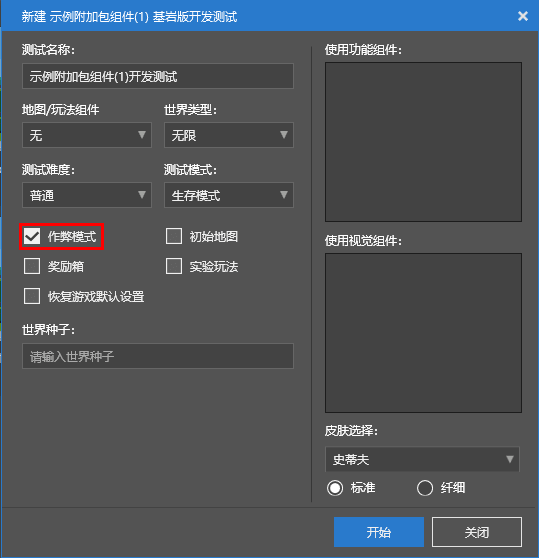

# 使用命令的方法

每一个命令都必须经过使用才能生效，我们将命令的使用的过程称作**执行**（**Execute**）命令。

为了使大部分命令顺利执行，我们需要在世界选项中打开“**作弊模式**”。这样，所有的“作弊命令”和“非作弊命令”就都可以使用了，我们也就无需担心命令的可用性问题。在我的世界开发工作台的开发测试中，我们确保“作弊模式”是开启的：

同时，我们强烈建议在探索命令系统时将游戏模式更改为**创造模式**。因为玩家可以在创造模式下自由地使用最高权限的命令，同时玩家在创造模式下还可以操控命令方块，以实现更多高级功能。

接下来，我们了解一下多种执行命令的方式。

## 通过聊天栏执行命令

进入世界后，我们按下`T`键（移动端用户是按下顶部的聊天按钮），我们将看到一个**聊天栏**（**Chat Bar**）覆盖在我们的界面上，这边是我们与其他玩家聊天的场所。但是，值得注意的是，这个聊天栏的功能不止于聊天。我们还可以将其视为一个控制台来执行命令。在聊天栏的第一个字符处输入斜杠`/`，我们将进入“命令的世界”。此时，我们将看到屏幕上出现了很多命令的提示信息，这些是可以用来提示我们输入正确的命令的信息，同时我们还可以利用这个信息进行命令的自动补全。

当我们输入命令的前几个字母后，屏幕上的提示信息也将筛选减少以适应我们已经输入的部分。随着我们的输入，我们可以看到符合筛选的命令将会越来越少，最终定位到某一个最终的命令上。不过，在此之前，如果你在使用PC设备，并且在屏幕上还有一些候选命令的时候按下`Tab`键，你将体验到命令的自动补全功能。重复按下`Tab`键可以让补全的命令在当前屏幕上提示的所有命令中循环。这是一个快速输入某个命令的非常实用的功能。

## 通过命令方块执行命令

我们在创造模式开启作弊的聊天栏中输入以下命令：`/give @s command_block`。我们将得到一个**命令方块（Command Block）**。命令方块是一个可以以自己为执行者执行预先配置好的命令的方块，只有在创造模式下通过对其按下“使用键”（PC端是鼠标右键）才可以将其配置界面打开。打开后，我们将看到如下一系列选项。

- **命令输入**：命令输入是我们输入命令的地方，这里的格式几乎与聊天栏中输入命令相同。唯一的不同点是命令方块中的命令无需斜杠`/`前缀。
- **方块类型**：我们放下命令方块时默认是**脉冲**模式。脉冲模式的命令方块时橙色的，每激活一次就执行一次命令。我们还可以将其改成绿色的**连锁**模式和紫色的**重复**模式。连锁模式的命令方块只在指向它的命令方块执行命令时才会执行命令，而重复模式的命令方块被激活时每一游戏刻都会执行一次命令。
- **条件**：默认为**无条件**，即不受条件制约，无视周围的命令方块执行成功与否。**有条件**时受到条件制约，即只有当前一个指向自己的命令方块执行指令成功时，自己才会执行命令。
- **红石**：脉冲模式和连锁模式默认**需要红石**，即必须由红石对其激活才能使其发挥作用，执行命令。但是如果调整成重复模式默认的**保持开启**，就可以使其重复模式的命令方块无需红石即可持续执行其中的命令；连锁模式是在感应后立即执行一次，脉冲模式将在设置完毕后立即执行一次，且此后将无法再次执行。
- **执行第一个已选项**（**Execute on First Tick**，在首刻执行）：在激活后第一个游戏刻立即执行，而非进入挂起状态等待延迟后再执行。
- **已选项中的延迟**（**Delay in Ticks**，延迟刻数）：对于脉冲模式命令方块和连锁模式命令方块，指定在被激活或触发后，执行命令之前延迟的游戏刻。对于重复模式命令方块，指定其重新执行命令所延迟的游戏刻。

## 通过函数文件执行命令

**函数**（**Function**）是一个允许开发者使用`.mcfunction`文件作为一个命令的集合来批量执行命令的功能，常常配合命令方块实现一些高级功能。

在函数文件中，一条命令单独占一行，没有斜杠`/`前缀。在文件中可以使用`#`来开启一个注释，`#`之后的文字都会属于注释内容而不被执行。

通过`/function`命令，我们可以执行一个函数。`/function`的语法是`/function <name: filepath>`。比如，我们可以通过`/function test`来执行行为包根目录的`functions`文件夹下的`test.mcfunction`文件。

通过`/reload`命令，我们可以重新加载行为包中的函数文件。通过该命令，我们可以更快地调试函数而不重启游戏。