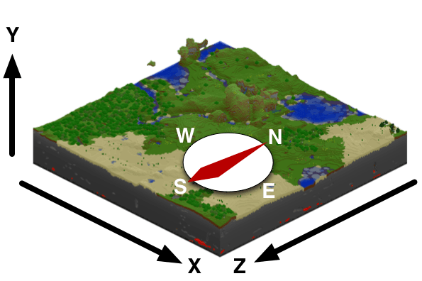

# 理解命令参数

通过前期的探索，我们可以粗略地了解到，一个命令是由如下部分组成的：

1. 如果是聊天栏输入的命令，则必须有一个`/`开头；
2. 紧跟着`/`之后是命令的**名称**（**Name**）；
3. 在命令名称之后是一个空格` `；
4. 紧接着是各个命令参数，参数与参数之间以空格隔开。

所以可见，我们必须要理解何为命令的**参数**（**Argument**），才能正确地使用一个命令。

## 参数

参数是命令名之后跟着的一系列用于精确界定命令执行范围或执行对象的数据。大部分命令都有一个或多个参数。参数分为多种类型，分别有**必需参数**、**可选参数**和**字面参数**。

### 必需参数

**必需参数**（**Required Argument**）是一种通过尖括号包裹起来的参数，格式是`<descriptor: type>`。尖括号代表该命令必须具有该参数才能正常运作，否则将会出现执行错误。例如，给予一个玩家管理员的命令：

```shell
/op <player: target>
```

冒号之前的部分称作该参数的**描述符**（**Descriptor**），通常又称为参数名，在这里是`player`，代表这里应该输入一个玩家。冒号之后的部分称作该参数的**类型**（**Type**），这里是`target`。`target`类型代表可以输入一个玩家名或者一个目标选择器。关于目标选择器，后面我们会一起重点学习。

如果该命令只输入`/op`，那么将会报错，提示缺少必要的参数。

### 可选参数

**可选参数**（**Optional Argument**）是一种通过方块号包裹起来的参数，是并非一定要输入的参数。这种参数往往具有一些默认值，如果不输入将自动调用其默认值。可选参数的格式为`[descriptor: type]`。例如，将一个玩家踢出世界的命令：

```shell
/kick <name: target> [reason: message]
```

这个命令有两个参数，第一个参数是一个必需参数，而第二个便是一个可选参数。如果只传入第一个玩家名，保留第二个为空，那么踢出玩家时将不会带有原因，而如果传入第二个可选参数，那么踢出玩家时将展示踢出原因。

### 字面参数

**字面参数**（**Literal Argument**）是一种和上面两种参数表达方式都不一样的参数，它没有描述符和类型，仅仅是一个字面意义的文本。也就是说，这个参数不允许玩家自定义传入的值，该写成什么样就写成什么样。往往，一个字面参数可以允许多个字面值，当有多个字面值时，各个值之间用`|`分隔开，此时如果一个字面参数是必需的，那么在外围将包裹尖括号；如果是可选的，将包裹方括号。对于只有一个字面值的字面参数，其外面没有括号，这种字面参数往往都是必需参数。它的格式一般为`arg`、`<arg1|arg2|...>`或`[arg1|arg2|...]`。例如，天气命令：

```shell
/weather <clear|rain|thunder> [duration: int]
/weather query
```

`/weather <clear|rain|thunder>`用来更换天气，`/weather query`用来查询天气。此时`<clear|rain|thunder>`是一个必需的字面参数，`query`是一个必须的只有一种选择的字面参数。

### 参数类型列表

这里列出了常见的参数类型列表和它们的描述。

| 类型       | 描述                                                         |
| :--------- | :----------------------------------------------------------- |
| Boolean    | 布尔值，`true`或者`false`。                                  |
| int        | 整数，比如`1`、`2`、`3`等。                                  |
| float      | 浮点数，比如`1.3`、`3.14`等。                                |
| string     | 字符串，可以直接是一个单词/汉字或是一个由引号包裹的多个单词/带空格的汉字，比如`single`或`"multiple words"`。 |
| message    | 消息文本，无需引号包括的字符串。                             |
| x y z      | 代表坐标的三个浮点数，中间用空格间隔，比如`16.5 128 32`代表x=16.5、y=128、z=32的位置。可以用`~`表示相对坐标，或用`^`表示局部坐标，具体详见[坐标](#坐标)。 |
| Block      | 方块ID。                                                     |
| Item       | 物品ID。                                                     |
| EntityType | 实体ID。                                                     |
| json       | JSON格式文本。                                               |
| target     | 一个玩家名或一个目标选择器。                                 |
| ……         | ……                                                           |

## 坐标

我的世界中的**坐标**（**Coordinate**）是一个三维空间的欧拉右手直角坐标系，但是与典范的欧拉坐标系不同，我的世界的坐标系经过一定的旋转，旋转成了y轴正方向代表朝上，因此，我们在世界中的高度成为了y坐标。



具体来讲，xyz的三个轴代表如下方向：

- x轴的正方向为东，其坐标反映了玩家距离原点在东（+）西（-）方向上的距离。
- z轴的正方向为南，其坐标反映了玩家距离原点在南（+）北（-）方向上的距离。
- y轴的正方向为上，其坐标反映了玩家位置的高低程度（其中海平面为62）。

一般来讲，如果需要给予坐标一个单位的话，我们认为世界中坐标的单位为米（m）。

### 相对坐标

在命令中，我们可以使用`~`来代表**相对坐标**（**Relative Coordinate**）。单独的`~`代表与执行原点距离为0的位置，`~`后面加一个数字（例如`~1`）代表相对于执行原点偏移了这个数字大小的距离的位置。后面所跟的数字可正可负，正代表沿着该轴正方向偏移，负则代表沿着该轴负方向偏移。

例如，`/tp ~1 ~5 ~-3`可以将玩家传送到往东1m，往上5m，同时往北3m的位置。

### 局部坐标

和相对坐标类似，**局部坐标**（**Local Coordinate**）也是一种从执行原点开始计算的坐标，不过其各个轴的方向和相对坐标有很大不同。局部坐标是以玩家视角面对的方向为轴的。准确地说：

- x轴的正方向为左，其坐标反映了在以玩家视角为参考左（+）右（-）方向上的距离。
- z轴的正方向为前，其坐标反映了在以玩家视角为参考前（+）后（-）方向上的距离。
- y轴的正方向为上，其坐标反映了在以玩家视角为参考上（+）下（-）方向上的距离（注意，玩家的上不一定就是竖直方向，例如玩家“90°看天”时玩家的上方向和水平面平行）。

局部坐标使用`^`代替`~`，其余的用法和相对坐标完全相同。

## 目标选择器

对于带有`target`类型参数的命令，我们知道可以使用玩家的名字来执行。但是，有时候使用玩家名是非常不便的。比如，我们通常不知道使用我们的玩法组件的玩家究竟是何名，自然无法在开发过程中预先使用玩家的名字。这时候，我们就需要**目标选择器**（**Target Selector**）的登场了。

我们有5种基选择器来选择不同的目标实体，它们分别是：

| 基选择器 | 功能                                                         |
| :------- | :----------------------------------------------------------- |
| `@p`     | 选择距离执行原点最近的玩家，执行原点通常是玩家或者命令方块。当`x`、`y`和`z`参数被指定时将选择距离该指定坐标最近的玩家。 |
| `@r`     | 选择一个随机玩家。当`type`参数被指定时将选择其他类型的实体。 |
| `@a`     | 选择所有玩家，无论存活与否。                                 |
| `@e`     | 选择所有实体。                                               |
| `@s`     | 选择命令的执行实体。                                         |

上面所说的“参数”皆指**选择器参数**（**Selector Parameter**），而非命令参数。选择器参数是跟在基选择器后面用方括号包裹起来的一种变量，可以用来筛选和缩小选择器选择的范围。选择器参数通常的语法是：

```shell
@<selector>[param1=value1,param2=value2,...]
```

我们可以看到，方括号内可以具有一个或多个选择器参数，每个选择器参数之间用英文半角逗号隔开。每个参数内部都会先出现一个参数名，参数名之后紧跟一个等号（`=`），等号后是该参数选择的值。

比如，我们想将所有冒险模式下的玩家更改为生存模式，而不影响创造模式或旁观者模式下的玩家，那么我应该使用如下命令和选择器参数：`/gamemode survival @a[m=adventure]`。

有一些选择器参数允许进行一种反选，这可以通过在参数的值之前添加英文半角感叹号`!`来实现，这称作对参数的值进行**否定**（**Negate**）。比如，`/gamemode survival @a[m=!adventure]`将实现将所有非冒险模式下的玩家的游戏摩米士全部更改为生存模式。

### 选择器参数列表

下面列出了所有的选择器参数及其功能：

| 参数         | 功能                                                         |
| :----------- | :----------------------------------------------------------- |
| `x, y, z`    | 指定选择器的执行原点，不必同时指定全部三个轴，不指定时默认和命令的执行原点一致。 |
| `r, rm`      | 指定距离执行原点一定范围内的实体，该参数的值代表范围的半径。`r`是radius的缩写，代表范围的最大半径；`rm`是radius minimum的缩写，代表范围的最小半径。两者都可不同时指定，`r`不指定时默认为无穷大，`rm`不指定时默认为0。 |
| `dx, dy, dz` | 指定在矩形长方体内的实体，执行原点将是该长方体的一个顶点。`d`是distance的缩写，三个参数分别代表距离该顶点（执行原点）的距离。若三者其中之一被指定，另外没有指定的参数默认值均为0。 |
| `c`          | 指定最大可能选择的实体数，最终选择的实体依赖于基础目标选择器本来应选出的实体的排列顺序。比如，对于`@p`和`@r`，该参数默认为1，`c`可以使其增加选择最近或随机目标的数量。而`@a`或`@e`仅仅会限制选择的目标数量，限制的顺序依赖内部代码的排序。负的值可以使得选择顺序被反转，比如`@p[c=-5]`可以选中距离执行原点最远的5个目标。`c`是count的缩写。 |
| `type`       | 指定实体ID，不可以被用于`@p`和`@a`，因为它们只能用于选择ID为`player`的实体，即玩家。该参数的值可以被否定，用于选择非某ID的实体。 |
| `m`       | 指定玩家的游戏模式。`m`是mode的缩写。 |
| `tag`        | 指定具有某种标签的实体，其中实体的标签可以`/tag`给予。 该参数的值可以被否定，用于选择不具有某个标签的实体。可以同时指定多个`tag`参数，来更严格地筛选出想要的目标。 |
| `name`   | 指定目标的名字，玩家名或者实体的自定义名字皆可以用该参数指定。该参数的值可以被否定，用于选择不具有某个名字的实体。可以同时指定多个`name`参数，来更严格地筛选出想要的目标。 |
| `l, lm`      | 指定具有一定经验等级的实体，该参数的值代表等级。`l`是level的缩写，代表最大经验等级；`lm`是level minimum的缩写，代表最小经验等级。两者都可不同时指定。 |
| `rx, rxm`    | 指定具有一定的绕x轴旋转角的实体，即指定具有一定**俯仰角**（**Pitch**）的实体，该参数的值的单位为角度制。`rx`是rotation x的缩写，代表最大俯仰角；`rxm`是rotation x minimum的缩写，代表最小俯仰角。实体的俯仰角范围为从-90°（向正上看天）到90°（向整下看地）。两者都可不同时指定。 |
| `ry, rym`    | 指定具有一定绕y轴旋转角的实体，即指定具有一定**偏航角**（**Yaw**）的实体，该参数的值的单位为角度制。`ry`是rotation y的缩写，代表最大偏航角；`rym`是rotation y minimum的缩写，代表最小偏航角。实体的偏航角范围为从-180°到180°。两者都可不同时指定。 |
| `scores`     | 指定具有特定记分项的目标。该参数的值允许使用花括号来进一步指定记分项，各个记分项之间使用英文半角逗号分隔，记分项的值可以使用`..`来代表一个范围。比如，`1..5`代表可以接受从1到5这个区间内的值。记分项的值也可以被否定，用来筛选不满足指定分数值的目标。花括号内的语法示例：`[scores={objectiveA=valueA1..valueA2,objectiveB=!valueB,...}]`。 |
| `family`     | 指定目标所属的**族**（**Family**，***科系***）类型。族可以在实体JSON文件的的`minecraft:type_family`组件中定义。该参数的值可以被否定，用于选择不属于某个族的实体。可以同时指定多个`family`参数，来更严格地筛选出想要的目标。 |

## 原始文本

**原始文本**（**Raw Text**）是一种JSON格式的文本，可以为我的世界中的文本增添一些富文本特性和动态翻译特性。原始文本可以被用在很多地方，比如命令中、书中和自定义游戏内容的许多支持原始文本的对象里。原始文本会以JSON的格式写入，但是以富文本的形式输出。在阅读原始文本的格式之前，建议先初步自行了解一下JSON的基本格式。

我的世界基岩版的原始文本具有严格的格式，首先，它必须是一个用花括号包裹起来的对象，且其中只有一个字段，即`rawtext`数组。`rawtext`数组中包含许多对象，每个对象称作一个原始文本**内容对象**。大体的格式如下：

```json
{
    "rawtext": [
        { /* object 1 */ },
        { /* object 2 */ },
        // other objects
    ]
}
```

要使每个内容对象生效，每个内容对象都必须要含有以下**内容标签**字段之一：`translate`、`text`、`selector`和`score`。如果一个内容对象含有多个内容标签，也只会有一个内容标签生效。生效是按照内容标签的权重来计算的，而上面列出的内容标签的顺序也恰是它们的权重顺序，当两个同时出现时，靠前的内容标签会生效。

每个内容标签的格式都略微不同，分别如下。

### `translate`

`translate`是用于翻译本地化文本的内容标签。格式如下：

```json
{
    "rawtext": [
        {
            "translate": "some.localization.key", // String类型，本地化键名，如果在语言文件中没有找到该本地化键名，或者填入的不是本地化键名而是普通的文本，则直接显示该文本。
            "with": [ /* some arguments for localization */ ] //可选，Array类型，用于填充到本地化文本中的参数，当本地化文本中带有一个或多个类似于“%s”的变量时用于替换变量所在的位置。数组中每一个元素都可以是一个单独的字符串文本或者另一个完整的原始文本对象。
        }
    ]
}
```

### `text`

`text`是最简单的内容标签，就是单纯地输出一段纯文本。格式如下：

```json
{
    "rawtext": [
        {
            "text": "Some Text." //String类型，纯文本。
        }
    ]
}
```

### `selector`

`selector`是一个单独的目标选择器，主要用于输出玩家或实体的名字。格式如下：

```json
{
    "rawtext": [
        {
            "selector": "@someSelector[someParams=someValues]" //String类型，其内容按照目标选择器的格式进行写入即可，会返回一个或多个实体的名字，返回多个实体名时会按照“AA、BB和CC”的格式。
        }
    ]
}
```

### `score`

`score`是用于显示一个记分项分数的标签。格式如下：

```json
{
    "rawtext": [
        {
            "score": {
                "name": "Entity Name or @selector or *", // String类型，需要显示分数的实体名字或一个目标选择器。也可以使用“*”作为值，此时将显示该原始文本的“读者”的分数，如果该原始文本的潜在读者为多个人，则无法显示。
                "objective": "someObjective", //String类型，记分项的内部名称。
                "value": "someValue" //可选，String类型，如果设置了该字段，那么不管实际分数为多少，都会显示该字段所给的值。
            }
        }
    ]
}
```

### 追加

在介绍原始文本的最一开始我们便提到，一个原始文本数组里面可以有多个内容对象。向一个原始文本数组中添加多个内容对象的行为称为原始文本的**追加**（**Append**）。

```json
{
    "rawtext": [
        { /* object */ },
        { /* appended object */ },
        // other appended objects
    ]
}
```

追加的原始文本内容对象最后解析的文本会和原来的文本的末尾直接连在一起。从输出结果来看和分别连着写了两个原始文本没有什么区别。但是，有些情况下只允许我们写一个原始文本，那么我们就需要用追加功能来依次排列我们所需要的内容标签，灵活运用四种标签组合出一个完整的预期的文本。

### 换行与参数顺序

你可以在原始文本中使用`\n`代表一个**换行**。换行有助于更好地进行文本排版。

你还可以使用`%%1`、`%%2`等来代替`%s`、`%d`这种不带顺序的参数占位符。这样即使`%%2`在文本出现在了`%%1`的前面，你依旧可以使`with`字段中的第二个元素成功替换到排在前面的`%%2`的位置。

本节的最后，简单地提示一点。如果你系统学习过JSON，你应该知道JSON文件不管是写成多行带有缩进的格式，还是全部写到一行中去，其功能是不受任何影响的。本节中的原始文本为了便于大家理解，所以使用了带缩进的排版，但是事实上，大部分使用原始文本的地方都是需要写到一行中的，还请各位开发者在使用时随机应变，正确地输入原始文本。
