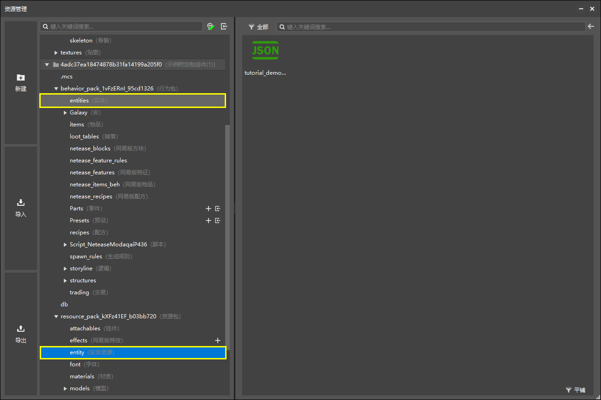
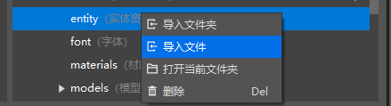
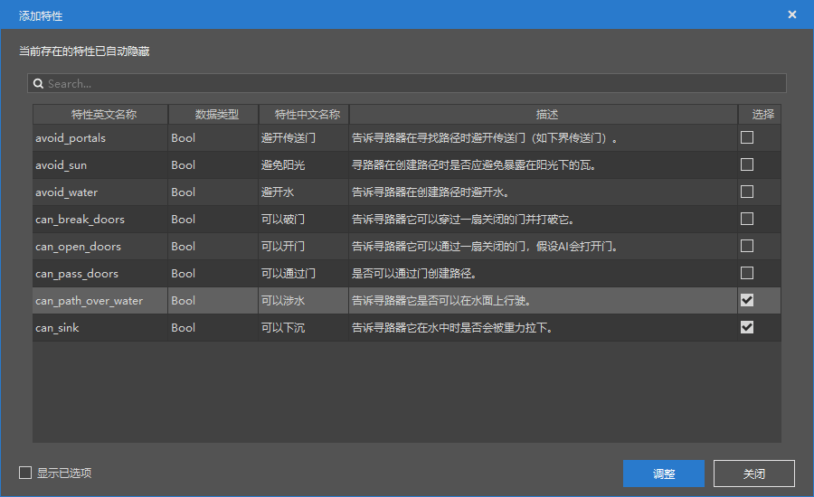
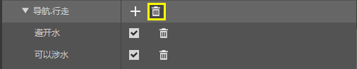
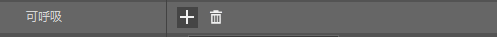
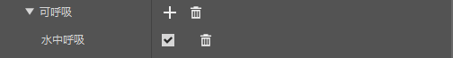

# 挑战：DIY史莱姆实体

在本节中，我们一起自定义一个史莱姆实体。我们都知道，史莱姆是不会在潜入水中自由地游泳的。所以一旦掉进水中，史莱姆只能漂浮在水面上。我们希望只做一种可以潜入水中游泳的史莱姆。

## 制作一个会潜水游泳的史莱姆

### 学会从原版模板包中导入原版资源

为了自定义一个新的史莱姆，我们需要使用原版史莱姆资源。遗憾的是，我们并没有在新建配置中找到史莱姆的数据模板。

所以我们需要在原版的资源包和行为包中手动找到史莱姆的资源和行为，并将其手动导入进编辑器中。我们使用下方的链接下载最新的原版资源包和行为包。

| 包类型 | 模板包链接                                                   |
| ------ | ------------------------------------------------------------ |
| 资源包 | [https://aka.ms/resourcepacktemplate](https://aka.ms/resourcepacktemplate) |
| 行为包 | [https://aka.ms/behaviorpacktemplate](https://aka.ms/behaviorpacktemplate) |

正如一个编辑器中的配置会创建一些配套文件一样，我们为了使实体生效，需要手动建立这一系列“配置”文件。一般来说，一个实体需要三个文件来支撑其渲染和行为，分别是**资源包定义文件**、**行为包定义文件**和**模型文件**。但是，由于我们想自定义一个和原版的史莱姆“长相一样”的实体，所以我们可以直接使用原版的史莱姆模型而无需修改。若无需修改，我们无需再在我们的资源包中导入原版的史莱姆几何模型。我们只需要找到并导入：

| 文件       | 位置                                             |
| ---------- | ------------------------------------------------ |
| 资源包定义 | `Vanilla_Resource_Pack/entity/slime.entity.json` |
| 行为包定义 | `Vanilla_Behavior_Pack/entities/slime.json`      |

在导入前，我们用编辑器将其打开。我们需要修改他们的实体ID，否则我们导入的实体将和原版实体“撞车”。

我们将资源包定义文件中的`minecraft:client_entity/description`段落下的`identifier`中的命名空间（即冒号前面的部分）`minecraft`修改为我们自己的命名空间即可，比如此处我修改为了之前我们第一章中便提到过的`tutorial_demo`。

同理我们将行为包定义文件中的`minecraft:entity/description`段落下的`identifier`中的命名空间`minecraft`也修改为同样的名称。

将两个文件保存后便可以关闭了。不过，为了不和其他开发者制作的模组冲突，我们还建议更改这两个文件的文件名，比如在`slime`前面也加上命名空间。

接下来我们将它们导入进编辑器。我们在“资源管理”窗格中找到对应的文件夹。

我们对两个文件夹分别右击并点击“**导入文件**”。

定位到我们刚才找到的原版文件，即可进行导入。导入成功后，我们便可以在“配置”窗格看到我们的自定义实体了。

我们点击该实体，右侧的“属性”窗格便出现了史莱姆的相关属性和组件。

### 添加相关组件

#### 修改运行时ID

为了使我们的史莱姆完全能够继承原版的硬编码行为，我们可以进一步将史莱姆的**运行时ID**（**Runtime Identifier**）修改为原版的史莱姆。

我们点击“**基础属性**”右侧的“**+**”按钮。选中“**继承生物**”特性。

选择“史莱姆”作为运行时ID继承的生物。

这样我们便将该生物没有进行数据驱动的行为也成功设置成了和原版是史莱姆完全一致了。

#### 添加游泳AI意向和游泳导航组件

点击“**行为包组件”**右侧的“**+**”按钮。搜索“swim”，即可看到我们想要的行为包组件。

我们选中 **`minecraft:behavior.random_swim`**的AI意向，该AI意向能够使史莱姆产生随机的“泳意”；再选中**`minecraft:navigation.swim`** 组件，该组件可以使史莱姆将水的内部纳入寻路算法。点击“调整”将组件添加到行为包中。

### 配置“行为.随机游泳”

我们先配置游泳的AI意向。

我们只需要设置其优先级即可，其余的保持默认状态。由于对于“随机游泳”我们可以认为是一种“休闲”状态，所以我们将其优先级设为最低“1”。这样，史莱姆触发其他状态，比如攻击玩家时，便可以优先进行攻击等行为。

同时我们可以删除漂浮的行为，防止其继续漂浮而不潜入水中。

### 配置“导航.游泳”

同理，我们配置导航组件。

我们选中“可以涉水”和“可以下沉”。同时，由于 **“导航”相关组件只能存在一个** ，所以我们需要删去原有的“导航.行走”组件。

这样，我们的史莱姆就“只会游泳”了。

### 配置可呼吸性

我们需要使史莱姆可以在水中呼吸。所以我们为可呼吸组件添加在水中呼吸的特性。

### 进入游戏自测

我们现在可以保存并进入游戏自测了，我们在水中放置一些我们自定义的史莱姆，看看史莱姆会不会游泳。不出我们所料，史莱姆顺利地在水中游了起来！

