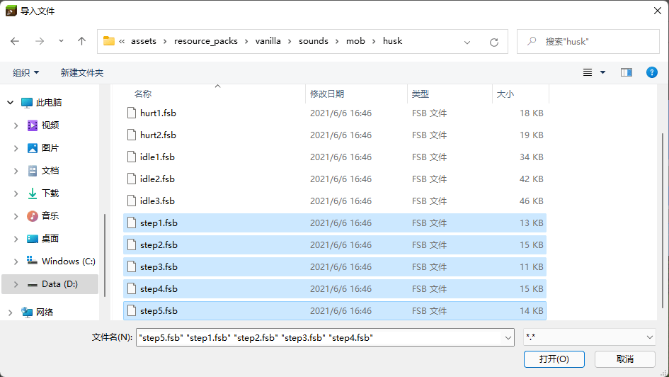
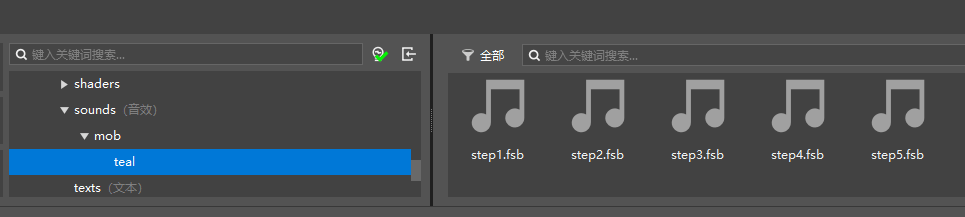

# 为实体添加音效

在本节中，我们为实体添加一个音效。事实上，由于我们的实体是使用Blockbench自动生成的，所以其实已经默认配备了鸡的音效。我们接下来将鸡的音效中的步行音效替换为另一个原版实体的，比如尸壳的步行音效。

## 导入音效资源

大家一定记得，我们在第一节中已经将我们的水鸭行为包导入了我的世界开发工作台。我们打开该附加包的编辑器，准备将尸壳的音效导入编辑器。


我们找到资源包的`sounds`文件夹，右击该文件夹，点击“**导入文件**”按钮。便可以打开导入窗口。



我们找到原版模板资源包下的`sounds/mob/husk`文件夹，我们将所有的`step*.fsb`文件选中。这些文件便是尸壳的步行音效文件。


此时，我们便可以在“资源管理”窗格中看到导入的文件了。但是，事实上，这些音效文件依旧存放在`sounds`文件夹的根目录中。我们并不推荐如此存放。音效文件和纹理文件类似，往往数量都非常庞大，所以我们需要有一个比较好的文件分类系统。直接存放在根目录不仅会使音效文件难易寻找，而且会使游戏无法处理同名的文件，是一种“坏文明”。我们可以看到，模板资源包中便提供了一种分类方法，我们比着葫芦画瓢，建立`sounds/mob/teal`文件夹，并将这些文件复制到该文件夹内。



这样，我们的音效文件就导入完毕了。

## 定义声音事件

导入好音效之后，我们定义这些音效的声音事件。只有有了声音事件，这些音效才有可能被实体引用，或者被命令播放。我们在`sounds`文件夹的根目录下建立`sound_definitions.json`文件，并填入以下内容。

```json
{
  "format_version": "1.14.0",
  "sound_definitions": {
    "mob.teal.step": {
      "category": "neutral",
      "sounds": [
        "sounds/mob/teal/step1",
        "sounds/mob/teal/step2",
        "sounds/mob/teal/step3",
        "sounds/mob/teal/step4",
        "sounds/mob/teal/step5"
      ]
    }
  }
}
```

声音定义文件的格式版本只有`1.14.0`，所以请使用该格式版本。`sound_definitions`字段下可以定义多个声音事件，这里我们只定义了一个标识符为`mob.teal.step`的事件。事件的`category`分类是`neutral`，意味着属于“有好生物”事件。这和游戏内声音设置屏幕中的音量滑块紧密相连。`sounds`可以是一个音效的相对路径，也可以一个数组，其内包含多个音效的相对路径。如果有多个音效，则播放时会随机播放一个。

这样，我们便定义好了声音事件。该声音事件已经可以由`/playsound`命令调用了。

## 使实体播放音效

为了使实体播放音效，我们需要将音效绑定到实体上。我们有两种绑定手段。

### 将声音事件绑定至系统声音

**系统声音**（**System Sound**），又称**存档声音**（**Level Sound**），是一系列挂钩在特定的硬编码事件上的声音触发器。我们可以通过资源包根目录的`sounds.json`文件将声音事件绑定在系统声音上。这样，这些声音事件便会根据游戏内情况而“独立自主”地播放。事实上，这是由于游戏本身会将绑定在系统声音上的添加至对应的系统声音事件中，从而无需开发者再做任何播放操作。系统声音类型可以在[枚举值列表](https://mc.163.com/mcstudio/mc-dev/MCDocs/2-ModSDK%E6%A8%A1%E7%BB%84%E5%BC%80%E5%8F%91/99-%E5%8F%82%E8%80%83%E8%B5%84%E6%96%99/0-Minecraft%E6%9E%9A%E4%B8%BE%E5%80%BC%E6%96%87%E6%A1%A3.html#syssoundtype)中找到，把其中的驼峰命名改成蛇形命名即可，比如`ItemUseOn`对应的是`item_use_on`系统音效类型。

Blockbench创建的水鸭实体默认已经将鸡的音效绑定到了水鸭的系统声音上，我们将`step`系统声音类型的绑定修改为我们刚刚定义的声音事件的标识符。

我们修改`sounds.json`文件如下：

```json
{
  "entity_sounds": {
    "entities": {
      "tutorial_demo:teal": {
        "events": {
          "ambient": "mob.chicken.say",
          "death": "mob.chicken.hurt",
          "hurt": "mob.chicken.hurt",
          "plop": "mob.chicken.plop",
          "step": {
            "pitch": 1,
            "sound": "mob.teal.step", // 修改此处的chicken为teal
            "volume": 0.25
          }
        },
        "pitch": [0.8, 1.2],
        "volume": 1
      }
    }
  }
}
```

此时，我们在游戏中看到水鸭踱步时，听到的声音便会自动播放为我们定义的音效了。

### 用动画或动画控制器播放音效

除了绑定到系统音效，我们还可以使用动画或动画控制器播放音效。在每个动画中，我们可以使用和`bones`平级的`sound_effects`来定义需要播放的音效。每个音效都必须与一个关键帧对应，代表音效播放的时间点。在每个动画控制器中，我们可以使用和`animations`和`transitions`平级的`sound_effects`来定义需要播放的音效。

```json
"animation.teal.baby_transform": {
  "loop": true,
  "bones": {
    "head": {
      "scale": {
        "0.0": 2,
        "0.5": 1,
        "1.0": 2
      }
    }
  },
  "sound_effects": {
    "0.0": { "effect": "sound1" }, // 0.0时播放实体定义文件中的sound1短名称的音效
    "0.5": [
      { "effect": "sound2" },
      { "effect": "sound3" }
    ] // 0.5时播放实体定义文件中的sound2和sound3短名称的音效
  }
}
```

```json
{
  "format_version" : "1.10.0",
  "animation_controllers" : {
    "controller.animation.teal.move" : {
      "initial_state" : "default",
      "states" : {
        "attack" : {
          "animations" : [ "attack" ],
          "transitions" : [
            {
              "default" : "variable.attack_animation_tick <= 0.0"
            }
          ],
          "sound_effects": [
            { "effect": "sound1" }
          ] // 一进入该状态便播放实体定义文件中的sound1短名称的音效
        },
        // ...
      }
    }
  }
}
```

我们可以看到，实体的动画控制器的 `sound_effects`只能做到在状态开始时播放音效。那么我们如何做到在状态结束时也可以播放音效呢？我们有两种途径，第一种是将音效定义在下一个状态的开始。但是这种方式的局限性太大。另一种途径则是使用和`animations`、`transitions`和 `sound_effects`平级的`on_exit`触发命令。`on_exit`数组可以保证在状态结束时执行其中的命令，它的每一个元素都可以是一个字符串斜杠命令。此时我们便可以使用`/playsound`命令来播放声音。
