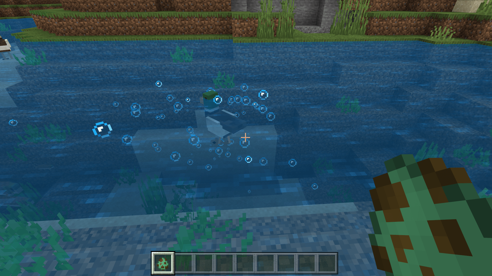

# 为实体添加粒子

在本节中，我们通过一个气泡粒子示例演示如何为实体添加粒子。我们为我们的水鸭添加一个在水中的气泡粒子。事实上，我们的水鸭在水中移动时本来就会产生少许粒子，这是硬编码的行为。但是，我们依旧可以为水鸭添加更多的气泡粒子。

## 定义粒子短名称

我们欲采用原版的国际版粒子发射器`minecraft:basic_bubble_particle_manual`作为我们的气泡粒子，所以我们在实体定义文件中定义这个粒子的短名称，以供我们后续使用。

```json
{
  "format_version": "1.10.0",
  "minecraft:client_entity": {
    "description": {
      "identifier": "tutorial_demo:teal",
      "materials": {
        "default": "chicken",
        "legs": "chicken_legs"
      },
      "textures": {
        "default": "textures/entity/teal"
      },
      "geometry": {
        "default": "geometry.teal"
      },
      "animations": {
        "move": "animation.teal.move",
        "look_at_target": "animation.common.look_at_target",
        "baby_transform": "animation.teal.baby_transform"
      },
      "scripts": {
        "animate": [
          {
            "move": "query.modified_move_speed"
          },
          "look_at_target",
          {
            "baby_transform": "query.is_baby"
          }
        ]
      },
      "particle_effects": {
        "bubble": "minecraft:basic_bubble_particle_manual"
      }, // 定义粒子短名称
      "render_controllers": ["controller.render.chicken"],
      "spawn_egg": {
        "base_color": "#62c287",
        "overlay_color": "#87692b"
      }
    }
  }
}
```

这个粒子发射器根据定义，只会在自身位于水中时持续发射气泡粒子，因此我们不必担心空气中会出现“气泡”。

## 挂接粒子至动画控制器

我们可以使用动画或动画控制器来挂接粒子，这里我们选用动画控制器。我们在资源包的`animation_controllers`文件夹内创建一个新文件，命名为`teal.animation_controllers.json`。然后，我们在其中输入如下内容。

```json
{
  "format_version": "1.10.0",
  "animation_controllers": {
    "controller.animation.teal.particle": {
      "initial_state": "default",
      "states": {
        "default": {
          "particle_effects": [
            {
              "effect": "bubble",
              "locator": "lead"
            }
          ]
        }
      }
    }
  }
}
```

由于我们希望粒子持续播放，我们只定义一个状态，并定义一个`particle_effects`字段。其中`effect`为粒子效果的短名称，而`locator`是个可选字段，为粒子挂接的**定位器**（**Locator**）。


因为我们知道，我们的水鸭实体中存在一个用于挂接栓绳的定位器，为了演示方便，我们也将它用于自定义气泡粒子的定位器。也就是说，这个栓绳点一旦位于水中，水鸭将在水中产生大量气泡。



我们进入游戏自测，可以看到，果不其然，鸭子脖颈处的栓绳点在水下时便会发射出大量的气泡粒子！