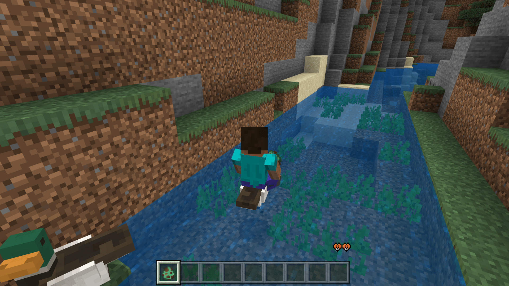

# 挑战：自定义水上坐骑

在本节中，我们一起来进行一个挑战，一起来自定义一个水上坐骑。在前面，我们已经制作出了一个非常完善的水鸭实体。目前，我们只需要为这个水鸭实体增加一些允许骑乘的相关组件即可完成挑战。

## 考查实体行为定义

我们先考查实体既有的定义文件。我们可以发现，实体中事实上已经有了一个可骑乘组件`minecraft:rideable`。它位于`minecraft:teal_adult`组件组中，内容为：

```json
"minecraft:rideable": {
  "family_types": [
    "zombie"
  ],
  "seat_count": 1,
  "seats": {
    "position": [
      0,
      0.4,
      0
    ]
  }
}
```

我们可以很容易看出，这个组件是用于生成僵尸骑手的。我们只需要对其进行改变即可将其变为同时是用于玩家作为骑手的组件。

## 修改组件

我们通过查阅文档、参考其他实体的用法或查看编辑器中该组件的说明，可以轻易将其进行改造：

```json
"minecraft:rideable": {
  "family_types": [
    "zombie",
    "player"
  ],
  "interact_text": "action.interact.mount",
  "seat_count": 1,
  "seats": {
    "position": [
      0,
      0.4,
      0
    ]
  }
}
```

我们可以通过在`family_types`字段中添加族的类型，然后通过`interact_text`来添加一个携带UI的交互按钮文本。这样，我们的水鸭便可以在玩家与其交互时将玩家设为其骑手，从而实现玩家骑乘在水鸭上的功能。

## 添加组件

但是，这并不意味着挑战便到此结束。因为目前我们的玩家还无法控制水鸭。我们骑在目前的水鸭上就好比没有萝卜钓竿就骑在猪上一样，无法控制方向，任凭其乱窜。我们需要添加一个控制组件。非常幸运的是，我们恰有一个可以通过方向键或方向按钮来控制实体移动的组件`minecraft:input_ground_controlled`。我们将其加在同样的位置。

```json
"minecraft:rideable": {
  "family_types": [
    "zombie",
    "player"
  ],
  "interact_text": "action.interact.mount",
  "seat_count": 1,
  "seats": {
    "position": [
      0,
      0.4,
      0
    ]
  }
},
"minecraft:input_ground_controlled": {}
```

这样，我们的水鸭便成为了一个可骑乘可控制同时具备游泳能力的实体了。



完整的行为包定义代码如下：

```json
{
  "format_version": "1.16.0",
  "minecraft:entity": {
    "description": {
      "identifier": "tutorial_demo:teal",
    "runtime_identifier": "minecraft:chicken",
      "is_spawnable": true,
      "is_summonable": true,
      "is_experimental": false
    },
    "component_groups": {
      "minecraft:teal_baby": {
        "minecraft:is_baby": {},
        "minecraft:scale": {
          "value": 0.5
        },
        "minecraft:ageable": {
          "duration": 1200,
          "feed_items": ["wheat_seeds", "beetroot_seeds", "melon_seeds", "pumpkin_seeds"],
          "grow_up": {
            "event": "minecraft:ageable_grow_up",
            "target": "self"
          }
        },
        "minecraft:behavior.follow_parent": {
          "priority": 5,
          "speed_multiplier": 1.1
        }
      },
      "minecraft:teal_adult": {
        "minecraft:experience_reward": {
          "on_bred": "Math.Random(1,7)",
          "on_death": "query.last_hit_by_player?Math.Random(1,3):0"
        },
        "minecraft:loot": {
          "table": "loot_tables/entities/chicken.json"
        },
        "minecraft:breedable": {
          "require_tame": false,
          "breeds_with": {
            "mate_type": "tutorial_demo:teal",
            "baby_type": "tutorial_demo:teal",
            "breed_event": {
              "event": "minecraft:entity_born",
              "target": "baby"
            }
          },
          "breed_items": ["wheat_seeds", "beetroot_seeds", "melon_seeds", "pumpkin_seeds"]
        },
        "minecraft:behavior.breed": {
          "priority": 3,
          "speed_multiplier": 1
        },
        "minecraft:rideable": {
          "family_types": [
            "zombie",
            "player"
          ],
          "interact_text": "action.interact.mount",
          "seat_count": 1,
          "seats": {
            "position": [
              0,
              0.4,
              0
            ]
          }
        },
        "minecraft:input_ground_controlled": {},
        "minecraft:spawn_entity": {
          "entities": {
            "min_wait_time": 300,
            "max_wait_time": 600,
            "spawn_sound": "plop",
            "spawn_item": "egg",
            "filters": {
              "test": "rider_count",
              "subject": "self",
              "operator": "==",
              "value": 0
            }
          }
        }
      }
    },
    "components": {
      "minecraft:type_family": {
        "family": ["chicken", "mob"]
      },
      "minecraft:breathable": {
        "total_supply": 15,
        "suffocate_time": 0
      },
      "minecraft:collision_box": {
        "width": 0.6,
        "height": 0.8
      },
      "minecraft:nameable": {},
      "minecraft:health": {
        "value": 4,
        "max": 4
      },
      "minecraft:hurt_on_condition": {
        "damage_conditions": [
          {
            "filters": {
              "test": "in_lava",
              "subject": "self",
              "operator": "==",
              "value": true
            },
            "cause": "lava",
            "damage_per_tick": 4
          }
        ]
      },
      "minecraft:movement": {
        "value": 0.25
      },
      "minecraft:damage_sensor": {
        "triggers": {
          "cause": "fall",
          "deals_damage": false
        }
      },
      "minecraft:leashable": {
        "soft_distance": 4,
        "hard_distance": 6,
        "max_distance": 10
      },
      "minecraft:balloonable": {
        "mass": 0.5
      },
      "minecraft:navigation.walk": {
        "can_path_over_water": true,
        "can_sink": false,
        "avoid_damage_blocks": true
      },
      "minecraft:movement.basic": {},
      "minecraft:jump.static": {},
      "minecraft:can_climb": {},
      "minecraft:despawn": {
        "despawn_from_distance": {}
      },
      "minecraft:behavior.rise_to_liquid_level": {
        "priority": 0,
        "liquid_y_offset": -0.5,
        "rise_delta": 0.01,
        "sink_delta": 0.01
      },
      "minecraft:behavior.panic": {
        "priority": 1,
        "speed_multiplier": 1.5
      },
      "minecraft:behavior.mount_pathing": {
        "priority": 2,
        "speed_multiplier": 1.5,
        "target_dist": 0,
        "track_target": true
      },
      "minecraft:behavior.tempt": {
        "priority": 4,
        "speed_multiplier": 1,
        "items": ["wheat_seeds", "beetroot_seeds", "melon_seeds", "pumpkin_seeds"]
      },
      "minecraft:behavior.random_stroll": {
        "priority": 6,
        "speed_multiplier": 1
      },
      "minecraft:behavior.look_at_player": {
        "priority": 7,
        "look_distance": 6,
        "probability": 0.02
      },
      "minecraft:behavior.random_look_around": {
        "priority": 8
      },
      "minecraft:physics": {},
      "minecraft:pushable": {
        "is_pushable": true,
        "is_pushable_by_piston": true
      },
      "minecraft:conditional_bandwidth_optimization": {}
    },
    "events": {
      "from_egg": {
        "add": {
          "component_groups": ["minecraft:teal_baby"]
        }
      },
      "minecraft:entity_spawned": {
        "randomize": [
          {
            "weight": 95,
            "trigger": "minecraft:spawn_adult"
          },
          {
            "weight": 5,
            "add": {
              "component_groups": ["minecraft:teal_baby"]
            }
          }
        ]
      },
      "minecraft:entity_born": {
        "remove": {},
        "add": {
          "component_groups": ["minecraft:teal_baby"]
        }
      },
      "minecraft:ageable_grow_up": {
        "remove": {
          "component_groups": ["minecraft:teal_baby"]
        },
        "add": {
          "component_groups": ["minecraft:teal_adult"]
        }
      },
      "minecraft:spawn_adult": {
        "add": {
          "component_groups": ["minecraft:teal_adult"]
        }
      }
    }
  }
}
```
