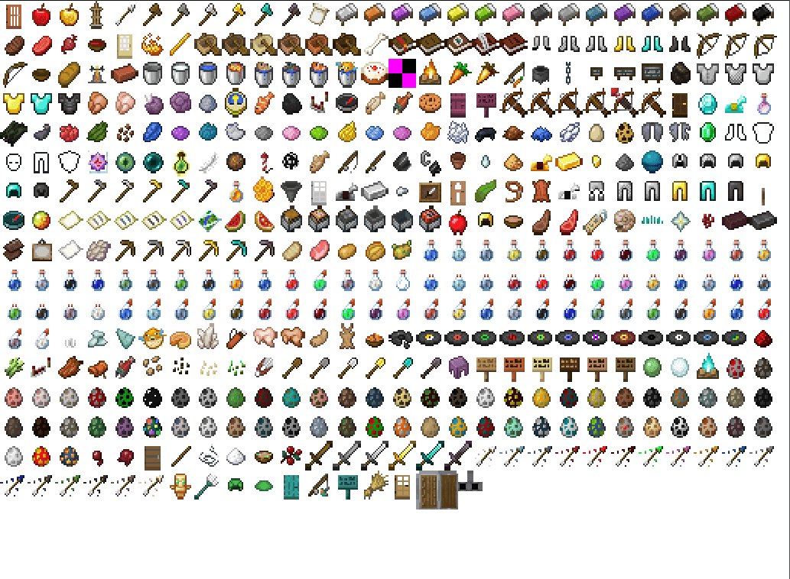

# 认识自定义物品

在本节中，我们一起来接触自定义物品。

物品和实体一样，也是可以通过JSON文件数据驱动来定义的。为了演示，我们使用在第七章中我们一起创建的拥有完整文件夹的附加包。我们记得，我们已经将这个附加包导入游戏。我们在我的世界开发工作台中将其打开。


我们希望使用配置功能新建一个物品，然后在“**资源管理**”窗格中找到物品的定义文件并研究这些文件。

我们可以看到，向导将提示我们建立如下配套文件：

```shell
./behavior_pack/netease_items_beh/tutorial_demo_item_demo.json
./resource_pack/netease_items_res/tutorial_demo_item_demo.json
./resource_pack/attachables/tutorial_demo_item_demo.json
```

这分别是物品的行为包定义文件、资源包定义文件和附作物文件。**附着物**（**Attachable**，***挂件***）作为一种可选的类实体物体，在物品定义中往往起到配合盔甲作为盔甲的模型或配合一般物品作为其自定义模型的作用。一般的物品是不需要这个文件的，所以我们如果选取了普通的物品或者“空”物品，那么这个文件是不会建立的。

## 行为包定义

我们先来看物品的行为包定义文件，这里以我们新创建的`./behavior_pack/netease_items_beh/tutorial_demo_item_demo.json`为例。

```json
{
  "format_version": "1.10",
  "minecraft:item": {
    "description": {
      "identifier": "tutorial_demo:item_demo",
      "category": "Construction",
      "register_to_create_menu": true,
      "custom_item_type": "none",
      "is_experimental": false
    },
    "components": {

    }/*,
    "events": {
      // no use at 1.10 format
    }*/
  }
}
```

- `format_version`：这是该物体文件的**格式版本**（**Format Version**）。物品稳定的格式版本有`1.10`、`1.14`和`1.16`，这三种格式版本均为不需要开启实验性玩法的稳定格式版本，也是我们这里推荐的格式版本，我们尤为推荐格式版本`1.10`。`1.16.100`及以上的格式版本意味着新版物品，这需要开启实验性玩法，我们不推荐使用。不过需要注意的是，如果使用`1.16.100`及以上的新版物品，则只需创建行为包定义文件，客户端需要的数据将从服务端通过来自数据包的形式接收。
- `minecraft:item`：物品的模式标识符，从标识符上来看并不区分客户端和服务端，引擎会根据其文件放置在行为包还是资源包来判断其为服务端还是客户端。其下有`description`、`components`和`events`对象。

`description`代表该物品的**描述**（**Description**）。

- `identifier`：字符串，该物品的赋命名空间标识符，格式为`<namespace>:<identifier>`，客户端和服务端的标识符要保持一致。
- `category`：字符串，该物品的物品栏分类，`Construction`为第一个分类。可以使用自定义的分类，自定义分类可以详见<a href="../../../mcguide/20-玩法开发/15-自定义游戏内容/13-自定义物品分页.html" rel="noopenner">自定义物品分页</a>。
- `register_to_create_menu`：可选，布尔值，是否要将物品注册到创造物品栏。默认为`false`。
- `custom_item_type`：可选，字符串，中国版特有的描述属性，可以继承原版的一些种类的物品，从而定义具有原版硬编码特性的物品。目前可以填写`weapon`、`armor`、`egg`、`ranged_weapon`、`bucket`、`projectile_item`等。
- `is_experimental`：可选，布尔值，该物品是否是否为实验性物品，即是否需要打开实验性玩法才可以得到。

`components`代表该物品的服务端**组件**（**Component**）。物品的大部分组件都是服务端的。但是，在资源包中（即客户端中），也存在部分可用的物品组件。并且其中一些组件有着重要的作用，例如添加物品的图标。

`events`代表该物品的服务端**事件**（**Event**），**并且只有在格式版本为`1.16.100`及以上时才有效**。与实体类似，物品服务端定义文件也允许定义一些事件，不过，目前可定义的事件只能由少数组件触发。也就是说目前定义事件的功能是比较有限的。我们可以看一个原版物品附魔金苹果的事件段落的节选。

```json
"events" : {
  "consumed" : {
    "sequence" : [
      {
        "add_mob_effect" : {
          "effect" : "regeneration",
          "duration" : 5,
          "amplifier" : 1,
          "target" : "holder"
        }
      },
      {
        "add_mob_effect" : {
          "effect" : "absorption",
          "duration" : 120,
          "amplifier" : 0,
          "target" : "holder"
        }
      }
    ]
  }
}
```

这个`consumed`事件由`minecraft:food`组件触发，可以给予食用者生命恢复和生命吸收状态效果。

## 资源包定义

我们再来看物品的资源包定义文件，我们依旧以通过配置新创建的`./resource_pack/netease_items_res/tutorial_demo_item_demo.json`为例。

```json
{
  "format_version": "1.10",
  "minecraft:item": {
    "description": {
      "identifier": "tutorial_demo:item_demo"
    },
    "components": {
      "minecraft:icon": "tutorial_demo:item_demo"
    }
  }
}
```

因为和行为包定义文件具有相同的模式标识符`minecraft:item`，所以理应具有相同的文件模式。但是，资源包定义中各个段落的支持情况却和行为包中的有所不同。资源包定义中只支持`description`和`components`，而且`description`只用来定义标识符，且`components`中支持的组件数目也没有行为包中的多。

但是，我们看到了一个极为重要的组件：`minecraft:icon`。该组件可以用于定义我们的物品图标。我们可以看到该组件的值已经自动为我们填写了`"tutorial_demo:item_demo"`。事实上，这里的值无需带有命名空间，但是为了不和其他模组冲突，我们还是可以为其加上命名空间的。

`minecraft:icon`的值是一个纹理的**短名称**。该短名称的定义并不像实体那样，它不是被定义在客户端定义文件中的。该短名称定义在一种被称为**图集定义文件**（**Atlas Definition File**）的文件中。

### 图集

**图集**（**Atlas**）是我的世界中一种只存在于内存中的纹理文件的称呼。我的世界每次启动游戏时，都会在游戏内依据资源包中的纹理创建图集。比如，物品会根据资源包中的各个小的物品贴图，以图集定义文件为索引创建物品图集。下面展示了一个原版的我的世界创建的**物品图集**。



我们的模组中的物品想要拥有图标，就必须引用一个物品图集中的图标。但是，如果我们不像物品图集中定义新的纹理，那么我们就无法引用自定义的图标，只能引用原版图标。不过，好在我们拥有自定义图集的能力，那便是修改图集定义文件。

我们可以以我们编辑器自动为我们生成的图集文件为例。为了讲解方便，我已经在其中手动添加了我们新物品的图标纹理。物品图集定义文件位于资源包`textures`文件夹根目录下，名称为`item_texture.json`。

```json
{
  "resource_pack_name": "tutorial_demo",
  "texture_name": "atlas.items",
  "texture_data": {
    "tutorial_demo:item_demo": {
      "textures": "textures/items/tutorial_demo/item_demo"
    }
  }
}
```

- `resource_pack_name`：字符串，我们资源包的名称，这可能影响到图集中精灵图的排序情况。不过普通开发者并不用担心这一点，只有某些特殊的着色器开发者需要注意图集的UV情况。
- `texture_name`：字符串，在物品图集中必须为`atlas.items`，它是代表物品图集的标识符。
- `texture_data`：对象，这里定义了所有的短名称。所有的字段都是`"<short_name>": { /* texture definition */ }`的形式。一般来说，纹理定义对象中只会有一个`textures`字段，代表该纹理的相对根目录的路径，不带有扩展名。扩展名将按照`tga`、`png`、`jpg`的格式顺序依次检查是否存在，并且读取第一个检查到的纹理。皆不存在时将会报出错误。

这样，我们就定义好了该物品的图标，从而完成了一个基础的空白物品的定义。