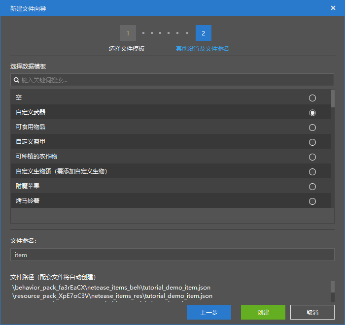
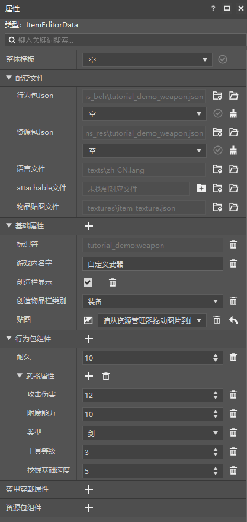
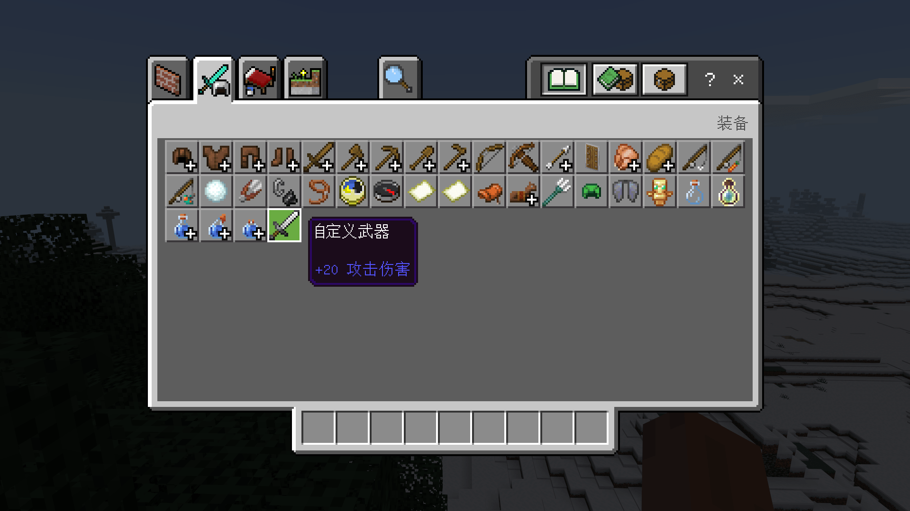

# 制作一个新武器

在本节中，我们将一起新建一个武器，使其具备攻击特性。

## 创建配置

我们打开我的世界开发工作台的编辑器，通过创建**配置**的方式快速创建一个新物品。



我们以“**自定义武器**”为基础，这样便可以创建一个武器。



## 更改属性

我们一起来考察这个物品的组件。我们可以看到，决定了这个物品为武器的组件为“**武器属性**”组件。该组件为中国版自制的组件`minecraft:weapon`。这个组件决定了一个武器的伤害、附魔能力、挖掘等级、基础挖掘速度等属性。我们可以根绝自己的意愿对该组件进行自定义。比如，我们把武器的伤害改为20。


我们这里提供一对稍加修改之后的武器物品对应的定义文件。行为包定义文件如下：

```json
{
  "format_version": "1.10",
  "minecraft:item": {
    "description": {
      "identifier": "tutorial_demo:weapon",
      "category": "Equipment",
      "custom_item_type": "weapon",
      "register_to_create_menu": true
    },
    "components": {
      "minecraft:max_damage": 10,
      "netease:weapon": {
        "attack_damage": 20,
        "enchantment": 10,
        "level": 3,
        "speed": 5,
        "type": "sword"
      }
    }
  }
}
```

资源包定义文件如下：

```json
{
  "format_version": "1.10",
  "minecraft:item": {
    "description": {
      "identifier": "tutorial_demo:weapon"
    },
    "components": {
      "minecraft:icon": "tutorial_demo:weapon"
    }
  }
}
```

值得注意的是，这里的“**耐久**”组件对应的是`minecraft:max_damage`，即最大的**损坏值**（**Damage Value**，简称**DV**），而非攻击能够产生的**伤害**（**Damage**）。该武器能够造成的攻击伤害由`netease:weapon/attack_damage`定义。这里的损坏值即我们在其他语境下经常提到的特殊值、数据值或附加值。之所以称为损坏值，是因为该物品每用一次便会一定程度上地损坏一次，损坏值也会逐渐增大。当损坏值达到最大损坏值时，物品便会因为损坏殆尽而破碎。所以最大损坏值也就是物品的**耐久**（**Durability**）。

我们进入游戏测试我们的武器。




可以看到，我们的武器确实如我们修改的那样，多出了一个+20的攻击伤害。这代表我们的武器自定义成功了！