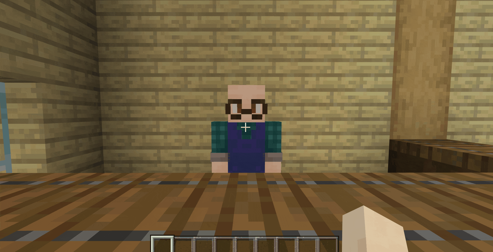
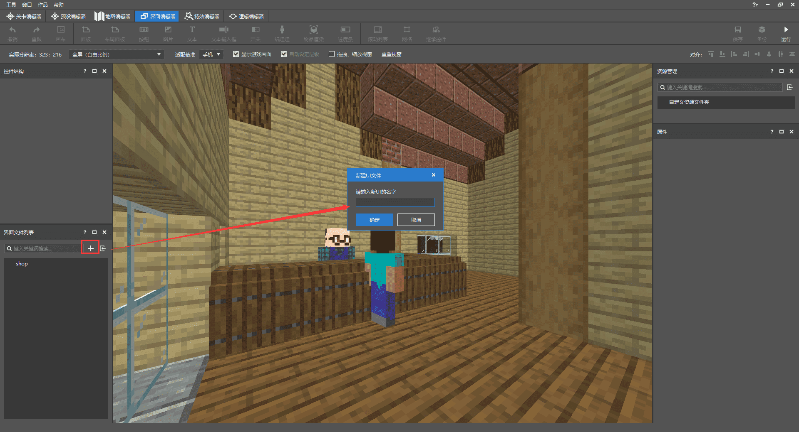
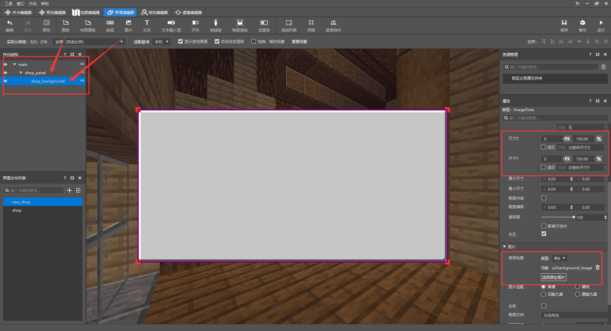
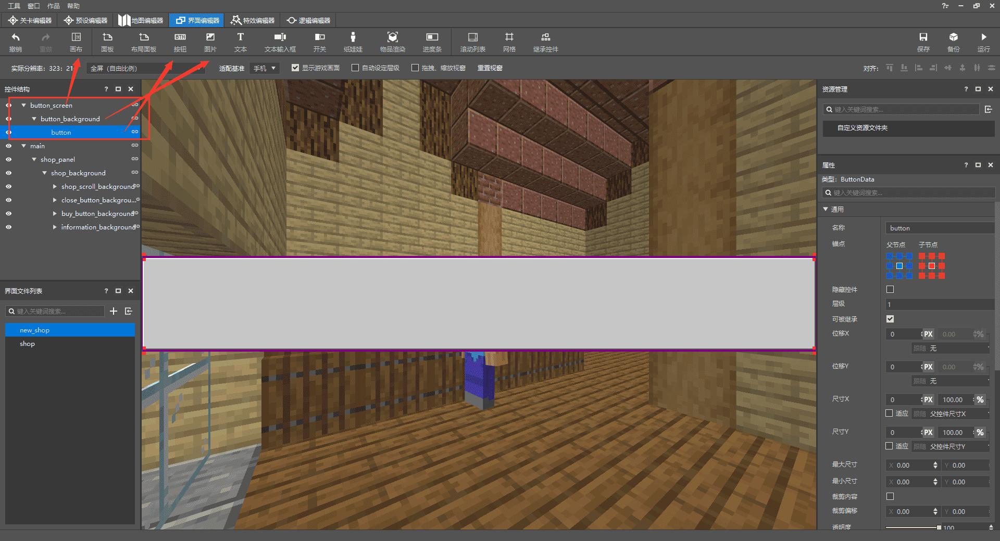
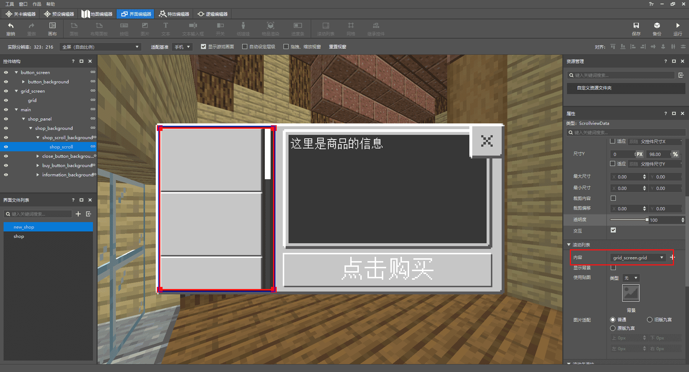
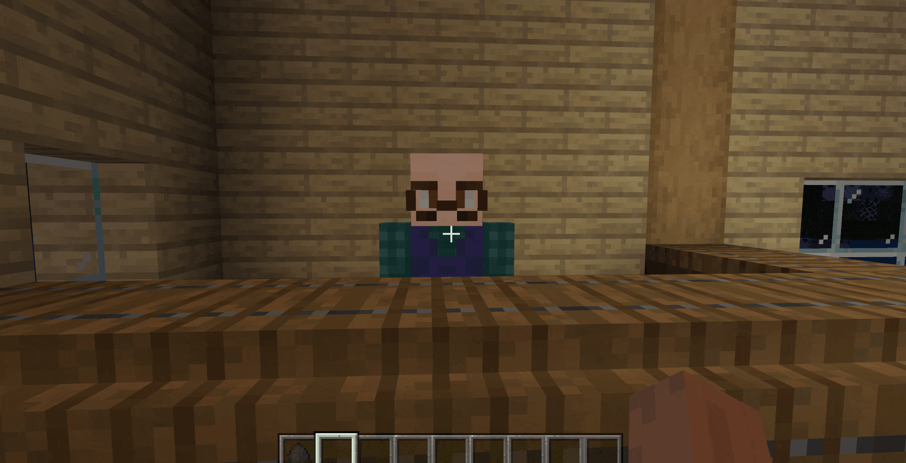
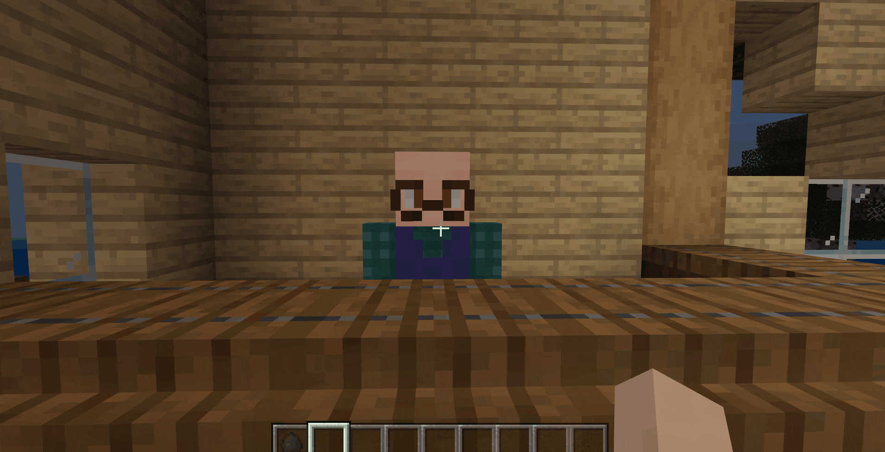

#  给NPC添加对应的交易表

现在，我们的NPC已经有了基本的行为，并且会在自己的区域内等待玩家的光临，接下来我们需要给NPC赋予“灵魂”，使其成为一个真正的商人，可以兑换各式各样的物品，实现的方法也有很多种，本篇我们将介绍两种实现的方法，你可以选择更适合自己或者更适合地图的一种。

<iframe src="https://cc.163.com/act/m/daily/iframeplayer/?id=6152b9cfb8a81f8fa07dc89f" height="600" width="800" allow="fullscreen" />


## 使用Add-on添加交易表组件

第一种方法比较简单，直接在生物的行为文件中添加如下组件即可

```json
"minecraft:economy_trade_table": { //让NPC有交易表
    "display_name": "entity.villager.anmial_shop", //交易表上显示的内容
    "table": "trading/custom/animal_shop.json", //交易表的路径位置
    "new_screen": true //是否使用新版的交易界面
}
```

然后根据写下的路径位置"trading/custom/animal_shop.json"，新建交易表，交易表的路径和名称必须一致，否则是无效的。由于我们目前还没有添加交易的物品，如作物种子、家具等，所以我们先随便添加一条交易来进行演示。

```json
{
  "tiers": [
    {
      "groups": [ //组
        {
          "num_to_select": 1, //从下方列表中选择1条出现在交易表中
          "trades": [
            {
              "wants": [ //交易所需
                {
                  "item": "minecraft:gold_ingot", //物品名称（金锭）
                  "quantity": 1 //数量
                }
              ],
              "gives": [ //交易所得
                {
                  "item": "minecraft:spawn_egg:10", //物品名称（刷怪蛋：鸡）
                  "quantity": 1 //数量
                }
              ]
            }
          ]
        }
      ]
    }
  ]
}

```

完成以上内容后，接下来进入到游戏右键NPC：



可以看到，打开交易表后上面有一串名字，这里就对应行为组件里的**"display_name"**，我们可以对其直接进行修改：

```json
"minecraft:economy_trade_table": { 
    "display_name": "交易表", //直接对其修改
    "table": "trading/custom/animal_shop.json", 
    "new_screen": true 
}
```


## 使用界面编辑器制作交易表的UI

我们这次地图的交易货币并不是存放在背包的，而是用数据存储，没有实体，所以就不能采用第一种Add-on的方式；所以为了实现NPC的交易功能，必须使用UI制作可交互的界面，所以我们将使用界面编辑器制作一个简易的合成表界面；



新建一个新的UI，并尽量输入一个比较独特且有意义的名字，这样在后续使用的时候更容易调试，也不易冲突；


新建一个UI后，左上可以看到控件结构，我们添加的所有UI控件都将在这里，点击某一控件可以在右侧的属性中进行修改调整；每次创建新的UI界面，都会有一个名为**main**的主画布，一般为默认就好（建议除主画布main外，把所有的UI空间都改为有意义且容易辨识的名称）

接下来在主画布下添加一个**面板控件**，将尺寸设置为合成表合适的大小，再添加**图片控件**，大小跟随上一个面板控件并添加贴图背景；



随后依次添加多个**图片控件**，用来当作滚动列表、关闭按钮、购买按钮以及商品信息的背景并调整到合适的大小和贴图以使UI更加美观；如果在添加UI控件时出现这种层级顺序错误的情况，可以将上方**自动设定层级**选项关闭，再逐一调整控件的层级即可。


铺好所有背景后，依次添加需要的控件，每个控件要放到相应的背景下。


点击滚动列表控件，可以在属性中看到**内容**，这里指的是滚动列表里应该放些什么，合成表需要有很多的商品，所以这里需要添加一排按钮用来选择商品，我们添加新的画布用来存储按钮模板。



为了能让按钮一个个的排列，我们还需要单独创建一个网格，把按钮放进网格里并设置需要的数量。


最后将网格添加到滚动列表里，就获得一个完整的合成表UI了！



## 使用MODSDK实现交易功能

1. 新建一个py文件，导入ScreenNode类，新增Main类并继承ScreenNode
2. 在ClietnSystem（客户端）的**UiInitFinished**事件中初始化UI
3. 在ServerSystem（服务端）中利用**PlayerAttackEntityEvent**事件，获得特定NPC和玩家的id
4. 设定玩家在点击此NPC时传达创建合成表UI的事件给客户端。

```python
class FarmClientSystem(ClientSystem):

    def __init__(self, namespace, systemName):
        super(FarmClientSystem, self).__init__(namespace, systemName)
        namespace = clientApi.GetEngineNamespace()
        system_name = clientApi.GetEngineSystemName()
        self.ListenForEvent(namespace, system_name,
                            'UiInitFinished', self, self.ui_init)
        self.ListenForEvent("FarmMod", "ServerSystem", "create_shop_ui",
                            self, self.Create_Shop_UI)


    def Create_Shop_UI(self,event):
        self.ui = clientApi.PushScreen("Farm","new_shop")


    def ui_init(self,args):
        clientApi.RegisterUI("Farm","new_shop","Script_NeteaseModw7ijjGNn.uiscreen.FarmUIScreen","new_shop.main")
```

```python
class FarmServerSystem(ServerSystem):
	def __init__(self, namespace, systemName):
		ServerSystem.__init__(self, namespace, systemName)
		self.ListenForEvent("FarmMod", "ClientSystem", "buy_item",
							self,self.PlayerBuyItem)
		self.ListenForEvent(serverApi.GetEngineNamespace(), serverApi.GetEngineSystemName(), "PlayerAttackEntityEvent",
							self,self.PlayerAttack)


	def PlayerAttack(self,args):
		print "攻击了"
		entityid = args["victimId"]
		self.playername = args["playerId"]
		if entityid == "-120259084268":
			self.NotifyToClient(self.playername,"create_shop_ui", args)

```

```python
class FarmUIScreen(ScreenNode):
	def __init__(self, namespace, name, param):
		ScreenNode.__init__(self, namespace, name, param)
```

接下来我们点击编辑器的**开发测试**进入游戏，点击对应id的NPC即可打开合成表UI，不过此时还不能对UI进行任何交互，接下来我们简单修改ui文件并绑定py函数实现一系列功能。

在ui文件的关闭按钮控件下修改 **"$pressed_button_name"** ，这样在py中给函数添加绑定的装饰器可以直接响应按钮的交互，在函数内添加关闭UI的接口。

> 需要删除ui文件按钮内的 "button_mappings" : []

```json
"close_button@common.button" : {
    "$control_alpha" : 1.0,
    "$default_texture" : "textures/ui/close_button_default",
    "$hover_texture" : "textures/ui/close_button_default_light",
    "$is_new_nine_slice" : false,
    "$label_color" : [ 1, 1, 1 ],
    "$label_font_scale_factor" : 1.0,
    "$label_font_size" : "large",
    "$label_layer" : 3,
    "$label_offset" : [ 0, 0 ],
    "$label_text" : "",
    "$nine_slice_buttom" : 0,
    "$nine_slice_left" : 0,
    "$nine_slice_right" : 0,
    "$nine_slice_top" : 0,
    "$nineslice_size" : [ 0, 0, 0, 0 ],
    "$pressed_button_name" : "%uiscreen.clicked_close_button", //修改按下的按钮的名称
    "$pressed_texture" : "textures/ui/close_button_default_light",
    "$texture_layer" : 2,
    "alpha" : 1.0,
    "anchor_from" : "center",
    "anchor_to" : "center",
    "bindings" : [
        {
            "binding_collection_name" : "",
            "binding_condition" : "always_when_visible",
            "binding_type" : "collection_details"
        }
    ],
    "clip_offset" : [ 0, 0 ],
    "clips_children" : false,
    "controls" : [
        {
            "default@new_shop.default" : {}
        },
        {
            "hover@new_shop.hover" : {}
        },
        {
            "pressed@new_shop.pressed" : {}
        }
    ],
    "draggable" : "not_draggable",
    "enabled" : true,
    "is_handle_button_move_event" : true,
    "layer" : 1,
    "max_size" : [ 0, 0 ],
    "min_size" : [ 0, 0 ],
    "offset" : [ 0, 0 ],
    "propagate_alpha" : false,
    "size" : [ "100.0%+0.0px", "100.0%+0.0px" ],
    "visible" : true
},
```

```python
#关闭按钮的绑定函数,按钮按下再松开后触发
@ViewBinder.binding(ViewBinder.BF_ButtonClickUp)
def clicked_close_button(self,args):
    print "按关闭了！"
    clientApi.PopScreen()
```



然后我们需要绑定滚动列表按钮的**button_label**，也就是对按钮上的文字进行修改，并且点击按钮后会在商品信息处显示对应信息：

1. 创建一个列表变量，在里面添加文字和描述
2. ui文件的button_label中添加集合绑定数组，用装饰器绑定函数修改按钮文字
3. 利用导入的模块截取按下按钮的具体index
4. 给玩家点击的按钮返回对应的描述

首先创建一个列表变量，在里面添加多个按钮上需要显示的文字和描述，因为目前还没有添加作物和种子，就先随便写一些东西用作测试：

```python
# coding=utf-8
self.item_button_text = [
    {
        "itemtext": "点击选择：小麦",  # 商品的名称，显示在按钮上
        "information": "品种：小麦\n生长周期：3\n价格：5",  # 商品的详细信息，展示在UI右侧
    },
    {
        "itemtext": "点击选择：茼蒿",
        "information": "品种：茼蒿\n生长周期：3\n价格：10"
    },
    {
        "itemtext": "点击选择：玉米",
        "information": "品种：玉米\n生长周期：3\n价格：15"
    },
    {
        "itemtext": "点击选择：小麦",
        "information": "品种：小麦\n生长周期：3\n价格：5"
    },
    {
        "itemtext": "点击选择：小麦",
        "information": "品种：小麦\n生长周期：3\n价格：5"
    },
    {
        "itemtext": "点击选择：小麦",
        "information": "品种：小麦\n生长周期：3\n价格：5"
    },
    {
        "itemtext": "点击选择：小麦",
        "information": "品种：小麦\n生长周期：3\n价格：5"
    },
    {
        "itemtext": "点击选择：苹果",
        "information": "品种：苹果\n生长周期：3\n价格：25"
    }
]
```

在button_label控件也就是按钮上的文字，添加一个绑定，并且给绑定函数返回的值赋予在“text”上，这样就可以实现获取集合中按钮的index值并返回文字，同时还要在按钮的控件下添加集合的变量名称：

```json
"button_label" : {
    "alpha" : "$control_alpha",
    "color" : "$label_color",
    "font_scale_factor" : "$label_font_scale_factor",
    "font_size" : "$label_font_size",
    "font_type" : "smooth",
    "layer" : "$label_layer",
    "max_size" : [ "100%", "100%" ],
    "offset" : "$label_offset",
    "shadow" : false,
    "text" : "#text",
    "text_alignment" : "center",
    "type" : "label",
    "bindings" : [
        {
            "binding_collection_name" : "$shop_grid_collection_name", //绑定的集合变量名
            "binding_name":"#item_button_text", //绑定名称，用在装饰器上
            "binding_name_override":"#text", //对应上面的#text
            "binding_condition" : "visible", //绑定条件：显示
            "binding_type" : "collection" //绑定类型：集合
        }
    ]
},
```

```json
"button@common.button" : {
    "$control_alpha" : 1.0,
    "$default_texture" : "textures/ui/pocket_button_default",
    "$hover_texture" : "textures/ui/pocket_button_hover",
    "$is_new_nine_slice" : false,
    "$label_color" : [ 1, 1, 1 ],
    "$label_font_scale_factor" : 1.0,
    "$label_font_size" : "large",
    "$label_layer" : 3,
    "$label_offset" : [ 0, 0 ],
    "$label_text" : "",
    "$nine_slice_buttom" : 0,
    "$nine_slice_left" : 0,
    "$nine_slice_right" : 0,
    "$nine_slice_top" : 0,
    "$nineslice_size" : [ 0, 0, 0, 0 ],
    "$shop_grid_collection_name" : "shop_grid", //集合变量的名称
    "$pressed_button_name" : "%uiscreen.clicked_item_button",
    "$pressed_texture" : "textures/ui/pocket_button_pressed",
    "$texture_layer" : 2,
    "alpha" : 1.0,
    "anchor_from" : "center",
    "anchor_to" : "center",
    "bindings" : [
        {
            "binding_collection_name" : "",
            "binding_condition" : "always_when_visible",
            "binding_type" : "collection_details"
        }
    ],
    "clip_offset" : [ 0, 0 ],
    "clips_children" : false,
    "controls" : [
        {
            "default@new_shop.default" : {}
        },
        {
            "hover@new_shop.hover" : {}
        },
        {
            "pressed@new_shop.pressed" : {}
        },
        {
            "button_label@new_shop.button_label" : {}
        }
    ],
    "draggable" : "not_draggable",
    "enabled" : true,
    "is_handle_button_move_event" : true,
    "layer" : 1,
    "max_size" : [ 0, 0 ],
    "min_size" : [ 0, 0 ],
    "offset" : [ 0, 0 ],
    "propagate_alpha" : false,
    "size" : [ "100.0%+0.0px", "100.0%+0.0px" ],
    "visible" : true
},
```

```python
#集合绑定字符串，给网格内的按钮添加对应的文字
@ViewBinder.binding_collection(ViewBinder.BF_BindString,"shop_grid","#item_button_text")
def binding_item_button_text(self,index):
    print index
    return self.item_button_text[index]["itemtext"] #返回此函数对应变量index的文字
```

导入re模块并使用**compile**函数和**findall**函数截取玩家实际点击按钮的index值，并且在ui文件中修改这个按钮控件的**"$pressed_button_name"**，使装饰器绑定这个按钮：

```json
"button@common.button" : {
    "$control_alpha" : 1.0,
    "$default_texture" : "textures/ui/pocket_button_default",
    "$hover_texture" : "textures/ui/pocket_button_hover",
    "$is_new_nine_slice" : false,
    "$label_color" : [ 1, 1, 1 ],
    "$label_font_scale_factor" : 1.0,
    "$label_font_size" : "large",
    "$label_layer" : 3,
    "$label_offset" : [ 0, 0 ],
    "$label_text" : "",
    "$nine_slice_buttom" : 0,
    "$nine_slice_left" : 0,
    "$nine_slice_right" : 0,
    "$nine_slice_top" : 0,
    "$nineslice_size" : [ 0, 0, 0, 0 ],
    "$shop_grid_collection_name" : "shop_grid",
    "$pressed_button_name" : "%uiscreen.clicked_item_button", //修改按下的按钮的名称
    "$pressed_texture" : "textures/ui/pocket_button_pressed",
    "$texture_layer" : 2,
    "alpha" : 1.0,
    "anchor_from" : "center",
    "anchor_to" : "center",
    "bindings" : [
        {
            "binding_collection_name" : "",
            "binding_condition" : "always_when_visible",
            "binding_type" : "collection_details"
        }
    ],
    "clip_offset" : [ 0, 0 ],
    "clips_children" : false,
    "controls" : [
        {
            "default@new_shop.default" : {}
        },
        {
            "hover@new_shop.hover" : {}
        },
        {
            "pressed@new_shop.pressed" : {}
        },
        {
            "button_label@new_shop.button_label" : {}
        }
    ],
    "draggable" : "not_draggable",
    "enabled" : true,
    "is_handle_button_move_event" : true,
    "layer" : 1,
    "max_size" : [ 0, 0 ],
    "min_size" : [ 0, 0 ],
    "offset" : [ 0, 0 ],
    "propagate_alpha" : false,
    "size" : [ "100.0%+0.0px", "100.0%+0.0px" ],
    "visible" : true
},
```

```python
#按钮的绑定函数，按下时通过re函数计算出按下的是滚动列表中的第几个按钮
@ViewBinder.binding(ViewBinder.BF_ButtonClickUp)
def clicked_item_button(self,args):
    print "按下啦"
    buttonpath = args["ButtonPath"].split('/')[-2] #使用导入的re模块截取按钮的index数
    reg = re.compile(r'\d+')
    button_index = reg.findall(buttonpath)
    if button_index:
        self.clicked_button_index = int(button_index[0])-1 #获取到的index数保存在此变量中
```

当玩家点击某个按钮时就会获取具体的index值，同时就可以为这个按钮添加描述；当然information对应的ui控件也需要添加绑定：

```python
#绑定字符串，给商品信息添加对应的描述
@ViewBinder.binding(ViewBinder.BF_BindString,"#shop_information")
def binding_shop_information(self):
    if self.clicked_button_index == -1: #如果点击按钮的index是-1，则返回一个空字符串
        return ""
    return self.item_button_text[self.clicked_button_index]["information"] #返回对应index的描述信息
```

```json
"item_information" : {
    "alpha" : 1.0,
    "anchor_from" : "top_left",
    "anchor_to" : "top_left",
    "clip_offset" : [ 0, 0 ],
    "clips_children" : false,
    "color" : [ 1, 1, 1 ],
    "enabled" : true,
    "font_scale_factor" : 1.0,
    "font_size" : "normal",
    "font_type" : "smooth",
    "layer" : 1,
    "line_padding" : 0.0,
    "max_size" : [ 0, 0 ],
    "min_size" : [ 0, 0 ],
    "offset" : [ 5, 5 ],
    "propagate_alpha" : false,
    "shadow" : false,
    "size" : [ "75.0%+0.0px", "75.0%+0.0px" ],
    "text" : "#text", 
    "text_alignment" : "left",
    "type" : "label",
    "visible" : true,
    "bindings" : [
        {
            "binding_name":"#shop_information", //用在装饰器上绑定
            "binding_name_override":"#text", //对应上面的#text
            "binding_condition" : "always_when_visible" //绑定条件：总是显示
        }
    ]
},
```

完成以上步骤后，合成表UI已经有了大致的内容：



现在，我们来添加最后也是最关键的内容，通过交易表UI进行购买；首先，通过装饰器和修改ui文件绑定购买的按钮；在绑定的函数下写相关的逻辑：

1. 如果玩家没有选择左侧的某样物品则返回
2. 获取玩家现在有的钱数并对比商品价格
3. 如果玩家的钱可以购买则继续，如果不能则返回
4. 购买成功后向服务端通信，给予玩家购买的物品

代码如下：

```python
# -*- coding: utf-8 -*-
self.item_button_text = [
    {
        "itemtext":"点击选择：小麦", #商品的名称，显示在按钮上
        "information":"品种：小麦\n生长周期：3\n价格：5", #商品的详细信息，展示在UI右侧
        "coin": 5, #购买商品的价格
        "itemname":"minecraft:grass" #用于读取实际商品以给予玩家
    },
    {
        "itemtext": "点击选择：茼蒿",
        "information": "品种：茼蒿\n生长周期：3\n价格：10",
        "coin": 5,
        "itemname": "minecraft:grass"
    },
    {
        "itemtext": "点击选择：玉米",
        "information": "品种：玉米\n生长周期：3\n价格：15",
        "coin": 5,
        "itemname": "minecraft:grass"
    },
    {
        "itemtext": "点击选择：小麦",
        "information": "品种：小麦\n生长周期：3\n价格：5",
        "coin": 5,
        "itemname": "minecraft:grass"
    },
    {
        "itemtext": "点击选择：小麦",
        "information": "品种：小麦\n生长周期：3\n价格：5",
        "coin": 5,
        "itemname": "minecraft:grass"
    },
    {
        "itemtext": "点击选择：小麦",
        "information": "品种：小麦\n生长周期：3\n价格：5",
        "coin": 5,
        "itemname": "minecraft:grass"
    },
    {
        "itemtext": "点击选择：小麦",
        "information": "品种：小麦\n生长周期：3\n价格：5",
        "coin": 5,
        "itemname": "minecraft:grass"
    },
    {
        "itemtext": "点击选择：苹果",
        "information": "品种：苹果\n生长周期：3\n价格：25",
        "coin": 5,
        "itemname": "minecraft:grass"
    }
]
```

先给商品的列表变量添加价格和实际商品的名称用于接下来的逻辑判断和物品发放；

```json
"buy_button@common.button" : {
    "$control_alpha" : 1.0,
    "$default_texture" : "textures/ui/pocket_button_default",
    "$hover_texture" : "textures/ui/pocket_button_hover",
    "$is_new_nine_slice" : false,
    "$label_color" : [ 1, 1, 1 ],
    "$label_font_scale_factor" : 1.0,
    "$label_font_size" : "large",
    "$label_layer" : 3,
    "$label_offset" : [ 0, 0 ],
    "$label_text" : "点击购买",
    "$nine_slice_buttom" : 0,
    "$nine_slice_left" : 0,
    "$nine_slice_right" : 0,
    "$nine_slice_top" : 0,
    "$nineslice_size" : [ 0, 0, 0, 0 ],
    "$pressed_button_name" : "%uiscreen.buy_button_clicked", //和前面的按钮一样，修改按下按钮的名称
    "$pressed_texture" : "textures/ui/pocket_button_pressed",
    "$texture_layer" : 2,
    "alpha" : 1.0,
    "anchor_from" : "center",
    "anchor_to" : "center",
    "bindings" : [
        {
            "binding_collection_name" : "",
            "binding_condition" : "always_when_visible",
            "binding_type" : "collection_details"
        }
    ],
    "clip_offset" : [ 0, 0 ],
    "clips_children" : false,
    "controls" : [
        {
            "default@new_shop.default" : {}
        },
        {
            "hover@new_shop.hover" : {}
        },
        {
            "pressed@new_shop.pressed" : {}
        },
        {
            "buy_button_label@new_shop.buy_button_label" : {}
        }
    ],
    "draggable" : "not_draggable",
    "enabled" : true,
    "is_handle_button_move_event" : true,
    "layer" : 1,
    "max_size" : [ 0, 0 ],
    "min_size" : [ 0, 0 ],
    "offset" : [ 0, 0 ],
    "propagate_alpha" : false,
    "size" : [ "100.0%+0.0px", "100.0%+0.0px" ],
    "visible" : true
},
```

修改购买按钮ui文件的**$pressed_button_name**用于在py文件中绑定；

```python
class FarmUIScreen(ScreenNode):
	def __init__(self, namespace, name, param):
		ScreenNode.__init__(self, namespace, name, param)

		self.clientsystem = clientApi.GetSystem("FarmMod", "ClientSystem") #获取客户端实例
		self.clicked_button_index = -1 #按钮的index值
		self.coin = 0 #定义玩家的钱数
		self.item_button_text = [
			{
				"itemtext":"点击选择：小麦", #商品的名称，显示在按钮上
				"information":"品种：小麦\n生长周期：3\n价格：5", #商品的详细信息，展示在UI右侧
				"coin": 5, #购买商品的价格
				"itemname":"minecraft:grass" #用于读取实际商品以给予玩家
			},
			{
				"itemtext": "点击选择：茼蒿",
				"information": "品种：茼蒿\n生长周期：3\n价格：10",
				"coin": 5,
				"itemname": "minecraft:grass"
			},
			{
				"itemtext": "点击选择：玉米",
				"information": "品种：玉米\n生长周期：3\n价格：15",
				"coin": 5,
				"itemname": "minecraft:grass"
			},
			{
				"itemtext": "点击选择：小麦",
				"information": "品种：小麦\n生长周期：3\n价格：5",
				"coin": 5,
				"itemname": "minecraft:grass"
			},
			{
				"itemtext": "点击选择：小麦",
				"information": "品种：小麦\n生长周期：3\n价格：5",
				"coin": 5,
				"itemname": "minecraft:grass"
			},
			{
				"itemtext": "点击选择：小麦",
				"information": "品种：小麦\n生长周期：3\n价格：5",
				"coin": 5,
				"itemname": "minecraft:grass"
			},
			{
				"itemtext": "点击选择：小麦",
				"information": "品种：小麦\n生长周期：3\n价格：5",
				"coin": 5,
				"itemname": "minecraft:grass"
			},
			{
				"itemtext": "点击选择：苹果",
				"information": "品种：苹果\n生长周期：3\n价格：25",
				"coin": 5,
				"itemname": "minecraft:grass"
			},
		]


	@ViewBinder.binding(ViewBinder.BF_ButtonClickUp)
	def buy_button_clicked(self,args):
		print "点击购买了"
		if self.clicked_button_index == -1:
			print "玩家还没选物品"
			return
		price = self.item_button_text[self.clicked_button_index]['coin']
		print "他想买的东西价值:",price
		print "你有的钱数：",self.coin
		if self.coin >= price:
			self.coin -= price
			print "买完以后你还剩：",self.coin
			#向服务端通信，将玩家id，剩余钱数，以及购买的实际物品作为参数传送过去
			self.clientsystem.NotifyToServer("buy_item",{"playerid":clientApi.GetLocalPlayerId(),"coin":self.coin,"buy_item":self.item_button_text[self.clicked_button_index]["itemname"]})
		else:
			print "你买不起"
```

使用装饰器绑定函数，注意此时的函数名和上方ui文件的**$pressed_button_name**必须一致；获取客户端实例并在玩家购买完成后通知服务端发放物品；

```python
class FarmServerSystem(ServerSystem):
	def __init__(self, namespace, systemName):
		ServerSystem.__init__(self, namespace, systemName)
		self.ListenForEvent("FarmMod", "ClientSystem", "buy_item",
							self,self.PlayerBuyItem)
		self.ListenForEvent(serverApi.GetEngineNamespace(), serverApi.GetEngineSystemName(), "PlayerAttackEntityEvent",
							self,self.PlayerAttack)


	def PlayerBuyItem(self, args):
		print "玩家买到了"
		player_id = args['playerid'] #传过来的玩家id
		item_name = args['buy_item'] #传过来的实际商品名称
		serverApi.GetEngineCompFactory().CreateItem(player_id).SpawnItemToPlayerInv( #发放物品
			{
				'newItemName': item_name,
				'count': 1
			},
			player_id
		)
```

```python
def Create_Shop_UI(self,event):
    self.ui = clientApi.PushScreen("Farm","new_shop")
    self.ui.coin = 100 #修改这个ui实例的硬币数量
```

在创建合成表时，先将玩家的钱数设定为100，然后进入到游戏中测试一下：


