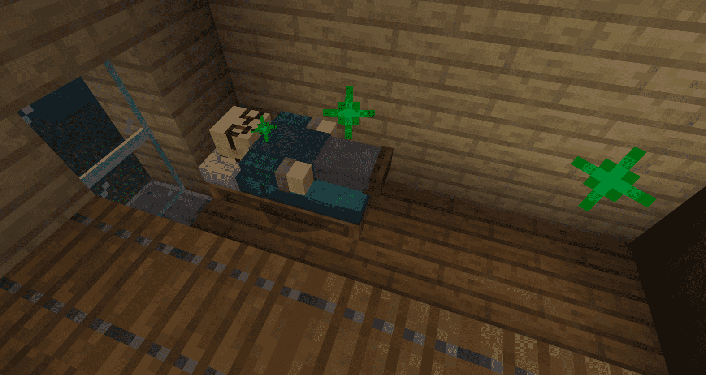
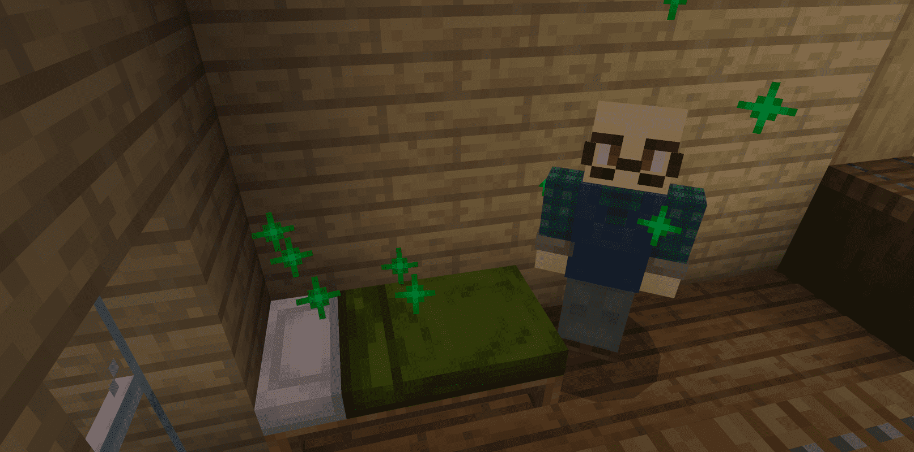

#  给NPC设置睡觉的床

现在，我们已经有一个任劳任怨并且可以和我们交易的商人啦，但是！商人们只能工作不能休息也太惨了吧？所以我们需要让NPC们和玩家一样拥有自然的作息，而不是一个冷冰冰的NPC，这样也可以一定程度上增加游戏的代入感，让玩家更好的享受乐趣。



## 让NPC绑定属于自己的床

每个NPC都要有一个自己的床，不然他们就要开始互相抢床，导致混乱，这就麻烦了。我们只需要在NPC行为里面添加一个行为组件就行了。

```json
"minecraft:dweller": {
    "dwelling_type": "village", //类型
    "dweller_role": "inhabitant", //角色（因为这张地图的NPC都是无职业的，如果想要添加给NPC添加职业，可以参考原版Villager_v2的行为组件）
    "update_interval_base": 20, //基础更新间隔
    "update_interval_variant": 10, //变种更新间隔
    "can_find_poi": true //是否可以寻找poi
}
```

进入到游戏中试一下，把NPC放在床的附近，当他和床同时发出绿色粒子的时候就成功啦！现在这个床就属于这个NPC了，当然我们玩家还是可以把他的床抢过来。



## 让NPC到床上睡觉

现在NPC已经有属于自己的床了，不过他们还不会去睡觉，接下来再加一个行为组件

```json
"minecraft:behavior.sleep": {
    "speed_multiplier": 1.5, //去睡觉时的移动速度倍增
    "sleep_collider_height": 0.3, //睡觉时生物碰撞箱的高度
    "sleep_collider_width": 1.0, //睡觉时生物碰撞箱的宽度
    "sleep_y_offset": 0.6, //睡觉时生物Y轴的偏移量
    "timeout_cooldown": 10.0 //发生意外起床后，再过多长时间可以再次睡觉
}
```

添加这个行为组件后，生物就会跑去睡觉啦，当然别忘了留下可以移动的行为组件。

这里还有一个小问题，如果我们给生物添加基本的睡觉行为，那么当生物找到床以后不管是白天还是晚上都会一直睡觉，所以我们需要利用**事件**和**组件组**配合，让NPC只有在晚上的时候才会睡觉。

有关components、events与component_groups三者之间的关系，可以参考往期教程：[定义生物行为的三种结构](https://g.126.fm/04a9tkE)。

首先我们添加一个可以检测时间的组件，分别在白天和晚上触发不同的事件：

```json
"minecraft:scheduler": {
    "min_delay_secs": 0, //最小延迟数
    "max_delay_secs": 10, //最大延迟数
    "scheduled_events" : [ //调度事件
        {
            "filters": { //过滤器（第一个）
                "all_of": [ //满足所有条件
                    { "test": "hourly_clock_time", "operator": ">=", "value": 0 }, //当事件大于等于0时（代表白天开始了）
                    { "test": "hourly_clock_time", "operator": "<", "value": 12000 } //小于12000时（代表白天还没有结束）
                ]
            },
            "event": "minecraft:work" //触发事件"minecraft:work"
        },
        {
            "filters": { //过滤器（第二个）
                "all_of": [ //满足所有条件
                    { "test": "hourly_clock_time", "operator": ">=", "value": 12000 }, //大于等于12000（代表夜晚开始了）
                    { "test": "hourly_clock_time", "operator": "<", "value": 24000 } //小于24000（代表夜晚还没有结束）
                ]
            },
            "event": "minecraft:sleep" //触发事件"minecraft:sleep"
        }
    ]
},
```

加上这个行为组件后，白天的时候就会触发**work**的事件，晚上就会触发**sleep**的事件，接下来添加这两个事件，分别在触发work事件的时候让村民起床，在触发sleep事件的时候让村民睡觉。

```json
"events": { //事件，所有的事件都放在这下面，和components（行为组件）在同一排
    
    "minecraft:sleep": { //当满足过滤器（第二个）时触发的事件
        "remove": { "component_groups": [ "villager_work" ] }, //移除"villager_work"组件组
        "add": { "component_groups": [ "villager_sleep" ] }
    }, //添加"villager_sleep"组件组
    
    "minecraft:work": { //当满足过滤器（第一个）时触发的事件
        "remove": { "component_groups": [ "villager_sleep" ] }, //移除"villager_sleep"组件组
        "add": { "component_groups": [ "villager_work" ] } //添加"villager_work"组件组
    }
}
```

```json
"component_groups": { //组件组，触发事件后可随意移除和添加一组或多个组
    
    "villager_sleep": { //与事件一起看，当满足过滤器（第二个）时就会添加这个组件组，而这个组件组下只有一个组件，就是去睡觉
        "minecraft:behavior.sleep": {
            "priority": 3,
            "goal_radius": 1.5,
            "speed_multiplier": 1.5,
            "sleep_collider_height": 0.3,
            "sleep_collider_width": 1.0,
            "sleep_y_offset": 0.6,
            "timeout_cooldown": 10.0
        }
    },
    
    "villager_work": { //当满足过滤器（第一个）时就会添加这个组件组，并且移除睡觉的组件组，这时候生物就会起床，现在这个组件组里什么都没有，所以NPC起床后也没什么变化
        
    }
},
```

把上面的内容添加到NPC的行为文件里以后，我们的商人就会在白天起床，晚上去睡觉啦。进入游戏来看一下实际效果！


