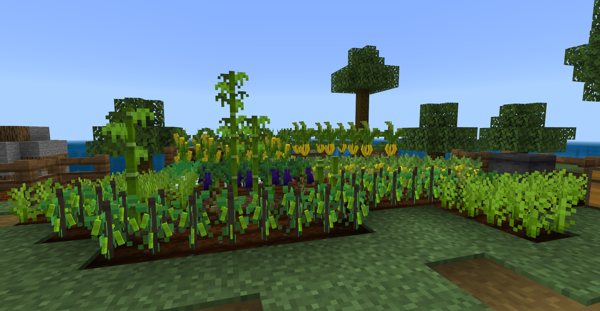
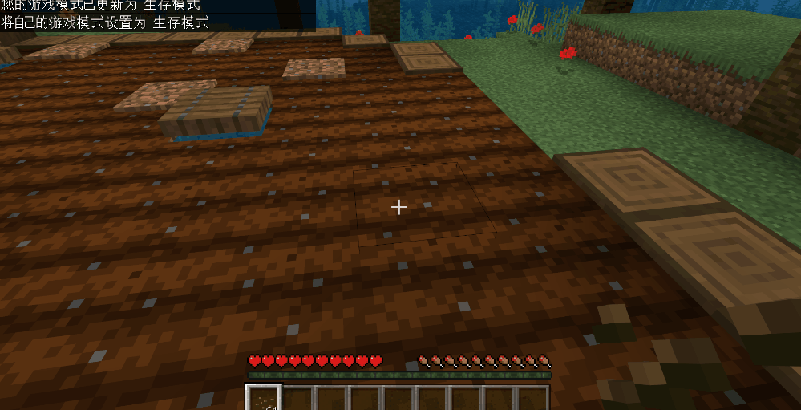

# 开始添加作物方块

基本了解新的自定义方块写法后，我们开始制作地图中需要的农作物：

- 农作物有多个生长状态，并且模型和贴图会随着成长而变化
- 部分农作物可收获多次
- 特殊农作物需要种植在篱笆上



<iframe src="https://cc.163.com/act/m/daily/iframeplayer/?id=6152ba9148e27490891f035c" height="600" width="800" allow="fullscreen" />


## 设定农作物不同阶段的生长状态

首先，我们给自定义方块添加基本的行为组件，使其可以在游戏中正常显示出来；

```json
{
    "format_version": "1.16.100",
	"minecraft:block": {
		"description": {
			"identifier": "farm:whiteradish",
            "register_to_creative_menu": true
		},
        "permutations": [
        ],
        "events": {
        },
        "components": {
            "minecraft:placement_filter": { //可以放在耕地上
                "conditions": [
                    {
                        "allowed_faces": ["up"],
                        "block_filter": ["farmland"]
                    }
                ]
            },
            "minecraft:entity_collision": false, //关闭生物碰撞箱
            "minecraft:pick_collision": { //设定选择时的碰撞箱
                "origin": [-8, 0, -8],
                "size": [16, 5, 16]
            },
              "minecraft:geometry": "geometry.whiteradish_stage_0", //方块模型
            "minecraft:material_instances": { //方块的贴图和渲染方法
                 "*": {
                    "texture": "farm:whiteradish_stage_0",
                    "render_method": "alpha_test",
                    "ambient_occlusion": false
                 }
            }
        }
	}
}
```


接下来，我们为其添加方块属性，并且利用触发器、事件和组合设定在不同属性的情况下，方块也会有明显的变化；

```json
{
    "format_version": "1.16.100",
	"minecraft:block": {
		"description": {
			"identifier": "farm:whiteradish",
            "register_to_creative_menu": true,
            "properties": {
				"farm:age": [0, 1, 2] //设定农作物共有三个生长阶段
			}
		},
        "permutations": [
            {
				"condition": "query.block_property('farm:age') == 0", //组合的条件表达式，当方块属性farm:age等于0时
				"components": { //满足上方的条件，将下方组件添加到方块中
                    "minecraft:loot": "loot_tables/empty.json",
                    "minecraft:pick_collision": {
                        "origin": [-8, 0, -8],
                        "size": [16, 5, 16]
	                },
		  			"minecraft:geometry": "geometry.whiteradish_stage_0",
					"minecraft:block_light_absorption": 0,
                    "minecraft:material_instances": {
                         "*": {
                            "texture": "farm:whiteradish_stage_0",
    		                "render_method": "alpha_test",
                            "ambient_occlusion": false
                         }
                    }
				}
	  		}
        ],
        "components": {
            "minecraft:placement_filter": { 
                "conditions": [
                    {
                        "allowed_faces": ["up"],
                        "block_filter": ["farmland"]
                    }
                ]
            },
            "minecraft:entity_collision": false,
            "minecraft:on_player_placing":  { //触发器，玩家放置方块时触发事件
				"event": "farm:on_player_placing",
				"target": "self"
	  		}
        },
        "events": {
            "farm:on_player_placing": { //当玩家放置方块时触发此事件，设定方块的生长阶段为0
                "set_block_property": {
                    "farm:age": 0
                }
            }
        }
	}
}
```

根据上方图片可以看出，主要分为四个部分，属性、组合、基础组件、事件；这四个部分相互调配，非常灵活；

再添加一个属性，控制农作物的生长刻数，组合中添加随机刻的触发器，使方块可以根据随机刻触发事件，达到农作物生长的目的；

```json
{
    "format_version": "1.16.100",
	"minecraft:block": {
		"description": {
			"identifier": "farm:whiteradish",
            "register_to_creative_menu": true,
            "properties": {
				"farm:age": [0, 1, 2],
                "farm:growth": [0, 1, 2, 3, 4, 5] //生长刻数，每次随机刻触发时都会+1
			}
		},
        "permutations": [
            {
				"condition": "query.block_property('farm:age') == 0", 
				"components": {
                    "minecraft:loot": "loot_tables/empty.json",
                    "minecraft:pick_collision": {
                        "origin": [-8, 0, -8],
                        "size": [16, 5, 16]
	                },
                    "minecraft:random_ticking": {  //添加随机刻的触发器，触发下方事件
                        "on_tick": {
                            "target": "self",
                            "event": "farm:on_age_count_0" //触发的事件
                        }
                    },
		  			"minecraft:geometry": "geometry.whiteradish_stage_0",
					"minecraft:block_light_absorption": 0,
                    "minecraft:material_instances": {
                         "*": {
                            "texture": "farm:whiteradish_stage_0",
    		                "render_method": "alpha_test",
                            "ambient_occlusion": false
                         }
                    }
				}
	  		}
        ],
        "components": {···},
        "events": {
            "farm:on_age_count_0": { //上方添加的随机刻触发器触发时，响应此事件
                "sequence": [
					{
						"condition": "query.block_property('farm:growth') < 2", //条件，当farm:growth属性小于2时
                        "set_block_property": {
                            "farm:growth": "query.block_property('farm:growth') + 1" //设定方块的属性farm:growth加1
                        }
                    },
                    {
                        "condition": "query.block_property('farm:growth') == 2", //条件，当farm:growth属性等于2时
                        "trigger": {
                            "event": "farm:on_whiteradish_grow_to_1", //触发新的事件
                            "target": "self"
                        }
                    }
                ]
            },
            "farm:on_whiteradish_grow_to_1": { //当farm:growth属性等于2时触发的事件（说明此时随机刻已经触发了3次）
                "set_block_property": { 
                    "farm:age": 1, //设定方块的属性farm:age为1（成长到新的阶段）
                    "farm:growth": 0 //设定方块的属性farm:growth为0（重置随机刻）
                }
            },
            "farm:on_player_placing": { 
                "set_block_property": {
                    "farm:age": 0
                }
            }

        }
	}
}
```

农作物的生长阶段到1后，条件是farm:age等于0的组合就失效了，所以我们需要添加新的组合表示农作物的新阶段，并且需要在组合中修改模型和贴图使农作物在到达新阶段时有所变化；

```json
{
    "condition": "query.block_property('farm:age') == 1", //新添加的组合，条件是农作物的生长阶段等于1时
    "components": {
        "minecraft:loot": "loot_tables/empty.json",
        "minecraft:geometry": "geometry.whiteradish_stage_0", //若有不同的模型需要修改
        "minecraft:block_light_absorption": 0,
        "minecraft:pick_collision": {
            "origin": [-8, 0, -8],
            "size": [16, 8, 16]
        },
        "minecraft:random_ticking": { //因为农作物还没有完全成熟，所以仍需要随机刻的触发器
            "on_tick": {
                "target": "self",
                "event": "farm:on_age_count_1" 
            }
        },
        "minecraft:material_instances": {
            "*": {
                "texture": "farm:whiteradish_stage_1", //若有不同的贴图需要修改
                "render_method": "alpha_test",
                "ambient_occlusion": false
            }
        }
    }
}
```

现在，农作物方块已经可以生长了，我们在编辑器中点击**开发测试**进入到游戏中测试一下。


成长阶段像0到1一样，继续添加从1-2的组合和事件，这样，一个较完整的农作物方块就完成了：

```json
{
    "format_version": "1.16.100",
	"minecraft:block": {
		"description": {
			"identifier": "farm:whiteradish",
            "register_to_creative_menu": true,
			"properties": {
				"farm:age": [0, 1, 2],
                "farm:growth": [0, 1, 2, 3, 4, 5]
			}
		},
        "permutations": [
	  		{
				"condition": "query.block_property('farm:age') == 0",
				"components": {
                    "minecraft:pick_collision": {
                        "origin": [-8, 0, -8],
                        "size": [16, 5, 16]
	                },
                    "minecraft:random_ticking": { 
                        "on_tick": {
                            "target": "self",
                            "event": "farm:on_age_count_0" 
                        }
                    },
		  			"minecraft:geometry": "geometry.whiteradish_stage_0",
					"minecraft:block_light_absorption": 0,
                    "minecraft:material_instances": {
                         "*": {
                            "texture": "farm:whiteradish_stage_0",
    		                "render_method": "alpha_test",
                            "ambient_occlusion": false
                         }
                    }
				}
	  		},
            {
				"condition": "query.block_property('farm:age') == 1",
				"components": {
		  			"minecraft:geometry": "geometry.whiteradish_stage_0", 
					"minecraft:block_light_absorption": 0,
                    "minecraft:pick_collision": {
                        "origin": [-8, 0, -8],
                        "size": [16, 8, 16]
	                },
                    "minecraft:random_ticking": { 
                        "on_tick": {
                            "target": "self",
                            "event": "farm:on_age_count_1" 
                        }
                    },
                    "minecraft:material_instances": {
                         "*": {
                            "texture": "farm:whiteradish_stage_1",
    		                "render_method": "alpha_test",
                            "ambient_occlusion": false
                         }
                    }
				}
	  		},
            {
				"condition": "query.block_property('farm:age') == 2",
				"components": {
		  			"minecraft:geometry": "geometry.whiteradish_stage_2",
					"minecraft:block_light_absorption": 0,
                    "minecraft:pick_collision": {
                        "origin": [-8, 0, -8],
                        "size": [16, 12, 16]
	                },
					"minecraft:on_player_destroyed": {
						"event": "farm:on_destroy_stage_2"
					},
                    "minecraft:material_instances": {
                         "*": {
                            "texture": "farm:whiteradish_stage_2",
    		                "render_method": "alpha_test",
                            "ambient_occlusion": false
                         }
                    }
				}
	  		}
        ],
        "events": {
            "farm:on_age_count_0": { 
                "sequence": [
					{
						"condition": "query.block_property('farm:growth') < 2", 
                        "set_block_property": {
                            "farm:growth": "query.block_property('farm:growth') + 1" 
                        }
                    },
                    {
                        "condition": "query.block_property('farm:growth') == 2", 
                        "trigger": {
                            "event": "farm:on_whiteradish_grow_to_1",
                            "target": "self"
                        }
                    }
                ]
            },
            "farm:on_age_count_1": {
                "sequence": [
                    {
						"condition": "query.block_property('farm:growth') < 5",
                        "set_block_property": {
                            "farm:growth": "query.block_property('farm:growth') + 1"
                        }
                    },
                    {
                        "condition": "query.block_property('farm:growth') == 5",
                        "trigger": {
                            "event": "farm:on_whiteradish_grow_to_2",
                            "target": "self"
                        }
                    }
                ]
            },
            "farm:on_player_placing": {
                "set_block_property": {
                    "farm:age": 0,
                    "farm:growth": 0
                }
            },
            "farm:on_whiteradish_grow_to_1": {
                "set_block_property": { 
                    "farm:age": 1, 
                    "farm:growth": 0 
                }
            },
            "farm:on_whiteradish_grow_to_2": {
                "set_block_property": {
                    "farm:age": 2,
                    "farm:growth": 0
                }
            }
        },
        "components": {

            "minecraft:placement_filter": {
                "conditions": [
                    {
                        "allowed_faces": ["up"],
                        "block_filter": ["farmland"]
                    }
                ]
            },
			"minecraft:entity_collision": false,
	  		"minecraft:on_player_placing":  {
				"event": "farm:on_player_placing",
				"target": "self"
	  		}
		}
	}
}
```


## 继续完善农作物方块

现在，我们已经有了农作物方块，不过还不够完整，没有农作物对应的果实和种下农作物需要的种子，我们来添加这些；

首先是种子，创建一个自定义物品，添加一个放置方块的组件即可。

```json
{
	"format_version": "1.16.100",
	"minecraft:item": {
		"description": {
			"identifier": "farm:whiteradish_seed",
			"category": "items"
		},
		"components": {
			"minecraft:icon": {
				"texture": "farm:whiteradish_seed"
			},
            "minecraft:ignores_permission": true, 
            "minecraft:block_placer": { //设定此物品可以放置方块
                "block": "farm:whiteradish", 
                "use_block_description": true
            }
		}
	}
}
```

农作物的掉落物也很简单，只需要在农作物成熟的组合中添加一个掉落物表即可！

```json
{
    "condition": "query.block_property('farm:age') == 2",
    "components": {
        "minecraft:loot": "loot_tables/whiteradish.json", //掉落物表路径
        "minecraft:geometry": "geometry.whiteradish_stage_2",
        "minecraft:block_light_absorption": 0,
        "minecraft:pick_collision": {
            "origin": [-8, 0, -8],
            "size": [16, 12, 16]
        },
        "minecraft:on_player_destroyed": {
            "event": "farm:on_destroy_stage_2"
        },
        "minecraft:material_instances": {
            "*": {
                "texture": "farm:whiteradish_stage_2",
                "render_method": "alpha_test",
                "ambient_occlusion": false
            }
        }
    }
}
```



