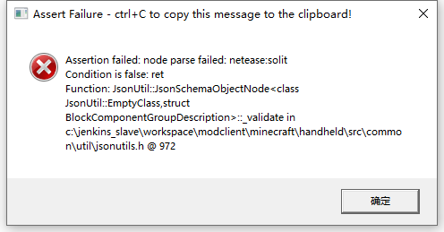
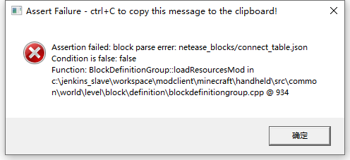

# 使用JSON遇到的问题和解决方法

JSON文件出错的时候，可能会在进入游戏测试的时候就报错，或者成功进入游戏但是与错误相关的内容会消失，有的时候甚至会直接导致游戏崩溃。

最容易发生也是最致命的问题就是格式错误，常规的编辑器在发生错误的时候都会有提示，如：vscode：


一些在线的JSON格式校验网站也可以检测格式，非常方便：


其次就是在进入游戏时会弹出的报错窗口：



json的报错同样会带有一些问题的提示信息：“节点分析失败：netease_solit”，我们可以根据报错的信息找到问题所在；并且，json的报错一般都不只有一个，比如这个报错点击确定后还会再弹出一个新的报错：



“block parse errer:netease_blocks/connect_table.json”，这个报错就提示了具体的json文件，于是我们去寻找这个文件内的netease_solit节点：

```json
{
  "format_version": "1.10.0",
  "minecraft:block": {
   "description": {
     "identifier": "farm:connect_table",
	 "register_to_creative_menu": true,
	 "is_experimental": false
   },
   "components": {
	  "minecraft:block_light_absorption":{
		"value": 0
	  },
	  "netease:render_layer": {
	    "value": "alpha"
	  },
	  "netease:solit": { //报错的节点（名称错误，应该是netease:solid，所以引擎无法识别这个不存在的组件）
	    "value": false
	  },
	  "netease:connection": {
		"blocks": ["farm:connect_table"]
	  }
    }
  }
}
```

这种弹窗报错可以按下ctrl+C复制，便于记录。


