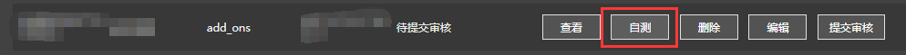
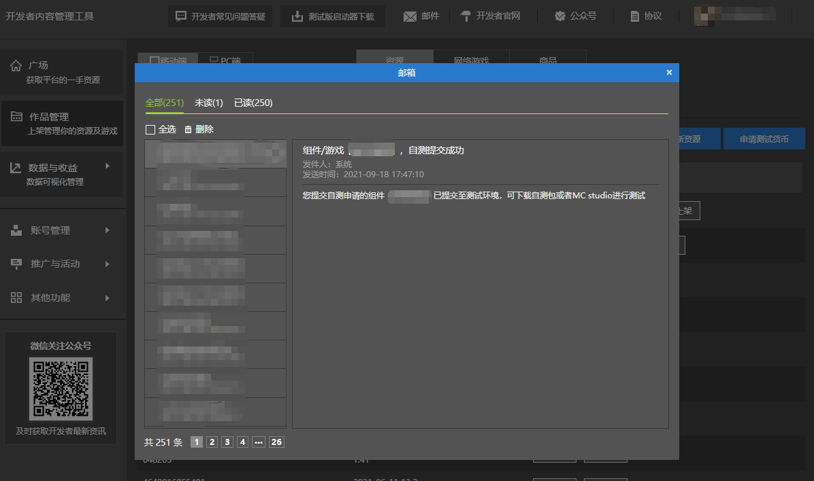
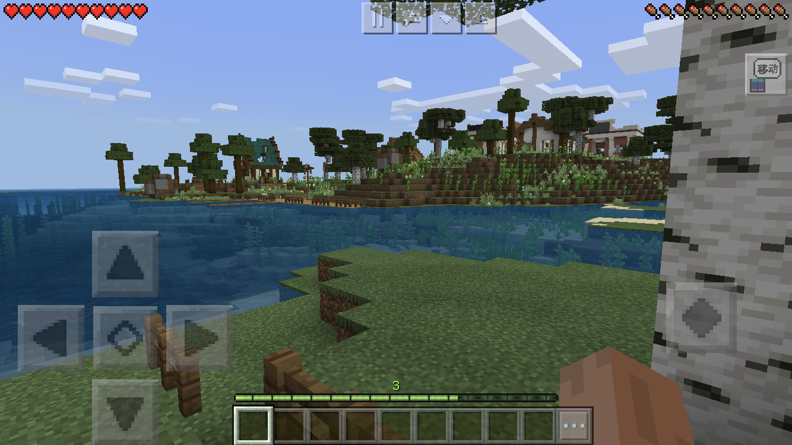

# 将作品上传至云端

在开发者内容管理平台点击**发布新资源**可以上传一个新作品，填入基本的信息并保存后，可以看到**自测**功能，点击就可以提交自测；

如果收到了邮件显示自测提交成功就可以啦。

## 下载自测包在手机上进行测试

点击开发者内容管理平台上方的**测试版启动器下载**，根据提示和教程在手机上下载测试软件。

下载好后打开软件并登录账号，就可以在资源中心找到刚才提交自测的作品，下载并进入到游戏中就可以实际测试啦！

