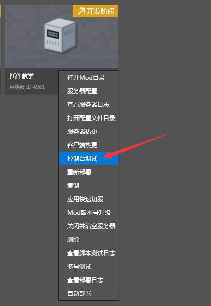
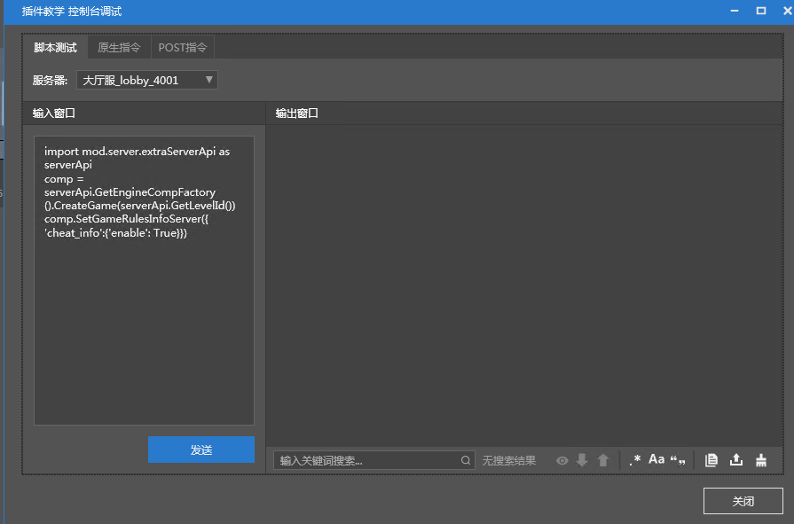
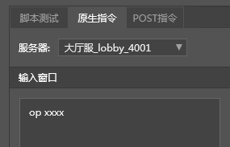

# OP权限

本节将介绍如何在Apollo中给指定玩家设置OP权限，以方便后续测试。

1. 对网络服右键，选择控制台调试。

   

2. 在脚本测试下，选择服务器（这里以lobby为例），输入以下代码，点击发送。

   ```python
   import mod.server.extraServerApi as serverApi
   comp = serverApi.GetEngineCompFactory().CreateGame(serverApi.GetLevelId())
   comp.SetGameRulesInfoServer({'cheat_info':{'enable': True}})
   ```

   **这么做就可以将Apollo的子服开启允许作弊，OP才能使用作弊命令。否则就算拥有OP权限，执行OP命令也会被服务器拦截。**

   

3. 在原生指令下，选择服务器(这里以lobby为例)，输入```op 玩家名```。

   

完成以上操作，即可在游戏中使用作弊命令。

## 注意事项

但是上方操作重新部署后会失效，后期可以自行制作插件，在服务器启动时执行上方代码，即可保持开启作弊模式。

