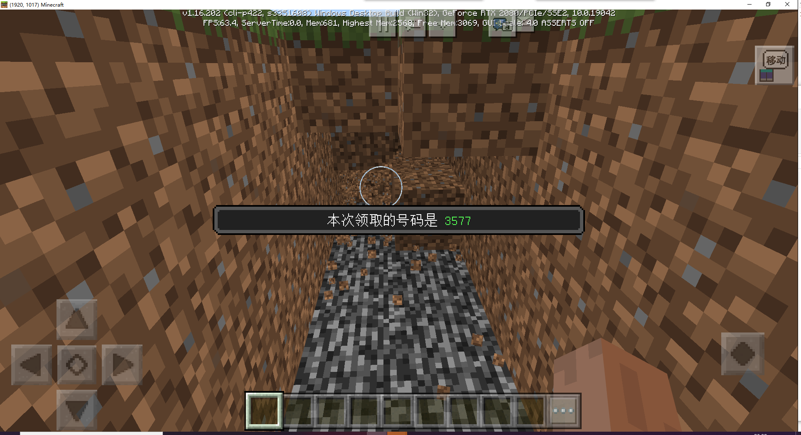

# 插件二次开发

在本节，我们将会修改之前写好的插件，对其进行二次开发。

## 需求

使用之前的抽奖插件，改造一个挖宝插件。

> 前一天20：01~当天20：00是挖宝时间。玩家破坏泥土方块有10%概率获得1个号码，每日每名玩家最多获得3个号码。每日20：00开奖，通过邮件（官方neteaseAnnounce插件中包含）告知中奖玩家并发放奖励。

- 废弃原插件输入cp1领取号码的功能
- 玩家可在game服破坏泥土方块，有10%概率获得号码，若成功获得，用官方neteaseAlert插件提示“本次领取的号码是%s”
- 奖励号码每日开奖后重置，玩家可重新通过破坏泥土方块获得号码。
- 若超过当日可领取的上限：3，不能再通过挖掘泥土方块获得号码。
- 每日开奖时间之前（上一天的20：01~当天20：00），输入cp2可查询已领取的号码。
- 官方neteaseAlert插件提示已领取的号码情况“今日已领取%s（数量）个号码：%s、%s、%s”
- 若玩家获得号码6666，可在发奖时领到特别大奖。
- 从1~10000中随机抽取5个号码作为本期中奖号码。（抽取的号码不含6666）
- 获得特别大奖者的邮件提示：恭喜你获得本期特别大奖！邮件附件内容：绿宝石*100
- 本期没有玩家获得特别大奖——本期中奖号码：%s、%s、%s、%s、%s。恭喜你，在本期抽奖活动中中奖，请再接再厉。邮件附件内容：黑曜石*5
- 本期有玩家获得特别大奖——本期特别大奖由%s获得。另外本期中奖号码：%s、%s、%s、%s、%s。恭喜你，在本期抽奖活动中中奖，请再接再厉。邮件附件内容：黑曜石*5
- 本期没有玩家获得特别大奖——本期中奖号码：%s、%s、%s、%s、%s。很遗憾，在本期抽奖活动中您未能中奖，请继续努力。邮件附件内容：铁锭*3
- 本期有玩家获得特别大奖——本期特别大奖由%s获得。另外本期中奖号码：%s、%s、%s、%s、%s。很遗憾，在本期抽奖活动中您未能中奖，请继续努力。邮件附件内容：铁锭*3
- 当天没有领取任何号码的玩家无需发放邮件。

## 制作

### 修改

根据需求，我们首先需要删除cp1的相关监听。

然后监听破坏泥土方块事件，完成获取号码的相关逻辑。

并修改开奖的逻辑，判断是否有玩家获得超级大奖。

### 注意事项

由于我们需要同时筛选数据表中的lottery和number列，来查找是否有玩家获取了超级大奖。

之前的索引并未覆盖到这两列，所以我们需要更新一下mod.sql，增加一个索引。

SQL语句如下

```sql
# 增加索引
ALTER TABLE `soldierLotteryPlayer`
    ADD UNIQUE INDEX `lottery_number`(`lottery`, `number`) USING BTREE COMMENT '彩票id和彩票号码的索引';
```

### 下载

修改了相关代码后的插件下载地址:

[二次开发的彩票插件](https://g79.gdl.netease.com/pluginguide04-08.zip)（含service与lobby/game部分）。


## 测试

在game服中挖掘泥土，可以看到有概率成功领取到号码。



测试开奖，与预期一致


