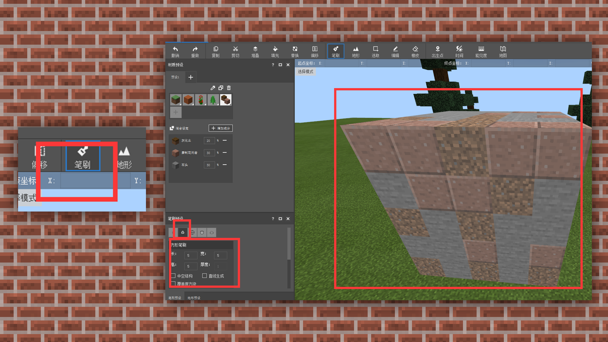
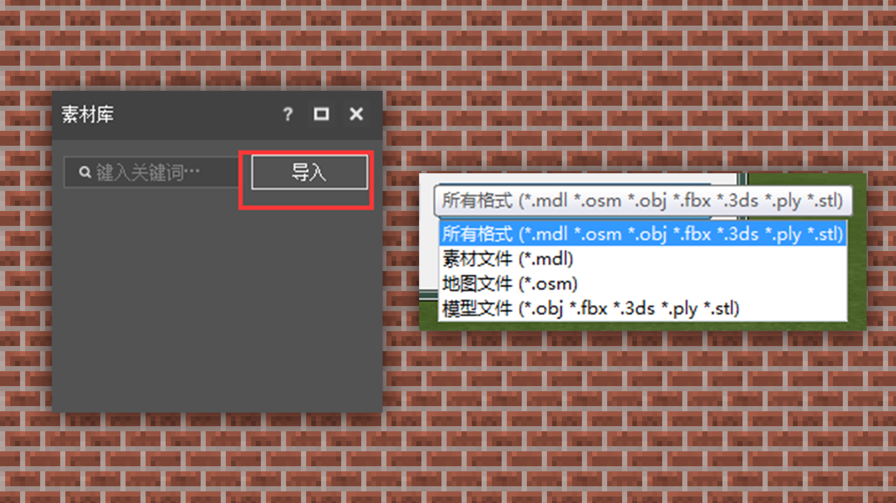

# 建筑工具的选择，以MCStudio为例进行简单介绍

#### TAG：建筑工具 MCStudio

#### 作者：上古之石

 

#### —建筑工具的选择，以MCStudio为例进行简单介绍

目前，最通常使用的建筑工具有：官方开发者工具MCStudio中的地图编辑器、客户端嵌入的创世神插件和笔刷等等，都可以作为建筑辅助的软件。

MCStudio：这是一款集合型的官方开发工具，在工具的地图编辑器中，将地形、创世神、笔刷三合一，是十分便利的集合性建筑辅助工具。

地图编辑器的界面分成了6大块：【菜单栏】+【工具栏】+【材质信息】+【笔刷信息】+【素材信息】+【预览界面】

【菜单栏】：对于各类编辑器进行选择、跳转。

【工具栏】：所有基础工具选择，包括保存、游戏内测试等功能都在其中。

【材质信息】：该位置会展现详细的方块信息，我们可以在此添加常用的建筑方块，也能进行混合方块的比例填补设置。

【混合填充】：可以使用混合方块，设置每个方块的数值比例进行随机填充，总和比例不能超过100%。选择增加成分—选择一个你想要混合的材质。

这边选择了三个方块进行混合，分辨设置成20%、30%、50%。

设置好后选择笔刷—选择方块图形，就可以看到混合比例的效果啦。

【笔刷信息】：笔刷工具中包含了地形预设，它拥有不同的笔头绘制出不同造型体块。笔刷方便润滑地形的边缘过渡，可以让地形或者是房屋表面效果更加自然。

【素材信息】：在素材模块中，我们可以将一些其他的建筑或模型，通过obj、fbx等常见格式，直接导入到现地图中使用和编辑。是一个十分方便快捷的操作。

【预览界面】：指对建筑效果的直接预览，可以实时看到建筑成品的预览效果、坐标、选区区块的起点/终点坐标，以及物品的尺寸坐标，方便开发者进行及时的编辑操作。

