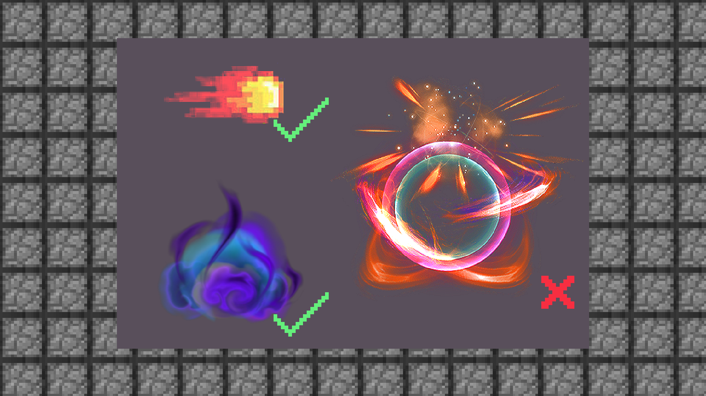

# 1.3特效制作的思路及规范介绍

#### TAG：特效 思路 规范

#### 作者：上古之石

#### 特效制作的思路及规范介绍

当选择了一款合适自己的特效软件后，我们就要开始学习特效的制作思路啦。
一般而言我们的设计可以从打草稿开始，当然也可以直接用大家习惯的方法进行绘制。

#### 一般2D特效思考的思路如下：

构思效果→手绘草稿→理清图层顺序→软件起稿→确定样式→开始上色→动态链接→确认导出→转换成各类格式

#### 而3D特效则会更加复杂：

构思效果→手绘草稿→理清图层顺序→软件起稿→确定样式→引擎起稿制作→挂钩制作各类效果→粒子渲染→动画链接制作→设置基础代码→成品确认导出→转换成各类格式

所以一般建议大家先从2D制作开始，理顺思路再去尝试3D进阶。

#### 制作规范

清楚了制作的思路流程，那么对于特效的制作规范我们也需要多注意。
首先特效色彩不建议过于艳丽，除非游戏有特殊需求，不然过渡艳丽的特效会在游戏里面有丢失和撕裂贴图的可能。

其次制作MC风格的游戏特效的时候，我们一定要多注意像素质感问题。如果mod原生比较写实那么特效也可以贴近写实风格，但如果是单纯的像素风，那就需要手绘像素风格会更贴近mod游戏风格。这里的思路主要跟随风格一体化来思考，是很多新手朋友都会忽视的地方。

再来就是制作特效时，我们建议使用透明背景。

若导出成品时没有去掉背景的话，导入游戏时就会产生错误。Ps：灰白格就是透明图层，千万不要以为这个有背景哦~ 

