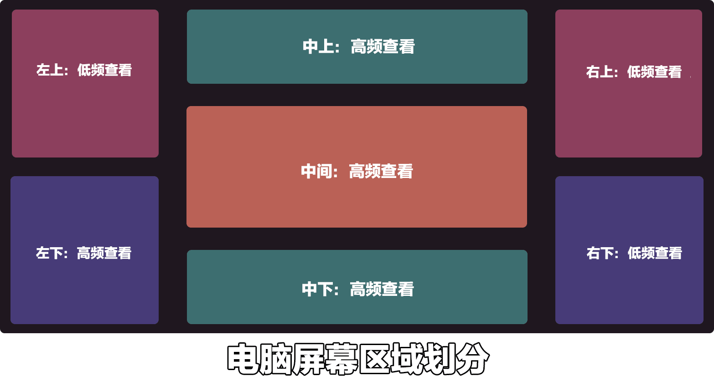

# 电脑端的UX设计标准

## 屏幕不同区域的不同定位

电脑版玩家相对手游玩家区域划分的更加随意，无论是高频查看还是低频查看，只要这块有添加新的UI，玩家就会注意到。也能很快的适应把某块低频查看区域变成高频查看区域的改变。所以开发者只要在不遮挡原版UI的前提下，整个屏幕都是可以进行UI布置的。

### 中间：高频查看

中间是玩家会去高频率看的区域，因为玩家主要的视觉中心都是在正中心，所以正中心不适合做特别大范围的常驻不透明UI，这类UI会完全的遮挡住玩家的游戏视野，导致玩家无法看清前方的游戏内容。

### 中下/上：高频查看

中下是快捷物品栏和血量显示的地方，玩家会经常查看以确认自身状态，所以这块是玩家习惯进行查看的区域，如果有和玩家属性相关且需要玩家高频查看的内容，可以放在这块区域。

中上区域也是玩家比较容易注意到的区域，这块区域在原版一般是用来显示BOSS血条的，所以中上这块区域很适合显示一些小体量的游戏信息。

### 左/右下角：高频/低频查看

游戏的左下角是聊天框，如果是联机模式会经常有信息弹出，所以玩家会较为平凡的查看左下角内容，此处不宜做大范围遮挡的UI，可能会导致玩家无法获取最新的聊天信息。

右下角目前仅用作显示声音，大部分玩家都不会开启，所以查看的频率并不是很高，较为适合开发者用来放置一些不需要时刻查看的菜单按钮。

### 左右上角：低频查看

左右上角以原版来说是没有什么太多内容的，右上角会在玩家被buff影响后增加一些buff图标需要注意一下。左右上角很适合添加一些较大范围的UI，而且这些UI不会过分的遮挡住玩家的游戏内容。

## 常见UI推荐放置位置

### 一级菜单按钮：右下左下

左下和右下都是原版UI相对使用较少的区域，相比于左下，右下更加适合添加一些彩蛋按钮显示在那里。

电脑的菜单图标最好可以直接在图标上留下对应的按键，这样玩家可以直接通过图标就能了解到按什么键就能打开想要的UI界面。

### 玩家属性信息：左上/快捷物品栏上方

玩家的属性信息也是属于需要玩家高频查看的内容，所以属性信息最好放置在玩家会经常查看的区域，较为复杂的属性合集可以放置在左上角，左上角相对快捷物品栏上方可以放置更加复杂的图案也不会挡住视线。

### 小地图：右上/左上

小地图占位面积较大，通常是放置比较空白的区域，而右上左上都是非常不错的位置，方便玩家随时查看自身位置又不会照成过多的遮挡。

### 技能按钮：左侧/快捷物品栏上方

左侧相对右侧更适合是因为右侧可能会被buff图标遮挡，而左侧仅有聊天框，并且可以调整聊天框高度，所以并不会遮挡住技能图标。

快捷物品栏上方也是可以放置技能图标的，和左侧一样，都是玩家会经常关注的区域，所以可以更好的观察技能冷却时间等信息。

## 常见需要注意的问题

### 不同分辨率的适配

电脑端大部分人游戏都是实用窗口化游戏，而窗口是可以进行拉伸的，所以电脑是可能出现任何比例的游戏窗口的，我们在定位一个UI位置时最好是以当前屏幕长宽进行定位。

图标的大小不建议随着不同分辨率进行大小缩放，如果随着大小可能会导致图案被压缩拉伸到失真，应该让图标随着窗口进行重新排列，比如大屏幕时是一排图标，小屏幕是自适应成两排图标。

### 我的世界原版的按键绑定（需要避开）

我的世界原版已经占用了不少按键，除非功能覆盖，比如我们希望玩家打开背包后不是打开原版的背包UI，而是打开我们组件的背包UI，这样我们可以进行按键覆盖，大部分情况下我们的按键都应该和原版的按键不冲突。

### 推荐的自定义按键交互绑定

技能按键推荐：技能属于需要高频率去点击的按键，应该尽量距离ASDW方向键近一些，这样可以方便玩家进行操作，比如R/T/G/H/Z/X/C/V。

一些功能菜单键，这类按键玩家并不需要频繁的操作，所以这类按键我们应该尽量设置在较远的距离，而且尽量和长按的按钮相隔一个按键，这样可以防止玩家误触。所以有关功能菜单键我们推荐U/I/O/P/J/K/L/N/M。

### HUD界面不要使用鼠标操作

在端游里面，HUD界面内容都是由按键操作，在HUD界面尽量不要设计需要鼠标点击才能进行点击的操作，GUI内的操作则可以使用鼠标操作。

### 像常见的游戏学习（降低玩家的学习成本）

电脑端上可以参考的成熟作品非常多，只需要根据自己组件的类型选择成熟的大型端游进行学习即可达到一个不错的设计效果。