# 枪械制作

> 温馨提示：开始阅读这篇指南之前，我们希望你对《我的世界》基岩版附加包有一定了解，有能力撰写 JSON 数据格式，并能够独立阅读《我的世界》开发者官网-开发指南或其他技术引用文档。

本文将帮助你添加一个自定义的枪械，包含了界面的相关文件。

本文假定你熟悉 Molang、渲染控制器、动画和实体定义有基本的了解。本文不涉及美术资源的相关教程，如果对此感兴趣的同学可以自行学习和了解。

在本教程中，您将学习以下内容。

- ✅枪械的制作；
- ✅第一人称显示手臂的两种方式；
- ✅枪械 UI 的搭建；

## 成果展示

我们在本节课中将要制作一个带有开火特效，第一、第三人称动画完整，并且附带人物手臂显示和界面的自定义枪械：

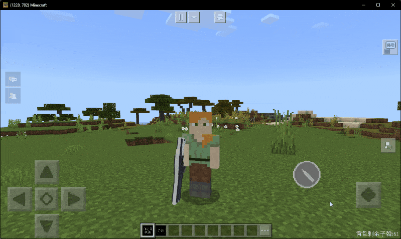

## 制作枪械

换个角度来看，枪械就是更复杂一些的 3D 武器罢了。这里比较**推荐**使用方法一（请查看「制作 3D 武器章节」）来制作枪械，因为这会方便我们制作动画，以及节省我们编写和调试 attachable 文件的时间，还有一些额外的好处。

以下是一个枪械所需要的基本文件目录结构（不包含 ui 和贴图文件）和相应的说明：

```text
├─behavior_packs
│  └─tutorial_b
│      ├─entities
│      │      tutorial_custom_gun_bullet_projectile.json		      → 子弹抛射物
│      │
│      ├─netease_items_beh
│      │      tutorial_custom_gun.json                                → 自定义枪械物品
│      │      tutorial_custom_gun_bullet.json                         → 子弹物品定义
│      │
│      └─tutorialScripts                                              → 代码
│
└─resource_packs
    └─tutorial_r
        ├─animations
        │      tutorial_custom_gun.animation.json                     → 自定义枪械动画
        │      tutorial_custom_gun_bullet_project.animation.json      → 子弹抛射物的动画
        │
        ├─animation_controllers
        │      tutorial_custom_gun.animation_controllers.json         → 枪械动画控制器
        │
        ├─entity
        │      tutorial_custom_gun_bullet_projectile.entity.json      → 子弹抛射物的渲染器定义
        │
        ├─models
        │  └─entity
        │          tutorial_custom_gun.geo.json                       → 自定义枪械骨骼
        │          tutorial_custom_gun_bullet_projectile.geo.json     → 子弹抛射物骨骼
        │
        ├─netease_items_res
        │      tutorial_custom_gun.json
        │      tutorial_custom_gun_bullet.json
        │
        ├─particles
        │      gun_fire.particle.json                                 → 开火特效
        │
        └─render_controllers
               player.render_controllers.json                         → 原版玩家渲染控制器，主要用来修改第一人称下的右臂显示
               tutorial_custom_gun.render_controllers.json            → 自定义枪械控制器
```

让我们开始吧。

### 显示手臂的两种方法

为什么先来介绍这个呢，因为这涉及到我们对于模型和动画的处理。总体思路有两种：

[第一种](https://mc.163.com/dev/mcmanual/mc-dev/mcguide/20-%E7%8E%A9%E6%B3%95%E5%BC%80%E5%8F%91/15-%E8%87%AA%E5%AE%9A%E4%B9%89%E6%B8%B8%E6%88%8F%E5%86%85%E5%AE%B9/1-%E8%87%AA%E5%AE%9A%E4%B9%89%E7%89%A9%E5%93%81/9-%E8%87%AA%E5%AE%9A%E4%B9%893D%E7%89%A9%E5%93%81/3-%E8%87%AA%E5%AE%9A%E4%B9%893D%E6%AD%A6%E5%99%A8%E6%94%BB%E5%87%BB%E6%95%88%E6%9E%9C%EF%BC%88%E4%B8%8A%EF%BC%89.html?catalog=1)：为第一人称单独建一个带玩家手臂的模型，然后让手臂继承原版的 uv 继承，让手臂使用原版玩家的贴图。原理大概如下：

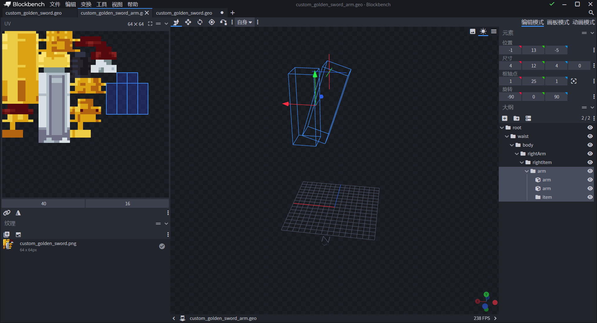

第二种：用动画控制原版的手臂并让其在第一人称下显示。

我们这里也是使用的第二种方法，毕竟第一种需要对美术有要求。

我们先来说一下第二种方法的原理。我们可以先了解一下原版第一人称**不显示手臂的原因**，观察原版的 `player.render_controller.json` 文件：

```json
{
  "format_version": "1.8.0",
  "render_controllers": {
    "controller.render.player.first_person": {
      "geometry": "Geometry.default",
      "materials": [ { "*": "Material.default" } ],
      "textures": [ "Texture.default" ],
      "part_visibility": [
        { "*": false },
        { "rightArm": "query.get_equipped_item_name(0, 1) == '' || query.get_equipped_item_name(0, 1) == 'map'" },
        { "rightSleeve": "query.get_equipped_item_name(0, 1) == '' || query.get_equipped_item_name(0, 1) == 'map'" },
        { "leftArm": "(query.get_equipped_item_name(0, 1) == 'map' && query.get_equipped_item_name('off_hand') != 'shield') || (query.get_equipped_item_name('off_hand') == 'map' && !query.item_is_charged) || (!query.item_is_charged && (variable.item_use_normalized > 0 && variable.item_use_normalized < 1.0))" },
        { "leftSleeve": "(query.get_equipped_item_name(0, 1) == 'map' && query.get_equipped_item_name('off_hand') != 'shield') || (query.get_equipped_item_name('off_hand') == 'map' && !query.item_is_charged) || (!query.item_is_charged && (variable.item_use_normalized > 0 && variable.item_use_normalized < 1.0))" }
      ]
    },
```

可以看到，只有在不拿物品或者拿着指定物品时，左右手臂才会显示。这意味着我们可以通过修改原版的控制器，再配合动画，就可以在第一人称显示手臂了。

### 添加基础文件

首先基础物品的定义都很简单，一个子弹物品，记得设置 `max_stack_size` 为 64；另一个自定义枪械记住添加以下组件就 OK：

```json
"netease:show_in_hand": {
    "value": false
},
```

我们直接进入到模型的制作。对齐原版的骨骼制作好一个基础的模型文件（当然位置也要对齐）：

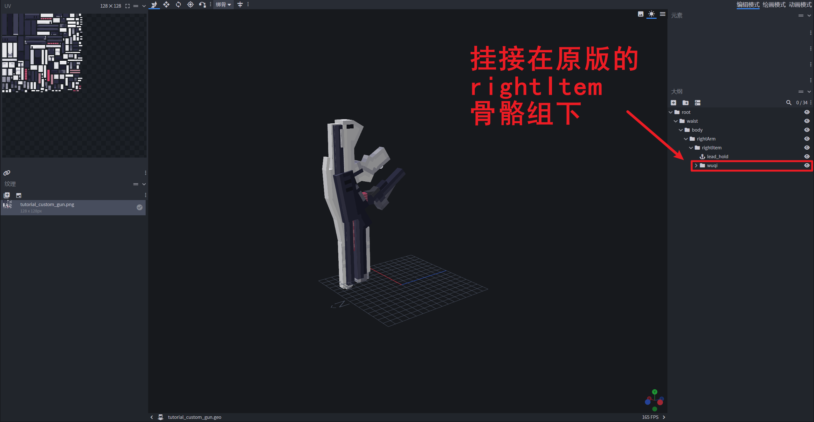

由于我们需要挂接开火的特效，所以模型上还需要额外添加上两个定位器：

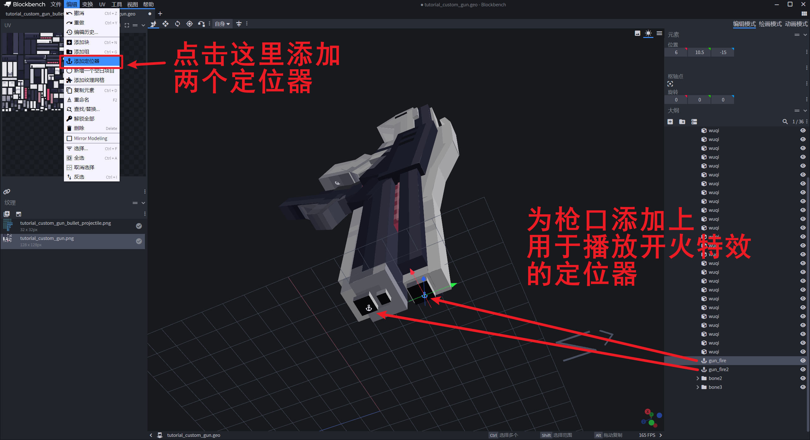

然后准备一个简单的激光子弹模型：

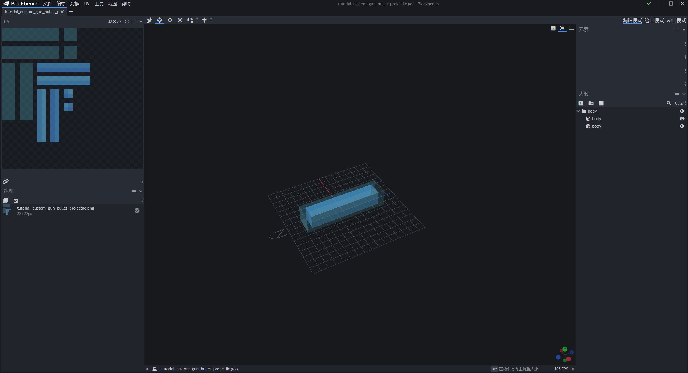

### 开火特效

我们先使用原版的粒子贴图来制作一个开火特效，起因是我们发现原版的贴图中有一排很适合用来模拟开火特效的粒子贴图：

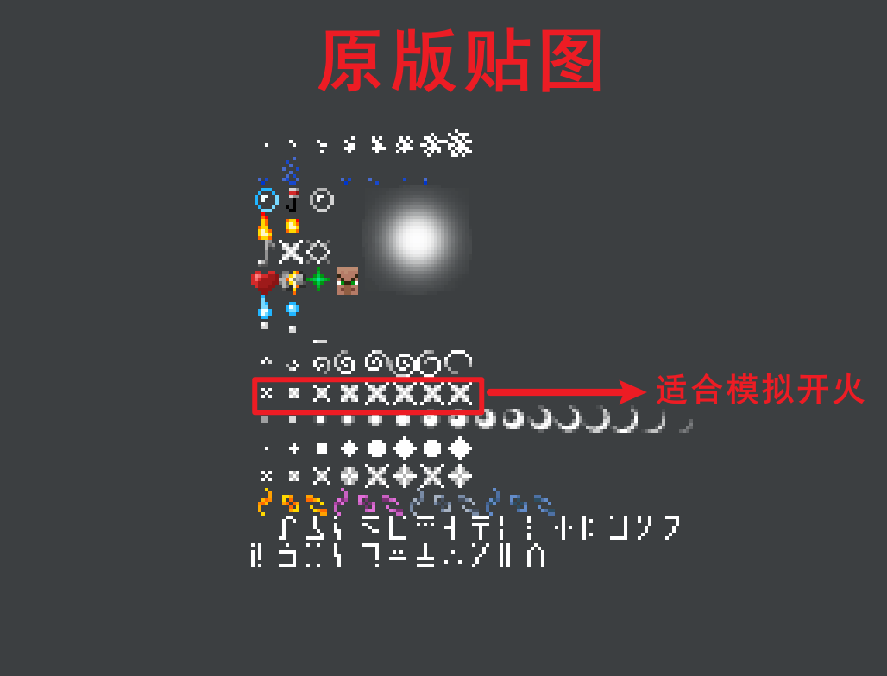

简单弄一下效果：

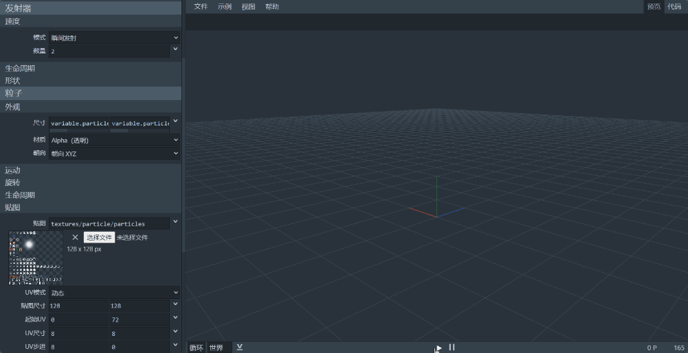

关于原版特效的创建与导入可参考[原版特效创建与导入](https://mc.163.com/dev/mcmanual/mc-dev/mcguide/16-美术/9-特效/20-原版特效创建与导入.html?catalog=1)

特效文件如下：

```json
{
	"format_version": "1.10.0",
	"particle_effect": {
		"description": {
			"identifier": "tutorial:gun_fire",
			"basic_render_parameters": {
				"material": "particles_alpha",
				"texture": "textures/particle/particles"
			}
		},
		"components": {
			"minecraft:emitter_local_space": {
				"position": true,
				"rotation": true
			},
			"minecraft:emitter_rate_instant": {
				"num_particles": 2
			},
			"minecraft:emitter_lifetime_expression": {
				"activation_expression": 0.1
			},
			"minecraft:emitter_shape_point": {},
			"minecraft:particle_lifetime_expression": {
				"max_lifetime": 0.1
			},
			"minecraft:particle_initial_spin": {
				"rotation": "Math.random(-200, 200)",
				"rotation_rate": "Math.random(-200, 200)"
			},
			"minecraft:particle_initial_speed": 0,
			"minecraft:particle_motion_dynamic": {},
			"minecraft:particle_appearance_billboard": {
				"size": ["variable.particle_random_1 * 0.3 + variable.particle_age", "variable.particle_random_1 * 0.3 + variable.particle_age"],
				"facing_camera_mode": "lookat_xyz",
				"uv": {
					"texture_width": 128,
					"texture_height": 128,
					"flipbook": {
						"base_UV": [0, 72],
						"size_UV": [8, 8],
						"step_UV": [8, 0],
						"frames_per_second": 4,
						"max_frame": 8,
						"stretch_to_lifetime": true
					}
				}
			},
			"minecraft:particle_appearance_tinting": {
				"color": {
					"interpolant": "variable.particle_age / variable.particle_lifetime",
					"gradient": {
						"0.0": "#FFE2D51E",
						"0.21": "#FFF7F5EC",
						"0.41": "#FFC12807",
						"1.0": "#FFB94C02"
					}
				}
			}
		}
	}
}
```

### 动画文件

我们先来准备一个用于制作动画的模型，复制一份原版的玩家模型，然后导入我们的自定义枪械模型，删除贴图：

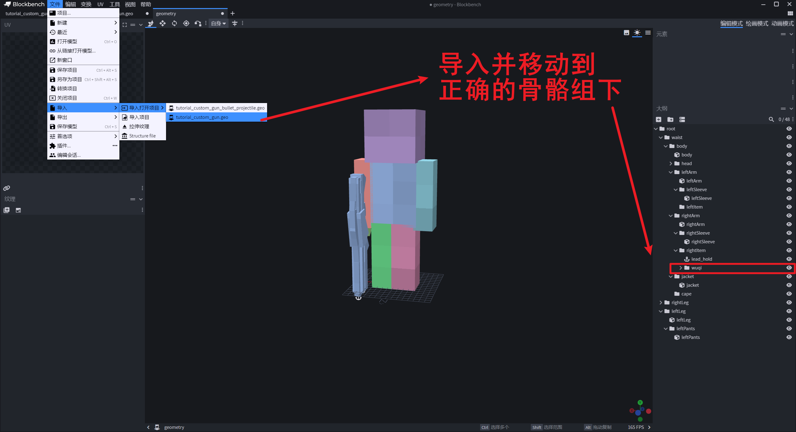

#### 第三人称动画

由于骨骼完美继承玩家，所以第三人称就不需要有对齐的动画了，只需要一个攻击动画。

我们来简单弄一个抬手开火的动画：

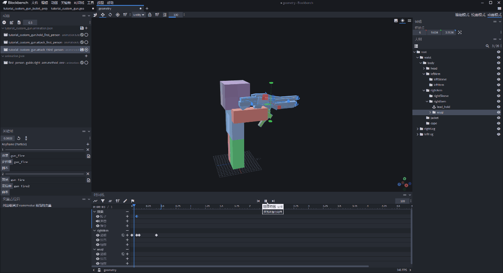

这里的特效需要用到制作模型时加入的定位器：

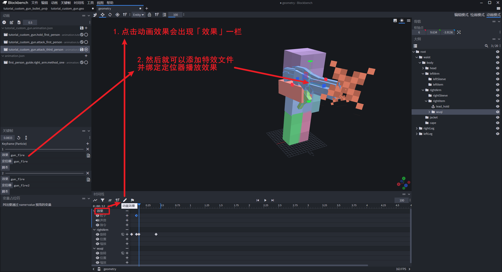

可以直接在 BlockBench 中看到效果，还是非常方便的。

另外由于我们手持物品时，原版默认有一个小小的抬起，所以动画这里要设置成覆盖：

```json
// 因为原版手持物品时，手臂有一个向上抬起的偏移量，这里需要覆盖掉
"override_previous_animation": true,
```

#### 第一人称动画

第一人称需要两个动画：手持动画和攻击动画。

正如我们第一节课中说的那样，需要先模拟游戏中第一人称的视角，这需要一个动画：

```json
{
	"format_version": "1.8.0",
	"animations": {
		"animation.first_person_guide.right_arm.method_one": {
			"loop": true,
			"bones": {
				"rightArm": {
					"rotation": [95, -45, 115],
					"position": [13.5, -10, 12]
				},
				"rightItem": {
					"position": [0, 0, -1]
				}
			}
		}
	}
}
```

和一个固定的相机视角：

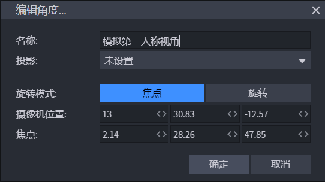

然后在播放上述动画的情况下，把除了 `rightArm` 之外的骨骼全部隐藏掉，k 我们自己的第一人称手持动画就可以了：

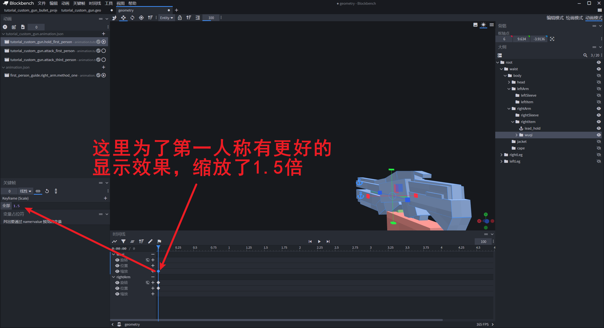

攻击动画建议直接先**复制**第三人称攻击动画的节点，主要是对齐动画发生的时间节点，然后再在播放「手持动画」和「第一人称模拟动画」之后对着第三人称动画 k 就行了：

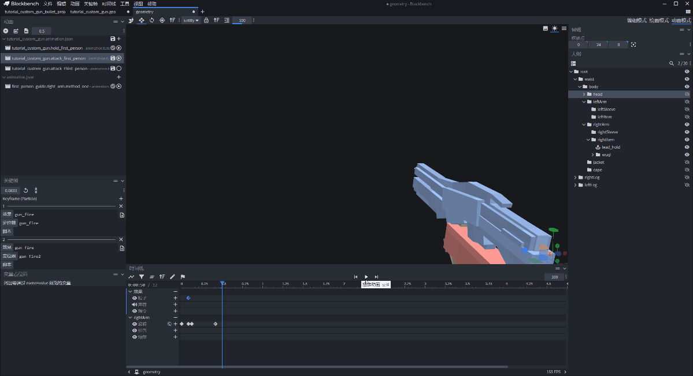

### 动画控制器

准备两个动画控制器，分别在第一人称和第三人称的情况下控制播放不同的动画，没什么好说的，除了播放的动画名称不一样，其余都相同，完整文件如下：

```json
{
    "format_version": "1.10.0",
    "animation_controllers": {
        "controller.animation.custom_gun_first_person": {
            "initial_state": "default",
            "states": {
                "default": {
                    "transitions": [
                        {
                            "first_person_attack1": "query.mod.custom_gun_attack == 1.0"
                        }
                    ]
                },
                "first_person_attack1": {
                    "animations": [
                        "custom_gun_attack_first_person"
                    ],
                    "transitions": [
                        {
                            "default": "query.any_animation_finished && query.mod.custom_gun_attack == 0.0"
                        }
                    ]
                }
            }
        },
        "controller.animation.custom_gun_third_person": {
            "initial_state": "default",
            "states": {
                "default": {
                    "transitions": [
                        {
                            "third_person_attack1": "query.mod.custom_gun_attack == 1.0"
                        }
                    ]
                },
                "third_person_attack1": {
                    "animations": [
                        "custom_gun_attack_third_person"
                    ],
                    "transitions": [
                        {
                            "default": "query.any_animation_finished && query.mod.custom_gun_attack == 0.0"
                        }
                    ]
                }
            }
        }
    }
}
```

这里的 `query.mod.custom_gun_attack` 是需要后续在代码中注册和设置的自定义变量。

### 渲染器

这里我们需要先把原版的 `player.render_controllers.json` 复制到我们的项目中（`_r\render__controllers\` 目录下），然后进行改造：

```json
{
  "format_version": "1.8.0",
  "render_controllers": {
    "controller.render.player.first_person": {
      "geometry": "Geometry.default",
      "materials": [ { "*": "Material.default" } ],
      "textures": [ "Texture.default" ],
      "part_visibility": [
        { "*": false },
        // 修改原版渲染器，让它支持在手持自定义枪械时，显示右手臂
        { "rightArm": "query.get_equipped_item_name(0, 1) == '' || query.get_equipped_item_name(0, 1) == 'map' || query.get_equipped_item_name(0, 1) == 'custom_gun'" },
        { "rightSleeve": "query.get_equipped_item_name(0, 1) == '' || query.get_equipped_item_name(0, 1) == 'map' || query.get_equipped_item_name(0, 1) == 'custom_gun'" },
        { "leftArm": "(query.get_equipped_item_name(0, 1) == 'map' && query.get_equipped_item_name('off_hand') != 'shield') || (query.get_equipped_item_name('off_hand') == 'map' && !query.item_is_charged) || (!query.item_is_charged && (variable.item_use_normalized > 0 && variable.item_use_normalized < 1.0))" },
        { "leftSleeve": "(query.get_equipped_item_name(0, 1) == 'map' && query.get_equipped_item_name('off_hand') != 'shield') || (query.get_equipped_item_name('off_hand') == 'map' && !query.item_is_charged) || (!query.item_is_charged && (variable.item_use_normalized > 0 && variable.item_use_normalized < 1.0))" }
      ]
    },
```

主要的变动就是在 `rightArm` 和 `rightSleeve` 的条件中，加入了手持自定义枪械的 Molang。

然后就是新增一个自定义枪械的渲染器（`tutorial_custom_gun.render_controllers.json`）：

```json
{
    "format_version": "1.8.0",
    "render_controllers": {
        "controller.render.tutorial_custom_gun": {
            "geometry": "Geometry.custom_gun",
            "materials": [{"*": "Material.default"}],
            "textures": ["Texture.custom_gun"]
        }
    }
}
```

### 子弹抛射物

行为包完整文件如下：

```json
{
    "format_version": "1.13.0",
    "minecraft:entity": {
        "description": {
            "is_experimental": false,
            "identifier": "tutorial:custom_gun_bullet_projectile",
            "is_spawnable": false,
            "is_summonable": false
        },
        "component_groups": {
        },
        "components": {
            "minecraft:despawn": {
                "despawn_from_distance": {}
            },
            "minecraft:physics": {},
            "minecraft:projectile": {
                "on_hit": {
                    "remove_on_hit": {},
                    "impact_damage": {
                        "catch_fire": false,
                        "knockback": true,
                        "damage": 4,
                        "destroy_on_hit": true
                    }
                },
                "gravity": 0.0,
                "power": 1.0,
                "offset": [
                    0,
                    0,
                    0
                ]
            },
            "minecraft:collision_box": {
                "width": 0.31,
                "height": 0.31
            },
            "netease:custom_entity_type": {
                "value": "projectile_entity"
            },
            "minecraft:pushable": {
                "is_pushable_by_piston": true,
                "is_pushable": true
            }
        },
        "events": {
        }
    }
}
```

重点还是添加上网易的组件，标识上这个实体是一个抛射物：

```json
"netease:custom_entity_type": {
    "value": "projectile_entity"
},
```

资源包的 `.entity.json` 文件定义也很简单：

```json
{
    "format_version": "1.10.0",
    "minecraft:client_entity": {
        "description": {
            "identifier": "tutorial:custom_gun_bullet_projectile",
            "materials": {
                "default": "entity_alphatest"
            },
            "textures": {
                "default": "textures/entity/tutorial_custom_gun_bullet_projectile"
            },
            "geometry": {
                "default": "geometry.tutorial_custom_gun_bullet_projectile"
            },
            "animations": {
                "move": "animation.tutorial_custom_gun_bullet_projectile.move"
            },
            "scripts": {
                "animate": [
                    "move"
                ]
            },
            "render_controllers": [
                "controller.render.default"
            ]
        }
    }
}
```

这里的 `move` 动画，是一个固定的动画，让子弹抛射物的根骨骼（这里是 `body`）执行下列文件就行：

```json
{
    "format_version": "1.8.0",
    "animations": {
        "animation.tutorial_custom_gun_bullet_projectile.move": {
            "loop": true,
            "bones": {
                "body": {
                    "rotation": [
                        "-query.target_x_rotation",
                        "-query.target_y_rotation",
                        0.0
                    ]
                }
            }
        }
    }
}
```

这个动画会让抛射物始终朝向速度方向。

### 添加相关资源

我们用代码把刚才的相关资源全部注入到玩家的渲染器中：

```python
# -*- coding: utf-8 -*-
import mod.client.extraClientApi as clientApi
import time

import config

CompFactory = clientApi.GetEngineCompFactory()
gameComp = CompFactory.CreateGame(clientApi.GetLevelId())


class TutorialClientSystem(clientApi.GetClientSystemCls()):

    def __init__(self, namespace, name):
        super(TutorialClientSystem, self).__init__(namespace, name)
        self.ListenEvent()
        #
        self.mQueryVariableComp = CompFactory.CreateQueryVariable(clientApi.GetLocalPlayerId())
        self.mItemComp = CompFactory.CreateItem(clientApi.GetLocalPlayerId())
        #
        self.mCarriedItem = self.mItemComp.GetCarriedItem()  # 手持物品

    def ListenEvent(self):
        # 自定义事件
        self.ListenForEvent('tutorialMod', 'tutorialServerSystem', 'SyncCustomGunStateEvent', self, self.OnSyncCustomGunStateEvent)
        # 系统事件
        self.ListenForEvent(clientApi.GetEngineNamespace(), clientApi.GetEngineSystemName(), "AddPlayerCreatedClientEvent",
                            self, self.OnAddPlayerCreatedClientEvent)

    def OnSyncCustomGunStateEvent(self, args):
        playerId = args['playerId']
        value = float(args['value'])
        CompFactory.CreateQueryVariable(playerId).Set(config.CustomGunAttackVarName, value)

    def OnAddPlayerCreatedClientEvent(self, args):
        playerId = args['playerId']
        self.InitRender(playerId)  # 包括其他玩家也需要被初始化

    # 初始化绑定
    def InitRender(self, playerId):
        # 自定义枪械
        self._InitToCustomGun(playerId)


    # 自定义枪械初始化渲染
    def _InitToCustomGun(self, playerId):
        queryVariableComp = CompFactory.CreateQueryVariable(playerId)
        queryVariableComp.Register(config.CustomGunAttackVarName, 0)
        queryVariableComp.Set(config.CustomGunAttackVarName, 0)

        actorRenderComp = CompFactory.CreateActorRender(playerId)
        actorRenderComp.AddPlayerGeometry('custom_gun', 'geometry.tutorial_custom_gun')
        actorRenderComp.AddPlayerTexture('custom_gun', 'textures/models/tutorial_custom_gun')
        actorRenderComp.AddPlayerRenderController("controller.render.tutorial_custom_gun",
                                                  "query.get_equipped_item_name('main_hand') == 'custom_gun'")

        # 定义动画和控制器名称
        animations = ['hold_first_person', 'attack_first_person', 'attack_third_person']
        controllers = ['custom_gun_first_person', 'custom_gun_third_person']

        for anim in animations:
            animationKey = 'custom_gun_' + anim
            animationName = 'animation.tutorial_custom_gun.' + anim
            actorRenderComp.AddPlayerAnimation(animationKey, animationName)

        for controller in controllers:
            controllerKey = controller + "_controller"
            controllerName = 'controller.animation.' + controller
            actorRenderComp.AddPlayerAnimationController(controllerKey, controllerName)

        # 添加动画的触发条件
        actorRenderComp.AddPlayerScriptAnimate(
            'custom_gun_hold_first_person',
            "variable.is_first_person && query.get_equipped_item_name('main_hand') == 'custom_gun'"
        )
        actorRenderComp.AddPlayerScriptAnimate(
            'custom_gun_first_person_controller',
            "variable.is_first_person && query.get_equipped_item_name('main_hand') == 'custom_gun'"
        )
        actorRenderComp.AddPlayerScriptAnimate(
            'custom_gun_third_person_controller',
            "!variable.is_first_person && query.get_equipped_item_name('main_hand') == 'custom_gun'"
        )

        # 添加特效
        actorRenderComp.AddPlayerParticleEffect('gun_fire', 'tutorial:gun_fire')
        # 有兴趣的同学也可以尝试加一下音效

```

### 射速的实现

要实现射速，除了代码上的配合外，还需要动画也跟着加速，正好原版支持这一特性。我们只需要在动画文件中添加上神秘代码就可以：

```json
"animation.tutorial_custom_gun.attack_third_person": {
    // 实现射速
    "anim_time_update": "query.anim_time + query.delta_time * query.mod.custom_gun_attack_speed",
```

其中，前面的 `query.anim_time + query.delta_time` 是必须的，而后面的参数是可以自定义的，比如 `query.anim_time + query.delta_time * 2` 就是 2 倍速播放，`query.anim_time + query.delta_time * 1` 就是原速播放。

所以我们这里又使用了另外一个自定义变量，我们也需要在初始化的时候声明好：

```python
# 自定义枪械初始化渲染
def _InitToCustomGun(self, playerId):
    queryVariableComp = CompFactory.CreateQueryVariable(playerId)
	# 射速相关的定义
    queryVariableComp.Register(config.CustomGunAttackSpeedVarName, config.CustomGunDefaultAttackSpeed)
    queryVariableComp.Set(config.CustomGunAttackSpeedVarName, config.CustomGunDefaultAttackSpeed)
```

3 倍射速演示：

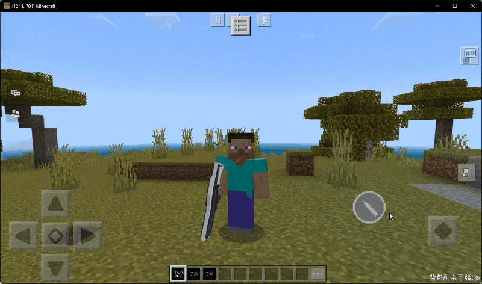

0.5 倍速演示：

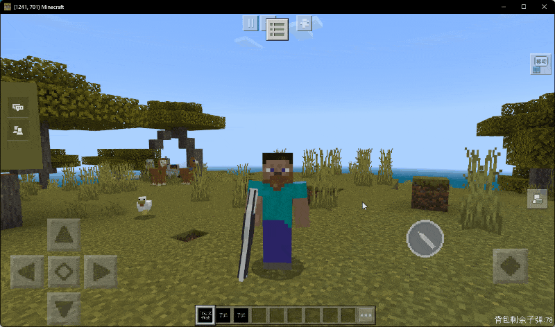

### UI 实现

UI 很简单，只需要在右下角显示当前背包中的子弹数量。然后在右下角固定一个射击按钮就可以了：

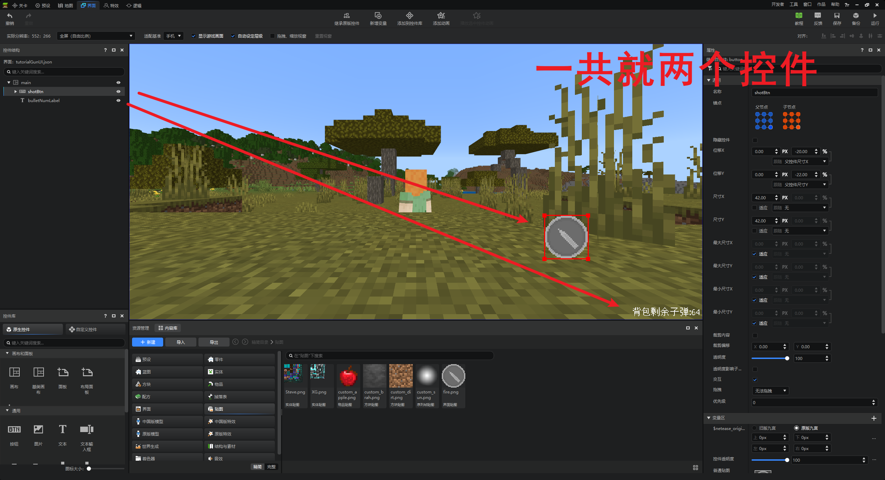

在客户端监听 `UiInitFinished` 事件之后进行注册：
```python
def OnUiInitFinished(self, args=None):
    # 注册 UI
    clientApi.RegisterUI('tutorialMod', 'tutorialCustomGunUI', 'tutorialScripts.uiScripts.UIScripts', 'tutorialGunUI.main')
    self.mCustomGunUINode = clientApi.CreateUI('tutorialMod', 'tutorialCustomGunUI', {'isHud': 1})
```

### UI 代码

首先，我们需要在手持自定义枪械的时候显示 UI，完整代码如下：

```python
# -*- coding: utf-8 -*-
import mod.client.extraClientApi as clientApi

import config

ViewBinder = clientApi.GetViewBinderCls()
ViewRequest = clientApi.GetViewViewRequestCls()
ScreenNode = clientApi.GetScreenNodeCls()

Namespace = clientApi.GetEngineNamespace()
SystemName = clientApi.GetEngineSystemName()
CompFactory = clientApi.GetEngineCompFactory()
gameComp = CompFactory.CreateGame(clientApi.GetLevelId())


#ui布局绑定
class UIScripts(ScreenNode):
    def __init__(self, namespace, name, param):
        ScreenNode.__init__(self, namespace, name, param)
        self.mPlayerId = clientApi.GetLocalPlayerId()
        self.mClientSystem = clientApi.GetSystem('tutorialMod', 'tutorialClientSystem')
        self.mItemComp = CompFactory.CreateItem(self.mPlayerId)
        self.mQueryVariableComp = CompFactory.CreateQueryVariable(self.mPlayerId)

        # 组件地址
        self.mShotBtnPath = "/shotBtn"
        self.mBulletLabelPath = "/bulletNumLabel"

        # 界面需要使用的自定义属性
        self.mFrameCnt = 0
        self.mCarriedItem = self.mItemComp.GetCarriedItem()  # 手持物品
        self.mIsBtnDown = False  # 按钮是否被按下
        self.mBtnDownFrame = 0  # 按钮按下帧数
        self.mShotSpeed = 0  # 攻击速度
        self.mAttackFrame = 0  # 攻击所需要的帧数
        self.mBulletNum = 0  # 子弹数量

    def Create(self):
        print("===== Tutorial Custom Gun UI Create Finished =====")
        # 注册按钮的事件
        control = self.GetBaseUIControl(self.mShotBtnPath).asButton()
        control.AddTouchEventParams({"isSwallow": True})
        control.SetButtonTouchDownCallback(self.OnShotBtnDown)
        control.SetButtonTouchUpCallback(self.OnShotBtnUp)
        control.SetButtonTouchMoveOutCallback(self.OnShotBtnUp)

        # 关注事件
        namespace, systemName = clientApi.GetEngineNamespace(), clientApi.GetEngineSystemName()
        self.mClientSystem.ListenForEvent(namespace, systemName, "OnCarriedNewItemChangedClientEvent", self, self.OnCarriedNewItem)

        # 刚创建时也自动触发一次
        self.OnCarriedNewItem({'itemDict': self.mItemComp.GetCarriedItem()})

    def Update(self):
        self.mFrameCnt += 1
        if self.mBtnDownFrame > 0:
            if self.mBtnDownFrame + self.mAttackFrame <= self.mFrameCnt:
                if self.mIsBtnDown:
                    # 还处于按下的状态，那么继续攻击
                    self.mBtnDownFrame = self.mFrameCnt + self.mAttackFrame
                    self._HandleAttack()
                else:
                    # 还原 query 变量
                    self.mQueryVariableComp.Set(config.CustomGunAttackVarName, 0.0)

    # region 按钮事件
    # --------------------------------------------------------------------------------------------
    def OnShotBtnDown(self, args):
        self._FreshBagBullet()
        if self.mBulletNum == 0:
            # 没有子弹不响应
            return
        self.mIsBtnDown = True
        if self.mFrameCnt >= self.mBtnDownFrame + self.mAttackFrame:
            self.mBtnDownFrame = self.mFrameCnt
            self._HandleAttack()

    def OnShotBtnUp(self, args):
        self.mIsBtnDown = False

    # endregion

    # region 事件监听
    # --------------------------------------------------------------------------------------------
    def OnCarriedNewItem(self, args):
        self.mCarriedItem = args['itemDict']
        if self._IsCarriedCustomGun():
            self._SetUIVisible(True)
            self._FreshUIData()
        else:
            self._SetUIVisible(False)

    # endregion

    # region 类函数
    # --------------------------------------------------------------------------------------------
    def _IsCarriedCustomGun(self):
        if self.mCarriedItem and self.mCarriedItem['itemName'] == 'tutorial:custom_gun':
            return True
        return False

    def _FreshUIData(self):
        # 读取攻击速度
        self.mShotSpeed = self.mQueryVariableComp.Get(config.CustomGunAttackSpeedVarName)
        self.mAttackFrame = self._GetAttackFrame()
        # 读取背包的信息，查看子弹信息
        self._FreshBagBullet()

    def _FreshBagBullet(self):
        bulletNum = 0
        allItems = self.mItemComp.GetPlayerAllItems(clientApi.GetMinecraftEnum().ItemPosType.INVENTORY)
        for _itemDict in allItems:
            if not _itemDict:
                continue
            if _itemDict and _itemDict['itemName'] == 'tutorial:custom_gun_bullet':
                bulletNum += _itemDict['count']
        self.mBulletNum = bulletNum
        self.GetBaseUIControl(self.mBulletLabelPath).asLabel().SetText("背包剩余子弹:" + str(self.mBulletNum))

    def _SetUIVisible(self, flag):
        self.SetScreenVisible(flag)

    def _GetAttackFrame(self):
        framePerSecond = 30
        return int(config.CustomGunAttackAnimDuration * (1 / float(self.mShotSpeed)) * framePerSecond)

    def _HandleAttack(self):
        animTotalTime = config.CustomGunAttackAnimDuration * (1 / float(self.mShotSpeed))
        # 原版的的等式转换一下而已
        # fireTime / float(animTotalTime) = config.CustomGunAttackAnimAttackFrame / float(config.CustomGunAttackAnimDuration)
        fireTime = config.CustomGunAttackAnimAttackFrame / float(config.CustomGunAttackAnimDuration) * float(animTotalTime)

        gameComp.AddTimer(0, self._SetAttackStateAndSyncToOtherClients, 'start')
        gameComp.AddTimer(fireTime, self._SetAttackStateAndSyncToOtherClients, 'fire')
        gameComp.AddTimer(animTotalTime, self._SetAttackStateAndSyncToOtherClients, 'end')

        # 刷新背包的子弹数
        gameComp.AddTimer(animTotalTime, self._FreshBagBullet)

    def _SetAttackStateAndSyncToOtherClients(self, state):
        # 设置本地自定义变量
        self.mQueryVariableComp.Set(config.CustomGunAttackVarName, 1.0 if state in ['start', 'fire'] else 0.0)
        # 通知其他客户端
        self.mClientSystem.NotifyToServer('SyncCustomGunAttackStateEvent', {'state': state, 'playerId': self.mPlayerId})

    # endregion
```

对代码稍微做一些解释：

- 这里面我们监听了 `OnCarriedNewItemChangedClientEvent` 而用来控制整个界面的显示与否；
- 还有一个 `_GetAttackFrame` 函数用来转换射速和游戏帧数，因为界面文件中的 Tick 函数中，一秒是 30 帧，所以这里要配合射速进行转换；
- 我们攻击状态除了设置本地之外，还需要使用事件来同步到其他客户端；
- 连发的实现思路是：1）按下之后记录按下的帧数；2）当按下之后立马处理攻击，然后等待到下一次检测帧，也就是按下帧数+攻击动画所需的帧数；3）如果此时还处于按下的状态，再次处理攻击，并重置按下的帧数；4）以此循环；

### 处理攻击

服务端代码：

```python
# -*- coding: utf-8 -*-
import math
import mod.server.extraServerApi as serverApi
from mod.common.utils.mcmath import Vector3

CompFactory = serverApi.GetEngineCompFactory()
gameComp = CompFactory.CreateGame(serverApi.GetLevelId())


class TutorialServerSystem(serverApi.GetServerSystemCls()):
    def __init__(self, namespace, name):
        super(TutorialServerSystem, self).__init__(namespace, name)
        self.ListenEvent()

    def ListenEvent(self):
        # 自定义事件
        self.ListenForEvent('tutorialMod', 'tutorialClientSystem', "SyncCustomGunAttackStateEvent", self,
                            self.OnSyncCustomGunAttackStateEvent)

    def OnSyncCustomGunAttackStateEvent(self, args):
        playerId = args['playerId']
        state = args['state']
        if state == 'fire':
            self._ShotBullet(playerId)
        else:
            relevantPlayers = CompFactory.CreatePlayer(playerId).GetRelevantPlayer([playerId])
            self.NotifyToMultiClients(relevantPlayers, 'SyncCustomGunStateEvent', {
                'playerId': playerId,
                'value'   : 1.0 if state == 'start' else 0.0
            })

    # 发射子弹
    def _ShotBullet(self, playerId):
        rot = CompFactory.CreateRot(playerId).GetRot()
        footPos = CompFactory.CreatePos(playerId).GetFootPos()
        shotPos = (footPos[0], footPos[1] + 1.25, footPos[2])
        shotPos = self._MoveForward(shotPos, rot, 1.3)
        param = {
            'power'    : 1.2,
            'gravity'  : 0,
            'position' : shotPos,
            'direction': serverApi.GetDirFromRot(rot)
        }

        projectileComp = CompFactory.CreateProjectile(playerId)
        projectileComp.CreateProjectileEntity(playerId, 'tutorial:custom_gun_bullet_projectile', param)

        self._ReduceItem(playerId, 'tutorial:custom_gun_bullet', 1)

    # 向前移动坐标
    def _MoveForward(self, pos, rot, distance):
        _rot = (0, rot[1])  # 第一个参数是上下角度，第二个是左右角度
        rx, ry, rz = serverApi.GetDirFromRot(_rot)
        return (pos[0] + rx * distance, pos[1] + ry * distance, pos[2] + rz * distance)

    def _ReduceItem(self, playerId, itemName, count):
        itemComp = CompFactory.CreateItem(playerId)
        allItems = itemComp.GetPlayerAllItems(serverApi.GetMinecraftEnum().ItemPosType.INVENTORY)
        remainingCount = count  # 剩余要减少的数量

        for slotPos, itemDict in enumerate(allItems):
            if itemDict and itemDict['itemName'] == itemName:
                item_count = itemDict['count']
                if item_count >= remainingCount:
                    itemComp.SetInvItemNum(slotPos, item_count - remainingCount)
                    return True  # 减少成功
                else:
                    itemComp.SetInvItemNum(slotPos, 0)
                    remainingCount -= item_count

        return False  # 减少失败，物品数量不足
```

由于我们在本地的界面中已经判断了物品数量是否足够，所以服务端不做特殊的处理。

唯一需要处理的就是子弹发出的初始位置，是玩家的 `footPos` 在 `y` 方向上 `+1.25` 之后，再向朝向的方向向前移动 `1.3` 的距离。

客户端唯一需要做的就是监听事件，并设置自定义变量：

```python
# -*- coding: utf-8 -*-
import mod.client.extraClientApi as clientApi
import config

CompFactory = clientApi.GetEngineCompFactory()
gameComp = CompFactory.CreateGame(clientApi.GetLevelId())


class TutorialClientSystem(clientApi.GetClientSystemCls()):

    def __init__(self, namespace, name):
        super(TutorialClientSystem, self).__init__(namespace, name)
        self.ListenEvent()

    def ListenEvent(self):
        # 自定义事件
        self.ListenForEvent('tutorialMod', 'tutorialServerSystem', 'SyncCustomGunStateEvent', self, self.OnSyncCustomGunStateEvent)

    def OnSyncCustomGunStateEvent(self, args):
        playerId = args['playerId']
        value = float(args['value'])
        CompFactory.CreateQueryVariable(playerId).Set(config.CustomGunAttackVarName, value)
```

### 进入游戏测试

至此，自定义枪械就基本完成了，就可以进入游戏进行测试了。主要是测试一下联机时候的表现如何：

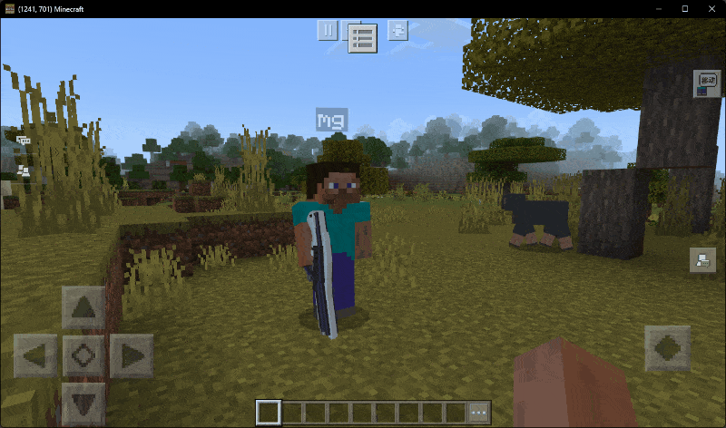

可以看到完全没问题。

## 小结

这篇文章带大家制作了一个简单的自定义枪械，主要的精力都花在了如何「开火」和「手臂显示」这两个部分。

但其实枪械还有很多地方可以优化的地方，比如：奔跑动画、换弹动画等。感兴趣的小伙伴可以自行尝试。思路完全是一样的。

另外比较重要的是学习了「**射速**」的实现，这一点特性大家可以发挥想象，其实可以运用在很多地方。

## 课后作业

本次课后作业，内容如下：

- 制作一个第一人称、第三人称动画完整，有自定义界面的自定义枪械。
- 并且支持配置「射速」这一个特性；
