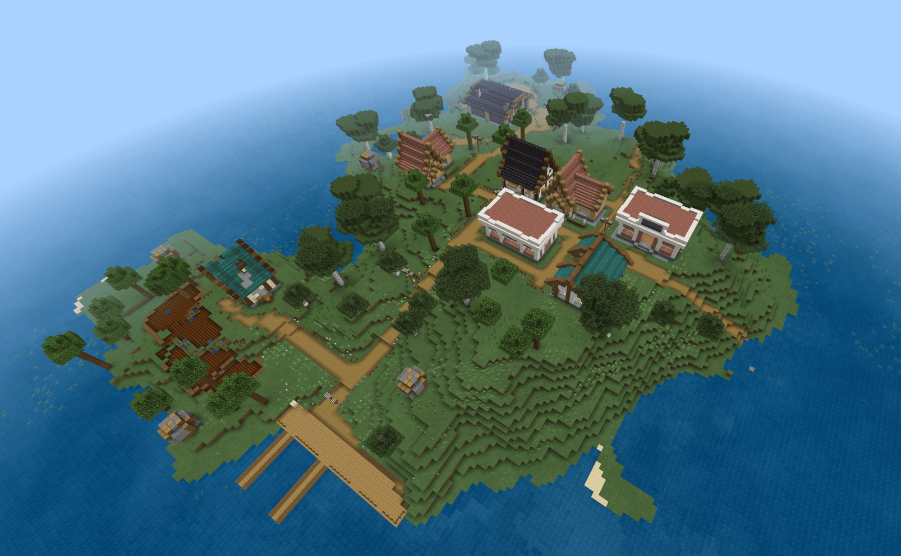
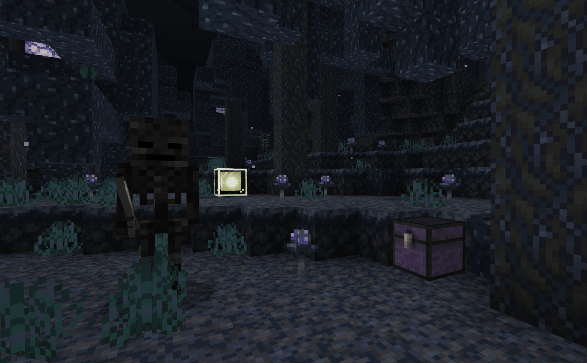

# 什么是玩法地图？

<iframe src="https://cc.163.com/act/m/daily/iframeplayer/?id=62457fab75882ab49558bcc9" width="800" height="600" allow="fullscreen"/>

跑酷地图、冒险地图、生存地图、小游戏地图、解密地图等各种类型的地图都可以称之为玩法地图；它们依赖于原版的游戏内容并进行扩展，在基础上创新出更多的“可能性”。同时玩法地图又需要区别于原版游戏，这就是 **核心玩法** 在玩法地图中的重要性。

**本系列教程将会从头至尾讲解如何制作并发布一张玩法地图，使萌新开发者成为一名合格的玩法地图开发者。**

## 对比玩法地图和玩法组件的区别

首先玩法地图和玩法组件最明显且最需要关注的区别就是“自由度”。玩法地图一定是依赖于一个地图场景的，玩家将会在这个地图场景内完成所有游戏，就算是开放世界玩法的地图也一定会有“边界”；

而玩法组件则不需要，在无限生成的原版世界中添加扩展玩法内容即可。

因此我们也可以推断出：游戏场景是组成玩法地图的重要元素。所以在后面的章节中，我们将着重介绍如何利用开发者工作台和其它软件工具高效制作游戏场景。

如果开发者想要让玩家更沉浸于游戏中，甚至将自己代入进游戏的角色，那么应该选择玩法地图；相较于功能组件，地图可以使玩法更完整，体验时的沉浸感更强。地图内的一切都由开发者决定，塑造什么风格的场景也将更好把控，玩家大致的动向也可以把握。

想象一下：玩家出生在一片灰暗的密林中，四周漂浮着灰尘与微光，玩家需要在密林中探索，寻找重要的宝物以逃出生天；在这期间可能会遇到怪物、发现遗迹、获得战利品。

在这样的描述中，如果想要十足的代入感并且控制玩家游玩风向的同时保证游戏体验，玩法地图绝对是优选。

## 玩法地图需要的元素

玩法地图必须具备的元素有：

- 核心玩法：核心玩法将会贯穿整个游戏过程，玩家将一直围绕它游玩。
- 游戏场景：玩家活动的区域，可以尽可能的大或小，但不能没有或无限大。

除此之外可以拓展的加分元素：

- 数值体系：属性的克制关系、装备的加成、等级提高的成长等。
- 通关目标：玩家需要朝着目标进行游戏，最终通关。
- 附加玩法：在核心玩法的基础上堆砌更多的分支玩法，增加可玩性。

充分结合以上这些元素，合理运用并且发挥创意才能开发出优质的玩法地图！

## 体验优质的玩法地图

在我的世界中国版的资源中心里，有很多作品，建议萌新开发者在学习开发前先去体验一些作品，对地图和组件有一些了解；除此之外，体验优质的玩法地图也是很重要的一课，因为这不仅可以学习好的游戏设计，还可以了解什么样的游戏内容可以使玩家得到更好的游戏体验。

我的世界开发者官网中也有相关的教程和示例：[《我的海滨农场》](../../20-玩法地图教程/第00章：示例下载/示例下载.html)

**课后作业：** 尝试体验一些优秀的玩法地图并分析自己喜欢或不喜欢的部分。

