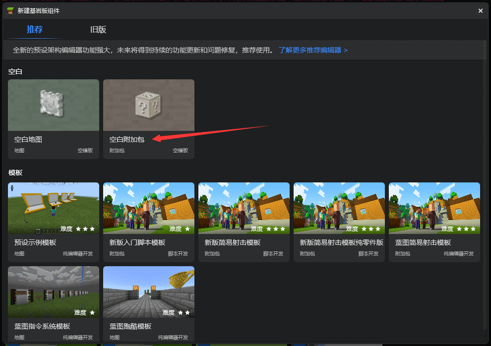
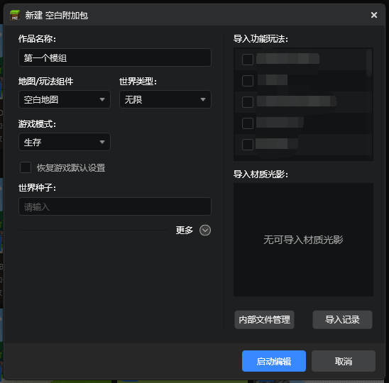
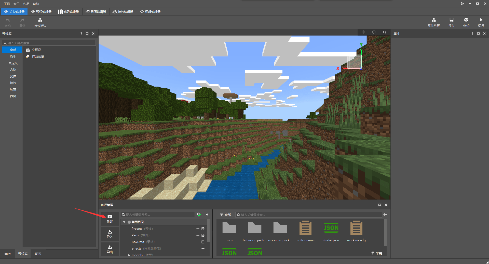
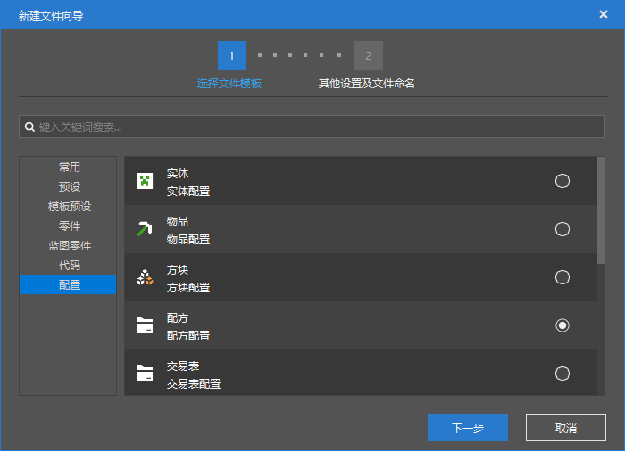
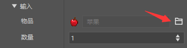
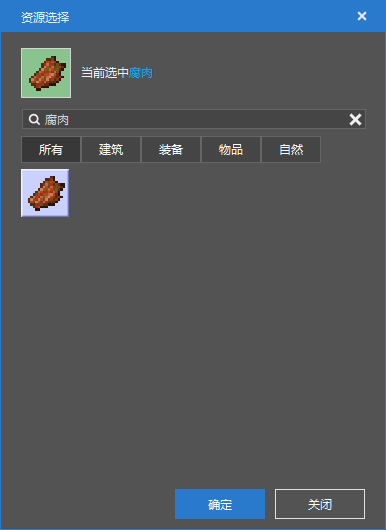
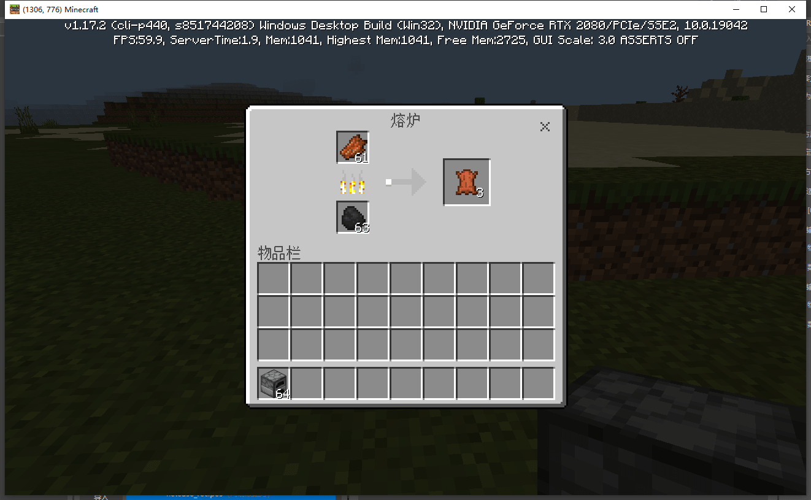

# 使用开发者工作台制作的第一个玩法

在本章中，我们将使用我的世界开发者工作台，来制作一个简单的组件。

<iframe src="https://cc.163.com/act/m/daily/iframeplayer/?id=62ce4273c6dfd1bb76ee9650" width="800" height="600" allow="fullscreen"/>


## 安装

开发者工作台是我的世界中国版为大家制作的一个用来制作模组的工具，集成了大量的功能，供开发者们更方便地制作各种模组。

下载地址：[https://mc.163.com/dev/](https://mc.163.com/dev/)


下载完成后进行安装，注册开发者账号并登录。

## 新建项目

安装完成后，我们点击左侧的“创作”按钮，并点击新建基岩版组件。


在弹出的窗口中，选择空白附加包并新建



随后弹出的窗口中，我们只需要填写作品名称，用来区分不同的项目，然后点击“启动编辑”即可。



待加载完成后，我们可以看到开发者工作台内置了6个编辑器：

- 关卡编辑器
- 预设编辑器
- 地图编辑器
- 界面编辑器
- 特效编辑器
- 逻辑编辑器

他们在模组的制作中发挥着不同的作用。在本章中，我们将会介绍如何使用关卡编辑器配置一些简单的自定义游戏内容。

## 制作一个配方

接下来我们使用开发者工作台新建一个配方。

这里我们制作一个腐肉烧制成皮革的熔炉配方。

> 在我的世界的玩法开发中，配方是一个json文件。对于新手来说，手写json文件是一个很繁琐的事情，所以编辑器的存在就让新建一个配方变得十分容易。我们只需要按照编辑器的文件创建向导，一步一步进行配置，即可创建出对应的json文件。

首先找到“资源管理”窗口，点击其中的“新建按钮”，如下图所示。



接下来选择到“配置”，然后选择“配方”，点击“下一步”。



然后修改文件命名，每个配方的名字不能重复。这里我们将其命名为```rotten_flesh_to_leather```，以便在以后配方很多的时候，能迅速地找到我们想要的配方。


细心的同学可能观察到了，在文件名上方有一个数据模板。这里我们选择的是空，即不用任何模板配方。同学们可以自行摸索每个配方模板的用途。

并且需要注意的是，我们创建的配方路径是在behavior_pack的netease_recipes文件夹下的，以后需要修改配方文件时要能找到这个路径。

创建完成后，就可以在右侧“属性”窗口，看到我们刚刚创建的配方。

现在我们将其修改为熔炉中，腐肉烧制成皮革的配方。

需要修改的地方有：

- 配方类型
- 适用方块
- 输入
- 输出

接下来可以跟着图片一起操作。

首先，因为是熔炉烧制的配方，而不是工作台的合成配方，所以我们需要将配方类型改为“熔炉配方”


修改完成后可以看到，原来的“配方构造”变为了“输入”和“输出”。正如游戏内的熔炉一样，需要提供一个烧制前的物品，和烧制后的物品。

接下来我们在适用方块的[0]处，将“空”改为熔炉。顾名思义，适用方块就是该配方能在哪些方块中使用。


随后我们修改输入和输出，将输入改为腐肉，输出改为皮革，数量均为1。



点击物品右边的选择按钮，在出现的”资源选择“窗口中，搜索腐肉，并选中即可。



输出的皮革选择同理。

修改完成后的配方属性如图：


点击窗口右上角的保存即配置完成。

接下来我们可以点击“运行”按钮进入游戏，验证一下配方是否生效。

可以看到腐肉成功烧成了皮革，配方配置成功！

