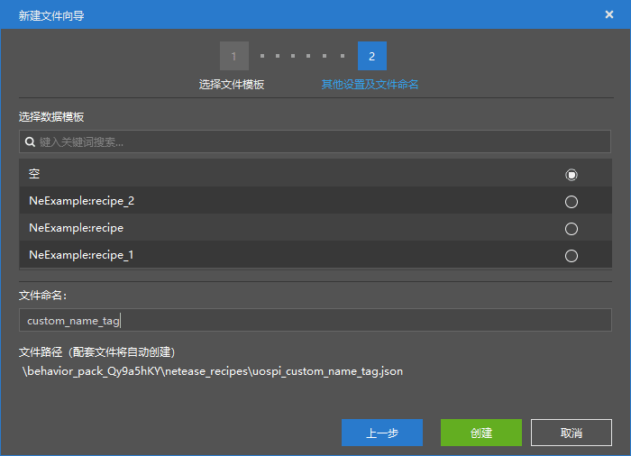
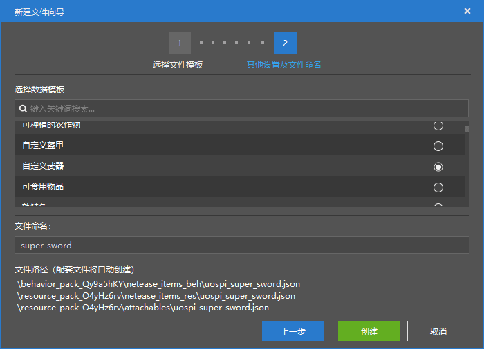
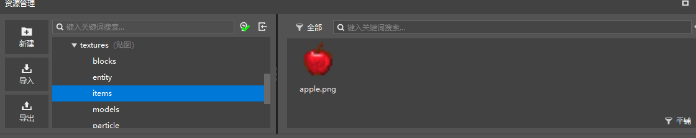

# 课后作业

在学习了如何使用编辑器制作一个简单的配方后，就可以举一反三，完成下面的课后作业。

## 作业要求

- 通过配方配置功能配置一个合成命名牌的配方
- 制作一把新的剑，攻击力设置为100
- 运行游戏尝试制作配方，和攻击效果

## 操作步骤

### 制作命名牌配方

在“资源管理”窗口中点击新建按钮，和之前一样新建一个配方。文件名可以不一样。



随后在配方属性窗口中按照自己的想法编写配方构造，将配方结果设置为命名牌。

配方构造可以和图片中不一样，按照自己的想法任意设计。


### 制作攻击100的剑

在“资源管理”窗口中点击新建按钮，在配置中选择“物品”。

数据模板选择自定义武器，文件名可以和图片中不一样。



随后我们在右侧的窗口中设置：

- 游戏内名字
- 贴图
- 耐久
- 攻击伤害


这里贴图暂时先选择自带的苹果素材，或者可以自己绘制一个图片将其放到```资源包/textures/items```目录中，并选择你自己的图片。



然后我们就可以进游戏测试了。

### 测试

进入游戏，在创造物品栏中，找到我们的超级剑，可以看到攻击力修改成功。


测试配方，可以正常合成。

