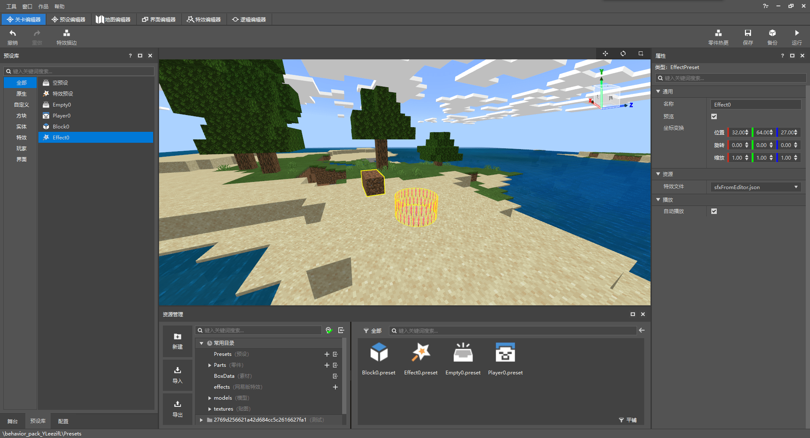
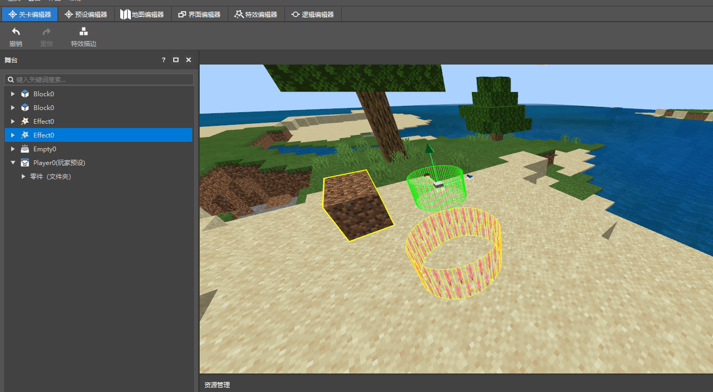
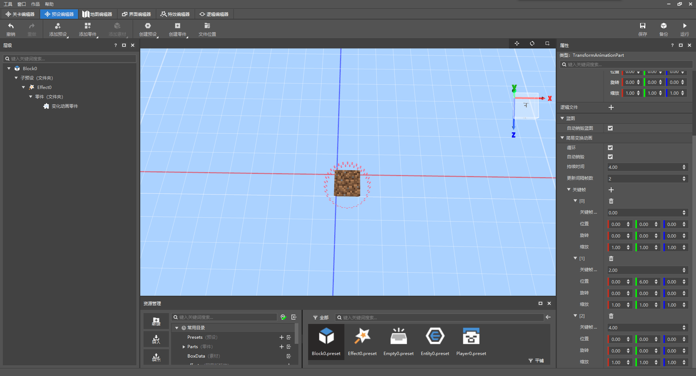
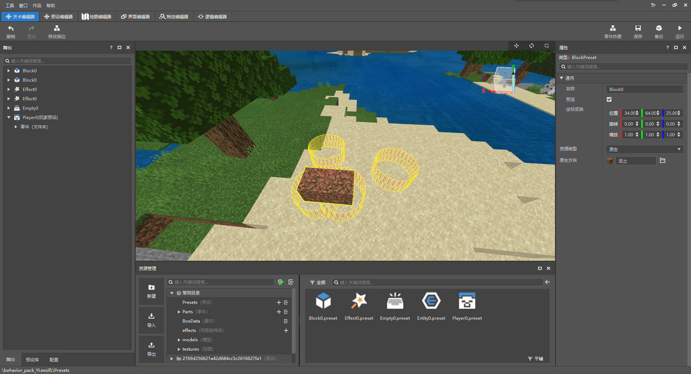
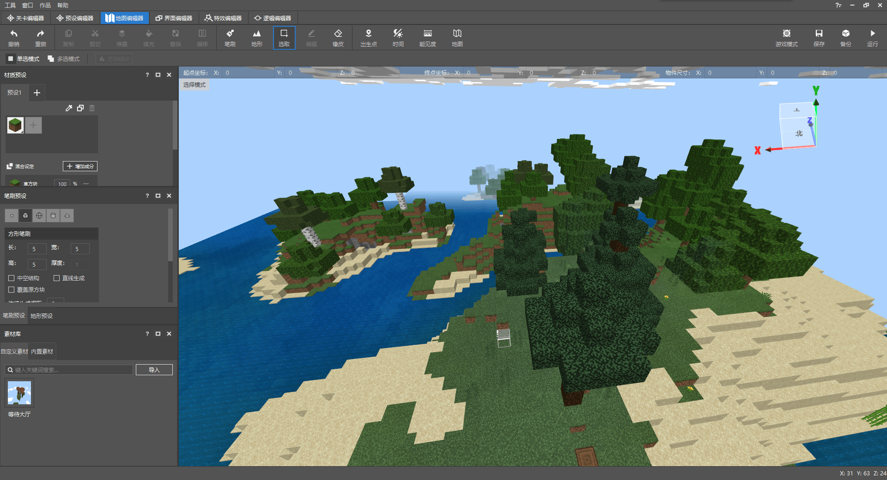
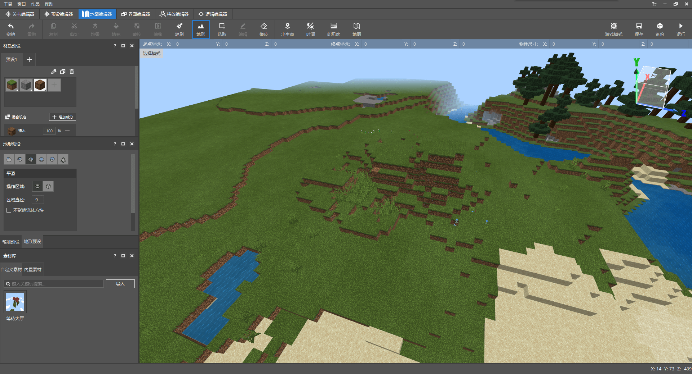
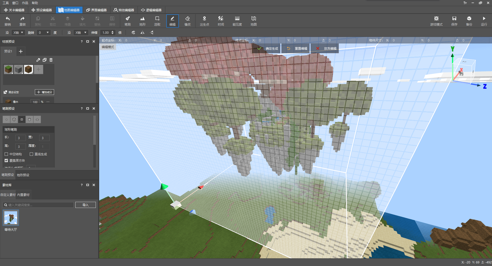
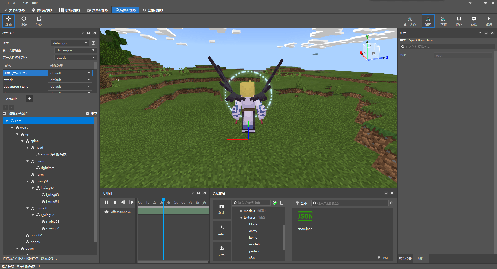

# 我的世界开发工作台

我的世界开发工作台（MC Studio）是一款由我的世界中国版官方制作的开发工具。

在之前的章节中我们已经使用过开发工作台来制作新的物品，合成配方。

本节我们将会继续介绍它的一些其他编辑功能。

<iframe src="https://cc.163.com/act/m/daily/iframeplayer/?id=62ce5180a240f794f8c2c801" width="800" height="600" allow="fullscreen"/>

## 关卡编辑器

关卡编辑器的功能主要是

- 对地图（场景）的展示
- 在场景中放置实例，即将预设进行实例化
- 实例的显示和坐标变换的调整
- 实例的属性编辑

### 舞台

舞台中列出了存在于场景中的所有实例。

在选中舞台中的某个实例后，中间的游戏窗口会对你选中的实例所代表的游戏元素进行高亮提示，并在右侧属性窗口显示具体属性。

比如图中的泥土就是个方块预设。

### 预设库

预设库中显示了所有可以用到关卡编辑器中的预设。在预设拖入游戏窗口后，会被实例化。

例如将一个特效预设(截图中为Effect0)拖入游戏后，就可以看到其在游戏中被播放。

再次拖入一个特效到游戏中，并且切回舞台面板，可以看到有两个Effect0在舞台中。

## 预设编辑器

在刚刚关卡编辑器中已经介绍到，关卡编辑器主要是把预设组合到游戏中的一个编辑器。

而我们的预设编辑器，顾名思义，就是用来编辑预设的编辑器。

比如我们在预设编辑器将两个预设进行组合，把特效和泥土预设组合到一起。

再切回到关卡编辑器，可以看到所有泥土方块都变成了预设中编辑的带特效的泥土。

## 地图编辑器

地图编辑器可以编辑游戏中的地图。

地图编辑器主要由一个游戏窗口、菜单栏、工具栏组成。

我们在游戏窗口中可以使用WASD和鼠标进行视角和位置的移动。

并且使用工具对游戏地图进行编辑。

### 笔刷工具

例如使用笔刷工具，可以选择我们需要选择方块、笔刷类型，然后像画画一样直接在游戏内进行建筑的制作。

### 地形工具

还可以使用地形工具，对地形进行修改。

| 修改前               | 修改后               |
| -------------------- | -------------------- |
|  |  |

### 素材

我们还可以某个存档内的某部分建筑保存为素材，并导出到别的存档进行使用。

## 界面编辑器

界面编辑器可以用来制作界面。

我的世界中的界面都是由json文件构成的，而直接编辑json文件语法较为复杂，不能实时看到编辑的效果。

所以使用界面编辑器可以大大减少编写界面的工作量。

在界面编辑器中，主要由组件栏，空间结构，界面文件列表，属性，资源管理，预览界面构成。

我们可以在顶部选取我们需要的界面组件，并将其拖到我们需要的位置上，然后由各个组件组成游戏中的窗口。

## 特效编辑器

特效编辑器可以编辑网易版特效，并将其挂接到骨骼模型上。

> 小知识：
>
> 骨骼模型是指由Blender等3d软件制作而成的fbx模型
>
> BlockBench所制作的模型叫做基岩版模型

## 逻辑编辑器

逻辑编辑器可以使用图形化编程的形式来编写模组的逻辑代码。

