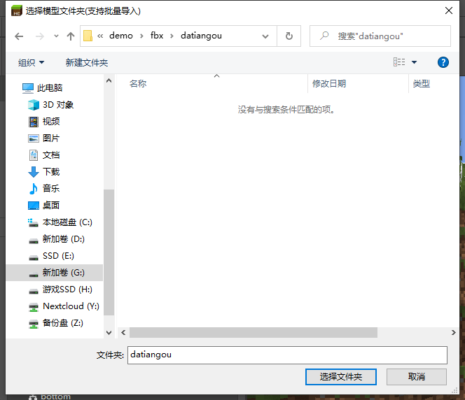
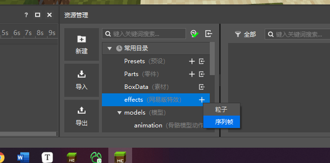
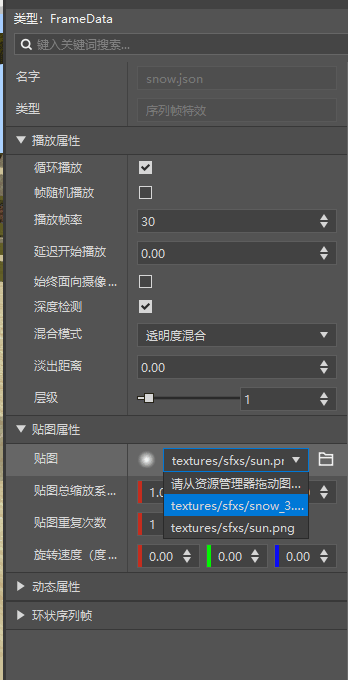

# 课后作业

## 测验

1.下方哪个编辑器不是我的世界开发工作台中有的编辑器:

A. 蓝图编辑器

B. 预设编辑器

C. 地图编辑器

D. 关卡编辑器

2.社区工具Chunker的作用是：

A. 制作Java版地图

B. 制作基岩版地图

C. 在基岩版和Java版存档间相互转换

D. 绘制地形的编辑器

3.地图编辑器可以将一个存档的建筑复制到另一个存档中

A. 对

B. 错

4.特效编辑器不可以制作的特效是哪种

A.网易版粒子

B.网易版序列帧

C.微软版粒子

5.网易版特效只可以挂接到骨骼模型上

A. 对

B. 错

## 实践

在实践中，需要自己亲手导入骨骼模型，制作一个序列帧特效，并将其挂接到指定的模型上。

### 操作步骤

首先下载素材包 [链接](https://x19.gdl.netease.com/demo.zip)。并解压到一个文件夹中。

然后新建一个空白附加包，切换到特效编辑器，点击导入模型按钮。

选择文件夹`./demo/fbx/datiangou`

弹出的界面直接确定即可。

随后切换模型到datiangou，就可以看到导入的模型了。

现在开始制作序列帧效果。

在资源管理中，找到`effects(网易版特效)`，点击加号进行新建，名称填写`snow`

然后将demo文件夹中的sfx中的内容，复制到当前组件的`resource_pack/textures/sfxs`文件夹中

在右侧属性窗口，将贴图替换为刚刚复制的图片

那么特效就配置完成了，现在只需要将特效绑定到模型上，就大功告成！

先在资源管理中找到`effects(网易版特效)`，其中应该有一个`snow.json`。

拖动这个`snow.json`到左侧骨骼挂点的`head`上

拖动完成后就完成了网易版特效对骨骼模型的挂接。

