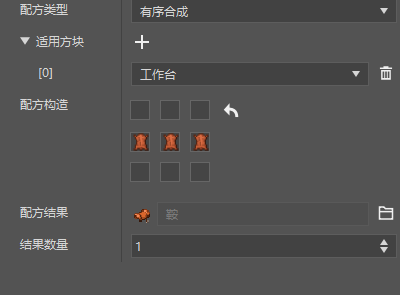
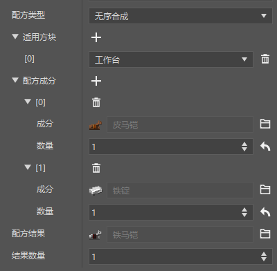
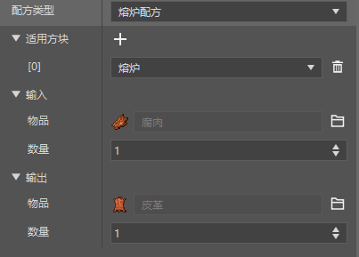
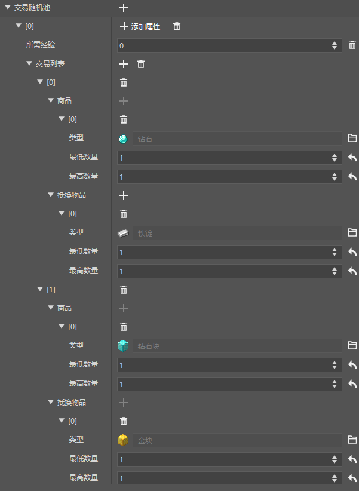
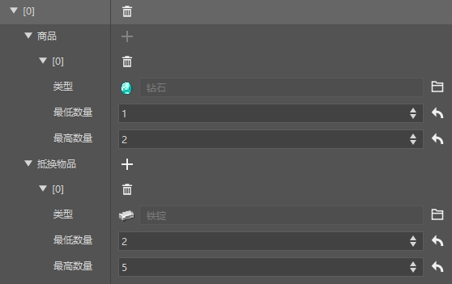
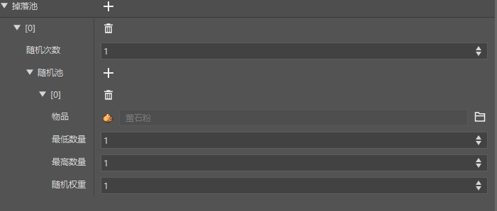
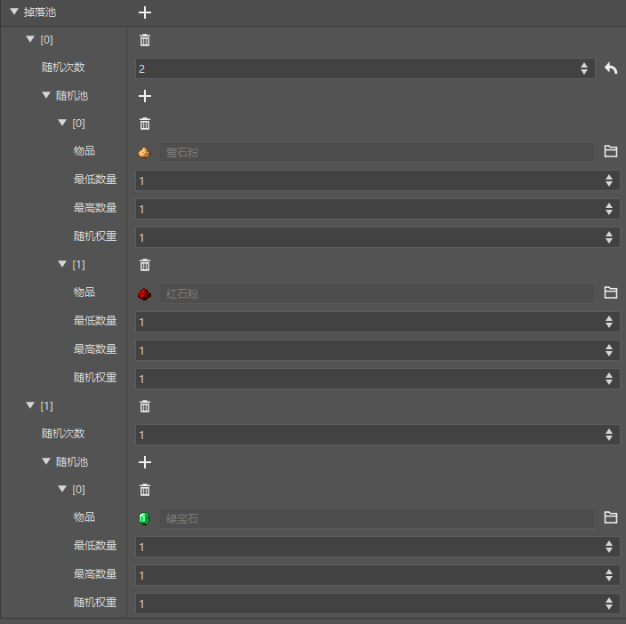

# 开始配置经济功能

本章中，将介绍如何配置游戏的经济功能——配方、交易、战利品表。

<iframe src="https://cc.163.com/act/m/daily/iframeplayer/?id=6328633de6c041f2578ca7e8" width="800" height="600" allow="fullscreen"/>

## 配方

配方的创建非常简单，在新建中找到配置，配方，选择模板后即可创建。

配方有3种类，分别是：有序合成、无序合成、熔炉配方。它们各有不同的用途。

### 有序合成

有序合成即在合成栏中，用指定材料，摆出指定形状的合成配方。

例如箱子的合成需要8个木板围成一圈。

例如这样就是一个自定义的合成鞍的配方，需要3个皮革摆到一排进行合成。

### 无序合成

无序合成指不规定摆放顺序、只要求指定材料的合成。

例如原版中，书的合成，只需要3个纸和一个皮革，而不考虑他们的排列方式。

例如这里可以指定一个皮马铠和1个铁锭，合成1个铁马铠，不考虑他们在工作台中的摆放方式。

同时适用方块还可以选择制图台、切石机，指定了这个配方可以在哪些方块上生效。

### 熔炉配方

熔炉配方指通过烧制来合成的配方。

例如原版中的原木被烧制后变成木炭。

例如这里配置了一个使用熔炉烧制腐肉变成皮革的配方。

适用方块用法和无序合成同理。比如我们这里只选择了熔炉，那么这个配方就不能在烟熏炉、高炉和营火中生效。

## 交易

交易是我的世界中一个非常有意思的玩法，下面我们来看一下如何自定义一个交易表。

同样是在新建->配置，找到交易表。

选择模板`ne_simple_template`，来创建一个简单的交易表模板。

在这里我们可以很清晰地看到，这个交易表的商品和抵换物品是什么。

接下来我们尝试修改一下交易，将交易改成2-5个铁锭，兑换1-2个钻石。

修改完成后效果如图。交易需要配置到一个实体上来进行，这里我们先暂时略过。

在本节的课后作业中，会带领大家配置这个交易到我们上一节创建的自定义流浪商人身上。

同时，在交易随机池的后面还有一个添加按钮，点击后就可以新增一个交易列表，我们可以对其设置经验。

来实现达到多少交易经验值，来解锁新的交易项目的功能。

## 掉落表

掉落表是指在击杀某个实体/破坏某个方块时，可以配置的掉落物列表。

在新建->配置，找到掉落表。

选择模板`ne_simple_template`，来创建一个简单的掉落表模板。

这样的一个掉落池，会在随机池中随机根据权重抽取物品，抽取1次，然后生成掉落物。

我们可以试着修改一下掉落池，将其改成必掉一个绿宝石，有可能掉落萤石或红石，随机次数2次。

不难理解，掉落池中每个项目，都会进行一次随机。而掉落池中的单个项目，会对其随机池进行指定次数的随机，来决定掉落物。

> 概率计算公式：单个概率=随机权重/权重和
>
> 例如现在的红石和萤石掉落概率都为50%