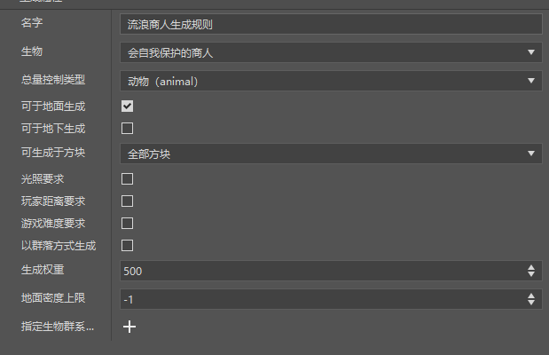
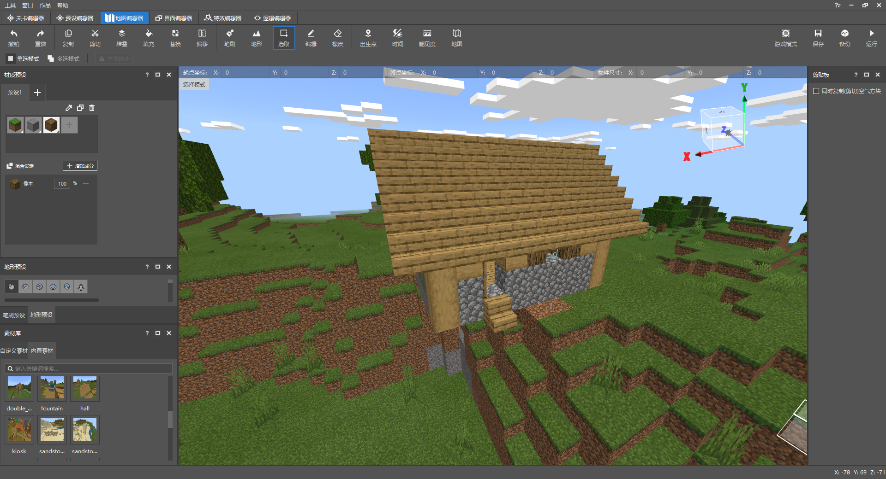
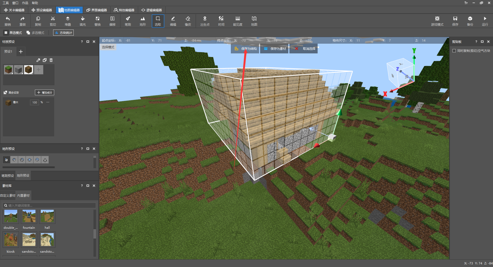
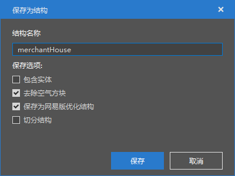
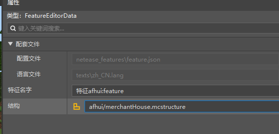
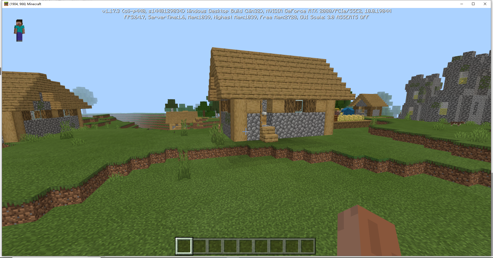

# 群系功能课后作业

本次课后作业，要求如下：

- 为新流浪商人配置新的生成规则
- 使用地图编辑器制作小屋，并保存成结构，使用特征规则随机生成在世界上

## 流浪商人的生成规则

像之前教程中一样创建一个新的生成规则，然后配置选择生物为我们在 [玩法功能课后作业](./1-玩法功能课后作业.html) 中配置的自定义实体。

配置如图所示，将总量控制类型改为动物，生成权重调为500，这样方便我们后续验证。

## 流浪商人小屋

我们使用地图编辑器，在素材库的内置素材中，选择，并放置一个小屋。

然后使用选取工具，将小屋框选出来，然后点击保存为结构。

随后给它命名，进行保存。

接下来我们回到关卡编辑器，在左侧配置栏中，找到之前创建的特征。

然后将它的结构选择刚刚保存的这个小屋的结构。

最后点击保存，配置完成。我们可以进入游戏验证一下。

可以看到房子成功生成在了游戏中，但是现在生成概率仍然偏高，感兴趣的学员可以自行调整，找到一个合适的值。