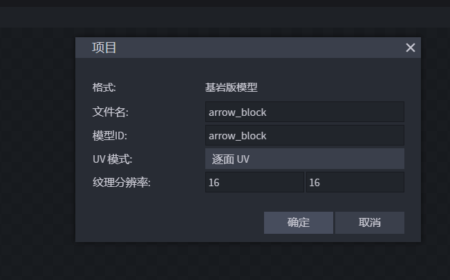
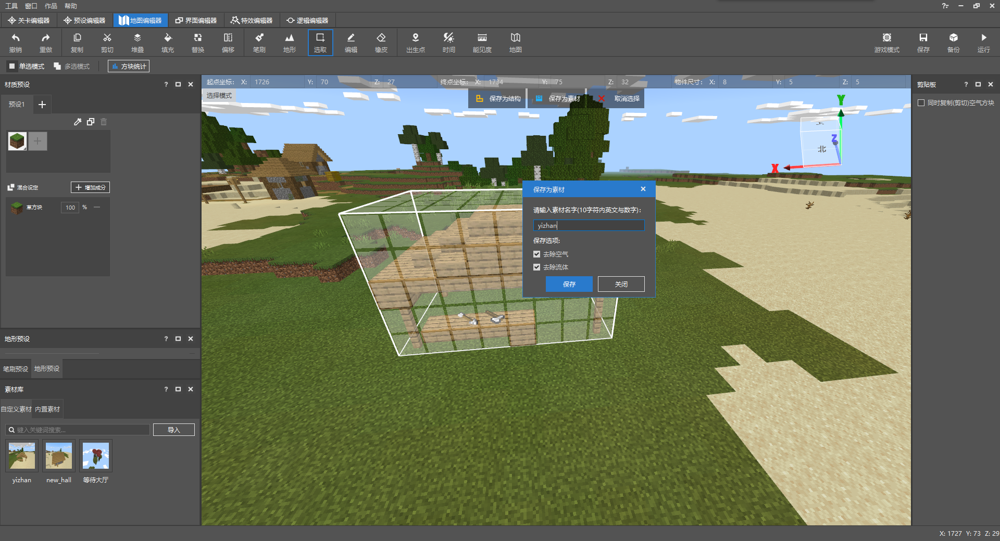
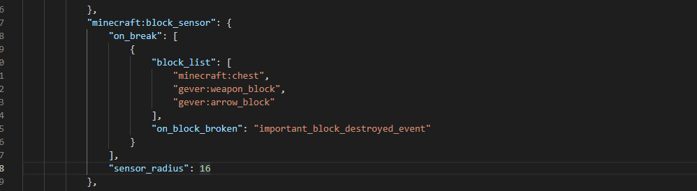

# 物品方块预设课后作业

要求：

- 设计更多武器方块，来点缀驿站
- 为自定义流浪商人，加入被破坏后攻击破坏目标的组件

## 更多武器方块

由于添加更多武器方块的步骤和[上一节](./2-制作物品方块预设.html)完全一致，只需要在创建模型时区分不同的模型名，所以我们这里略过，直接展示成果。



例如这里的`arrow_block`和之前的`weapon_block`不一样。

添加完成方块后，同样的再将驿站的素材放置后重新保存，导入预设素材。



这样我们的更多武器方块就添加完成。

## 攻击盗宝贼的行为

要实现攻击破坏武器方块的玩家，其实实现原理和之前的攻击破坏箱子的原理一样。

所以我们回到自定义实体的配置，打开json文件，找到`minecraft:block_sensor`。

```
			"minecraft:block_sensor": {
                "on_break": [
                    {
                        "block_list": [
                            "minecraft:chest"
                        ],
                        "on_block_broken": "important_block_destroyed_event"
                    }
                ],
                "sensor_radius": 16
            },
```

其中的`block_list`，就是需要探测破坏的方块，在这里我们添加我们新增的武器方块，例如例子中是`gever:arrow_block`和`gever:weapon_block`。

配置完成后，如图：



## 完整资源下载

至此为止，预设编辑器的全部内容就已经介绍完毕。下面放出整个地图的的文件。可以自行解压后导入到编辑器中，供参考和学习。

下载地址：[点我](https://g79.gdl.netease.com/preset_tutorial_res.zip)