# 逻辑编辑器的基础概念（3）

本节将会着重介绍两个在逻辑编辑器中非常重要的逻辑功能：判断逻辑和循环逻辑。

相信在之前的逻辑制作中，大家已经遇到了很多需要进行逻辑判断和需要使用循环的地方，那么本节，就会介绍这些节点的使用方法。

<iframe src="https://cc.163.com/act/m/daily/iframeplayer/?id=63286619a240f794f8c5fbaf" width="800" height="600" allow="fullscreen"/>

## 判断逻辑

逻辑编辑器有很多种可以进行判断的节点，下图列出了所有在 `旧版节点` 中的可用于逻辑判断的节点。

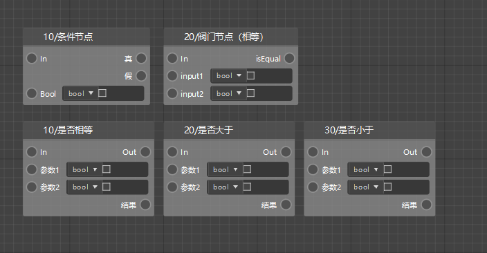

同样，在基础节点中，也有许多可以用来进行判断的节点。

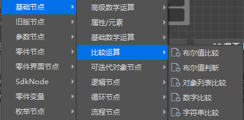

这里我们简单的创建一个`比较运算`中的布尔值判断来说明。

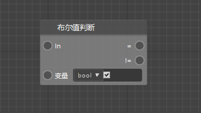

这样一个布尔值判断节点，会将输入的变量，判断它的值，如果是`真`，则从=端口继续执行，如果是`假`，则会从!=端口继续执行。


与之类似的，还有字符串比较节点，我们可以在这个节点中输入两个字符串变量，来判断他们的大小。字符串不仅可以判断是否等于，还可以判断大于小于。大于小于的判断依据是字符串对应的编码的中的索引位置，比如"a"在unicode中表示为`\u0061`，"b"在unicode中表示为`\u0062`，对应的十进制分别是91、92，那么就是91<92，即a<b。如果不了解计算机编码的同学可能会比较难以理解大于小于的判断，建议可以直接把<和>的端口都看做不等于。

## 循环逻辑

利用循环，我们就可以在程序中轻松地从某一个存储多个元素的对象中取出所有元素。

在上一节中，我们已经介绍了列表(List)和字典(Dict)的创建和使用，也介绍了可以使用循环来取出它们的所有内容。

在逻辑编辑器的开发中，主要有两个循环节点可以使用，分别是`条件循环遍历节点`和`顺序循环遍历节点`。

### 条件循环遍历节点

我们首先可以观察这个节点的输入和输出端口。


它拥有`In`，`跳出`，`列表`3个输入端口，`循环体`，`循环完成`，`索引`，`值`这4个输出端口。

#### 循环体

每一次循环中的内容，如果像上图一样，输入的列表是["a","b"]，进入循环后，就会执行2次循环体，分别将值"a"，"b"进行打印。

#### 遍历完成

在整个循环结束后，程序将从遍历完成端口继续往下执行。

#### 索引

遍历中每次循环的索引值，如果是列表，从0开始；字典则为字典的key。

#### 值

遍历中每次循环的值，如果是列表，则为列表的item；字典则为字典的value。

#### In

和所有节点的In端口一样，当这个端口的In被连接时，在它的上一个节点运行结束后，就会运行到条件循环遍历节点。

#### 跳出

当循环中满足某个条件，想立刻终止循环时，就可以将执行连线连接到跳出端口。那么循环就会立刻终止运行，直接继续执行遍历完成后的节点。

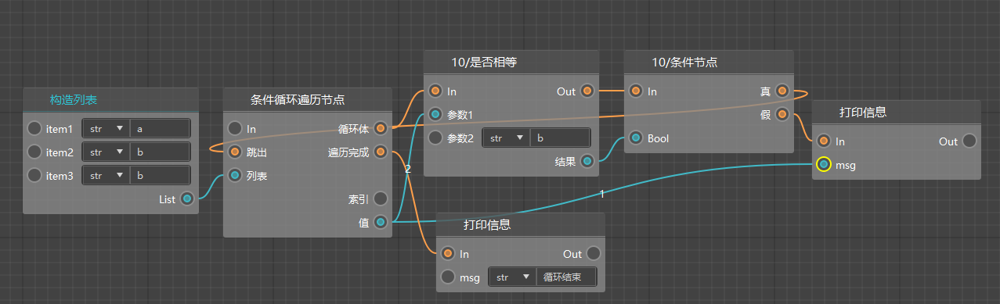

例如上方的循环结构，有一个列表["a","b","c"]，每次循环体中都会判断元素的值和"b"是否相等，如果相等的话，就会跳出循环，否则打印信息。

那么上面一串节点最终的运行结果就应该是:

```
a
循环结束
```

#### 列表

需要进行循环的对象，可以是列表，也可以是字典，或者其他的一些可迭代对象。

### 顺序循环遍历节点

顺序循环和条件循环虽然同为循环，但是有些许不一样。


如上图所示，循环节点将会从起始索引开始循环，每次循环执行循环体中的内容，循环体执行结束后，会将索引值+1，继续执行循环体。直到索引值>终止索引，才会执行遍历完成后的内容。

它和条件循环节点的主要区别在于，条件循环只能在列表中或字典之类的可迭代对象中进行循环，而顺序循环遍历节点不依赖这些对象进行循环。其他的用法基本一致。

例如需要编写一个逻辑，从5打印数字到10，就可以设置其实索引为5，终止索引为10，然后将值进行打印。就像下图这样。

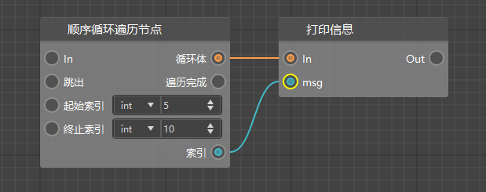

## 课后作业

1. 在 实体受到伤害 事件中，判断 攻击者为 玩家，并手持 钻石剑 时，才会将伤害返还给攻击者。
2. 在 实体受到伤害 事件中，判断 攻击者为 玩家，并手持 钻石剑 时，会根据 物品列表 掉落随机 物品道具。

本节课的作业可以在上一节作业的基础上进行修改。首先可以确定的是，两个要求都需要判断攻击者为玩家，并且手持钻石剑。

那么我们就可以在接口中首先查找获取玩家手中物品的接口，然后再获取物品的id，判断是否是钻石剑。

- 搜索`GetEngineTypeStr`，创建一个获取实体类型的零件接口，将它的实体ID和伤害源ID连接，并判断实体类型是否是`minecraft:player`。
- 搜索`GetPlayerItem`，创建一个获取玩家物品的零件接口，判断物品信息字典的newItemName是否是`minecraft:diamond_sword`。

物品信息字典中的数据格式，可以在<a href="../../../../mcguide/20-玩法开发/10-基本概念/1-我的世界基础概念.html#物品信息字典">文档</a>中查阅。也可以自己打印物品字典信息，在日志窗口中找到你想要判断的物品的物品名。

获取玩家物品的节点处，根据<a href="../../../../mcdocs/1-ModAPI/接口/玩家/背包.html?key=GetPlayerItem&docindex=1&type=0">文档</a>，物品位置是一个玩家物品位置枚举，我们可以创建一个枚举对象，然后在右侧属性，将其更改为主手。

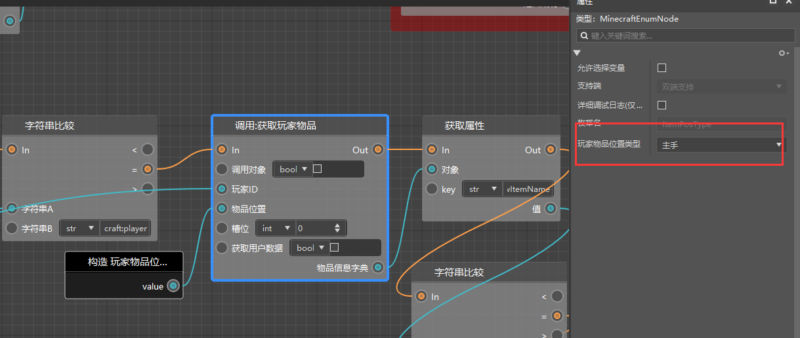

现在就获取到了玩家手中的物品信息，我们从字典中获取newItemName，来判断是否是`minecraft:diamond_sword`.

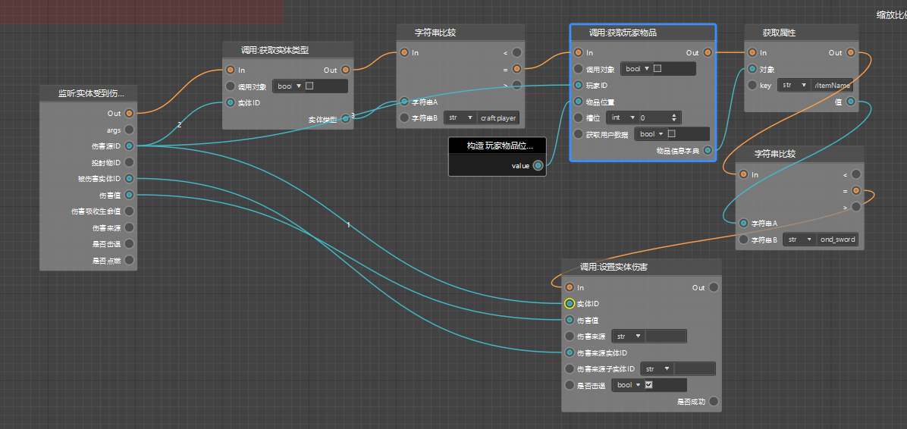

这样我们就可以筛选出了使用钻石剑攻击的玩家，才返还伤害。接下来继续完成掉落物的生成。掉落物这里我们直接使用生成物品掉落物接口。

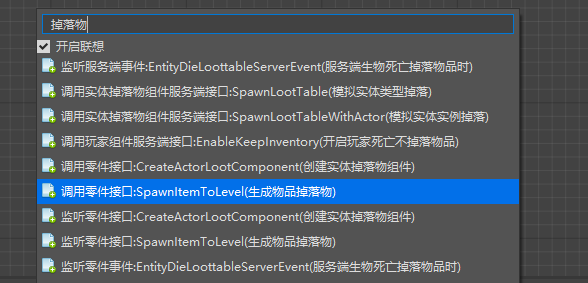

同时，要随机抽取掉落物，我们还要构造一个列表，来存储需要随机的物品列表。这里我们构造一个2长度的列表，里面先存好了钻石和铁锭的物品名。`minecraft:diamond`和`minecraft:iron_ingot`。接下来需要随机给他抽取。

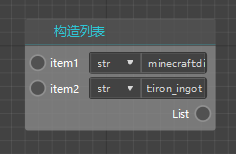

随机抽取就需要使用随机函数，在0到列表长度-1的数字中抽取一个数字，然后获取这个数字对应列表索引的值。或者为了方便起见，我们也可以使用内置python接口的shuffle函数，来打乱这个列表，并获取第0位元素。然后构造一个字典，根据物品字典的格式，我们必填`newItemName`,`newAuxValue`,`count`这几个值。

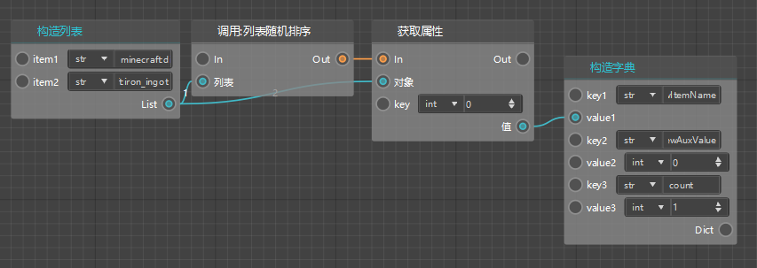

这样我们就获得了一个随机的物品信息字典，接下来就要将它生成到被攻击的实体的位置上。

创建一个生成物品掉落物的零件接口节点，可以看到我们还需要维度id和生成位置。通过查阅文档可以知道，维度id是实体所在的维度的id，生成位置是用来定位生成坐标的。它们都可以通过零件接口获取。

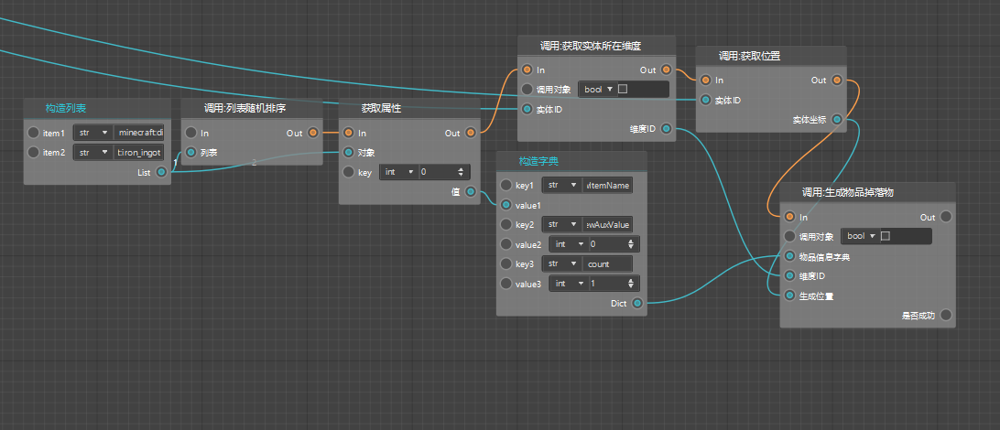

上图的实体id均连接了被伤害实体ID。这样我们就完成了随机掉落物的生成。

我们把第一个In节点接到设置实体伤害后，让它接着设置伤害之后执行。

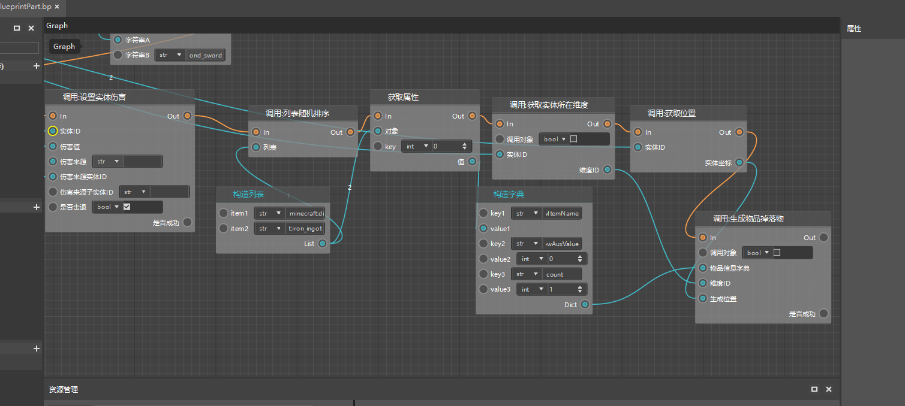

这样我们就完成了所有节点的连接。可以进入游戏测试效果了！

