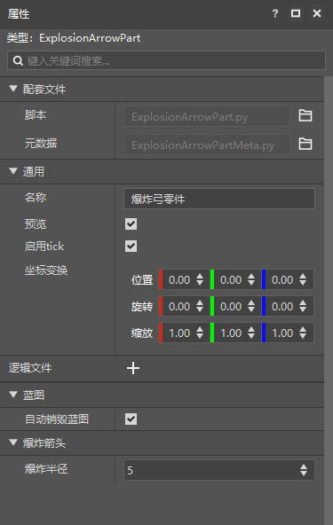

# 代码编写基础

本节将主要介绍接口和事件之间的区别、文档的查阅以及客户端和服务端之间的通信。

<iframe src="https://cc.163.com/act/m/daily/iframeplayer/?id=632867a9e6c041f2578ca820" width="800" height="600" allow="fullscreen"/>

## 接口与事件

这里的接口与事件和逻辑编辑器的接口和事件定义一致，如果有遗忘的同学可以去[回顾](../2-逻辑编辑器基础/3-逻辑编辑器的基础概念（2）.html)。

那么在逻辑编辑器中，所有事件，都体现为`监听:xxxxx`，而在零件开发中，监听事件一般都是定义一个函数。

如果需要查阅所有可以监听的事件，可以在<a href="../../../../mcdocs/1-ModAPI/事件/世界.html?catalog=1">这里</a>进行查询。

例如在`PartBase`中定义以下函数，就视为监听了ServerChatEvent

```python
def ServerChatEvent(self, args):
    pass
```

而在零件开发中调用接口，都是以调用函数的形式来调用的。

还是这个事件，`GetParent`，`SetEntityAttrValue`，`SetEntityAttrMaxValue`，都是调用了`PartBase`的接口。

所有可以使用的接口都可以在<a href="../../../../mcdocs/3-PresetAPI/预设管理/PresetApi.html?catalog=1">这里</a>进行查询。

```python
    def ServerChatEvent(self, args):
        if args["message"] != "更新血量":
            return
        parent = self.GetParent()
        entityId = parent.GetEntityId()
        if args["playerId"] != entityId:
            return
        self.SetEntityAttrValue(entityId, AttrType.HEALTH, self.health)
        self.SetEntityAttrMaxValue(entityId, AttrType.HEALTH, self.maxHealth)
```

> 为什么<a href="../../../../mcdocs/3-PresetAPI/预设对象/预设/预设基类PresetBase.html?catalog=1#预设基类presetbase">PartBase</a>中没有找到上方代码使用的GetParent?
>
> 因为我们是基于面向对象技术，进行预设和零件开发的。PartBase继承了SdkInterface和TransformObject对象，自然就可以调用来自父类的函数。
>
> 实际上我们调用的GetParent接口，是来自<a href="../../../../mcdocs/3-PresetAPI/预设对象/通用/变换对象TransformObject.html#getparent">TransformObject</a>的。这样GetParent，因为零件挂载玩家预设上，就能得到玩家。

## 服务器客户端通信

在之前的逻辑编辑器界面制作中，我们就已经稍微接触了一些服务器和客户端之间的通信。

当时的界面，将客户端中的内容，发送到了服务端。服务端监听，并执行命令。

这样就是一个客户端往服务端的通信。但是实际上，客户端和服务端之间，是可以双向通信的。下面将会详细介绍通信的使用方法。

### 客户端->服务端

客户端向服务端的通信主要需要在客户端调用`NotifyToServer`接口，而服务端需要在初始化的时候调用`ListenSelfEvent`接口，来监听这个事件。

#### NotifyToServer

文档说明：<a href="../../../../mcdocs/3-PresetAPI/预设对象/零件/零件PartBase.html?key=NotifyToServer&docindex=2&type=0#notifytoserver">点我</a>

| 参数名    | 数据类型 | 说明     |
| :-------- | :------- | :------- |
| eventName | str      | 事件名称 |
| eventData | object   | 事件数据 |

这是一个客户端接口。`eventName`是事件名称。事件名称可以理解为这个事件的具体含义。客户端中使用这个事件名称发送到服务端，那么服务端相应的也需要使用这个事件名称来监听。`eventData`是事件的具体数据，即一般事件中的args，一般传入一个字典。

#### ListenSelfEvent

文档说明：<a href="../../../../mcdocs/3-PresetAPI/预设对象/零件/零件PartBase.html?catalog=1#listenselfevent">点我</a>

| 参数名    | 数据类型 | 说明     |
| :-------- | :------- | :------- |
| eventName | str      | 事件名称 |
| target    | object   | 目标     |
| func      | object   | 回调函数 |

这个接口，双端通用。

`eventName`就是我们NotifyToServer时所定义的事件名称。`target`为监听哪个对象的事件，一般填写self。`func`为回调函数，定义一个函数，参数为args，然后在这里传入function类型的值。

例子:

```python
class TestPartPart(PartBase):
    def InitServer(self):
        print "InitServer"
        self.ListenSelfEvent("TestEvent", self, self.OnTestEvent)

    def OnTestEvent(self, args):
        print "收到来自 {} 的客户端事件".format(args["playerId"])

    def SendToServer(self):
        self.NotifyToServer("TestEvent", {"playerId": self.GetLocalPlayerId()})
```

这样如果在客户端调用SendToServer函数，服务端就会相应的收到事件，并打印消息。

### 服务端->客户端

服务端向客户端的通信主要需要在服务端调用`NotifyToClient`接口，而客户端需要在初始化的时候调用`ListenSelfEvent`接口，来监听这个事件。

#### NotifyToClient

文档说明：<a href="../../../../mcdocs/3-PresetAPI/预设对象/零件/零件PartBase.html?catalog=1#notifytoclient">点我</a>

| 参数名    | 数据类型 | 说明     |
| :-------- | :------- | :------- |
| playerId  | str      | 玩家ID   |
| eventName | str      | 事件名称 |
| eventData | object   | 事件数据 |

这是一个服务端接口。`playerId`为需要发送到的玩家id。其他的参数和`NotifyToServer`用法一致。

如果需要广播到所有玩家的客户端，可以使用<a href="../../../../mcdocs/3-PresetAPI/预设对象/零件/零件PartBase.html?catalog=1#broadcasttoallclient">BroadcastToAllClient</a>。

#### ListenSelfEvent

ListenSelfEvent和客户端向服务端通信中的使用方法一致。

文档说明：<a href="../../../../mcdocs/3-PresetAPI/预设对象/零件/零件PartBase.html?catalog=1#listenselfevent">点我</a>

| 参数名    | 数据类型 | 说明     |
| :-------- | :------- | :------- |
| eventName | str      | 事件名称 |
| target    | object   | 目标     |
| func      | object   | 回调函数 |

这个接口，双端通用。

`eventName`就是我们NotifyToServer时所定义的事件名称。`target`为监听哪个对象的事件，一般填写self。`func`为回调函数，定义一个函数，参数为args，然后在这里传入function类型的值。

例子:

```python
class TestPartPart(PartBase):
    def InitClient(self):
        print "InitClient"
        self.ListenSelfEvent("TestEvent", self, self.OnTestEvent)

    def OnTestEvent(self, args):
        print "收到来自服务端的事件 {}".format(args)

    def SendToServer(self,playerId):
        self.NotifyToClient(playerId, "TestEvent", {"msg": "test"})
```

这样如果在客户端调用SendToServer函数，服务端就会相应的收到事件，并打印消息。

## 课后作业

### 辨认接口和事件

辨别下方的代码是调用接口还是监听事件

1. `self.SetCommand()`
2. `def OnCommandOutputServerEvent(self, args):`


> 答案
>
> 1. 调用接口
> 2. 监听事件

### 零件开发实际操作

使用零件开发来编写一个爆炸箭的功能：所有射出的弓箭，在击中目标时都会产生爆炸。

并且使用自定义属性面板，设置爆炸范围。

#### 操作步骤

1. 创建一个玩家预设、空零件。零件命名为`ExplosionArrow`。
2. 将零件挂接到玩家预设上。
3. 接下来使用PyCharm打开`ExplosionArrowPart.py`，编辑代码。
4. 在`__init__`下定义一个爆炸半径成员变量，方便后面制作自定义属性。
5. 监听<a href="../../../../mcdocs/1-ModAPI/事件/实体.html?key=ProjectileDoHitEffectEvent&docindex=2&type=0#projectiledohiteffectevent">ProjectileDoHitEffectEvent</a>，并获取对应位置，再调用<a href="../../../../mcdocs/3-PresetAPI/预设对象/通用/SDK接口封装SdkInterface.html?key=CreateExplo&docindex=4&type=0#createexplosion">CreateExplosion</a>，创建爆炸，其中爆炸半径使用成员变量，随后删除箭的实体。

代码参考：

```python
@registerGenericClass("ExplosionArrowPart")
class ExplosionArrowPart(PartBase):
    def __init__(self):
        PartBase.__init__(self)
        self.explosionRadius = 5
        self.name = "爆炸弓零件"

    def ProjectileDoHitEffectEvent(self, args):
        self.CreateExplosion((args["x"], args["y"], args["z"]), self.explosionRadius, True, True, args["srcId"], args["srcId"])
        self.DestroyEntity(args["id"])

```

接下来设置元数据，打开`ExplosionArrowPartMeta.py`，修改`PROPERTIES`，添加一个爆炸半径变量。

代码参考:

```python
@sunshine_class_meta
class ExplosionArrowPartMeta(PartBaseMeta):
    CLASS_NAME = "ExplosionArrowPart"
    PROPERTIES = {
        "explosionRadius": PInt(text="爆炸半径", sort=1000, default=5, group="爆炸箭头")
    }
```

这样就修改完成。打开编辑器，选中爆炸弓零件，就可以看到相应的设置。



### 通信

利用客户端和服务端的通信系统，将玩家聊天的内容发送到客户端，并打印到日志窗口中。

#### 操作步骤

1. 新建一个空零件，命名为`NotifyTest`，并挂接在玩家预设上。
2. 编辑`NotifyTestPart.py`，监听<a href="../../../../mcdocs/1-ModAPI/事件/世界.html?key=Join&docindex=2&type=0#serverchatevent">ServerChatEvent</a>，获取消息内容和玩家ID，使用NotifyToClient将其发送给客户端，事件名为`ChatToClient`，数据是一个dict`{"msg": 消息内容}`。
3. 在InitClient中调用ListenSelfEvent，监听`ChatToClient`事件，再定义一个函数叫做`OnRecvChat`，接收args作为参数，打印`args["msg"]`，作为回调函数。

代码参考:

```python
@registerGenericClass("NotifyTestPart")
class NotifyTestPart(PartBase):
    def __init__(self):
        PartBase.__init__(self)
        self.name = "通信测试"

    def InitClient(self):
        self.ListenSelfEvent("ChatToClient", self, self.OnRecvChat)

    def OnRecvChat(self, args):
        print "从服务端发来的聊天信息: {}".format(args["msg"])

    def ServerChatEvent(self, args):
        message = args["message"]
        playerId = args["playerId"]
        self.NotifyToClient(playerId, "ChatToClient", {"msg": message})
```

这样每次发消息，在日志窗口都会由客户端打印收到的消息内容。