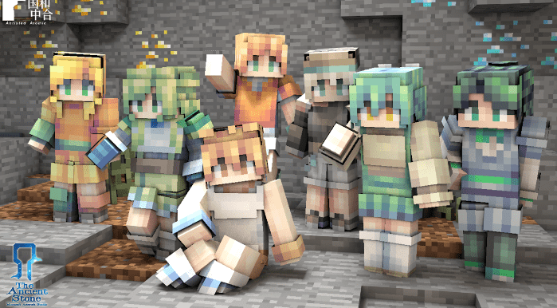
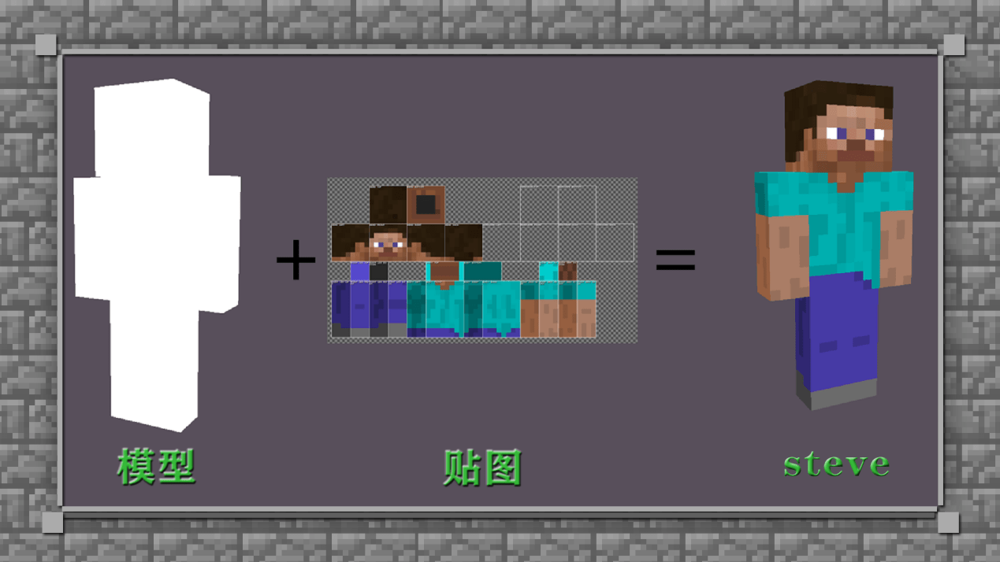
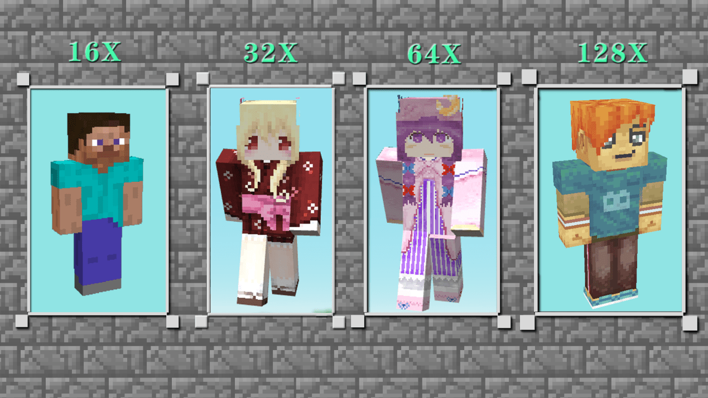
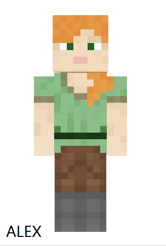
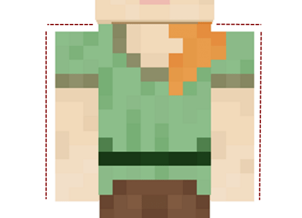
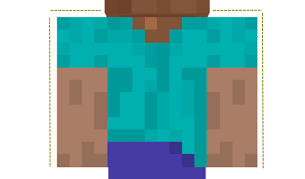
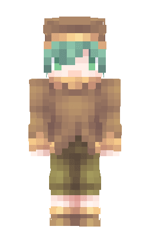
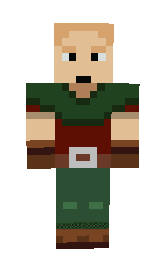
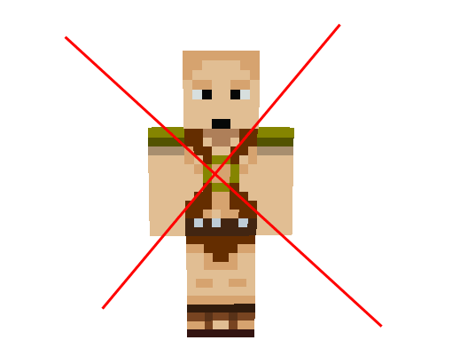

# 初识皮肤基础知识

## 了解什么是皮肤

皮肤是《我的世界》中必不可少的元素，是彰显冒险家们个性的存在。

而如何创作和拥有一件专属于自己的皮肤？如何让自己的个性皮肤不是普普通通？

那么就跟随本期皮肤教程来学习创作出属于自己的专属皮肤吧~

首先，我们来了解一下，皮肤的本质是什么。

皮肤的其实就是一张贴图。而贴图则可以理解为我们平时所穿的衣服，而我们自己本身则是人物主体。穿上不同风格衣服的我们，则也被装饰成了不同的风格和外貌。皮肤的贴图则定义了我们在游戏中的风格和外貌。

## 了解皮肤的视觉魔法 —分辨率

如果皮肤的贴图决定了风格，那么决定皮肤精细度关键在于“分辨率”！

目前，16x（X为像素的意思）是最基础和常用的官方贴图规格，而32x、64x、128x则是高分辨率的贴图规格。不同皮肤分辨率尺寸会给予视觉效果上的“高清化”精度提升，分辨率就是决定贴图高清精细与否的要素之一。

小贴士：如果很喜欢像素风格的话，那就建议大家不要绘制超过64X的高清贴图哈。 注意：目前皮肤软件skin3d不支持32x的皮肤绘制，如有对应像素尺寸的皮肤需求，大家可以选择BlockBench。

## 了解皮肤的不同体型 

在我的世界中冒险家们可以选择两个体型：1、标准Steve体型 2、Alex体型

两个体型的最大区别在于手臂的粗细，体型的选择大家可以根据自己决定的皮肤风格来进行判断。比如，画的是一个少女，那么手臂肯定选择Alex的细手臂会更合适女生的柔美，反之，画的是一个男生，那么就需要粗手臂的Steve展现出男生的硬朗啦~

而在绘制皮肤贴图类型的时候，我们也有两种选择：1、单层皮肤 2、双层皮肤

1、单层皮肤：是皮肤只有一层，手臂双脚都只能绘制一种样式，然后软件自动进行镜像复制。十分适合新手刚开始上手绘图使用。

2、双层皮肤：是指在单层皮肤的基础上再贴图叠加一层，相当于给人物再穿了一个衣服，戴了一个帽子。而且双层皮肤的手脚左右都可以单独绘制，软件不会镜像复制。对于创作来说增加了更多的乐趣和选择。一般都是新手进阶后常选的皮肤格式。

## 不能被展示的皮肤守则

完成作品后，很多冒险家都出现了不能上传自己心爱的皮肤作品的问题，或者是审核不通过的情况。在这里，我们除了遵守和注意新版《开发者内容审核制度》所提出的审核制度外，我们还要注意这几点内容。

上传失败的截图

第一，皮肤出现缺失。

在绘制图片的过程中因为软件绘制和保存出来的规格错误所导致的常见问题。大家只要先在皮肤软件3Dskin里面测试和检查一遍。如果发现缺失直接补上重新上传即可。

第二、皮肤绘制太过暴露

有时候所谓的暴露不仅仅是不画衣服的皮肤，也有包含腿部的裙子太短导致下半身留白过多或者是上半身衣服太低导致留白太多，都会可能判定为过于暴露。所以大家要多注意绘制时候的颜色覆盖噢~

第三、直接使用原版贴图

很多开发者喜欢原生贴图系列，然后绘制好面部和四肢后就给直接贴入了原版贴图在身上。然后导致审核上传失败。所以一般建议大家使用原版贴图在身上的时候可以稍微做一下修改，将衣服的部件和细节都稍微补全，或者画上自己的logo也是可以的噢~

那么以上就是至今开发者们都会遇到最多皮肤审核问题，大家想要了解更多的上传规范，可以查看《组件上架的规范及过审攻略》进行更深入化的学习。
