# 软件学习：MCskin3D软件教程

通过上述基础概念的讲解，相信大家对于皮肤有了大致的理解。但想要绘制皮肤，选择好的辅助皮肤绘制软件也是很重要的。而MCskin3D软件则是最好上手和最实用的我的世界皮肤绘制软件。让我们一起来认识一下MCskin3D。

MCskin3d是一款免费的皮肤制作器，大家通过它可以进行绘制在《我的世界》中所使用的皮肤。在这款软件中，大家可以体验到最方便的皮肤绘制方法，并且还能浏览加载所有符合游戏内规格的皮肤，以及批量化管理。此编辑器支持在3D视图下编辑，也支持2D视图编辑，还支持3D/ 2D各一半视图的绘制，让皮肤绘制不再是难题。

## MCskin3d 界面介绍

接下来我们就一起学习一下界面如何操作吧~

——首先，我们下载好MCSKIN3D并打开软件界面。

如下图所示，软件界面清晰的分成六大区块：菜单栏、常用工具栏、皮肤项目面板、贴图绘制窗口、调色面板、皮肤绘制预览窗口。

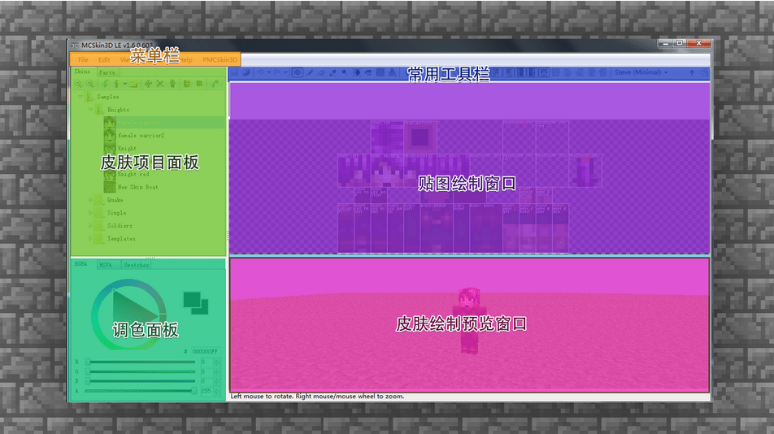

菜单栏：集合MCSKIN3D的所有功能和操作命令，共包括5个大类菜单，通过菜单的操作可以完成项目素材管理、编辑项目、调整视图等操作。

常用工具栏：包含了绘制和编辑皮肤贴图时经常使用的工具，也是我们绘制的时候常用的。

如镜头调整、绘制工具、橡皮擦、取色、皮肤展示模式选择等。

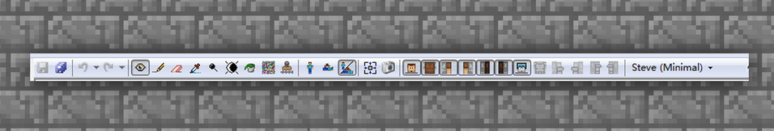

皮肤项目面板：所有新建的皮肤或者绘制好的皮肤文件都会保存在这个面板之内，可以直观的从小图标上进行区分，并且可以给皮肤在此处右键进行【重命名】。并且还可以进行放大缩小、复制、升降分辨率的操作，十分清晰和方便。

贴图绘制窗口：该区域是用作贴图细微调整的时候，很重要的部分。像眼睛调色、人物刘海、衣服的饰品绘制的时候就需要用到此部分。当操作熟练时，则基本上可以直接在贴图上进大体绘制，事后进行模型贴图的来回切换及调整。此部分较为进阶，当大家有一定的熟练度后再做尝试即可。

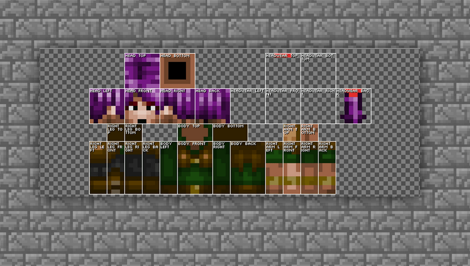

贴图的每一块都已经写上了模型块命名，可以很好的找到需要绘制的部分。

调色面板：色彩调和和选择的面板，在这里可以选择和调出自己喜欢的颜色，然后使用绘图工具进行上色就OK啦。当然这里还有一个黑科技就是色板，可以将自己喜欢的颜色或使用过的颜色在色板进行保存，这样可以方便调取出来。

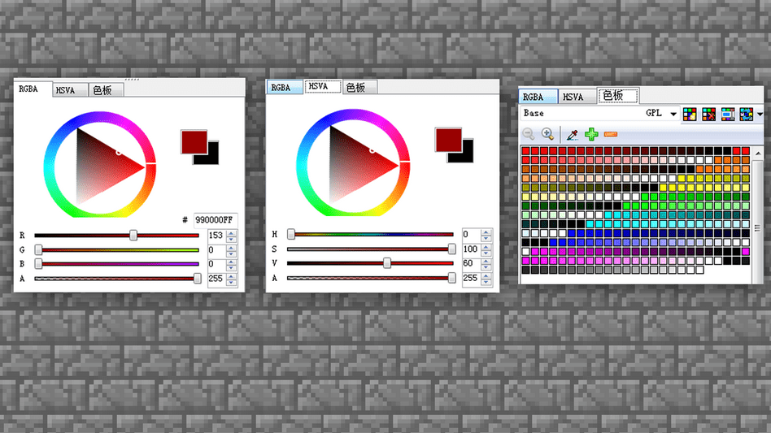

皮肤绘制预览窗口：绘制好的皮肤会在这个部分进行3D展示和阅览，可以精确的使用鼠标移动视角，看到皮肤呈现的效果和画面感觉。这里预览的模型和游戏内是一样的尺寸，大家完全可以放心调整。

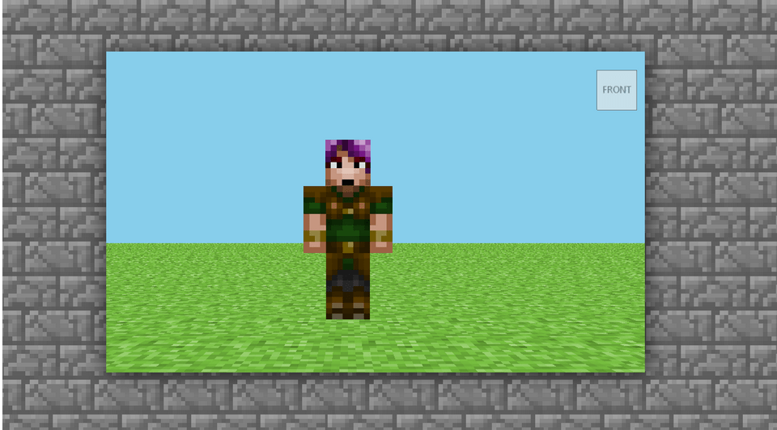

## 使用MCskin3D新建皮肤

### 新建皮肤种类

模块都介绍完毕，就让我们开始进入实际操作的环节吧。

首先，在皮肤项目面板中的菜单栏中找到【新建皮肤】

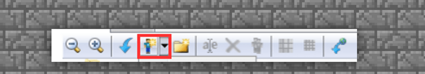

然后选择想要绘制的皮肤类型模型，ALEX 和 STEVE 对应的是最新双层皮肤贴图模型，有minimal标签的是老版本的贴图模型，即单层皮肤版本ALEX和STEVE。

那什么是单层皮肤，什么是双层皮肤呢？通过案例来学习一下吧。

—单层皮肤：是皮肤只有一层，手臂双脚都只能绘制一种样式，然后软件自动进行镜像复制。一般适合新手练习使用。

—双层皮肤：是指在单层皮肤的基础上再贴图叠加一层，相当于给人物再穿了一个外套，戴了一个帽子。而且双层皮肤的手脚左右都可以单独绘制，软件不会镜像复制。对于创作来说增加了更多的乐趣和选择。一般都是新手进阶后常选的皮肤格式。

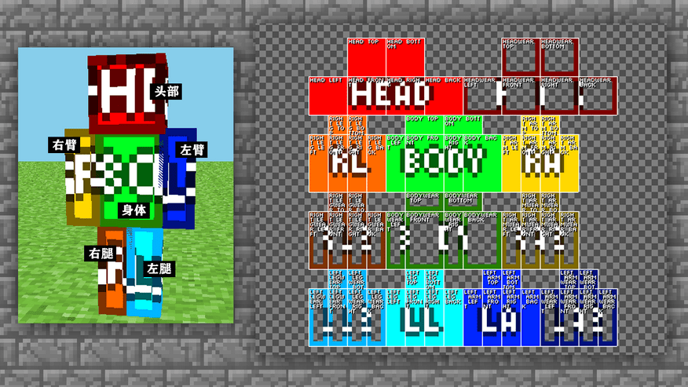

## 如何使用MCskin3D绘制皮肤 

在**MCskin3D**皮肤绘制最常用到的工具是：

铅笔、橡皮擦、取色管、亮度刷、油漆桶。

接下来我们就来试一试每个工具该如何操作。

【铅笔】用铅笔我们就可以给皮肤进行，像素块绘制，常用来绘制皮肤的结构和细节。并且还可以根据需求来调整笔刷的大小。

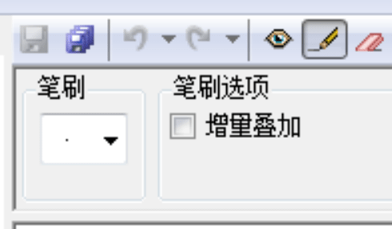

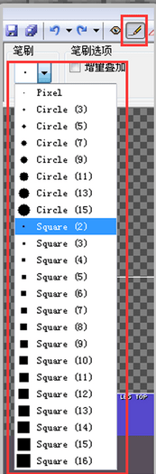

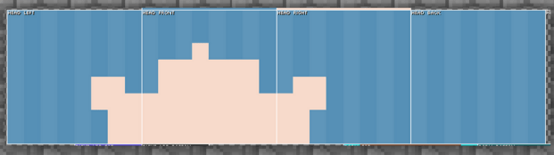

【橡皮擦】可以擦除和修改一切你画错的内容。和铅笔一样可以根据需求调整笔刷的大小。

【取色管】可以在之前绘图的地方/案例上取色，十分方便快捷。

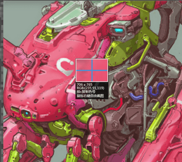

【亮度刷】可以让底色变亮/变暗的工具，根据不同的强度和笔刷大小可以来控制变亮变暗的力度，来增加和改变人物的光阴对比。

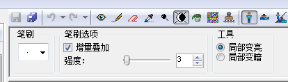

【油漆桶】可以直接大批量的铺色，对于底色铺设是很好用的。

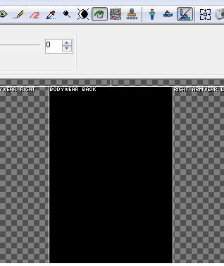

工具都熟悉一下后，接下来就让我们开始绘制属于我们的皮肤吧~
